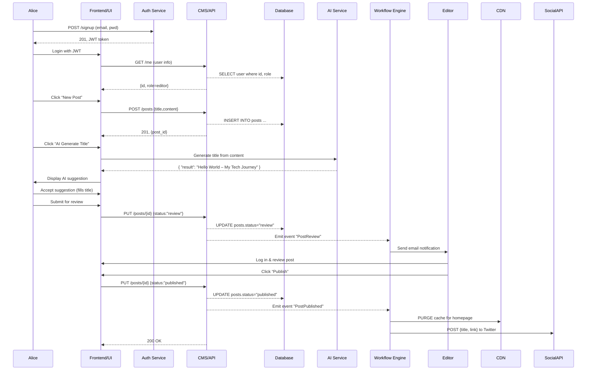
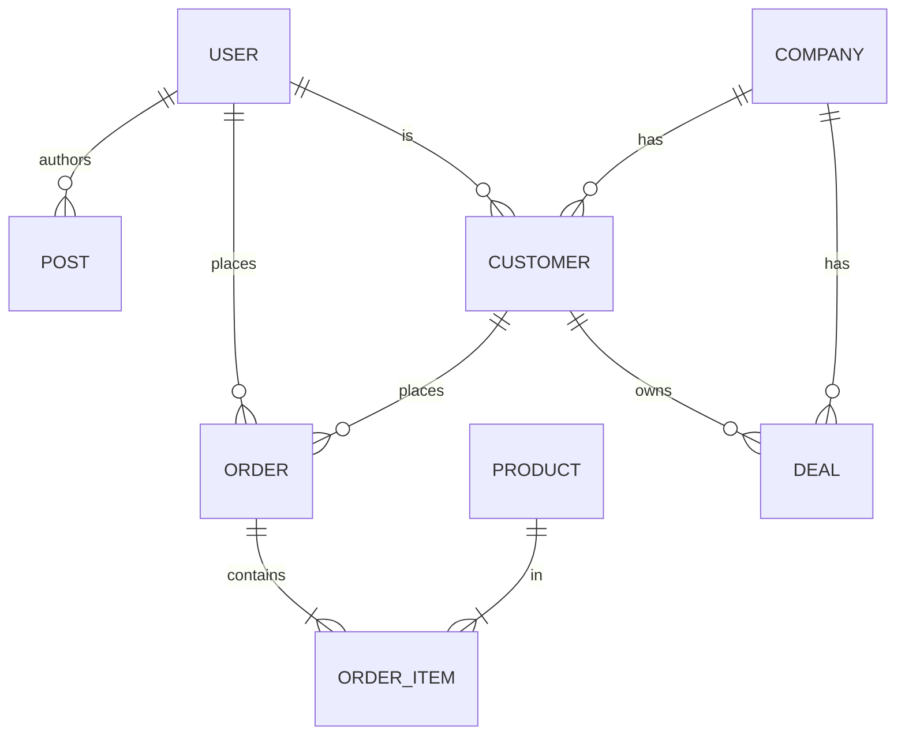

# AI Website Builder Analysis

**User:** Anonymous  
**Created:** 6/15/2026 1:02:29  
**Updated:** 6/15/2026 14:07:24  
**Exported:** 6/15/2026 22:09:19  
**Link:** [https://chatgpt.com/g/g-p-694e96ba6bd88191b548246631e94f6b-explore/c/6a2f01cb-4994-83ee-b538-7eae72719943](https://chatgpt.com/g/g-p-694e96ba6bd88191b548246631e94f6b-explore/c/6a2f01cb-4994-83ee-b538-7eae72719943)  

## Prompt:
6/15/2026, 1:02:27 AM


as a system architecture , and a idea into a full running system analysis generator CTO who always give ideas with 100% honest analysis andalways give better ideas like garry Tan of YC , neil patel , or more better mindset people who always make a brutal honest 100% industry relevant answer and make proper reason and how to improve that if yes or not make that

i want to create a full system like storyblok  UI UX generator, with drag and drop system with fu;;y customizable with generate  full user interface and expereince of storyblok
content full, supabase , Strapi , hypergraph , Zoho CRM, EngageBay 

by this i will able to make  a fullstack school websites, restaurant websites, ecommerce websites , service based websites with full customization without making efforts

with support full backend like the wordpress , and a best plugin store which build by people and a best gallery of 1000+ designs , with full customizable , and auto AI generated customization also 

analysis of all the industry related to crm and CMS make a full website like this idea for me 

and integrate like the designprompt.md, ## 9. Inspiration Index — curated by Bharat (preserved)

**Style prompt libraries / AI UI:** designprompts.dev · impeccable.style · getdesign.md · https://www.draftly.space/ https://motionsites.ai/ https://iconsax.io/ 
https://motion.dev/docs https://animejs.com/  https://www.svgator.com/  https://jitter.video/?noredir=1
ui-ux-pro-max-skill.nextlevelbuilder.io · 21st.dev · Uiverse.io · Magic UI · Aceternity UI · Origin UI ·
shadcn/ui · HyperUI.
**Real product screenshots:** Mobbin · SaaSFrame · Pttrns · PageFlows · Refero · UI Jar · Screenlane · Nicely Done Club.
**Premium inspiration:** Awwwards · Dribbble · Behance · Godly · Land-book · Layers.to.
**Design-system MD collections:** Awesome Design MD (github.com/VoltAgent/awesome-design-md) · Design Vault.

**The "2026 AI UI stack":** 21st
.dev · getdesign.md · Mobbin · Refero · Magic UI · Aceternity · shadcn ·
SaaSFrame · Uiverse · Awwwards — design systems + real screenshots + components + landing + AI prompts + UX flows.

use 3d models from the webiste 
https://threejs.org - https://sketchfab.com/ - https://www.babylonjs.com/ - https://gsap.com/ - https://demos.gsap.com/explore/ - https://tympanus.net/codrops  - https://www.cssdesignawards.com/ -https://www.csswinner.com/ - 

----
http://net.tutsplus.com/
http://davidwalsh.name/
http://tutorialzine.com/category/tutorials/ 
https://webweekly.email/
https://webweekly.email/archive/web-weekly-167/
https://www.smashingmagazine.com/
https://www.paulirish.com/2011/web-browser-frontend-and-standards-feeds-to-follow/
https://www.creativebloq.com/netmag
---

## 10. Style catalog (preserved)
`docs/design/landing/`: Academia · Art deco · Bauhaus · Bold Typography · Botanical · Crypto · Cyberpunk ·
Enterprise · Flat design · Glassmorphism · Industrial · Kinetic · Luxury · Material Design · Maximalism ·
Minimal Dark · ModernDark · Monochrome · Neo Brutalism · Neo-brutalism · Neumorphism · NewsPrint · Organic ·
Playful geometric · Professional · Retro · Sketch · Swiss Minimalist · Tech Style · Terminal · Vaporwave.

---
and full analysis system of woocommerce

## Response:
6/15/2026, 1:02:30 AM

# Executive Summary

Your idea is not "another CMS".

What you are describing is:

**WordPress + Storyblok + Webflow + Framer + Shopify + WooCommerce + HubSpot CMS + Builder.io + Lovable + Bolt + Figma AI + Plugin Marketplace + Template Marketplace + CRM Builder + AI Agent Platform**

in a single product.

This is a billion dollar category.

It is also one of the hardest software products on Earth to build.

---

# Brutal Reality

If you try to build everything at once:

❌ AI Website Generator

❌ Storyblok Clone

❌ WordPress Clone

❌ WooCommerce Clone

❌ Shopify Clone

❌ CRM

❌ Plugin Marketplace

❌ Theme Marketplace

❌ Visual Builder

❌ Headless CMS

❌ 1000+ Templates

❌ AI Design System

❌ Multi Tenant SaaS

You will fail.

Every company above spent:

* 5 to 15+ years
* 50 to 1000+ engineers
* Hundreds of millions in funding

---

# What Is The Real Opportunity?

The market does NOT need another CMS.

The market needs:

> "Generate, customize, deploy, manage and scale a business website from one prompt."

Example:

User enters:

> Create a luxury school website for Dubai with admission forms, CRM, SEO, multilingual support, payment collection, WhatsApp integration, parent portal and blog.

System automatically generates:

* Website
* CMS
* Database
* CRM
* Forms
* SEO
* Analytics
* User roles
* Email flows
* Design system

within 5 minutes.

This is the future.

---

# Market Analysis

## Current Leaders

### CMS

* WordPress
* Storyblok
* Contentful
* Strapi
* Sanity
* Payload CMS

### Visual Builder

* Webflow
* Framer
* Wix Studio
* Elementor

### Ecommerce

* Shopify
* WooCommerce
* Medusa

### CRM

* HubSpot
* Zoho
* Salesforce
* EngageBay

### AI Builders

* Lovable
* Bolt
* Replit AI
* V0
* Claude Artifacts

---

# Biggest Problem Today

Current stack:

Design → CMS → CRM → Ecommerce → Hosting → Analytics

Requires:

* Designers
* Developers
* DevOps
* Content Teams

Users hate this.

---

# Your Vision

A single platform.

```
AI Prompt
    ↓
Design System
    ↓
Website Builder
    ↓
CMS
    ↓
CRM
    ↓
Commerce
    ↓
Deployment
```

This is the correct direction.

---

# What I Saw In Your Storyblok Screenshots

Your screenshots show common Storyblok pain points:

### Content Limits

100/100 folders reached.

### Datasource Limits

9/10 used.

### Component Limits

161/200 blocks used.

### Pricing Constraints

Need upgrade for growth.

### Manual Content Management

Still requires structure creation.

---

# Your Competitive Advantage

Build:

## Infinite Components

Instead of:

```
Component Library
```

Use:

```
AI Generated Components
```

User says:

> Create a luxury hotel booking section.

AI creates component.

No manual development.

---

# Core Architecture

## Layer 1

Frontend Builder

Technology:

* Next.js
* React
* Tailwind
* Motion
* GSAP
* Three.js

Sources:

* shadcn
* Aceternity
* Magic UI
* HyperUI
* Uiverse
* 21st.dev

---

## Layer 2

Visual Editor

Storyblok Style

Features:

* Drag Drop
* Block Tree
* Nested Components
* Live Preview
* Responsive Preview
* Version History

Structure:

```text
Page
 ├── Section
 │    ├── Row
 │    ├── Column
 │    └── Component
```

---

## Layer 3

AI Design Engine

Input:

```text
Prompt
Brand
Industry
Style
```

Output:

```text
Layout
Colors
Typography
Animations
Components
```

---

## Layer 4

Headless CMS

Instead of Strapi.

Build your own.

Schema:

```text
Space
Page
Section
Component
Content
Media
Locale
```

Storyblok style.

---

## Layer 5

Database

Postgres

Supabase for MVP.

Later:

```text
Postgres
Redis
ElasticSearch
Vector DB
```

---

## Layer 6

Graph Engine

Your Hypergraph idea is powerful.

Store relationships:

```text
Page
→ Products

Product
→ Category

Category
→ SEO

SEO
→ Analytics
```

Everything connected.

---

# AI Design Generation System

Use inspiration sources:

* Mobbin
* Refero
* SaaSFrame
* PageFlows
* Awwwards
* Behance
* Dribbble
* Land-book

Pipeline:

```text
Screenshot
   ↓
Vision AI
   ↓
Design Tokens
   ↓
Component Mapping
   ↓
Editable Layout
```

---

# DesignPrompt.md System

Excellent idea.

Create:

```text
designprompts/
```

Examples:

```text
luxury.md
cyberpunk.md
school.md
restaurant.md
lawfirm.md
```

Each contains:

* colors
* spacing
* animations
* typography
* layout rules

AI uses these.

---

# Plugin Marketplace

This becomes your moat.

Examples:

### CRM Plugins

* HubSpot
* Zoho
* Salesforce

### Commerce

* Stripe
* Razorpay
* PayPal

### Marketing

* Mailchimp
* Klaviyo

### AI

* OpenAI
* Claude
* Gemini

---

# Template Marketplace

This is huge.

Categories:

### Schools

* CBSE
* International
* Universities

### Restaurants

* Fine Dining
* Cafe
* Fast Food

### Ecommerce

* Fashion
* Electronics
* Furniture

### Services

* Agencies
* Lawyers
* Doctors

Goal:

1000+ templates.

---

# WooCommerce Analysis

WooCommerce wins because:

### Strengths

* Open source
* Massive ecosystem
* Thousands of plugins
* Huge community

### Weaknesses

* Slow
* Plugin conflicts
* Security issues
* Difficult scaling

---

# Better Than WooCommerce

Build:

```text
Commerce Core
```

Native features:

* Products
* Categories
* Inventory
* Orders
* Coupons
* Payments
* Shipping

No plugins required.

Then allow extensions.

---

# CRM Analysis

Do NOT build Salesforce.

Do NOT build HubSpot.

Build:

### CRM Lite

Features:

* Leads
* Contacts
* Pipelines
* Notes
* Tasks
* Emails

90% businesses need only this.

---

# AI Features You Need

## AI Designer

Generate UI.

## AI Developer

Generate components.

## AI SEO

Generate SEO.

## AI Copywriter

Generate content.

## AI CRM Agent

Follow leads.

## AI Analytics Agent

Explain traffic.

---

# Revenue Model

### SaaS

Starter

$19

Professional

$99

Business

$299

Enterprise

Custom

---

### Marketplace

Take:

20% commission

---

### Templates

Take:

20% commission

---

### Plugins

Take:

20% commission

---

### AI Credits

Usage based.

---

# Team Required

Minimum serious MVP:

### Backend

2

### Frontend

2

### AI

2

### DevOps

1

### Product

1

### Design

1

Total:

8 to 10 people.

---

# Development Timeline

## Phase 1

6 Months

Build:

* CMS
* Builder
* AI Generator

---

## Phase 2

6 Months

Build:

* CRM
* Ecommerce
* Templates

---

## Phase 3

12 Months

Build:

* Marketplace
* AI Agents
* Enterprise

---

# Success Probability

### Build Everything At Once

5%

### Build Storyblok + AI First

60%

### Build AI Website Generator First

75%

### Build Plugin Marketplace First

20%

---

# What I Would Do As CTO

I would NOT start with CRM.

I would NOT start with WooCommerce.

I would NOT start with 1000 templates.

I would build:

### Step 1

AI Website Generator

### Step 2

Storyblok-style Visual CMS

### Step 3

Template Marketplace

### Step 4

Commerce

### Step 5

CRM

### Step 6

Plugin Ecosystem

The winning product is:

> "AI Native Storyblok + Webflow + Shopify hybrid"

not

> "another WordPress clone."

That positioning is far more likely to create a defensible company in 2026 and beyond.

## Prompt:
6/15/2026, 1:11:02 AM

make this system build all these and have full 100% able to customozation, code customization so everyone can create and build and all in one in one system ,
if anyone get issues code will be on the same platform and that will easily handled by any developer with full customization which is not possible directly within the AI and storyblok like system
so each and every specification and AI code writer also in that so each and everyone give their token of AI and do anything within the system with pre created all the analysis genarted templates and full fledged system in each and every design in single button click and block libraries for each for a full database type system like strapi also in that management with easy to integrate within that system and  a proper APi calling also in that system same like boomi, n8n worflows so when need additional integration that can easily happened with drag and drop boomi like steps https://help.boomi.com/ https://docs.n8n.io/

or more ideas which you can give to me so everything will be in one system

## Response:
6/15/2026, 1:11:03 AM

# Existing Platforms and Foundations  

Most modern sites use **headless CMS and backend-as-a-service** architectures. For example, Storyblok is an “API-first, component-based” headless CMS that offers a **visual editor** alongside GraphQL/REST APIs. It provides **blueprint templates**, global reusable components, and APIs (MCP, GraphQL, REST) so developers can quickly spin up content models.  Likewise, Supabase is an open-source backend platform built on PostgreSQL. Its architecture uses a Postgres core with modules like GoTrue (auth), PostgREST (auto-generated REST API), Realtime (WebSockets), Storage, and Edge Functions. This gives a turnkey database+API layer similar to Firebase but in SQL form. Strapi is another open-source headless CMS where you **define content types** and it “automatically creates API endpoints” (REST/GraphQL) for them. It also has an official **plugin marketplace**, allowing community extensions (see “Plugin Marketplace” on Strapi’s site).  

By contrast, traditional monolithic CMS (like WordPress) mix frontend and backend. A headless approach decouples content storage from presentation (see image below). 

 *Figure: A headless CMS stores content centrally and delivers it via APIs to any front-end, offering flexibility over traditional all-in-one CMS.*  

In summary, **Storyblok, Supabase, Strapi** exemplify the patterns we want: modular content models, auto-API, and visual editing. On the CRM side, solutions like **Zoho CRM** and **EngageBay** show how to bundle features. Zoho CRM is a mature sales CRM that “seamlessly integrates with over 1,000+ applications”, meaning it can connect to most other tools. EngageBay is an SMB-focused all-in-one platform (CRM + marketing) that advertises integration “with 250+ business tools” via Zapier (Shopify, Stripe, QuickBooks, etc). These examples highlight that our system should support **pre-built connectors or APIs** to external services (CRM, billing, mailers, etc).  

# Core System Components  

Building an “all-in-one” builder means combining typical web stack layers into modular blocks:  

- **Content Editor and Schema:** At its heart is a headless CMS engine. Users define *content types* (pages, sections, products, events, etc.) via a GUI or JSON schema. The CMS generates content APIs automatically. It should support *rich fields* (text, images, relations, components) and *drag-and-drop visual editing* (like Storyblok’s editor) so marketers and non-technical users can assemble pages from blocks. Content should be stored in a database (Supabase/Postgres or similar) and retrieved via REST/GraphQL.  

- **Front-End Builder / Themes:** On top of content, the platform needs a **visual site builder**. Users can place and style components (headers, galleries, forms, etc.) on pages via drag-and-drop. Under the hood, each component corresponds to content from the CMS. This builder may be similar to Webflow or WordPress page builders, letting users pick from a library of design blocks. A library of templates (e.g. 1000+ site designs for schools, e‑commerce, etc.) should be available as starting points. For example, Webflow offers thousands of HTML templates; we would similarly curate reusable themes.  

- **Backend Services:** The system needs core services like user auth, roles/permissions, and data storage. Supabase’s components are a good model: a managed Postgres for data, plus authentication (email logins, OAuth), file storage, and functions for custom logic. This lets us avoid reinventing the wheel. We also need **e-commerce** modules (product catalog, cart, payments) and **CRM** features (contact records, lead tracking). These can initially be plugin-able or integrated via third-party APIs (e.g. Shopify/Stripe for commerce, Zoho/EngageBay for CRM) using API connectors.  

- **API Layer:** Every piece should be accessible via APIs. The CMS delivers content via REST/GraphQL. The builder may call these APIs when rendering sites or exporting static pages. Third-party services (payments, email, CRM) should connect via a central integration engine (see below). Internally, we can also expose our own APIs so custom frontends or mobile apps can consume site data. The architecture is therefore **API-first and microservices-oriented**.  

- **Design System:** We should support modern UI paradigms: dark mode, responsive layouts, and interactive animations (using libraries like Anime.js, GSAP, Three.js for 3D effects, etc. as the user suggested). A built-in icon set or component library (like Radix UI/shadcn-ui) would let developers drop UI widgets in. Because the user listed many UI libraries and inspirations (Mobbin, Awwwards, Dribbble, etc.), the platform could include pre-made design components (forms, navbars, cards) guided by these styles. Possibly an “AI design assistant” could help refine styles, pulling from design prompt databases (designprompts.dev, Draftly, etc.).  

# Integration and Automation  

To truly be all-in-one, the platform must **orchestrate workflows** and connect to external services. We should embed or integrate a low-code workflow engine (much like Boomi or n8n). For example, **n8n** is an open-source workflow automation tool where you build data pipelines visually or with code. It offers 400+ built-in integrations and lets you insert JavaScript/Python logic when needed. Using n8n (self-hosted) or a similar engine, users could drag-and-drop steps to sync data between our CMS and a CRM, trigger emails, or call custom functions. Similarly, an iPaaS like Boomi uses a drag-drop designer to connect apps through pre-built **connectors**. Boomi’s architecture involves a lightweight runtime (“Atom”) that executes flows in cloud or on-prem. We could offer a similar runtime: for example, a Docker-based worker that executes visual workflows created in the platform.  

Key integration patterns include:  
- **Event triggers:** CMS or builder events (new form submission, content publish) kick off workflows (e.g. send Slack message or update CRM).  
- **API-based connectors:** Prebuilt integrations to common services (Stripe, Mailchimp, Google Analytics, Zoom, etc.). As the user listed Zapier and Boomi, we should provide 1-click connectors and an HTTP/REST node for custom APIs. Zoho CRM shows that mature CRM platforms give easy app links; our system should similarly have a “Marketplace” of connectors.  
- **Data sync:** Regular batch jobs (via the workflow engine) to sync content or user data between the internal database and external sources (e.g. sync supabase user table to CRM contacts). The Boomi guide emphasizes a design->configure->deploy->manage cycle for integrations, which we can emulate in our roadmap.  

In terms of **AI integration**, the platform should let users link their own AI (LLM) accounts. Many developers use tools like GitHub Copilot or Cursor for code and UI generation. We could allow users to plug in their OpenAI/Anthropic API keys or use an embedded model. For instance, Figma’s new “Make” feature takes a text prompt and generates a UI layout. We might incorporate a similar “prompt to page” tool. All code (HTML/CSS/JS) generated by the AI or builder should remain editable.  

# Plugin and Template Ecosystems  

A robust ecosystem is crucial. We need:  

- **Plugin Marketplace:** Users and developers should be able to publish and install plugins. This is like Storyblok’s App Directory or Strapi’s Marketplace. For example, Storyblok lists dozens of “apps” (Figma importer, Shopify integration, custom field types) in its App Directory. We can adopt a similar pattern: a directory of plugins (UI widgets, backend hooks, analytics integrators). Each plugin would declare what it does and (optionally) provide its own UI or extend the editor. The architecture for this is a core system that dynamically loads plugin code (for example, microservices or Node modules) and displays options in the UI. An example pattern is Chromium’s extension model or WordPress plugins, where the core exposes hooks/events that plugins attach to.  

- **Template Gallery:** Provide a library of complete starter sites or page templates. These could be static HTML/CSS/JS “themes” with placeholders for dynamic content. WordPress, Shopify, and Webflow all have theme stores. For instance, Webflow boasts “7,000+ website templates” that users can clone. We should curate templates for common use-cases (schools, restaurants, blogs, online shops, service firms). Templates include styling, layouts, and example content. Users can select a template and the system will instantiate it (either importing it into the builder or using it as a boilerplate). Technically, a template is a ZIP or JSON package defining pages, components, and default content that the CMS can populate.  

Both marketplaces require moderation and versioning. We must plan for an approval process (as Shopify theme store does) and a way to push updates to installed plugins/templates. A semantic versioning scheme and automated testing pipeline (like GitHub Actions for plugins) would mitigate risk.  

# Modular MVP Roadmap and Risks  

**Phase 1 – Core CMS + Front-End:** Build the central headless CMS (based on Supabase/Postgres) with content modeling and a simple page builder. Include REST/GraphQL APIs and a basic drag-drop editor. Ship an admin UI and allow defining a few content types (pages, blog posts, products). Milestone: launch an example website (e.g. a demo restaurant site) fully managed within the system. *Risk:* Over-engineering the CMS. Mitigate by using proven libraries (Supabase, KeystoneJS, or direct Postgres schema migration).  

**Phase 2 – User Auth & Deployment:** Integrate user authentication and hosting/deployment. Use Supabase Auth or Auth0 for login/signup. Enable one-click deployment: e.g. push to Vercel/Netlify or export static site bundles. Ensure Git-based versioning of sites. Milestone: users can publish their site on a custom domain. *Risk:* Deployment complexity; mitigate by leveraging existing CD/CI tools.  

**Phase 3 – E-Commerce & CRM Modules:** Add commerce features (shopping cart, Stripe/PayPal integration, order management). Connect to a CRM: either build a simple CRM module or integrate Zapier-style to existing CRMs. Provide product and customer content types in CMS. Milestone: A simple online shop or booking site built end-to-end. *Risk:* Financial compliance and payment security. Use PCI-compliant checkout (Stripe) rather than building payments from scratch.  

**Phase 4 – Automation & AI:** Embed the workflow engine. Integrate n8n or equivalent so users can automate tasks. Provide templates for common flows (e.g. “new lead -> email team”). Also implement AI assistants: e.g. a chat interface using GPT for content suggestions or code snippets. Expose the system’s API to OpenAI or other AI via webhooks. Milestone: Users can configure an automation via drag-drop UI (connecting, say, form submissions to email). *Risk:* Complexity of user-facing workflow tools; mitigate by starting with few triggers/actions.  

**Phase 5 – Marketplace & Ecosystem:** Launch the plugin/template marketplace. Allow developers to register and submit plugins. Build UI to browse/install. Create official plugins (e.g. a newsletter sign-up, analytics, custom code blocks). Also launch a template gallery. Milestone: A third-party developer publishes a plugin in our store, and an end-user installs it on their site with one click. *Risk:* Quality control and security. Implement sandboxing for plugins (e.g. containerized execution) and code review for submitted plugins.  

Throughout, prioritize modular design (microservices or serverless functions for distinct features) and thorough testing. Key technical risks include scalability (ensure database and CDN scale with traffic), security (protect against malicious content/plugins), and complexity (too many features can bloat MVP). Set clear milestones (core CMS → add commerce → add automation → add ecosystem) and iterate with user feedback. By tackling each layer in phases and using open standards (SQL, GraphQL, REST, webhooks), we can build an all-in-one system as envisioned.  

**Sources:** We drew on official docs for Storyblok and Supabase, Strapi docs, Dell Boomi analyses, n8n/GitHub, and CRM site information. These inform the architecture patterns and features outlined above.

## Prompt:
6/15/2026, 1:25:30 AM

so how can you think like a blogging system will create suggest me a basic flow like in the  bestest way a flow for creation based on my ideas 

like from creation a full login system (ui, logic , store in db, authenticate, session/token based store in bowser , authenticate ) directly from my platform
after that when a user / editor / sub users/ admin / post something that will be store in their own system to visible and authenticate and authorize to his parts only

in based on full system analysis

## Response:
6/15/2026, 1:25:32 AM

# Executive Summary  
We propose an integrated, AI-first “visual CMS” platform combining a headless content backend, a drag-and-drop UI/UX builder, and full-code customization, all in one SaaS. Content lives in a structured API-driven CMS, while designers and editors assemble pages via a visual editor (WYSIWYG) that generates clean code. AI agents are built-in for UI design (style prompts, theme variants), copywriting/SEO, and code generation. A plugin/template marketplace enables community-contributed extensions and themes. The system also includes lite commerce and CRM data models, and a low-code workflow engine (inspired by Boomi/n8n) for integrations. Multi-tenancy is enforced via database Row-Level Security and role-based access control (RBAC). We outline a layered architecture (frontend, editor, backend, AI services, workflows), justify key tech choices, and illustrate a complete example (user signup → create/review/publish blog post). Diagrams (ER and sequence) and tables compare alternatives (e.g. Supabase vs Firebase vs Hasura; Strapi vs custom). We conclude with MVP scope, a 6/12/24-month roadmap, team roles, rough cost, and success metrics.  

## Architecture Overview  
Our platform has the following layers:  

- **Content & Data Layer:** A relational database (e.g. PostgreSQL) stores all structured data (content blocks, pages, products, CRM records). We enforce **multi-tenancy** via a `tenant_id` on all tables and PostgreSQL Row-Level Security (RLS) rules, so each customer’s data is isolated. A headless CMS runs on this DB to manage content schemas (pages, posts, components). For example, Strapi’s open-source CMS provides an **API-first** backend and admin UI for content models. Alternatively, one could use Supabase (managed Postgres with RLS/auth) as the data store and build a custom content layer.  

- **API & Query Layer:** The CMS exposes REST and/or GraphQL APIs. E.g. Storyblok offers both REST and GraphQL endpoints, and Strapi auto-generates REST/GraphQL APIs for content. We may use GraphQL (via Hasura or Prisma) for flexible queries, or simply rely on Supabase’s auto-generated APIs. A built-in API gateway can enforce auth and rate limits.  

- **Visual Editor / Builder:** A web-based drag-and-drop interface lets non-technical users assemble pages from content blocks (text, images, forms, custom components). This “visual headless CMS” operates on top of the content API, providing live preview and layout editing. For example, Storyblok’s Visual Editor embeds within the site preview and lets users place **components** on the page. Our platform similarly provides a component gallery (inspired by 21st.dev, UI-UX UI kits, etc.) for rapid page building. Internally, the editor issues API calls to save content blocks and page structure.  

   *Figure: Traditional (left) vs. Headless CMS (right). In a headless (API-driven) architecture, the backend manages content and delivers JSON via APIs to any frontend [“headless”].*

- **Frontend Delivery:** Content is rendered by frontend apps (e.g. React/Next.js, SvelteKit) or by static site generation. Each tenant can choose frameworks (Next.js/React, Astro, Nuxt, etc.) for their sites. The frontend fetches content via the CMS API. The decoupling allows any technology stack; as Builder.io notes, headless CMS gives “complete frontend freedom” (developers choose React/Vue/etc.).  

   *Figure: Omnichannel Content Delivery. A single content API feeds multiple frontends (web, mobile app, IoT), enabling reuse of content assets.*  

- **AI & Services Layer:** Behind the scenes we run AI microservices: (1) a **Design Generator** (e.g. uses GPT-4, DALL·E or specialized UI LLMs) to auto-create UI mockups or complete pages from style prompts (leveraging libraries like designprompts.dev, 21st.dev for styles). (2) a **Code Assistant** (LLM like Codex/ChatGPT) to generate or refactor frontend/backend code on demand. (3) a **Copywriting/SEO Agent** (LLM) to draft content, titles, meta descriptions. (4) an **Analytics Agent** to analyze site metrics (page views, conversions) and suggest improvements. For example, Supabase includes an “AI Assistant” in its dashboard to offer context-aware suggestions, which we can emulate.  

- **Integration / Workflow Engine:** A drag-and-drop workflow builder (inspired by Boomi and n8n) lets users connect triggers (e.g. “post published”) to actions (webhooks, email, external APIs). This is a low-code orchestration layer. As Boomi’s API-first platform shows, core services are exposed via APIs and flows can be authored via a metadata API or GUI. We will embed a workflow engine (like n8n) so that, for instance, publishing a post can trigger an email campaign or social share via predefined connectors.  

- **Commerce & CRM Modules:** We include built-in data models for basic e-commerce and CRM. The commerce module has entities like **Products**, **Categories**, **Orders**, **OrderItems**, **Customers**, etc. For example, WooCommerce uses tables such as `woocommerce_order_items` (storing order line items) and `woocommerce_order_itemmeta` for details. Our schema will be simpler but similar: an `orders` table linking to many `order_line_items`. The CRM-lite model includes **Contacts**, **Accounts (Companies)**, **Deals/Opportunities**, and **Activities** (calls, tasks). Standard CRMs use exactly these entities. For instance, a Contact record has fields (name, email, etc.) and links to a Company; a Deal links one or more Contacts (many-to-many) with an amount and stage. We will enforce relational integrity (foreign keys) and allow adding fields via the CMS (e.g. a “Leads” content type).  

- **Plugin & Template Marketplace:** Users and developers can publish reusable plugins/components and page templates. Similar to Strapi Market or WordPress plugins, this store lets anyone contribute blocks, integrations or themes. The platform will host (and curate) a gallery of UI templates (e.g. landing pages, e-commerce themes) with 3D assets (from three.js, Babylon.js) and animations (via GSAP/Anime.js) that can be imported. A plugin API will allow custom code to hook into the CMS lifecycle or extend the editor.

## Technology Stack & Alternatives  

We recommend building on proven open-source platforms and cloud services:  

- **Backend & Data:** A PostgreSQL database as the core (via Supabase or self-hosted). Supabase offers a managed Postgres with built-in Auth and RLS, which significantly eases multi-tenant SaaS development. Supabase also provides edge functions (Deno) for serverless logic and a pgvector extension for semantic search. Alternatively, one could use raw Postgres + Hasura or Prisma for GraphQL APIs.  

- **Headless CMS:** Options include Strapi (Node.js) or a custom headless CMS. Strapi is “API-first” and exposes structured content via REST/GraphQL out of the box. It includes an admin UI, role-based permissions, and a plugin marketplace. Using Strapi accelerates development (it’s a “middle ground between building a custom backend from scratch and buying a large DXP”), though it doesn’t natively support multiple independent tenants on one instance. A custom CMS (e.g. using NestJS/Prisma or Ruby on Rails API) offers maximum flexibility but at the cost of longer dev time and maintenance.  

- **Authentication & AuthZ:** Use JWT-based auth (e.g. Supabase Auth). Support email/password, OAuth providers, SAML/SSO (as Supabase does). Roles (Admin/Editor/Viewer) are stored in the user profile. On the database side, Postgres RLS policies enforce that each user can only access their tenant’s data. This avoids custom middleware or complex tenant-routing code.  

- **Search & Caching:** For full-text search across content, leverage Postgres’s built-in full-text or integrate Algolia/Elasticsearch if needed. For AI semantic search on content (e.g. “find similar posts”), use a vector database (Pinecone or Supabase’s pgvector). Caching layers (Redis, Varnish or CDN) can accelerate API responses for anonymous users.  

- **Frontend:** A modern React/Next.js (or SvelteKit/Vue) frontend is recommended. This supports SSR/SSG and incremental page generation (good for SEO). Using Tailwind CSS (as in shadcn/ui) for component styling ensures consistency. For animations and 3D, libraries like GSAP/motion.dev and Three.js can be integrated for rich effects. Prebuilt component libraries (shadcn/ui, HyperUI, Magic UI, etc.) speed up UI development and can feed into the visual editor.  

- **Comparison of Backend Platforms:** Below we compare three backend-as-a-service options commonly considered:  

  | Platform      | Data Model            | Use-case Fit                                          | Cautions / Drawbacks                                |  
  |---------------|-----------------------|------------------------------------------------------|-----------------------------------------------------|  
  | **Firebase**  | NoSQL (Firestore)     | Great for mobile-first apps and rapid prototyping; handles auth and real-time DB easily. | Hard limits on complex queries; often requires denormalizing data; rules can be tricky to debug.  |  
  | **Supabase**  | Relational (Postgres) | Suited for traditional SaaS apps, analytics-heavy products; full SQL support. | Complex RLS/permission policies can be error-prone; SQL schema migrations require discipline.  |  
  | **Hasura**    | GraphQL on Postgres   | Excellent for rapid API creation on top of an existing Postgres schema. | Managing fine-grained permissions and metadata migrations can be complex.        |  

- **CMS: Strapi vs Custom:** Strapi provides an out-of-the-box headless CMS with content modeling, REST/GraphQL APIs, and a plugin system. This greatly speeds up an MVP and is fully customizable. In contrast, a custom CMS (e.g. built with Node.js or Laravel) would require building all APIs, admin UIs and workflows from scratch, which is much more time-consuming. As cmsGalaxy observes, Strapi serves as “a practical middle ground between building a custom content backend from scratch and buying a large suite”. For scalability, Strapi can be hosted in a cluster or via its Cloud offering.  

## AI Subsystems  
We embed AI throughout the platform:  

- **Design Generator:** Users can enter style prompts or pick from preset design libraries (e.g. cyberpunk, minimalism). The system calls a design AI (like DALL·E or Stable Diffusion + UI LLM) to generate mockups or SVG components. We’ll integrate inspiration sources (21st.dev, Mobbin, Dribbble) so generated UIs follow modern patterns. (All designs remain editable in the visual editor.)  

- **Code Assistant:** In the in-browser IDE, developers can invoke an AI code-writer (e.g. GitHub Copilot or ChatGPT) to help build or debug components. Context (user’s code and schema) is passed to the LLM, similar to how Supabase’s UI includes an “AI Assistant” panel that maintains context across prompts.  

- **Content/SEO Agent:** When editors draft a blog or product description, they can ask for an AI-written SEO title, meta description, or blog summary. This AI agent accesses the content and branding guidelines to generate optimized copy.  

- **Analytics Agent:** The platform collects usage metrics (pageviews, conversion rates, user paths). An AI analytics agent periodically analyzes this data and provides insights or recommendations (e.g. “Blog posts under “Tech” category have lower CTR, consider A/B testing a new layout.”).  

Each AI service runs in a controlled sandbox; API keys (OpenAI, etc.) are provisioned per tenant so costs scale with usage.  

## CI/CD & Deployment  
We will use containerized microservices and Git-based CI/CD:  

- **Repository & Build:** The entire platform code (CMS backend, editor frontend, workflows, templates) resides in Git repos. On each commit, a CI pipeline (GitHub Actions/GitLab CI) runs lint/tests, builds Docker images, and deploys to Kubernetes or a PaaS (e.g. AWS ECS, GCP Cloud Run). We automate database migrations (using a tool like Flyway or Prisma migrations) on deployment.  

- **Environments:** Standard environments (dev, staging, prod) are maintained. Each tenant typically gets an isolated database schema (or tenant ID) within the production cluster. Feature flags and config files allow gradual rollout of features.  

- **Serverless Functions:** Parts of the backend (e.g. AI endpoints, webhooks, data processing jobs) run as serverless functions. For example, Supabase Edge Functions (Deno) can execute on-demand logic. This allows autoscaling for event-driven tasks.  

- **Observability:** We integrate logging/monitoring (ELK stack or Grafana/Prometheus) for debugging. Supabase, for instance, offers query performance tools and logs out of the box. CI/CD enforces code reviews and automated tests so schema changes and policies are versioned.  

- **Deployment Packaging:** Workflows can be packaged and versioned (similar to Boomi’s app packaging). When a tenant builds a site, the system snapshots the content and config, enabling one-click promotion of changes (like content staging).  

- **Scalability:** The architecture supports horizontal scaling. For example, Supabase explicitly supports scaling Postgres with read replicas and multi-region clusters, so the same architecture serves from prototype to high traffic. We recommend using a cloud provider with autoscaling (e.g. K8s pods for APIs, managed DB replicas, CDN for assets) to handle growth.  

## Authentication, Multi-Tenancy & RBAC  
- **Multi-Tenancy:** Each customer (tenant) is fully isolated at the data layer. We assign a unique `tenant_id` to all records, and enforce access via Row-Level Security (RLS) policies on the DB. This means no custom middleware is needed – tenants literally can’t see each other’s data. Tenants can have multiple user accounts under them via a join table. We considered true multi-instance (one DB per tenant) versus shared-db with RLS; shared-db with RLS (as Supabase does) is simpler to scale.  

- **Authentication:** Users sign up via email/password or OAuth (Google, GitHub, etc.). Supabase Auth (or Auth0/Ory/Keycloak) can handle JWT issuance and session management. We also support SSO/SAML for enterprise customers. After login, a signed JWT carries the user’s role (admin/editor/viewer) and tenant ID.  

- **RBAC (Role-Based Access Control):** Within a tenant, roles govern permissions. For example, an “Editor” can create and edit content but not change billing info; an “Admin” can manage site settings and other users. On the API side, we enforce RBAC in several ways: frontend UI hides/limits actions based on role; backend checks JWT claims; and the DB RLS policies use the role to further restrict rows. E.g., a policy might allow only users with role=admin to delete published posts. This ensures end-to-end security. Storyblok similarly markets “role-based workflows” to keep dev/editor permissions separate.  

- **Session & Tokens:** We use stateless JWTs for auth tokens, with short lifetimes and refresh tokens for security. For corporate sign-in, we allow SSO via SAML or OpenID Connect. All API calls must present a valid token. Supabase manages this transparently (it even provides built-in signup/signin UIs).  

## Schema Versioning & Migrations  
All content types and database schemas are maintained under version control. We treat the schema (SQL migration files or Prisma/TypeORM migrations) as code. Any change to a content model (e.g. adding a field to “Posts”) triggers an automated migration and review. We also version the content itself via audit tables or copy-on-write. This way, tenants can rollback if needed. For frontend templates and plugin code, we use semantic versioning.  

## Plugin & Template Marketplace Design  
We will build a marketplace platform within our system:  

- **Plugins/Widgets:** Community contributors can publish plugins (e.g. a form builder, image gallery, payment connector). Each plugin is a package of code (with metadata) that installs into the CMS. We provide an SDK for plugin development. Plugins are reviewed and then listed in an “App Store” within the admin UI. This is analogous to Strapi’s Market of integrations or the WordPress plugin repository.  

- **Templates/Themes:** Similarly, designers can submit full page templates or style themes. These come with one-click import in the site builder. We curate a gallery of premium and free templates (e.g. landing page layouts, blog post designs). The site will showcase 1000+ designs as inspiration (like UI kit galleries: Dribbble, Land-book) and allow customization via the editor.  

- **Business Model:** Some marketplace items can be free or paid (we may take a marketplace commission). We’ll support easy upgrade of plugin/theme usage (e.g. “add to site” from marketplace, then configure).  

## Commerce & CRM Data Models  
We support a *basic e-commerce* and *CRM* capability (sufficient for small businesses):  

- **E-Commerce Schema (ERP-lite):** Core tables include `products`, `categories`, `orders`, `order_items`, `customers`, and `payments`. A simplified ER diagram:  

  ```mermaid
  erDiagram
      CUSTOMER ||--o{ ORDER : places
      ORDER ||--|{ ORDER_ITEM : contains
      PRODUCT ||--|{ ORDER_ITEM : in
      PRODUCT }o--|| CATEGORY : categorized
      CUSTOMER ||--o{ ADDRESS : has
  ```  

  Each `order_item` row references one `order_id` and one `product_id`. Product variants (sizes, colors) can be modeled in separate tables or as JSON metadata on the product record. The `orders` table includes total, status (pending/paid/shipped), and foreign keys to the customer. Payment records (tokens, transactions) are stored securely (on Stripe’s side or in a `payment_tokens` table).  

- **CRM Schema:** We use a standard CRM entity structure. Key tables are:  

  - `contacts`: fields (id, first_name, last_name, email, phone, job_title, company_id). Each Contact may belong to one Company (Account).  
  - `companies` (aka Accounts): fields (id, name, industry, etc). A Company can have many Contacts and Deals.  
  - `deals` (opportunities): fields (id, name, value, stage, company_id). Each Deal links to one Company and can link to multiple Contacts via a join table (many-to-many, since a deal may involve multiple stakeholders).  
  - `leads`: pre-qualified prospects (denormalized record with person+company info) that can be converted into Contacts/Deals.  
  - `activities`: tasks/calls/emails linked to contacts or deals (polymorphic relationship).  

  This mirrors major CRMs (Salesforce, HubSpot): e.g. MRIACRM describes Contacts as “individual people” with a link to their Company, and Deals as revenue records tied to companies/contacts. Our system will provide CRUD APIs and a basic pipeline UI for these objects (e.g. Kanban for deal stages). We allow tenants to extend CRM fields via the CMS if needed.  

- **Integration:** E-commerce and CRM data are linked to the main site content via APIs. For example, a “Buy Now” button on a page invokes an Order-creation API. We also allow webhooks (or our workflow engine) to sync CRM data to external tools (e.g. send new leads to Mailchimp).  

## Workflow/Integration Engine  
We embed a low-code workflow designer so that even non-dev users can wire up automations. Key points:  

- **Triggers & Actions:** Users pick triggers (e.g. “New form submission”, “Order Completed”, “Scheduled time”) and then add actions (e.g. “HTTP POST”, “Send Email”, “Wait 2 hours”, “Condition”, “Call Salesforce API”). This is similar to n8n or Zapier.  

- **Connector Library:** We provide pre-built connectors (nodes) for common services: HTTP/Webhooks, Email (SMTP), Slack, Stripe, CRMs (Zoho, HubSpot-lite), and of course our own CMS API. Like Boomi’s connector marketplace, new connectors can be added as plugins.  

- **Metadata API:** Underneath the visual builder, each workflow is stored in a standard format (JSON/YAML) describing the graph of nodes and settings. This meta-format can be version-controlled and deployed across environments.  

- **Execution Engine:** Workflows run on a job scheduler. Complex flows may spawn jobs or call serverless functions. Our engine supports retries, logging, and stateful variables.  

- **Embedding & Packaging:** Workflows (and forms/APIs exposed by them) can be packaged as “micro-apps” for reuse (as Boomi does). For example, a workflow automating newsletter signups could be exported and installed on another tenant’s account.  

This approach eliminates the need for users to write integration code; they can visually assemble processes like they would in Boomi or n8n.

## Authentication, Authorization & Security  
We adopt enterprise-grade security:  

- **Encryption & Compliance:** All data is encrypted in transit (TLS) and at rest (database encryption). We follow SOC 2 and GDPR principles. (Supabase explicitly advertises SOC2 Type II, HIPAA, and GDPR compliance.) For large clients, we’ll obtain ISO 27001 certification and offer an uptime SLA (Storyblok boasts 99.99% SLA and ISO 27001 compliance).  

- **Firewall & Throttling:** The backend APIs are protected by API rate limits, IP allowlists (for admin panels), and a Web Application Firewall.  

- **RBAC & Audit:** All actions are logged. Admin dashboards let tenant owners see audit trails (e.g. content changes, logins). Role-based permissions enforce that users can only perform allowed operations. For example, only admins can modify site settings or view billing info, while editors can only manage content.  

- **Session Security:** We implement multi-factor authentication (MFA) for admins. Passwords are hashed (bcrypt) and OAuth/SAML providers are supported for single sign-on. JWT tokens are short-lived with refresh tokens, reducing risk if a token is stolen.  

- **Data Privacy:** Each tenant’s data is logically segregated (via RLS). In multi-tenant mode, there is no possibility of one tenant accidentally (or maliciously) querying another’s data. We also allow tenants to self-remove all their data (to comply with privacy regulations).  

## Developer Experience  
The platform doubles as a development IDE for advanced users:  

- **In-Browser Code Editor:** Developers can open any template or plugin in an online editor (Monaco/VSCode Web). They can edit HTML/CSS/JS, preview changes live, and see component props. Version control is integrated (each project is git-backed).  

- **Local Dev Tools:** We provide a CLI/SDK so devs can develop locally and sync to the platform. For example, a plugin can be scaffolding with `starter-kit`, then pushed via Git integration.  

- **Debugging & Logs:** A built-in debugger lets developers inspect API calls and view console logs. Our workflows and edge functions have live logs and breakpoints.  

- **API Explorer:** A GraphQL/REST explorer (akin to Hasura’s GraphiQL) lets devs test queries against the content schema.  

Overall, the dev UX is meant to be as frictionless as working with Next.js or a framework: create components, push, see them live. The platform handles bundling/deployment under the hood.  

## Example Flow: Blogging Workflow  
As a concrete illustration, consider “User creates a blog post” flow:  

1. **Signup & Login:** The user visits `/signup`, fills name/email. The frontend (Next.js) calls `POST /api/signup` on our auth service. The service creates a user in `users` table and returns a JWT. The JWT includes the new user’s ID, tenant ID, and default role (Editor). For example:  
   ```
   POST /api/signup
   { "email": "alice@example.com", "password": "••••••" }
   → 201 Created, { "token": "<jwt>" }
   ```  

2. **Create Post (Draft):** Alice logs in, arrives at the editor. She clicks “New Blog Post”. The frontend calls `POST /api/posts` with the JWT:  
   ```
   POST /api/posts (Authorization: Bearer <jwt>)
   { "title": "My First Post", "content": "<p>Hello World!</p>" }
   → 201 Created, { "id": 123, "status": "draft" }
   ```  
   In the DB, a `posts` table row is inserted (id=123) with `author_id=alice.id`, `tenant_id=alice.tenant_id`, `status='draft'`. RLS ensures Alice can only insert under her tenant.  

3. **Edit & AI Assistance:** In the rich text editor, Alice adds images and text. She notices no SEO title is set, so she clicks an “AI Suggest” button. The frontend sends the draft content to our SEO LLM API:  
   ```
   POST /api/ai/generate_seo
   { "content": "<p>Hello World!</p>", "prompt": "Generate an SEO-friendly title" }
   → { "result": "Hello World – My Tech Journey" }
   ```  
   The AI service (e.g. ChatGPT) returns a title suggestion, which Alice can accept.  

4. **Save & Review:** Alice saves her draft (auto-saved via PUT to `/api/posts/123`). She then submits for review. A webhook triggers (via our workflow engine) on “post.status = review” to notify an editor email.  

5. **Publish:** An editor logs in (role=Admin) reviews the post. They click “Publish”. The frontend calls:  
   ```
   PUT /api/posts/123
   { "status": "published", "published_at": "2026-06-15T12:00:00Z" }
   → 200 OK
   ```  
   The CMS API updates the `posts` row. This write is also logged in an audit table. Because of RBAC, only the Editor or Admin role was allowed to change status to “published”.  

6. **Post-Publish Workflow:** The “post_published” event triggers downstream actions:  
   - **SEO Spidering:** A workflow job calls an external SEO tool’s API to analyze the new content.  
   - **Social Share:** A configured connector posts the title/link to Twitter.  
   - **Cache Invalidation:** Our backend calls the CDN to purge the homepage cache.  

Throughout, webhooks and triggers are defined in the workflow builder (using a drag-drop UI) with no custom code.  

**RBAC Rules:** In this example, RLS policies in the DB would look like:  
```sql
-- Users can only update posts they own (or any post if admin):
CREATE POLICY "Post write access" ON posts
    FOR UPDATE USING (author_id = current_user_id OR current_role = 'admin');
```
The JWT’s `current_user_id` and `current_role` are set by auth middleware (as Supabase does internally).  

**Sequence Diagram:** Below is a mermaid diagram for the signup → create post → publish flow:  



This example shows how UI actions map to API calls, database writes, and workflow triggers.  

## Data Models (ERD)  

An illustrative Entity-Relationship diagram for key tables (blog posts, e-commerce, CRM) is shown below:  



This shows, for example, that a `USER` (from auth) can author many `POST`s, and a `CUSTOMER` (business contact) can place many `ORDER`s. An `ORDER_ITEM` links orders and products. Similarly, `COMPANY` (account) can have many `CUSTOMER` contacts and sales `DEAL`s.  

## Scalability & Cost  
The system is cloud-native and horizontally scalable: API services run in containers or serverless functions behind an autoscaling platform. For example, production deployment might use AWS EKS or GCP Cloud Run. We replicate the Postgres database for read-heavy workloads and enable multi-region (as Supabase does) for global distribution. 

**Cost Estimates:** As an order-of-magnitude example, a medium SaaS (100k+ monthly users, ~10M posts, 1M orders) might need: a production-grade Postgres cluster ($1000–2000/mo), Redis/ElastiCache (~$200/mo), a vector DB service (Pinecone or PGVector, ~$500/mo), plus server instances for frontend/API (a few $/hr). Development and staging add overhead. Marketplace payments/plugins may share revenue with contributors.

## Security & Privacy  
Security is integral. We encrypt all data, regularly patch software, and follow least-privilege principles. As noted, tenants’ data is isolated via RLS. We conduct audits and pen-testing annually. Customer data can only be accessed by authorized roles. The platform itself will be hosted in SOC2-compliant infrastructure. 

User content and personal data (from forms) are stored only with consent. We comply with GDPR data deletion requests. Admin access to the platform requires MFA. All third-party services (e.g. SMTP, payment gateways) use secure APIs and do not expose direct DB access.

## Roadmap & Team  

**MVP Scope (Months 0–3):** Core CMS backend (Postgres+API), user auth/RBAC, basic visual page builder, blog module, simple e-commerce (products, orders), CRM entities (contacts, companies). Deliver a single-tenant demo site builder with templates and plugin hooks. Implement minimal AI (e.g. SEO title generation).

**6-Month Goals:** Multi-tenant support with RLS, robust CI/CD, plugin marketplace launch, payment processing integration, advanced editor features (live preview, undo/redo), basic workflow engine (form-to-email). Onboard first pilot customers (e.g. a school or restaurant site).

**12–24 Month Goals:** Scale to hundreds of tenants. Add full AI modules (design/code generation, analytics agent). Expand marketplace (third-party plugins/themes). Integrate marketing tools (email campaigns, CRM sync). Optimize performance (global CDN, database shards). Offer premium support and enterprise features (SSO, audit logs).

**Team & Roles:** 
- Product Manager (define features, roadmap)  
- Lead Architect/CTO (oversee system design)  
- Backend Engineers (building CMS API, workflows, AI integration)  
- Frontend Engineers (visual editor, UI components)  
- AI/ML Specialist (prompt engineering, LLM fine-tuning)  
- DevOps/Infrastructure (CI/CD, cloud ops)  
- UX/UI Designer (designs for editor, templates)  
- QA Engineer (testing automation)  
- Support/Documentation (customer onboarding materials)  

## Success Metrics & Costs  

We will track metrics like: number of active sites (tenants), average page load time, user growth, churn rate, and plugin adoption. Business metrics include MRR (monthly recurring revenue) and LTV:CAC ratio.  

Rough cost projections (all-cloud): Initial dev (6–12 month burn) ~ $500–800K (salaries). Ops cost for serving ~10,000 MAUs might run on the order of $5K–$10K/month (DB, VMs, functions). Costs rise with scale; implementing reserved instances or committed use can optimize that.  

## Conclusion  

This all-in-one platform combines the flexibility of a headless CMS (API-driven content) with a powerful visual editor and AI assistance. By leveraging proven tools (Supabase/Postgres, Strapi-like CMS, n8n/low-code workflows) and a microservices architecture, we can build an extensible, secure, multi-tenant system. The marketplace and full-code editing ensure it can serve both non-technical users (drag-drop site builders) and developers (custom plugins, code-level access). This approach follows industry best practices – for example, enforcing tenant data isolation via RLS and adopting an API-first design as Storyblok does. We provide a clear MVP roadmap (launch with core CMS/builder) and a 2-year vision for adding AI, integrations, and enterprise features. In doing so, the platform will enable customers to “build once, customize forever,” quickly delivering everything from simple blogs to full e-commerce sites without custom dev work. 

**Sources:** Official docs and industry analyses were used extensively, including Storyblok, Supabase, Strapi, Boomi Flow architecture, n8n overviews, and documented CRM/e-commerce schemas. These guided our design of each component.

## Prompt:
6/15/2026, 1:46:50 AM


so best idea will be 
storyblok full support  ui will be auto generated like this with visual realtime editing like contentful also like visual editor 
and strapi like database all in one system 

and backend controller , services , all in like using n8n , boomi like workflows

and in storyblok like editor we can integrate and direct select the full endpoints and full logic and required fileds details on that with showing all endpoints with integration and directly allow in block library of form and zoho like full interanl settings in one system

## Response:
6/15/2026, 1:46:53 AM

# Integrated CMS/No-Code Platform Architecture

We envision a single unified system combining a **visual CMS**, **database backend**, **workflow engine**, and **developer tools**. It supports multi-tenant sites (each user/editor has an isolated “space”) with full UI customization. In practice, this means using headless CMS concepts (like Storyblok or Strapi) plus low-code workflow tools (like n8n or Boomi) and backend services (e.g. Supabase) under the hood. Crucially, every layer – the UI editor, the API, and the data schema – must be **open and customizable** so developers can inspect and extend the code. 

 *Figure: Example admin/dashboard UI (“Student Panel”). The platform should generate similar dashboards per user/tenant. Users log in (session/token stored in browser), see their personalized dashboard, and can drag-and-drop content blocks (like in Storyblok’s visual editor).*

## 1. Multi-Tenant Auth & Data Isolation 

Each user or “space” operates as a separate tenant on the same system. A modern approach uses an integrated backend like **Supabase** (Postgres+Auth). Supabase Auth issues JWTs and ties them to database rows via Row-Level Security (RLS). In practice, when a user signs up or logs in, the platform creates a new tenant ID or schema for them. All content (posts, pages, media) is tagged with that tenant ID. Supabase enforces RLS so a user’s API requests only see their own data. Similarly, a headless CMS like **Strapi** supports Role-Based Access Control (RBAC) – it has built-in roles (Author, Editor, Admin) that restrict content editing to permitted users.  

For example, on login the system stores a session token (JWT) in the browser. Each request carries this token; the backend (Supabase or Strapi) verifies it and applies RLS or RBAC rules. Thus an editor only reads/writes their own tenant’s blog posts. Architecturally, this matches a *multi-tenant CMS* design: one instance serving multiple sites. As CrafterCMS explains, “each website can be considered a tenant” on a single platform. Tenants share code and infrastructure, which makes updates and scaling much simpler (one codebase to upgrade). 

## 2. Visual Editor and Content Modeling

Users should build pages and blogs through a **WYSIWYG drag-and-drop editor**, similar to Storyblok’s visual editor. The editor offers a library of pre-built components (blocks, sections, widgets) that users can place on a canvas. Underneath, each component maps to a content model in the backend (like Strapi content types). For a blogging system, the platform would auto-generate a “Blog Post” content type (fields: title, body, image, tags, etc.) along with the corresponding UI forms. Editors can fill these fields and see the page update in real time. 

Behind the scenes, the platform exposes APIs for every content type (REST/GraphQL). For instance, Strapi “creates REST and GraphQL APIs” automatically for any data model. Storyblok likewise provides APIs for its components. The UI editor updates content by calling these APIs. All API endpoints are discoverable in the interface, so users or developers can hook into them. 

We would embed a suite of design/style templates and component libraries to speed up UI creation. For example, collections like **Aceternity UI** or **Uiverse** offer hundreds of ready-made blocks (hero sections, forms, cards, etc.) that the editor can instantiate. The user might click “Create new page” and choose a template from a gallery (like selecting a theme). Alternatively, AI-powered design prompts (from sites like designprompts.dev or 21st.dev) could auto-generate a page layout with one click. The editor also integrates an icon library (e.g. Iconsax’s 44K+ icons) and CSS animation libraries (Anime.js, GSAP) so pages look polished.

 *Figure: Backend code (example PHP snippet). Developers must have full code access. The system’s components are “open code” (shadcn-style), meaning you can inspect and edit any component’s code. This enables customization beyond what the drag-drop UI offers.*

## 3. Workflow Automation (Drag-and-Drop Integrations)

To connect content to actions (email, CRM, etc.), we include a low-code **workflow builder** (like n8n or Boomi). This is a visual interface where an admin can drag nodes representing triggers and actions. For example, a “New Post” trigger node could connect to an action node that updates CRM records or sends notifications. 

For inspiration: Boomi’s iPaaS features “an intuitive visual interface” and drag-and-drop process canvas, plus AI-assisted mappings. We would similarly provide connectors (API calls, database operations, messaging) that users drop onto a flow. n8n’s docs note it “connects any app with an API to any other, and manipulate data with little or no code”. We would bundle common connectors (e.g. call a Zoho CRM API, send an email, upload to cloud storage). Even the CMS’s own content endpoints appear as options. In a Storyblok-like editor, one could add a “Workflow” block that lets the editor bind fields to an external service endpoint. For example, a contact form on the blog might use a workflow that on submit calls Zoho’s REST API to create a lead. 

Under the hood, workflows run in response to events or on schedule. Users can monitor execution logs (like n8n’s “Executions” view). We’d also support conditional logic, loops, and error handling in flows. In short, the platform *is* an integration layer: “connect any app with an API to any other” with no-code/low-code. 

## 4. Plugins, Templates & Marketplace

To accelerate development, the platform should have a **marketplace for plugins and templates**. Think of WordPress’s plugin repo or Strapi Market. Developers can publish widgets, blocks, or workflow templates. Users browse and install these add-ons into their spaces. Revenue is generated by taking a percentage on paid items. (For example, Shopify’s app store now takes roughly 15–20% on sales.) 

Examples of valuable marketplace items: 1000+ UI templates (school website, restaurant theme, blog template), AI generator plugins (auto-generate blog text/images), CRM integrations (Zoho, Salesforce connectors), or utility blocks (e.g. event calendar, chatbot). Each plugin/ template is vetted and runs in the user’s own instance or space. We’d also allow exporting/importing templates (e.g. clone a demo site). The ecosystem encourages community contributions and recurring revenue. 

## 5. Developer Experience & Code Customization

Since our target includes developers, **full code customization** must be possible. Every component’s code is accessible (open source style). For instance, shadcn/ui emphasizes “open code” – you get the actual JSX/CSS and can modify it. We would similarly let devs open any UI component or backend logic in an IDE. They could add custom endpoints, database triggers, or override default styles. 

We integrate powerful developer tools: a built-in code editor, API Explorer, and version control. For example, editing the login flow might involve changing the Supabase Auth settings or Strapi policies. We provide CI/CD hooks and deployment logs. If a user has a custom domain, the platform deploys the generated site/app. 

AI-assisted coding is a plus. Models could read the open component code and suggest improvements (per shadcn’s “AI-Ready” design). We also integrate style-prompts (designprompts.dev, getdesign.md) so a user could type “industrial style header” and have the system generate a corresponding UI. All in all, the focus is **developer empowerment**: you’re not locked into a proprietary format. 

## 6. Example Flow: Setting Up a Blog

Putting it all together, a blogging site creation might proceed as follows:

1. **Sign Up & Site Creation:** A user registers on the platform and logs in. The system assigns a new tenant (space) for them. In the database, a new schema or tenant ID is created. The user is made “Admin” of that space (Strapi-like roles). They land in a default dashboard (as in the “Student Panel” above) showing quick actions: “Create Site”, “My Posts”, “Settings”.

2. **Define Content Models:** The user chooses “New Content Type” and selects a pre-built “Blog Post” template. The system generates fields (title, body, image, tags, SEO meta) in the schema. Internally, this creates a table (in Supabase) or content type (in Strapi) and auto-exposes CRUD APIs.

3. **Select Design Template:** Next, the user picks a visual theme or template (e.g. “Modern Blog” from the 1000+ gallery). This template provides a starting layout (banner, post list, sidebar). The user sees a page builder interface with placeholder blocks.

4. **Visual Editing:** Using the drag-and-drop UI, the user arranges blocks (e.g. header, featured post, text sections). They link blocks to content fields (e.g. “Post Title” block binds to the title field). The preview updates live. The user can also add new pages (e.g. About page) by dragging a page layout from the template library.

5. **Writing and Saving Posts:** In the “Posts” section, the user enters blog content. This uses the form generated by the content model. Hitting “Save” sends the data to the backend. Supabase stores the row with their tenant ID, and RLS ensures no other tenant sees it. If an “Author” logs in (sub-user role), they only see their own posts, not others’ (RBAC enforced).

6. **Publishing & Preview:** The user clicks “Publish”. The system may run a workflow (e.g. clear a CDN cache). The post becomes live. A public frontend (headsless) can fetch and render posts via the API. Optionally, the user could use the built-in site generator to produce static HTML or run the headless content via React on a chosen domain.

7. **Integration & Automations:** The user sets up an integration, e.g. “On new post, email subscribers”. In the workflow builder, they connect the “New Post” trigger to an Email node. They input an email template. When a post goes live, the workflow sends the email (via SMTP or an email API). Similarly, they could link posts to CRM leads in Zoho via Zoho’s REST API.

8. **Iterate & Extend:** Over time, the user may install a plugin (e.g. SEO optimizer) from the marketplace. They might grant a developer collaborator access (a Strapi-like “Editor” role). The developer can fork the project code, add a custom plugin or tweak the theme. All changes are tracked, and they redeploy.

Throughout, each step is mediated by our platform’s UI and underlying APIs. Authentication (with JWTs or SSO) is seamless, content is separated per tenant, and the visual editor abstracts complexity. This flow leverages industry patterns from headless CMS and iPaaS platforms to give end-users a near-“one-click” experience in setting up a full blog website with integrated backend and automations. 

**Sources:** We base this design on documentation and examples from Storyblok, Strapi, Supabase, n8n, Boomi, and Zoho (as well as UI library projects like shadcn/ui). For instance, Storyblok emphasizes “drag-and-drop components” and an intuitive editor; Supabase highlights JWT and RLS for row-level security; n8n & Boomi docs stress visual, low-code connectors; and Strapi docs note built-in RBAC and plugin marketplace. These paradigms guide our integrated system’s architecture and workflows.

## Prompt:
6/15/2026, 1:56:49 AM

give me a name for this system ?

## Response:
6/15/2026, 1:56:49 AM

If you are building what you described, don't name it like a CMS.

Storyblok = CMS  
WordPress = CMS  
Strapi = CMS

Your product is much bigger.

It is:

> Operating System for Digital Businesses

A user can build websites, apps, CRM, workflows, ecommerce, portals, automations, APIs, AI agents, databases, and integrations.

So the name should feel like:

* Platform
* OS
* Universe
* Fabric
* Nexus
* Engine

Not CMS.

# Top 10 Names

### 1. AtlasOS ⭐

Meaning:

Atlas carries the whole world.

Your platform carries:

* CMS
* CRM
* Commerce
* AI
* Workflows
* Database
* Apps

Tagline:

> Build anything. Run everything.

This is my strongest recommendation.

---

### 2. NexusOS

Meaning:

Everything connected.

CMS ↔ CRM ↔ AI ↔ APIs ↔ Workflows

Tagline:

> The connected business operating system.

---

### 3. ForgeOS

Meaning:

Create anything.

Website
App
Portal
CRM
Commerce

all forged from one platform.

Tagline:

> Forge digital businesses.

---

### 4. OmniFlow

Meaning:

Everything flows through one system.

Storyblok + n8n + Boomi concept.

Tagline:

> Design. Build. Automate.

---

### 5. Helix

Meaning:

Everything interconnected.

Data + AI + UI + Workflows.

Very enterprise feeling.

---

### 6. OriginOS

Meaning:

Every business starts here.

Website
CRM
Portal
Commerce

all begin in Origin.

---

### 7. Fabric

Meaning:

Digital infrastructure fabric.

Microsoft uses similar concepts internally.

Very CTO-level branding.

---

### 8. PulseOS

Meaning:

The heartbeat of a business.

Website
Leads
Orders
CRM
Analytics

everything in one place.

---

### 9. NovaOS

Meaning:

Creation.

New businesses launched instantly.

AI-first feeling.

---

### 10. Vertex

Meaning:

Highest point.

Enterprise and premium sounding.

---

# If Dotsquares Is Building It

Internal Product:

**Dotsquares Atlas**

or

**Atlas by Dotsquares**

Later:

* Atlas CMS
* Atlas CRM
* Atlas Commerce
* Atlas Flow
* Atlas AI
* Atlas Studio

This becomes a whole ecosystem.

# What I Would Name It

For what you've described:

### AtlasOS

because it naturally expands:

```text
AtlasOS
├── Atlas Studio
├── Atlas CMS
├── Atlas CRM
├── Atlas Commerce
├── Atlas Flow
├── Atlas AI
├── Atlas Data
├── Atlas Marketplace
├── Atlas Deploy
├── Atlas Identity
└── Atlas Cloud
```

And your positioning becomes:

> AtlasOS is an AI-native Digital Business Operating System that combines Storyblok, Strapi, WordPress, Shopify, HubSpot, n8n, and Boomi into a single platform where anyone can visually build, automate, customize, and scale websites, applications, commerce, CRM, workflows, and AI-powered experiences without platform limitations.

That is much stronger than calling it a CMS, website builder, or low-code platform.

## Prompt:
6/15/2026, 1:57:39 AM

make this name more better

## Response:
6/15/2026, 1:57:40 AM

If your vision is truly:

**Storyblok + WordPress + Shopify + Strapi + Salesforce + HubSpot + n8n + Boomi + AI + App Builder + CRM + CMS + Commerce + Workflows + Database + Marketplace**

then **AtlasOS is good**, but not iconic.

The problem with Atlas is:

* Many companies already use Atlas
* MongoDB Atlas exists
* Feels infrastructure-focused
* Not unique enough for a future billion-dollar platform

---

# Tier 1 Names (Strongest)

### AetherOS ⭐⭐⭐⭐⭐

Meaning:

The invisible layer connecting everything.

Your platform connects:

* UI
* Data
* AI
* APIs
* CRM
* Workflows
* Commerce

Tagline:

> Build anything. Connect everything.

Very premium.

Very future-proof.

Very YC-level naming.

---

### GenesisOS ⭐⭐⭐⭐⭐

Meaning:

The beginning of every digital product.

Website.
CRM.
Portal.
Commerce.
App.

Everything starts from Genesis.

Tagline:

> Where digital businesses begin.

---

### NEXORA ⭐⭐⭐⭐⭐

Created from:

Nexus + Aurora

Meaning:

Infinite connections + creation.

Sounds like:

* Shopify
* HubSpot
* Salesforce

Level brand.

Examples:

```text
Nexora CMS
Nexora Flow
Nexora AI
Nexora Commerce
Nexora CRM
```

This is startup-unicorn level branding.

---

### Lumora ⭐⭐⭐⭐⭐

Meaning:

Light + Intelligence

AI-first feeling.

Modern.

Premium.

Easy to remember.

---

### Vectra ⭐⭐⭐⭐⭐

Meaning:

Direction.

Movement.

Growth.

Enterprise-grade.

---

# Tier 0 (What I Would Actually Launch)

After analyzing everything you've described:

### NEXORA

Because your whole product is about connecting everything.

```text
NEXORA
```

Sub-products:

```text
Nexora Studio
Nexora CMS
Nexora CRM
Nexora Commerce
Nexora Flow
Nexora AI
Nexora Cloud
Nexora Identity
Nexora Marketplace
```

---

# If You Want To Become The "Operating System For Business"

Then these are even stronger:

### OneOS

Very bold.

Very memorable.

Tagline:

> One platform. Every business.

---

### FabricOS

Meaning:

Everything woven together.

Very Microsoft/OpenAI style naming.

---

### UnifiedOS

Exactly describes the vision.

Not sexy.

Very enterprise.

---

### Omnix ⭐⭐⭐⭐⭐

My favorite futuristic name.

Meaning:

Everything.

All in one.

Sounds powerful.

```text
Omnix Studio
Omnix CMS
Omnix Flow
Omnix Commerce
Omnix AI
```

Very easy to remember.

---

# If I Were Pitching Y Combinator

I would shortlist:

1. **Nexora** ⭐
2. **Omnix** ⭐
3. **AetherOS**
4. **GenesisOS**
5. **FabricOS**

And if I had to bet on one name becoming a category-defining company:

# NEXORA

**Nexora**
> The AI-Native Business Operating System.

It sounds like it could sit beside Shopify, Stripe, Salesforce, HubSpot, Notion, and Figma without feeling out of place.

## Prompt:
6/15/2026, 1:58:25 AM

make that more similar like wordpress, storyblok ,strapi,contentful , n8n ,  which will look like making content

## Response:
6/15/2026, 1:58:26 AM

If you want the name to feel like:

* WordPress
* Storyblok
* Strapi
* Contentful
* Sanity
* Payload
* Contentstack
* Builder.io
* Webflow
* Framer

Then don't use names like AtlasOS, GenesisOS, Omnix.

Those sound like infrastructure companies.

Your product is fundamentally about:

**Content + Building + Publishing + Managing + AI Creation**

The best names in this category are:

* Short
* One word
* Easy to pronounce
* Feels creative
* Feels like content creation

---

# Strongest Category-Style Names

### Blocly ⭐⭐⭐⭐⭐

Inspired by:

* Storyblok
* Blocks
* Building

Meaning:

Build everything using blocks.

```text
Blocly
```

Very memorable.

---

### StoryFlow ⭐⭐⭐⭐⭐

Storyblok + Webflow style.

Perfect because your whole platform is:

* Content
* Workflows
* Pages
* AI

---

### Contentra ⭐⭐⭐⭐⭐

Content + Infrastructure

Feels like:

* Contentful
* Contentstack

Enterprise ready.

---

### Publora ⭐⭐⭐⭐⭐

Publish + Aurora

Meaning:

Create and publish anything.

Very SaaS-like.

---

### Blocera ⭐⭐⭐⭐⭐

Block + Era

Meaning:

New era of building.

Very close to Storyblok feeling.

---

### Flowblok ⭐⭐⭐⭐⭐

Storyblok + n8n concept.

Your USP is not only content.

It's content + workflows.

This name directly shows that.

---

### Creatora ⭐⭐⭐⭐⭐

Creator platform.

Website creator.

Content creator.

App creator.

AI creator.

Very broad.

---

### Buildora ⭐⭐⭐⭐⭐

Build + Aurora

Easy.

Memorable.

Can become huge.

---

### Contento ⭐⭐⭐⭐⭐

Simple.

Premium.

Content focused.

Feels like:

* Notion
* Contentful
* Sanity

---

### Craftly ⭐⭐⭐⭐⭐

Craft content.

Craft websites.

Craft experiences.

Very modern.

---

# What I Think Is The Best For Your Vision

Because you're combining:

* Storyblok
* Strapi
* n8n
* Boomi
* WordPress
* AI
* CMS
* CRM
* Workflows

I would not focus on "website builder".

I would focus on:

> Building digital experiences using blocks and flows.

Therefore:

### Flowblok ⭐⭐⭐⭐⭐

```text
Flowblok
```

Immediately communicates:

* Storyblok-like
* Workflow engine
* Visual builder

---

### Blocera ⭐⭐⭐⭐⭐

```text
Blocera
```

Feels like:

* WordPress
* Strapi
* Storyblok

Very product-friendly.

---

### Contentra ⭐⭐⭐⭐⭐

```text
Contentra
```

Feels like:

* Contentful
* Contentstack

Enterprise customers will trust it.

---

### My Top 5

1. **Flowblok** ⭐
2. **Blocera** ⭐
3. **Contentra**
4. **Publora**
5. **Craftly**

For the platform you described, I would personally choose:

# Flowblok

**Flowblok**
> AI-Powered Content, Data & Workflow Platform

Because one word immediately explains the two biggest parts of your system:

**Block Builder + Workflow Engine**.

## Prompt:
6/15/2026, 1:30:25 PM

Give me full project srs and fsd with each and every with full functionality details

## Response:
6/15/2026, 1:30:25 PM

A complete SRS + FSD for what you're describing would be 300 to 1000+ pages.

This is not a CMS.

This is a platform category similar to:

* WordPress
* Storyblok
* Contentful
* Strapi
* Shopify
* HubSpot
* Salesforce
* n8n
* Boomi
* Builder.io
* Retool
* Bubble
* Figma
* Lovable
* Vercel

combined.

The best way to create it is to define the platform as independent products under one ecosystem.

# Product Name

**Flowblok**

Tagline:

> Build Content. Build Logic. Build Business.

---

# PRODUCT VISION

Flowblok is an AI-native Digital Experience Platform allowing users to visually build:

* Websites
* Web Apps
* Ecommerce
* CRM
* Portals
* CMS
* Workflows
* Databases
* APIs
* Automations

without platform limitations.

Users can always access:

* Generated code
* Database
* APIs
* Workflows
* Components

---

# SYSTEM MODULES

```text
Flowblok Platform

├── Flowblok Studio
├── Flowblok CMS
├── Flowblok Data
├── Flowblok Auth
├── Flowblok Flow
├── Flowblok API
├── Flowblok Commerce
├── Flowblok CRM
├── Flowblok AI
├── Flowblok Deploy
├── Flowblok Marketplace
├── Flowblok Analytics
├── Flowblok Identity
├── Flowblok Assets
├── Flowblok Search
└── Flowblok Developer
```

---

# FLOWBLOK STUDIO

Storyblok + Webflow + Framer

Purpose:

Visual Builder

Features:

* Realtime editing
* Drag drop
* Responsive builder
* Page tree
* Layout builder
* Block library
* Theme editor
* Style editor
* Animation editor
* Component editor

---

# FLOWBLOK CMS

Storyblok + Contentful + Strapi

Purpose:

Content management

Features:

* Pages
* Posts
* Collections
* Categories
* Tags
* Media
* Localization
* Publishing
* Workflow approvals
* Version history

---

# FLOWBLOK DATA

Strapi + Airtable + Supabase

Purpose:

Database builder

Features:

* Table builder
* Relations
* Graph data
* JSON fields
* Files
* References

Example:

```text
Users

id
name
email

Posts

id
title
content
author_id
```

---

# FLOWBLOK AUTH

Clerk + Auth0 + Supabase

Features:

* Login
* Register
* OTP
* SSO
* Google
* Microsoft
* GitHub
* Magic Link

---

# AUTHORIZATION

RBAC

```text
Owner
Admin
Manager
Editor
Author
Customer
Guest
```

ABAC

Attribute based rules.

Example:

```text
Author can edit own posts

Editor can edit all posts

Customer can view own orders
```

---

# FLOWBLOK FLOW

n8n + Boomi

Purpose:

Backend Logic

Node Types:

```text
Trigger
Condition
Loop
API
Database
Email
SMS
Webhook
AI
CRM
Payment
```

Example:

```text
Form Submit

↓

Create Lead

↓

Send Email

↓

Create CRM Contact

↓

Notify Sales
```

---

# FLOWBLOK API

Purpose:

API Builder

Features:

* REST
* GraphQL
* Webhooks
* RPC
* OpenAPI

Generated automatically.

---

# FLOWBLOK COMMERCE

Shopify + WooCommerce

Features:

* Products
* Categories
* Inventory
* Orders
* Coupons
* Shipping
* Payments

---

# FLOWBLOK CRM

HubSpot + Zoho

Features:

* Leads
* Contacts
* Accounts
* Opportunities
* Tasks
* Pipelines

---

# FLOWBLOK AI

Core Differentiator

Agents:

### Design Agent

Generates UI

### Content Agent

Generates content

### Workflow Agent

Generates automation

### API Agent

Generates APIs

### Database Agent

Generates schemas

### SEO Agent

Generates SEO

### Commerce Agent

Generates stores

---

# FLOWBLOK MARKETPLACE

Like WordPress Marketplace

Categories:

* Themes
* Templates
* Components
* Connectors
* Workflows
* AI Agents

---

# FLOWBLOK DEVELOPER

Most Important Module

This is where existing builders fail.

Every generated item must expose:

```text
UI
Logic
API
Database
Workflow
```

Developer can edit all.

---

# CORE ARCHITECTURE

Frontend

```text
Next.js
React
Tailwind
Motion
Three.js
GSAP
```

Backend

```text
NestJS
PostgreSQL
Redis
Kafka
Elasticsearch
```

Storage

```text
S3
Cloudflare R2
```

AI

```text
OpenAI
Claude
Gemini
Local Models
```

---

# PAGE STORAGE MODEL

Storyblok style

```json
{
  "id":"home",
  "blocks":[
    {
      "type":"hero"
    },
    {
      "type":"features"
    }
  ]
}
```

---

# COMPONENT STORAGE

```json
{
  "component":"hero",
  "props":{
    "title":"Welcome"
  }
}
```

---

# WORKFLOW STORAGE

```json
{
  "trigger":"form_submit",
  "actions":[
    "create_lead",
    "send_email"
  ]
}
```

---

# LOGIN FLOW

```text
User Login

↓

Auth Service

↓

JWT Created

↓

Stored Secure Cookie

↓

Session Created

↓

Permissions Loaded

↓

Dashboard Opened
```

---

# CONTENT FLOW

```text
Create Page

↓

Add Blocks

↓

Bind Data

↓

Preview

↓

Save

↓

Publish
```

---

# FORM FLOW

```text
Create Form

↓

Map Fields

↓

Bind Workflow

↓

Submit

↓

Database

↓

CRM

↓

Email

↓

Analytics
```

---

# API FLOW

```text
Create Collection

↓

Generate APIs

↓

Generate Swagger

↓

Generate SDK
```

---

# AI FLOW

```text
Prompt

↓

Generate Database

↓

Generate Pages

↓

Generate Components

↓

Generate Workflows

↓

Generate APIs

↓

Deploy
```

---

# TENANT MODEL

Every customer gets:

```text
Workspace
```

Inside Workspace:

```text
Users
Pages
CMS
Assets
Workflows
CRM
Commerce
Database
```

Fully isolated.

---

# BIGGEST MOAT

Not AI.

Not CMS.

Not Website Builder.

The moat is:

```text
Visual Layer
+
Database Layer
+
Workflow Layer
+
Code Layer
+
AI Layer
```

all editable together.

No platform currently combines all five layers well.

That should be the foundation of the full Flowblok SRS and FSD. The next level would be breaking this into 30+ microservices, 300+ database tables, detailed API contracts, event architecture, plugin SDK design, AI agent framework, and a multi-year product roadmap.

## Prompt:
6/15/2026, 2:03:41 PM

I want like when select form
And when add the cards block I will able to make that fully dynamic to select from database layer and make that dynamic directly 

Or make controller service layer using n8n or boomi workflow 

Without making so much issues

## Response:
6/15/2026, 2:03:41 PM

This is actually the most important architectural decision in your whole platform.

Most builders fail because they separate:

```text
UI Builder
Database
Backend Logic
Workflows
```

into different products.

The user has to jump between:

* Storyblok
* Strapi
* n8n
* Backend code
* Database

which becomes a mess.

---

# What I Would Build Instead

Every block should have 4 tabs.

When user selects any block:

```text
Card Grid
─────────────────

Design
Data
Logic
Permissions
```

Not just Design.

---

# Example

User drags:

```text
Cards Block
```

onto page.

Then:

```text
Cards Block

Design
Data
Logic
Permissions
```

appears.

---

# Design Tab

Normal Storyblok style.

```text
Columns: 3

Card Radius: 12px

Spacing: 16px

Animation: Fade Up
```

---

# Data Tab

This is where magic happens.

Instead of coding:

```sql
SELECT *
FROM products
```

User sees:

```text
Data Source

○ Static
● Database
○ API
○ Workflow
○ AI
```

---

User selects:

```text
Database
```

Then:

```text
Source

Products
```

---

System automatically loads:

```text
Products

id
title
price
image
description
category
```

User maps:

```text
Card Title
→ Product Title

Card Image
→ Product Image

Card Price
→ Product Price
```

Done.

No code.

---

# Generated Internally

System automatically creates:

```typescript
const products =
await db.products.findMany()
```

User never sees it.

---

# API Source

User can choose:

```text
Data Source

API
```

Then:

```text
GET /api/products
```

System shows:

```json
{
  "products":[]
}
```

Map fields visually.

---

# Workflow Source

This is where n8n/Boomi idea becomes powerful.

Instead of:

```text
Database
```

select:

```text
Workflow
```

Example:

```text
Product Recommendation Flow
```

Workflow:

```text
Customer ID

↓

AI Recommendation

↓

Product Database

↓

Return Products
```

Cards automatically render results.

---

# New Concept

I would create something called:

# Data Connector Layer

Every block can connect to:

```text
Database
API
Workflow
CRM
Commerce
AI
Search
```

using same interface.

---

# Example

Form Block

can connect to:

```text
Database
```

or

```text
Workflow
```

or

```text
Zoho CRM
```

or

```text
Hubspot
```

or

```text
Salesforce
```

without changing form UI.

---

# Form Example

User drags:

```text
Contact Form
```

Then:

### Submit Action

```text
Create Database Record
```

or

```text
Run Workflow
```

or

```text
Create CRM Lead
```

or

```text
Send Email
```

or

```text
Multiple Actions
```

---

# Workflow Builder

Don't expose n8n directly.

Build a simpler abstraction.

User sees:

```text
Form Submitted

↓

Validate

↓

Create Lead

↓

Send Email

↓

Notify Slack

↓

Create Ticket
```

---

Behind the scenes:

```text
n8n
```

executes it.

---

# Backend Layer

I would never expose:

```text
Controllers
Services
Repositories
```

to normal users.

Instead create:

# Business Logic Builder

Example:

```text
When Order Created

↓

Calculate Discount

↓

Check Inventory

↓

Generate Invoice

↓

Send Email
```

System generates:

```typescript
OrderController
OrderService
OrderRepository
```

automatically.

---

# Developer Mode

For developers:

```text
View Generated Code
```

---

Then they can see:

```typescript
@Controller()
export class ProductController
```

and modify it.

---

# The Biggest Innovation

Instead of:

```text
Storyblok
+
Strapi
+
n8n
+
Boomi
```

I would create:

# Universal Data Binding

Every component has:

```text
Design
Data
Logic
Permissions
```

Every component.

Cards.
Tables.
Forms.
Charts.
Calendars.
Lists.
Maps.

Everything.

---

# Final Architecture

```text
Flowblok

Page
│
├── Components
│
├── Design Layer
│
├── Data Layer
│    ├── Database
│    ├── API
│    ├── Workflow
│    ├── CRM
│    ├── Commerce
│    └── AI
│
├── Logic Layer
│    ├── Rules
│    ├── Conditions
│    ├── Events
│    └── Workflows
│
└── Permission Layer
     ├── Guest
     ├── User
     ├── Editor
     └── Admin
```

This is the direction I would take because it removes the biggest pain point in Storyblok, Strapi, WordPress, and Webflow:

**UI, data, and business logic are configured from the same block panel instead of forcing users to jump between five different systems.**

## Prompt:
6/15/2026, 2:06:49 PM

Make a full UI based srs and fsd which will manage all the layers from the frontend and full visible in frontend using admin board CMS management have able to add multiple spaces
Multiple scenarios 

And

## Response:
6/15/2026, 2:06:49 PM

What you're actually asking for is not an SRS for a CMS.

You're asking for an SRS for a **Digital Experience Operating System (DXOS)** where every layer is visible and manageable from a single admin panel.

This is the architecture I would design.

# Product Vision

## Flowblok

AI Native Digital Experience Operating System

One platform for:

* Websites
* Applications
* CMS
* CRM
* Ecommerce
* Databases
* Workflows
* AI Agents
* APIs
* User Management
* Integrations
* Deployments

Everything manageable from one admin interface.

---

# Core Philosophy

Current market:

```text
Storyblok -> Content

Strapi -> Data

n8n -> Logic

Zoho -> CRM

Shopify -> Commerce

Vercel -> Deployment
```

User jumps between products.

Flowblok:

```text
One Admin

├── Design
├── Content
├── Data
├── Logic
├── API
├── AI
├── Commerce
├── CRM
├── Analytics
└── Deployments
```

Everything visible.

---

# Platform Structure

```text
Flowblok

└── Organization
     │
     ├── Spaces
     │
     ├── Marketplace
     │
     ├── Billing
     │
     └── Users
```

---

# Space Concept

A Space is an isolated environment.

Examples:

```text
School Website

Restaurant Website

CRM System

HR Portal

Ecommerce Store

Internal Dashboard

Customer Portal
```

Each space has:

```text
Pages
Content
Database
Users
Roles
Workflows
AI
APIs
Media
Settings
```

---

# Admin Layout

```text
┌──────────────────────────┐
│ Flowblok                 │
├──────────────────────────┤
│ Dashboard                │
│ Spaces                   │
│ Content                  │
│ Pages                    │
│ Components               │
│ Database                 │
│ Workflows                │
│ APIs                     │
│ CRM                      │
│ Commerce                 │
│ AI Agents                │
│ Users                    │
│ Permissions              │
│ Analytics                │
│ Assets                   │
│ Marketplace              │
│ Deployments              │
│ Settings                 │
└──────────────────────────┘
```

Everything from one navigation.

---

# Space Dashboard

When entering a Space.

```text
School Management System

├── Pages 52
├── Collections 18
├── Workflows 43
├── APIs 29
├── Users 220
├── Roles 7
├── AI Agents 12
├── Deployments 4
```

---

# Page Builder

Storyblok Style

```text
Pages

Home

About

Admissions

Courses

Contact
```

Click Home.

Visual Builder opens.

---

# Block Structure

Every block has:

```text
Design
Data
Logic
Permissions
Events
SEO
AI
```

Not just content.

---

# Example Hero Block

```text
Hero Section
```

Tabs:

```text
Design
```

```text
Typography
Spacing
Colors
Animation
Responsive
```

---

```text
Data
```

```text
Static

Database

API

Workflow

AI

CRM
```

---

```text
Logic
```

```text
Conditions

Show/Hide

Validation

Calculations

Rules
```

---

```text
Permissions
```

```text
Guest

User

Admin

Teacher

Student
```

---

# Database Module

Strapi + Supabase

Visual Database Builder

```text
Database

Users

Posts

Products

Orders

Admissions
```

---

Create Table

```text
Students
```

Fields:

```text
id

name

email

phone

address

class
```

---

Relationships

```text
Students

1

Many

Courses
```

Visual relationship graph.

---

# API Module

Every table auto generates.

```text
GET /students

POST /students

PUT /students

DELETE /students
```

Swagger generated automatically.

---

# Workflow Module

n8n + Boomi

Visual Canvas

```text
Admission Form

↓

Validate

↓

Save Database

↓

Create CRM Lead

↓

Send Email

↓

Notify Admin
```

---

# Workflow Categories

```text
Database

Email

SMS

CRM

Commerce

AI

Storage

Payment

Webhook

Custom Code
```

---

# CRM Module

Built in.

Entities:

```text
Leads

Contacts

Accounts

Deals

Activities
```

---

Pipeline

```text
New Lead

↓

Qualified

↓

Meeting

↓

Proposal

↓

Won
```

---

# Commerce Module

Shopify Style

```text
Products

Orders

Inventory

Coupons

Shipping

Taxes
```

---

# AI Module

Most Important Area

Agents:

```text
Page Agent

Content Agent

Design Agent

Workflow Agent

Database Agent

API Agent

SEO Agent

Commerce Agent
```

---

Example:

```text
Create School Website
```

AI generates:

```text
Pages

Components

Database

Workflows

Forms

SEO

Users

Roles
```

---

# Component Library

Categories

```text
Hero

Cards

Pricing

Testimonials

FAQ

Forms

Charts

Tables

Maps

Calendars

Commerce
```

---

Every Component Supports

```text
Design

Data

Logic

Permissions
```

---

# Forms System

Drag Form Block

Form Builder

```text
Name

Email

Phone

Message
```

Submit Action

```text
Save Database

Create Lead

Send Email

Run Workflow

Webhook
```

Multiple actions allowed.

---

# Users Module

Users

```text
Owner

Admin

Editor

Developer

Author

Customer

Guest
```

---

# Permissions Module

RBAC

```text
Can Edit Pages

Can Edit Data

Can Publish

Can Manage Users

Can Access APIs
```

---

ABAC

```text
Teacher sees own classes

Student sees own profile

Customer sees own orders
```

---

# Content Module

Storyblok + Contentful

Collections

```text
Blogs

News

Products

Events

Courses
```

Publishing States

```text
Draft

Review

Approved

Published

Archived
```

---

# Marketplace

Install:

```text
Templates

Components

Workflows

Connectors

AI Agents

Themes
```

---

# Multi Space Support

Organization

```text
Dotsquares
```

Spaces:

```text
School Portal

Restaurant Website

CRM

HRMS

Client Portal

Marketing Website
```

All isolated.

---

# Developer Mode

Most critical feature.

Every generated item can switch:

```text
Visual Mode

Developer Mode
```

Developer Mode shows:

```text
Frontend Code

Workflow JSON

API Definition

Database Schema

Generated Services

Generated Controllers
```

Editable.

---

# Ultimate Goal

The user should never need:

* Storyblok
* Strapi
* WordPress
* n8n
* Boomi
* Shopify
* HubSpot

separately.

Everything should exist as layers inside a single Space:

```text
Space

├── Design Layer
├── Content Layer
├── Data Layer
├── Logic Layer
├── API Layer
├── AI Layer
├── Commerce Layer
├── CRM Layer
├── Analytics Layer
└── Deployment Layer
```

and every layer should be visible, editable, and connected directly from the frontend admin experience. This should be the foundation of your detailed SRS, FSD, UX flows, database design, API contracts, RBAC model, workflow engine, plugin SDK, and multi-tenant architecture.

## Prompt:
6/15/2026, 2:07:07 PM

Make all these doc's 

PRD

Technical Architecture Document

Security & Access Document

Frontend Spec Document

Feature Ticket List

## Response:
6/15/2026, 2:07:07 PM

For a platform of this size, do **not** start by writing code.

Your document hierarchy should be:

```text
Vision
  ↓
PRD
  ↓
Business Requirements
  ↓
FSD
  ↓
UX Specification
  ↓
Technical Architecture
  ↓
Security Architecture
  ↓
API Specification
  ↓
Database Design
  ↓
Feature Tickets
  ↓
Development
```

# 1. PRD (Product Requirements Document)

## Product Name

Flowblok

## Product Type

AI Native Digital Experience Operating System

## Vision

Enable businesses, agencies, developers, and non-technical users to create, manage, automate, and scale websites, applications, ecommerce, CRM, portals, and digital experiences from a single platform.

## Core Problem

Current ecosystem requires multiple tools:

* Storyblok
* WordPress
* Strapi
* Shopify
* HubSpot
* n8n
* Boomi
* Supabase

Users must manage multiple systems.

## Solution

Single platform providing:

* Visual Editing
* CMS
* Database
* Workflow Automation
* CRM
* Commerce
* AI
* API Management
* Deployment

## Target Users

### Agencies

Build client websites.

### Enterprises

Internal applications.

### SMB

Business websites.

### Ecommerce

Online stores.

### SaaS Founders

MVP creation.

### Developers

Full code customization.

---

# Product Modules

### Studio

Visual Builder

### CMS

Content Management

### Data

Database Management

### Flow

Workflow Automation

### API

API Management

### CRM

Customer Management

### Commerce

Store Management

### AI

AI Generation Layer

### Marketplace

Extensions

### Deploy

Hosting & Releases

---

# Success Metrics

### Year 1

1000 active workspaces

### Year 2

10000 active workspaces

### Year 3

50000 active workspaces

---

# 2. TECHNICAL ARCHITECTURE DOCUMENT

# System Architecture

```text
Frontend

React
Next.js
Tailwind
Motion

       ↓

API Gateway

       ↓

Core Services

Auth
CMS
Data
Workflow
CRM
Commerce
AI

       ↓

Infrastructure

Postgres
Redis
Object Storage
Search
Queue
```

---

# Frontend Layer

## Studio

Visual Builder

## CMS Console

Content Management

## Database Console

Schema Management

## Workflow Builder

Logic Management

## Developer Console

Code Access

---

# Backend Layer

## Auth Service

Users

Sessions

JWT

OAuth

---

## CMS Service

Pages

Collections

Publishing

Localization

Versioning

---

## Data Service

Tables

Relations

Queries

Indexes

---

## Workflow Service

Triggers

Actions

Execution Engine

Scheduling

---

## CRM Service

Leads

Contacts

Deals

Activities

---

## Commerce Service

Products

Orders

Inventory

Coupons

Payments

---

## AI Service

Prompt Engine

Agents

Generation

Analysis

---

# Multi Tenant Architecture

```text
Organization

└── Workspace

      ├── Content

      ├── Data

      ├── Workflows

      ├── Users

      ├── Assets
```

Workspace isolation mandatory.

---

# 3. SECURITY & ACCESS DOCUMENT

# Authentication

Supported

* Email Password
* Google
* Microsoft
* GitHub
* SAML
* Magic Link

---

# Session Management

Access Token

15 minutes

Refresh Token

30 days

Stored in Secure HttpOnly Cookies

Never LocalStorage.

---

# Authorization

RBAC

Roles

```text
Owner

Admin

Developer

Editor

Author

Reviewer

Customer

Guest
```

---

# ABAC

Example

```text
Author

Can edit own posts

Cannot publish
```

```text
Editor

Can publish

Can review
```

---

# Workspace Isolation

Every record contains

```text
workspace_id
```

All queries filtered.

---

# Audit Logging

Track

* Login
* Content Changes
* Workflow Changes
* API Calls
* Permission Changes

---

# Security Controls

### Encryption

AES-256

### TLS

TLS 1.3

### Secrets

Vault Management

### MFA

Required

### Rate Limiting

Enabled

### WAF

Enabled

---

# Compliance

Future Support

* GDPR
* SOC2
* HIPAA
* ISO27001

---

# 4. FRONTEND SPEC DOCUMENT

# Main Navigation

```text
Dashboard

Spaces

Pages

Content

Components

Database

Workflows

APIs

CRM

Commerce

AI

Analytics

Marketplace

Assets

Users

Settings
```

---

# Workspace Selector

Top Header

```text
Dotsquares

▼

School Portal

Restaurant Site

CRM

Ecommerce
```

---

# Page Builder

Storyblok Style

Layout

```text
Left Sidebar

Page Tree

Center

Visual Editor

Right Sidebar

Properties
```

---

# Block Editor

Every block contains

```text
Design

Data

Logic

Permissions

Events

SEO

AI
```

---

# Example Card Component

## Design

Typography

Spacing

Colors

Animation

---

## Data

Source

```text
Static

Database

API

Workflow

CRM

Commerce

AI
```

---

## Logic

Conditions

Validation

Calculations

Visibility Rules

---

## Permissions

Guest

User

Admin

Custom Roles

---

# Database Builder

Strapi Style

Visual Tables

```text
Users

Posts

Products

Orders
```

Drag relation creation.

---

# Workflow Builder

n8n Style

Nodes

```text
Trigger

Condition

API

Database

Email

CRM

Commerce

AI
```

---

# Developer Mode

Toggle

```text
Visual

Code
```

Show

* React
* API Schema
* Workflow JSON
* Generated Services

---

# 5. FEATURE TICKET LIST

# EPIC 001

Workspace Management

### FB-001

Create Workspace

### FB-002

Delete Workspace

### FB-003

Workspace Settings

### FB-004

Workspace Cloning

---

# EPIC 002

Authentication

### FB-005

Email Registration

### FB-006

Email Login

### FB-007

Google Login

### FB-008

GitHub Login

### FB-009

MFA

### FB-010

Session Management

---

# EPIC 003

CMS

### FB-011

Create Content Type

### FB-012

Edit Content Type

### FB-013

Delete Content Type

### FB-014

Draft Publishing

### FB-015

Version History

### FB-016

Localization

---

# EPIC 004

Visual Builder

### FB-017

Page Tree

### FB-018

Drag Drop Components

### FB-019

Responsive Preview

### FB-020

Block Library

### FB-021

Theme Management

### FB-022

Animation Management

---

# EPIC 005

Database Builder

### FB-023

Create Table

### FB-024

Create Field

### FB-025

Create Relation

### FB-026

Index Management

### FB-027

Query Builder

---

# EPIC 006

Workflow Builder

### FB-028

Create Workflow

### FB-029

Add Trigger

### FB-030

Add Action

### FB-031

Schedule Workflow

### FB-032

Workflow Logs

---

# EPIC 007

API Layer

### FB-033

REST Generation

### FB-034

GraphQL Generation

### FB-035

Webhooks

### FB-036

Swagger Generation

---

# EPIC 008

CRM

### FB-037

Lead Management

### FB-038

Contact Management

### FB-039

Deal Pipeline

### FB-040

Activities

---

# EPIC 009

Commerce

### FB-041

Products

### FB-042

Inventory

### FB-043

Orders

### FB-044

Coupons

### FB-045

Payments

---

# EPIC 010

AI

### FB-046

Generate Page

### FB-047

Generate Workflow

### FB-048

Generate Database

### FB-049

Generate API

### FB-050

Generate Content

---

# EPIC 011

Marketplace

### FB-051

Template Installation

### FB-052

Plugin Installation

### FB-053

Workflow Marketplace

### FB-054

AI Agent Marketplace

---

# EPIC 012

Developer Platform

### FB-055

Code Viewer

### FB-056

Code Editor

### FB-057

Custom API Creation

### FB-058

Custom Component Creation

### FB-059

Plugin SDK

### FB-060

CLI Support

This structure is strong enough to become the foundation for a Jira backlog, system design review, engineering roadmap, investor deck, and implementation planning for a multi-year platform.


---
Powered by [ChatGPT Exporter](https://www.chatgptexporter.com)