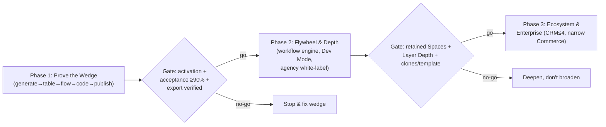
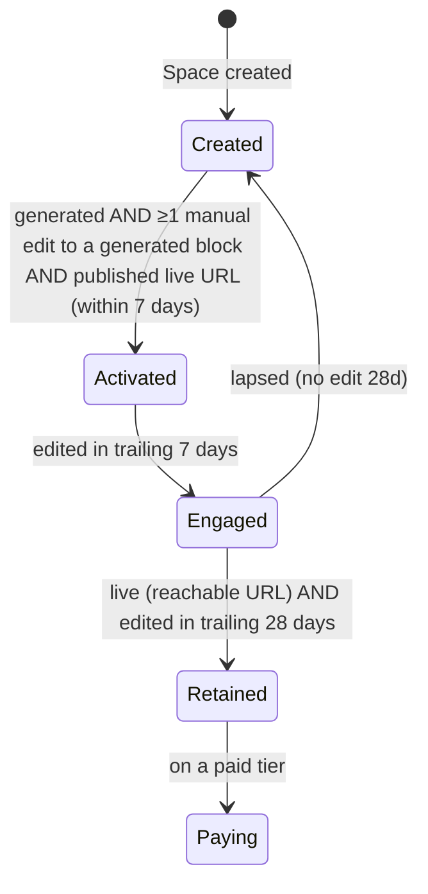

# Flowblok — Product Requirements Document

## 1. Document Control

| Field | Value |
|---|---|
| **Document** | 01-PRD.md — Product Requirements Document |
| **Product** | Flowblok — AI website generator with a real database, real APIs, and code you own |
| **Version** | 1.0 — FINAL |
| **Status** | Final / approved for build |
| **Owner** | Product Management (Senior PM) |
| **Author email** | dharamraj.nagar@dotsquares.com |
| **Date** | 2026-06-16 |
| **Canonical source of truth** | `_CONTEXT.md` — this PRD must not contradict it |

### Related documents (cross-references)

| File | Purpose |
|---|---|
| [`_CONTEXT.md`](./_CONTEXT.md) | Canonical names, numbers, decisions — the single source of truth |
| [`02-TECHNICAL-ARCHITECTURE.md`](./02-TECHNICAL-ARCHITECTURE.md) | Modular-monolith architecture, data layer, tenancy, ADRs |
| [`03-SECURITY-AND-ACCESS.md`](./03-SECURITY-AND-ACCESS.md) | Roles, ABAC, auth/JWT, RLS, crypto, compliance posture |
| [`04-FRONTEND-SPEC.md`](./04-FRONTEND-SPEC.md) | App chrome, editing modes (Simple vs power), component specs |
| [`05-FEATURE-TICKETS.md`](./05-FEATURE-TICKETS.md) | The 12 epics and FB-001…FB-068 tickets in detail |
| [`06-SRS.md`](./06-SRS.md) | Software requirements specification (functional/non-functional) |
| [`07-FSD.md`](./07-FSD.md) | Functional specification / detailed behavior |
| [`08-DESIGN-SYSTEM.md`](./08-DESIGN-SYSTEM.md) | Single machine-readable design system + tokens (SSOT) |

> **Reading note for stakeholders.** This PRD defines *what* Flowblok is, *who* it serves first, *what* ships *when*, *how* we make money, and *how* success is measured. It states one positioning wedge and one primary persona for the first 18 months. The full multi-module vision is preserved in **Appendix A (Vision)** and is deliberately demoted out of the funded plan. Ticket-level acceptance criteria live in `05-FEATURE-TICKETS.md`; engineering and design depth live in `02`/`03`/`04`/`08`.

> **Terminology (canonical).** The user-facing entity is a **Space**. The hierarchy is **Organization (tenant) → Space**. The word "Workspace" is retired across UI, routes (`/app/{org}/{space}`), JWT claims, and tickets. In the data model, `tenant_id` = Organization id and `space_id` = Space id; both columns exist on every tenant-owned row. RLS keys off `tenant_id`; the application scopes by `space_id`. See `_CONTEXT.md` §3.

---

## 2. Executive Summary (The Wedge)

**Flowblok is the AI website generator that doesn't trap you: prompt → an editable, hosted site with a real database and real APIs — and you own the code.**

Most AI site builders hand you a pretty page and a dead end. The output is a styled HTML shell with no real data model, no automation, and no way to take your code with you. The moment you need a working form that captures a lead, a table that stores it, or a developer who wants to extend it, you hit a wall and start over in a different tool.

Flowblok's wedge is the opposite promise, proven on **one narrow slice**:

> **Type a prompt → get a live page bound to a real generated table → with a real form-to-email workflow → that a developer can open, view, and fork as code → published to a hosted URL.**

That single slice exercises all five layers Flowblok unifies — **Visual + Database + Workflow + Code + AI** — on a deliberately small surface, so the integrated experience is demonstrable in Phase 1 rather than promised for Phase 3.

### One persona, one job, one competitor, one wedge

| Dimension | The funded bet (first 18 months) |
|---|---|
| **Primary persona** | **Agency** — has budget, uses the product repeatedly across clients, and drives the template/clone flywheel. |
| **Activation persona** | **Non-technical user** (founder, marketer) — the person who runs the first generation and feels the magic. Owns the **Simple** default editing experience. |
| **Served later** | **Developer** (activates Phase 2, Developer Mode read/fork), **Enterprise** (activates Phase 3, SSO/isolation/compliance). |
| **The one job** | "Spin up an editable, hosted client site with working lead capture — and hand off code I own — faster than my current stack." |
| **The one competitor to beat** | Single-output AI site generators (e.g., Wix ADI / Framer AI / v0-class tools) on the axis they cannot follow us to: **a real database + real APIs + exportable code under one editable surface.** |
| **The one wedge sentence** | "Prompt → editable, hosted client site + lead capture, own your code." |

### Why this is investable

"Better than 13 leaders at once" is the absence of positioning. A single wedge for a single primary persona is a product an 8–10 person team can ship, a buyer can understand, and a moat can compound behind. The broad "Digital Experience Operating System" framing — replacing 13 tools across 16 modules — is real long-term ambition, but it is **vision, not build order**, and lives in Appendix A.

> **Build-order clarification.** "AI Generator first" is a **GTM and value framing**, not a literal build sequence. The generator sits *on top of* the Builder + Data + CMS primitives; those primitives are built first so the generator has something to generate into. See §10.

---

## 3. The Moat (Compounding & Phase-1 Demonstrable)

A moat is not "five layers integrated" — that is copyable feature work. Flowblok's defensibility rests on two assets that **compound with usage** and begin accruing in Phase 1.

### 3.1 Moat A — Proprietary generation telemetry (requires central inference)

Every generation produces a closed feedback loop: **prompt → generated app → human edits → publish/keep decision.** Because AI inference is **platform-provided by default** (not BYO-key — see §12), Flowblok observes, at scale, exactly *what the AI produced* and *what the human changed to make it good.* That edit-delta corpus is the training and evaluation signal that makes the generator measurably better over time, and no competitor relying on BYO-keys or single-shot output can see it.

- **Metric that proves the moat is widening:** **generation acceptance rate** (share of generated blocks kept with zero or minor edits) trending up release over release, and **edit-delta shrinkage** (median edits-to-acceptable falling) on the golden-prompt set (§9).

### 3.2 Moat B — Template / clone / marketplace network effect

Agencies clone proven Spaces and publish/consume templates. Each successful client build becomes reusable inventory; each template that performs attracts the next agency. This is the only credible **network effect** in the plan, so the flywheel is **pulled forward from Phase 3 to Phases 1–2** (see §10, §13).

- **Metric that proves the moat is widening:** **clones-per-template** and **share of new Spaces seeded from a template** trending up; marketplace **supply growth** (published templates/month).

### 3.3 Moat verification metric — Layer Depth

Because the thesis is *cross-layer editability*, we instrument **Layer Depth** = the count of distinct layers (of Visual / Data / Workflow / Code / AI) edited in a Space within 30 days. If users only ever touch Visual, the moat is theater. Target: a rising median Layer Depth, with a healthy share of Spaces touching ≥3 layers.

---

## 4. Problem Statement

### 4.1 The trap in today's AI site builders

AI website generators have made the *first* 60 seconds magical and the *next* 60 minutes a dead end:

| The promise | The trap the agency actually hits |
|---|---|
| "Describe your site, get a website." | Output is a static visual shell — no real data model behind it. |
| "It's editable." | Editable until you need logic; then you export HTML and rebuild elsewhere. |
| "Capture leads." | A form that emails you, with nowhere structured to store or route the lead. |
| "Developer-friendly." | No real code to own; you're locked to the builder's runtime. |

For an **agency**, this means the AI demo wins the pitch but loses the project: the tool can't carry a real client engagement from prompt to handoff.

### 4.2 The fragmented-stack tax (the broader pain, context for the wedge)

Beyond the AI-builder trap, the conventional alternative is to assemble best-of-breed tools and pay the integration tax:

| Need | Common tool | Friction the team pays |
|---|---|---|
| Visual design | Webflow / Builder.io | Separate login, export friction |
| Content | Storyblok / Contentful | Hard caps and datasource limits |
| Database | Strapi / Supabase | Hand-wiring to the CMS |
| Workflows | n8n / Zapier | Another tool to learn and maintain |
| Hosting | Vercel / Netlify | Manual deploy pipeline |

The seams between these tools are where agencies lose margin. Flowblok's wedge removes the seams for the *common* client-site job; the long-tail (CRM, Commerce) is explicitly deferred (§5, Appendix A).

### 4.3 Cap ceilings users actually hit (evidence)

This is not hypothetical. The reference Storyblok account that motivated Flowblok shows hard, observed limits: **161 of 200 blocks**, **100 of 100 folders**, **9 of 10 datasources**. These caps force premature architecture decisions and migrations. Flowblok's tenant-scoped data model and AI-assisted component generation are a deliberate counter — see the honest reframing of "Infinite Components" in §7.4.

---

## 5. Goals & Non-Goals

### 5.1 Goals (funded plan, ordered)

1. **Prove the wedge on one slice.** Generate page → bind to a generated table → attach a real form→email workflow → view/fork code in Developer Mode → publish to a hosted URL. (Phase 1.)
2. **Make the generator demonstrably better over time** via central-inference telemetry (Moat A) — acceptance rate up, edit-delta down.
3. **Light the flywheel early.** Template + clone + (install-side) marketplace in Phases 1–2 (Moat B).
4. **Earn agency trust.** Editable output, safe/reversible publishing, and a hard **export guarantee** (code as a Git repo, data as a dump, content as JSON/Markdown).
5. **Protect margins from day one.** AI metered as invisible/abundant credits with a hard free-tier cap and soft (never mid-build hard) caps on paid tiers.

### 5.2 Non-Goals — hard scope ceilings (numeric)

| We are NOT doing (in the funded plan) | Ceiling / rule | Why |
|---|---|---|
| **Building Salesforce / HubSpot.** | If/when CRM ships, **CRM v1 = exactly 4 objects: Lead, Contact, Deal, Activity.** Deferred to a post-wedge phase, gated on activation thresholds. | Full CRM is a different, larger product; it is the most commoditized, contested work and must not front-load the wedge. |
| **Beating WooCommerce / being a store engine.** | **Commerce is cut from the funded 18-month plan.** If revisited, a narrow, defensible v1 only — never "better than WooCommerce." | Commerce is heavily commoditized and pulls an 8–10 person team off the wedge. |
| **Exposing n8n directly.** | Phase-1 **"Flow Core"** = the single template **form → email** (plus store-record). The full visual workflow engine is Phase 2. | KISS; the wedge needs one working automation, not a node engine. |
| **Being a payment processor (PSP).** | **Tokenization only.** We never hold card data; SCA/3DS, refunds/chargebacks, and tax-calc ownership are out of the wedge entirely. | Minimize PCI scope; avoid PSP liability. |
| **Free-form AI schema synthesis.** | AI parameterizes **pre-modeled schema archetypes**, not arbitrary DDL. (FB-048 AI-Generate-Database is **cut from Phase 1**.) | Auto-applied AI DDL on a shared cluster is a production-safety hazard (`_CONTEXT.md` §; `02`). |
| **A BI / data-warehouse suite.** | Analytics = the activation/north-star dashboard + later an AI Analytics agent — not a BI platform. | Out of wedge. |

> The earlier draft's unsourced "90% of businesses need only CRM Lite" claim is **removed** as unsubstantiated.

---

## 6. Personas, Tiers & Entitlements

### 6.1 Persona priority

| Persona | Status (18-mo plan) | Activating phase | Owns which experience |
|---|---|---|---|
| **Agency** | **Primary** (funded build target) | Phase 1 | Power surface (seven block tabs, dense ModernDark), multi-Space, clone, white-label |
| **Non-technical user** | **Activation persona** | Phase 1 | **Simple mode** (2–3 tabs, progressive disclosure, comfortable density) — the default |
| **Developer** | Served later | Phase 2 | Developer Mode (view/fork code), CLI/SDK (Phase 3) |
| **Enterprise** | Served later | Phase 3 | SSO/SAML, isolated tenancy, compliance, advanced RBAC |

> **UX contradiction resolved (KISS vs power-user).** The **non-technical activation persona owns the default Simple editing mode**. The seven-tab power surface and dense ModernDark aesthetic are **gated to Developer/Agency roles**. One product, two surfaces, role-driven — see `04-FRONTEND-SPEC.md`.

### 6.2 Persona → tier → entitlements

This reconciles every persona to a monetized tier (the Developer persona previously had none) and aligns with **FB-066 billing**.

| Tier | Price | Primary persona | Spaces | AI credits | Key entitlements |
|---|---|---|---|---|---|
| **Free** | $0 | Non-technical (activation) | 1 | Hard cap (see §12) | Generate + edit + publish to a Flowblok subdomain; export; staging-by-default. |
| **Starter** | **$19 / mo** | Non-technical / solo | 1 | Abundant, metered; soft cap | Custom domain + SSL; remove Flowblok badge; full export. |
| **Professional** | **$99 / mo** | Developer / power user | Multiple | Higher pool; soft cap | **Developer Mode** (view/fork code), API access, multiple Spaces. |
| **Business** | **$299 / mo** | **Agency** | Multiple client Spaces | Pooled across Spaces; soft cap | **White-label**, client handoff, multi-Space team roles, reseller billing (Phase 2 readiness — §13). |
| **Enterprise** | Custom | Enterprise | Custom | Custom / BYO-key option | SSO/SAML, isolated/dedicated-schema tenancy, BAA chain (gated), advanced RBAC, audit export. |

---

## 7. Product Surface

### 7.1 Funded surface vs. vision surface

The funded 18-month plan ships a **focused slice** of the surface. The full **16 modules** (Flowblok Studio · CMS · Data · Auth · Flow · API · Commerce · CRM · AI · Deploy · Marketplace · Analytics · Identity · Assets · Search · Developer) and the stacked-Space vision are preserved in **Appendix A** as the non-binding end state, not the build target.

**Phase-1 funded modules:** Studio (Simple + power), CMS (core), Data (records store), Auth, **Flow Core** (form→email), API (auto REST per collection), AI (constrained generation), Deploy (staging + publish), Assets (basic), Marketplace (install + clone seed).

### 7.2 The Space and its layers

Canonical tenancy and layout (see `_CONTEXT.md` §3):

```
Organization (tenant) → Space → { Pages, Content, Database, Users, Permissions,
                                   Workflows, Assets, APIs, AI Agents, Commerce,
                                   CRM, Analytics, Settings }
```

A Space stacks layers — **Design · Content · Data · Logic · API · AI · Commerce · CRM · Analytics · Deployment** — though Commerce/CRM are vision-tier (Appendix A), not Phase 1. Page structure is consistent: `Page → Section → Row / Column / Component`.

### 7.3 Editing surfaces: Simple (default) vs. the seven block tabs

The seven canonical block tabs remain **Design · Data · Logic · Permissions · Events · SEO · AI**. They are the **power surface** for Developer/Agency roles. The **non-technical activation persona sees Simple mode by default** — a reduced 2–3 tab surface (Design + Data + AI) with progressive disclosure; the remaining tabs reveal as the user's role/needs grow.

### 7.4 "Infinite Components," reframed honestly

AI generating components is **table stakes**, not a moat. The honest differentiator is **consistency + cross-layer editability**: components come from a **curated default library** that is design-token-constrained and accessibility-validated; **AI is the escape hatch** that parameterizes/selects vetted templates rather than free-form synthesizing arbitrary UI. Quality control: token constraints + automated a11y/AA-contrast validation + the curated library, with the generation eval gate of §9. This directly counters the observed Storyblok caps (§4.3) without claiming an unbounded, uncontrolled generator.

---

## 8. Generation & Refinement Loop

Generation quality *is* the activation funnel. The loop is designed so users never face an auto-published, half-right site.

1. **Set expectations (pre-generation).** Before running, show what Flowblok will produce (page set, one generated table, one form→email flow) and what it will not. No silent over-promising.
2. **Constrained generation.** AI selects and parameterizes **vetted block templates** and a **small set of pre-modeled schema archetypes** — not free-form schema synthesis (§5.2; FB-048 cut from Phase 1).
3. **"What the AI assumed" panel.** Every generation exposes an **editable assumptions panel** (industry, sections chosen, schema archetype, copy tone) the user can correct and re-run.
4. **Preview before any deploy.** Generation **never auto-publishes.** Output lands in **staging (noindex) by default**; the user explicitly publishes.
5. **Partial regeneration.** "Keep my edits, restyle the rest"; generate **variations** of a block; regenerate a single section without clobbering hand edits (per-artifact ownership — see §7 round-trip rule in `02`).
6. **Refine, then publish.** The user edits visually (Simple mode) or in code (Developer Mode), then publishes to a hosted URL with one-click rollback (§15).

> **North-star correction.** We do **not** optimize for "publish in the first session." A half-right published site is a churn driver. We optimize for **retained, edited, live value** (§11).

---

## 9. AI Quality, Evaluation & Governance

### 9.1 Quality & evaluation spec (CI-gated)

Generation has explicit acceptance criteria for "good," enforced in CI:

| Control | Definition | Gate |
|---|---|---|
| **Golden-prompt set** | A fixed, versioned set of representative agency prompts. | Run every release. |
| **Automated scorers** | (a) renders-without-error, (b) WCAG **AA contrast** pass, (c) schema-validity of generated archetype, (d) binding integrity (block↔table). | **≥ 90% pass rate** required to ship. |
| **Human-eval rubric** | Reviewer scores usefulness/coherence on a fixed rubric. | Tracked release-over-release. |
| **CI regression gate** | Acceptance rate may not regress beyond a set delta vs. previous release. | Blocks merge. |
| **Latency budget** | Generation **p95** within target (set in `02`); breach pages on-call. | Monitored. |
| **Per-generation cost budget** | Worst-case tokens per generated site modeled; cost capped (§12). | Monitored, soft-capped. |

### 9.2 AI governance

- **Prompt/output moderation** on inputs and generated content.
- **IP / licensing** of generated assets clarified in terms (Appendix A / `03`); generated code/content is the customer's, exportable.
- **Human-in-the-loop required** before any AI action that contacts a real person (e.g., a future CRM follow-up) or makes an irreversible change. No autonomous outreach in the wedge.

---

## 10. Phased Rollout / MVP Strategy

### 10.1 Sequencing rationale (qualitative confidence, not a false-precision table)

The earlier draft cited an unsourced 75% / 60% / 20% / 5% probability table. Those numbers had no derivation and are **replaced with explicit reasoning**:

| Strategy | Confidence | Reasoning |
|---|---|---|
| **Build everything at once (16 modules)** | **Very low** | An 8–10 person team cannot ship 16 modules well; four co-primary personas with conflicting UX pull the product apart; no moat is demonstrable before money/runway expires. |
| **CMS + AI** | **Moderate** | Sound, but a CMS without a database/workflow/code escape hatch is undifferentiated from incumbents; doesn't prove the five-layer thesis. |
| **AI generator first (as GTM framing) on a real-DB/code slice** | **Highest** | Proves all five layers on one slice; produces the telemetry moat immediately; lets a small team ship in a true wedge window. **← chosen.** |
| **Marketplace-first** | **Low** | A marketplace with no supply and no anchor product is empty; the flywheel needs a generator to seed it. |

### 10.2 Phase plan — each boundary is a kill-or-continue gate

| Phase | Duration | Ships (funded) | Go/No-Go gate to proceed |
|---|---|---|---|
| **Phase 1 — Prove the Wedge** | **~8–12 weeks** (within the 6-month foundation window) | One-slice generation (page → generated table → form→email **Flow Core** → view/fork code → publish), Space mgmt, Auth (no mandatory MFA), Data **records store**, auto **REST** per collection, basic Deploy (staging+publish), **template install + clone**, AI-credit metering + **hard free-tier cap**. | **Activation ≥ target** (generate+edit+publish within 7 days — §11) AND generation acceptance ≥ 90% on golden set AND export guarantee verified. Else: stop and fix the wedge — do not add modules. |
| **Phase 2 — Agency Flywheel & Depth** | next ~6 months | Full **Workflow engine** (beyond Flow Core), Developer Mode general availability, **GraphQL**, agency-readiness (white-label, client handoff, multi-Space roles, reseller billing — §13), template **publish/sell** side, Analytics dashboards. | Retained-Spaces growth + rising Layer Depth + clones-per-template ≥ target. Else: deepen, don't broaden. |
| **Phase 3 — Ecosystem & Enterprise** | following 12 months | Full Marketplace economy, Plugin SDK + CLI, AI Agents, Enterprise (SSO/SAML, isolated tenancy, advanced RBAC), scale hardening; **CRM v1 (≤4 objects)** and any narrow Commerce only if gated metrics justify. | LTV:CAC ≥ 3 sustained; enterprise pipeline real. |

> Deferred out of Phase 1 (to later phases, gated on activation thresholds): free-form DB Builder, GraphQL, SDK codegen, localization, mandatory MFA, full Developer-Mode execution, FB-048 AI-Generate-Database.

### 10.3 Authoritative phase matrix (modules & tickets)

Single mapping; reconciles the Tech-Arch "MVP?" column, the epic roadmap, and per-ticket phases. **Workflow is split**: Phase-1 **Flow Core** vs Phase-2 **full engine**.

| Phase | Epics (primary) | Representative tickets |
|---|---|---|
| **Phase 1** | Space Mgmt, Auth, CMS core, Visual Builder, Database (records store), API (REST), AI generation (constrained), **Flow Core**, Deploy, Marketplace (install + clone) | FB-001…FB-004, FB-005…FB-008/FB-010 (MFA deferred), FB-011…FB-015, FB-017…FB-021, FB-023…FB-025, FB-033, FB-046/FB-049/FB-050, FB-051, FB-055 (read) |
| **Phase 2** | Full Workflow engine, Developer Platform (view/fork), API (GraphQL/Webhooks), CRM v1 prep, Analytics, agency readiness | FB-028…FB-032, FB-034…FB-036, FB-056…FB-058, FB-066 (billing) |
| **Phase 3** | Marketplace economy, Plugin SDK/CLI, AI Agents, Enterprise, CRM v1 (≤4 objects), narrow Commerce (if gated) | FB-052…FB-054, FB-059…FB-060, FB-037…FB-040, FB-041…FB-045 |



### 10.4 MVP definition (end of Phase 1)

The MVP is the **one-slice wedge proven end to end**: a user types a prompt, gets a generated set of pages **bound to one generated table**, with a **working form→email Flow Core**, can **view and fork the code** in Developer Mode, and **publishes to a hosted URL** — with export guaranteed. CRM, Commerce, the full workflow engine, GraphQL, SDK codegen, and the marketplace economy are explicitly deferred.

---

## 11. Success Metrics & KPIs (Measurement Spec)

### 11.1 Space lifecycle state model

"Active workspace" was previously undefined yet load-bearing. It is now precise:



### 11.2 Activation and north-star (contradiction resolved)

- **Activation** = within **7 days of Space creation**: ran a generation **AND** made **≥1 manual edit** to a generated block **AND** published to a **live URL**.
- **North-star** = the **weekly count of Spaces that are both live (reachable URL) AND edited in the trailing 7 days** — i.e., *retained generated value*, not first-session vanity.

### 11.3 Re-baselined growth targets

The 1k / 10k / 50k figures refer to **trailing-28-day Retained Spaces**, **re-baselined from MVP launch (month 6)** — not raw signups.

| Metric (trailing-28-day Retained Spaces) | Year 1 (from launch) | Year 2 | Year 3 |
|---|---|---|---|
| **Retained Spaces** | 1,000 | 10,000 | 50,000 |
| **CAC assumption alongside** | ≤ $X blended (agency-led + PLG); validated with design partners (§13) | declining via flywheel | flywheel-dominant |

> Each growth target carries a CAC assumption (§13) so the number is accountable, not aspirational.

### 11.4 KPI dashboard — every metric is a formula + window + source + target

The prior adjective targets ("High," "Fast," "Grow," "Low") are replaced:

| KPI | Formula | Window | Source | Target |
|---|---|---|---|---|
| **Activation rate** | Activated Spaces ÷ Created Spaces | 7-day | product events | ≥ 40% of Created Spaces |
| **North-star** | count(live AND edited) Spaces | trailing 7-day | product events | grows ≥ X% WoW |
| **Retention** | Retained ÷ Activated | trailing 28-day | product events | ≥ 60% |
| **Generation acceptance rate** | kept-with-≤minor-edits blocks ÷ generated blocks | per release | generation telemetry | ≥ 90% and rising |
| **Layer Depth** | distinct layers edited per Space | trailing 30-day | edit telemetry | median ≥ 2, ≥X% touch ≥3 |
| **Clones-per-template** | clones ÷ published templates | trailing 28-day | marketplace events | rising |
| **MRR** | Σ tier price × paying Spaces | monthly | billing (FB-066) | grows with Retained |
| **Gross margin** | (revenue − AI COGS − hosting) ÷ revenue | monthly | billing + AI metering | ≥ 70% blended (§12) |
| **LTV:CAC** | (ARPA × gross-margin × avg-lifetime) ÷ CAC | rolling | billing + GTM | ≥ 3 (§13) |
| **Churn** | churned paying Spaces ÷ start-of-period paying | monthly | billing | ≤ 4%/mo and decreasing |
| **Published-site load** | LCP p75 of hosted sites | weekly | RUM | LCP ≤ 2.5s |

---

## 12. Business Model

### 12.1 SaaS tiers

| Tier | Price | Audience |
|---|---|---|
| **Free** | $0 | Activation persona; hard generation cap; Flowblok subdomain |
| **Starter** | **$19 / mo** | Solo / non-technical; custom domain |
| **Professional** | **$99 / mo** | Developer / power user; Developer Mode |
| **Business** | **$299 / mo** | **Agency**; white-label, client Spaces |
| **Enterprise** | **Custom** | SSO/SAML, isolation, compliance |

### 12.2 AI inference & credits — central by default

- **Default: platform-provided AI keys**, metered as **invisible/abundant AI credits** at paid tiers. No mid-creation meter anxiety; the **non-technical activation persona never needs a key.**
- **BYO-key is an optional advanced/enterprise setting only.** This resolves the "who pays when a tenant has no key" contradiction (nobody is stranded) and preserves the **telemetry moat** (§3.1), which BYO-default would forfeit.
- **Free tier: a hard generation cap.** Paid tiers: **soft caps** — never a hard mid-build stop; the user is warned and can continue/upgrade.

### 12.3 Per-generation COGS & gross-margin model

Worst-case tokens per generated site are modeled to prove **Starter $19 is not margin-negative.** (Illustrative model; live figures tracked against the §11 gross-margin KPI.)

| Item | Worst-case assumption (per generated site) |
|---|---|
| Input + output tokens (multi-step pipeline, constrained surface) | modeled ceiling per generation |
| Generations included before soft cap (Starter) | bounded so monthly AI COGS ≤ a fraction of $19 |
| Hosting/egress per live site | bounded by staging-by-default + CDN |

| Tier | Price | Modeled AI COGS/mo (capped) | Hosting/mo | Blended gross margin target |
|---|---|---|---|---|
| Free | $0 | hard-capped to ~$0 floor | minimal subdomain | n/a (acquisition cost) |
| Starter | $19 | ≤ ~25% of price (soft-capped) | low | ≥ 60–70% |
| Professional | $99 | ≤ ~20% of price | moderate | ≥ 70% |
| Business | $299 | pooled, ≤ ~20% | per client Space | ≥ 70% |

> Rule: if worst-case generation cost on a tier approaches margin-negative, the **soft cap tightens** before the tier is sold — never a hard stop mid-build. COGS/margin are tracked monthly (§11).

### 12.4 Marketplace

- **20% commission** on all marketplace sales — templates, plugins, AI agents.
- Goal: **1000+ templates.** The clone/template flywheel is pulled into Phases 1–2 (§3.2, §13).

---

## 13. Go-To-Market

### 13.1 Beachhead & channels

- **Agency-led** outbound + partnerships (the primary persona buys repeatedly and reuses).
- **Template-marketplace-seeded** supply: pre-seed high-quality templates so the first agencies arrive to a non-empty shelf (Moat B).
- **PLG signups** from the generator demo (the activation persona experiences the wedge in 60 seconds).

### 13.2 Design partners (close before Phase 2)

Close **5–10 named design-partner agencies** before exiting Phase 1. Each provides: real client briefs (golden prompts), edit-delta telemetry, white-label/handoff requirements, and CAC validation. (Named list maintained in the GTM tracker; reconciled to `_CONTEXT.md`.)

### 13.3 CAC and the path to LTV:CAC ≥ 3

| Lever | Mechanism |
|---|---|
| **CAC down** | flywheel (clones/templates) lowers paid-acquisition dependence over time; PLG demo converts self-serve. |
| **LTV up** | agency tier ($299) + multi-Space + pooled credits + low churn from retained value (§11). |
| **Formula** | LTV:CAC = (ARPA × gross-margin(≥70%) × avg-lifetime) ÷ CAC ≥ 3, with a CAC assumption attached to each growth target (§11.3). |

### 13.4 Agency-readiness milestones (Phase 2)

White-label (remove Flowblok branding), one-click **client handoff** (transfer Space + export repo), **multi-Space team roles**, and **reseller billing** (the agency bills its client; Flowblok bills the agency — reconciled with **FB-066**).

---

## 14. Migration & Portability

Portability is a first-class promise and a sales weapon against the "trap."

### 14.1 Import paths

| From | Mechanism | Phase |
|---|---|---|
| Storyblok / Contentful | Content export → mapped to Flowblok content types | Phase 2 |
| WordPress | WXR (WordPress XML) import | Phase 2 |
| CSV | Bulk import into records store (later: CRM/Commerce objects) | Phase 1 (records) |

### 14.2 Hard export guarantee

> **Your data and code are exportable at any time.** This is a contractual product promise, not a setting we can quietly remove.

| Artifact | Export format |
|---|---|
| Content | JSON / Markdown |
| Database (records store) | Database dump (e.g., SQL/CSV/JSON) |
| Generated code | A real **Git repository** you own |
| Media / assets | Original files |

Export traces directly to **GDPR Art. 20 (data portability)** — see `03-SECURITY-AND-ACCESS.md`.

---

## 15. Operational Trust

| Area | Commitment |
|---|---|
| **Support model** | Free: community/docs. Starter: email. Professional: priority email. Business (Agency): priority + onboarding. Enterprise: SLA-backed. |
| **Hosted-site uptime** | Honest targets: **99.9% Business**, **99.95% only with multi-AZ HA**. (No 99.99% claim on single-cluster Postgres — see §16, `03`.) |
| **AI-outage fallback** | The prompt and in-progress work are **never lost** if inference is unavailable; the user can retry or continue editing existing output. |
| **Safe/reversible publishing** | **Staging-by-default (noindex)**; custom domain + SSL on publish; **one-click rollback** to any prior published version. |

---

## 16. Compliance & Legal Posture

| Item | Posture |
|---|---|
| **Data roles** | A documented **controller/processor mapping** is the foundation of all GDPR work (`03`). |
| **HIPAA** | **Product-gated capability, not a marketed target.** PHI is **prohibited on standard tenancy** until an isolated tier + BAA chain ships. |
| **SLA** | Honest: **99.9% Business / 99.95% with multi-AZ HA**. No 99.99% claim. |
| **Compliance-claims discipline** | Never market SOC 2 / ISO / HIPAA as "certified" before an attestation exists. Use **"designed to align with."** SOC 2 **evidence collection starts in Phase 1**, not Phase 3. |
| **PCI** | Tokenization only; not a PSP (§5.2). |
| **AI/IP** | Generated assets' IP/licensing clarified in terms; human-in-the-loop before any real-person contact or irreversible action (§9.2). |

---

## 17. Architecture & Data Posture (PRD-level, see `02`)

These product-shaping decisions are stated here and detailed in `02-TECHNICAL-ARCHITECTURE.md`:

- **Modular monolith for Phase 1** (NestJS modules, not deployables) on one managed Postgres (+pgvector), at most 2–3 deployable units (web/API + async worker). The "30+ microservices / 300+ tables" figure is **not a goal** — it is, at most, a non-binding end-state symptom. **Service-extraction rule:** split a service only on an independent scaling profile **or** a dedicated owning team.
- **No Kafka/Elasticsearch in Phase 1–2.** Use transactional-outbox + Redis Streams / pg-boss / BullMQ; Kafka deferred to Phase 3 gated on a measured throughput threshold.
- **Identity:** Supabase (or managed Postgres) provides **Postgres + RLS + pgvector + Auth-as-IdP only**; the NestJS monolith **consumes** Supabase-issued JWTs (does not re-issue). **Asymmetric signing (RS256/EdDSA + JWKS)** end-to-end; alg pinned on every verifier (no HS256-shared-secret). No custom API Gateway in Phase 1.
- **ORM:** **Prisma** is canonical (TypeORM/Flyway = "alternatives considered" only).
- **Tenant-defined "tables" = a JSONB-backed records store** (`tenant_id + space_id + collection_id + JSONB payload + GIN indexes`), **not per-tenant DDL.** Real DDL is reserved for the ~40 platform tables and an Enterprise dedicated-schema tier. Platform migrations (Git/CI/review) are split from runtime tenant schema-evolution; **generated DDL never auto-applies** (dry-run + diff gate).
- **Visual↔Code is one-way generation + explicit fork**, not symmetric round-trip. Code→Visual re-import is limited to the generator's lossless canonical AST grammar; any edit outside it seals the block as a labeled **Custom Component** (no longer visually editable). The round-trip feasibility spike is a **Phase-1 go/no-go** (RISK-02 below), not a footnote.

---

## 18. Risks & Mitigations

| ID | Risk | Impact | Mitigation |
|---|---|---|---|
| RISK-01 | **Incumbents ship the same AI generation with more distribution** | They out-reach us | Compete on the axis they can't follow without re-architecting: real DB + real APIs + exportable code + telemetry moat (§3). Win agencies via flywheel + handoff. |
| RISK-02 | **Visual↔Code round-trip is undecidable in the general case** | Months lost chasing the impossible | One-way generation + sealed Custom Component fork (§17); **Phase-1 go/no-go spike**; per-artifact ownership (never silently regenerate over hand edits). |
| RISK-03 | **Model-layer commoditization ("what if the model eats us")** | Generators become a feature | Moat is the **edit-delta telemetry + flywheel**, not the base model; central inference keeps the data asset (§3, §12). |
| RISK-04 | **Generation quality / output SLA** | Bad output kills activation | Eval gate ≥90%, golden set, CI regression gate, refinement loop, "what AI assumed" panel (§8, §9). |
| RISK-05 | **Generation latency / cost crushes activation or margins** | Slow/expensive = no activation, thin margin | Latency p95 + per-gen cost budgets (§9.1); abundant credits + soft caps + hard free cap (§12). |
| RISK-06 | **Over-scoping (16 modules / 4 personas)** | Team shredded; nothing ships well | One wedge, one primary persona, hard numeric non-goals (§2, §5.2); kill-or-continue gates (§10). |
| RISK-07 | **PMF kill-metric per phase missed** | Building past PMF signal | Each phase boundary is a metric gate; no-go = stop/deepen, not broaden (§10.2). |
| RISK-08 | **Vision-vs-MVP expectation gap** | Buyers expect 16 modules now | Public positioning = the wedge only; the 16-module/DXOS framing lives in Appendix A as vision, explicitly not the funded plan (§2, §7.1). |
| RISK-09 | **Tenant isolation breach** | Catastrophic cross-tenant leak | `tenant_id` (RLS) + `space_id` (app scope) on every row; three-layer enforcement (UI → JWT → RLS); asymmetric JWT (§17, `03`). |
| RISK-10 | **AI-authored DDL on shared cluster** | Production-safety hazard | Records store (no per-tenant DDL); generated DDL never auto-applies; dry-run + diff gate (§17). |
| RISK-11 | **Plugin security (Phase 3)** | Untrusted code in multi-tenant system | Containerized sandbox + mandatory review; semantic versioning + automated tests. |
| RISK-12 | **Compliance misrepresentation (HIPAA/SOC2)** | FTC §5 / legal exposure | Compliance-claims discipline; HIPAA product-gated; honest SLA (§16). |

---

## 19. Open Questions & Consistency Resolutions (§19)

Internal contradictions from the source draft, resolved here and logged:

| # | Contradiction | Resolution |
|---|---|---|
| OQ-1 | KISS vs 16-module scope | KISS wins; 16 modules demoted to Appendix A (vision); funded plan = the wedge (§2, §7.1). |
| OQ-2 | "Never sees code" vs "Developer Mode" headline | Both true by **persona**: non-technical never needs code (Simple mode); Developer Mode is a gated escape hatch (§6, §7.3). |
| OQ-3 | Tagline "do everything" vs humble non-goals | Public tagline = the wedge; non-goals are hard numeric ceilings (§2, §5.2). |
| OQ-4 | Workflow "MVP basic" vs "Phase 2" | Split: **Flow Core** (form→email) Phase 1; full engine Phase 2 (§10). |
| OQ-5 | "AI-first" as build order | It is GTM framing; generator sits on top of Builder+Data+CMS primitives (§2). |
| OQ-6 | BYO-key vs central inference | Central by default; BYO advanced/enterprise only (§12). |
| OQ-7 | Light vs dark design SSOT | App is **dark-first (ModernDark)**, single accent; one machine-readable token SSOT in `08-DESIGN-SYSTEM.md`. |

Remaining items to validate per phase (tracked in the GTM/PM tracker): exact Phase-1 content-type set; default soft-cap thresholds per tier; named design-partner list; SOC 2 evidence cadence; import-tool priority order.

> Anything that would change canonical names, numbers, or decisions must first be reconciled against `_CONTEXT.md`.

---

## Appendix A — Vision (Internal, Non-Binding)

> This appendix preserves the full long-term ambition. **It is not the funded 18-month plan** and must not drive build order, positioning, sales claims, or staffing.

**Flowblok as a Digital Experience Operating System (DXOS):** one platform unifying design, content, data, logic, APIs, CRM, commerce, AI, SEO, assets, analytics, and deployment — conceptually replacing the capabilities of Storyblok, WordPress, Strapi, Contentful, Builder.io, Webflow, Shopify, WooCommerce, Zoho CRM, HubSpot, n8n, Boomi, and Supabase.

- **The 16 modules:** Flowblok Studio · CMS · Data · Auth · Flow · API · Commerce · CRM · AI · Deploy · Marketplace · Analytics · Identity · Assets · Search · Developer.
- **Stacked-Space vision:** Design · Content · Data · Logic · API · AI · Commerce · CRM · Analytics · Deployment, all editable from one admin.
- **AI subsystems (vision):** AI Designer, AI Developer/Code Assistant, AI SEO, AI Copywriter, AI CRM Agent, AI Analytics Agent; generation agents for Page/Workflow/Database/Commerce; the `designprompts/*.md` style catalog (31 styles).
- **CRM (vision):** "CRM Lite" — Leads, Contacts, Companies/Accounts, Deals/Pipelines, Activities, Notes, Tasks, Emails (v1 hard-capped to 4 objects when/if built — §5.2).
- **Commerce (vision):** Products, Categories, Inventory, Orders, Coupons, Payments, Shipping, Taxes — narrow and defensible only, never "better than WooCommerce" as a marketed claim.
- **Marketplace (vision):** Themes · Templates · Components · Connectors · Workflows · AI Agents; 1000+ templates; 20% commission; Plugin SDK + CLI.

The discipline of this PRD is precisely that this appendix stays an appendix until the §10 gates earn each next layer.

---

*End of 01-PRD.md (v1.0 FINAL, 2026-06-16).*
