# Flowblok — Technical Architecture Document

## 1. Document control

| Field | Value |
|---|---|
| **Document** | `02-TECHNICAL-ARCHITECTURE.md` |
| **Product** | Flowblok — AI-Native Visual Business Operating System |
| **Version** | **1.0 (FINAL)** |
| **Date** | 2026-06-16 |
| **Status** | FINAL — approved for build |
| **Owner** | Principal Architect / CTO |
| **Source of truth** | `_CONTEXT.md` (canonical names / numbers / decisions) |

**Related documents (cross-reference by filename)**

- [`_CONTEXT.md`](./_CONTEXT.md) — Canonical Planning Context (single source of truth)
- [`01-PRD.md`](./01-PRD.md) — Product Requirements Document
- [`02-TECHNICAL-ARCHITECTURE.md`](./02-TECHNICAL-ARCHITECTURE.md) — this document
- [`03-SECURITY-AND-ACCESS.md`](./03-SECURITY-AND-ACCESS.md) — Security & Access Document
- [`04-FRONTEND-SPEC.md`](./04-FRONTEND-SPEC.md) — Frontend Specification Document
- [`05-FEATURE-TICKETS.md`](./05-FEATURE-TICKETS.md) — Feature Ticket List (epics + FB-### tickets)
- [`06-SRS.md`](./06-SRS.md) — Software Requirements Specification
- [`07-FSD.md`](./07-FSD.md) — Functional Specification Document
- [`08-DESIGN-SYSTEM.md`](./08-DESIGN-SYSTEM.md) — Design System (single source of truth for tokens)

> This document derives all naming, numbers, and decisions from `_CONTEXT.md`. Where it elaborates implementation detail not present in `_CONTEXT.md`, it does so without contradicting it. Security depth (crypto, RBAC/ABAC matrices, audit, threat model) is owned by `03-SECURITY-AND-ACCESS.md`; design tokens are owned by `08-DESIGN-SYSTEM.md`; this document references them rather than duplicating them.

### 1.1 Canonical terminology (authoritative)

| Term | Meaning | Notes |
|---|---|---|
| **Organization** | The tenant — billing + top-level identity boundary. | DB column `tenant_id` = Organization id. |
| **Space** | The user-facing unit a person builds in (pages, data, workflows, …). | DB column `space_id` = Space id. **"Workspace" is retired** as a user-facing term; it survives only as a legacy synonym in historical notes. |
| Hierarchy | **Organization (tenant) → Space → { Pages, Content, Database, Users, Permissions, Workflows, Assets, APIs, AI Agents, Commerce, CRM, Analytics, Settings }** | Route segment: `/app/{org}/{space}`. |
| Isolation key | **`tenant_id`** | RLS keys off `tenant_id`; the application additionally scopes by `space_id`. Both columns appear on every tenant-owned row. |

> **Glossary propagation:** every diagram, policy, route, JWT claim, and ticket title in this document uses **Space** (not Workspace) and the `tenant_id` / `space_id` column convention. See `_CONTEXT §3` glossary entry.

### 1.2 What changed in v1.0 (architecture deltas from v0.1 DRAFT)

This release applies the expert-crew global decisions. The most consequential reversals from the v0.1 draft:

1. **Phase 1 is a modular monolith**, not microservices. The "30+ services / 300+ tables" figure is **deleted as a target** and reframed as a non-binding end-state symptom (§2.2, §5).
2. **Supabase provides Postgres + RLS + pgvector + Auth-as-IdP only.** The NestJS monolith **consumes** Supabase-issued JWTs and does **not** re-issue them. The **custom API Gateway and Kafka are dropped from Phase 1** (ADR-01, ADR-06, ADR-09).
3. **Tenant-defined "tables" are rows in a JSONB records store**, not physical per-tenant DDL (§7.3, ADR-07).
4. **Visual↔Code is one-way generation + an explicit fork escape hatch**, not symmetric round-trip (§9.4, ADR-10).
5. **Phase-1 AI generation is a narrow templated surface** with a quality eval gate; no free-form schema synthesis; FB-048 (AI-Generate-Database) is cut from Phase 1 (§11, ADR-11).
6. **Prisma is the single canonical ORM/migration tool.** TypeORM/Flyway appear only as "alternatives considered."
7. New mandatory sections: published-site data path (§9.6), untrusted-code rendering isolation (§14.7), tenant-context propagation through async paths (§10.6), SSRF egress proxy (§16), checkout saga (§7.6), workflow execution journal (§10.4).

---

## 2. Architecture goals & principles

Flowblok's funded-build wedge (`_CONTEXT §1`, PRD positioning) is: **"the AI website generator that doesn't trap you — prompt → an editable, hosted site with a real database and real APIs; own your code."** The five-layer thesis (**Visual + Database + Workflow + Code + AI**) is the moat, and Phase 1 must make that thesis **provable on one narrow vertical slice**:

> Generate a page → bind it to a generated table → attach a real form→email workflow → view/fork the code in Developer Mode → publish to a live URL.

The architecture exists to deliver that slice for an **8–10 person team (2 BE, 2 FE, 2 AI, 1 DevOps, 1 Product, 1 Design)** — not to pre-build a 16-module everything-platform. The full 16-module surface and the "DXOS" framing are an internal vision appendix, not a Phase-1 build order.

### 2.1 Principles

| # | Principle | What it means in practice |
|---|---|---|
| P1 | **API-first** | Every capability is an API before it is a UI. The admin app, generated sites, and the platform SDK are clients of the same versioned API surface. |
| P2 | **Modular monolith first; extract only on proof** | Phase 1 is **one deployable web/API app + one async worker** (≤ 2–3 deployables) composed of NestJS modules. A module is extracted into a service **only** when it has an *independent scaling profile* OR a *dedicated owning team* (the **Service Extraction Rule**, §5.4). Microservices are an org-scaling tool the pre-PMF team does not need. |
| P3 | **Multi-tenant by construction** | Shared PostgreSQL with `tenant_id` (+ `space_id`) on every tenant-owned row + Row-Level Security keyed on `tenant_id`. No cross-tenant query is *possible*, not merely *disallowed*. |
| P4 | **Performance-first** | SSR/SSG/edge delivery, aggressive caching (Redis + CDN), code splitting, read replicas. |
| P5 | **DRY / KISS** | One chrome, one design-token contract (`08-DESIGN-SYSTEM.md`), one auth IdP, one workflow engine, one data-binding engine, **one ORM (Prisma)**. Resist per-module reinvention. |
| P6 | **Schema-as-code for the *platform*; online runtime evolution for *tenant* schemas** | Platform's ~40 tables evolve via Prisma migrations under Git/CI/review. Tenant-defined "tables" evolve at runtime against a JSONB records store with no human PR (§7.3). The two paths never mix. |
| P7 | **Developer-extensible, never auto-destructive** | "Nothing is locked": generated React, workflow JSON, API defs, and the Space schema descriptor are inspectable/forkable. But the generator **never silently regenerates over hand edits** (per-artifact ownership, §9.4). |
| P8 | **Generated and tenant code is untrusted** | Any AI-generated or developer-authored code executes only in a per-tenant isolated runtime with no platform credentials (§14.7). The shared rendering service never SSRs arbitrary tenant code. |

### 2.2 Scale posture (NOT a target list)

The v0.1 "30+ microservices / 300+ tables" figure is **retired**. It was an anti-pattern propagated as canon: it contradicts KISS, is fatal for a 2-BE team, and would force ~1M physical tables at 50k Spaces.

- **End-state symptom, not a goal:** a mature platform *may* eventually decompose into many modules and accumulate many platform tables. That is an emergent symptom of growth, never a number to build toward.
- **Phase-1 reality:** **~8 NestJS modules** inside one deployable app + one worker; **~40 platform tables** (DDL); unlimited tenant "tables" stored as **rows** in a JSONB records store (§7.3).
- **Growth drivers:** Space growth Y1 1,000 · Y2 10,000 · Y3 50,000 — re-baselined from MVP launch (month 6), counted as trailing-28-day **retained** Spaces (`_CONTEXT §13`, north-star in `01-PRD.md`).
- **SLA:** honest **99.9% Business / 99.95% only with multi-AZ HA**. The 99.99% figure is removed as a canonical target (compliance discipline, §15, `03-SECURITY-AND-ACCESS.md`).

---

## 3. System context & high-level diagram

The Phase-1 boundary box is explicit: a **modular monolith** (one web/API deployable) plus **one async worker**, on **managed Postgres (Supabase)**. There is **no custom API gateway** and **no Kafka** in Phase 1.

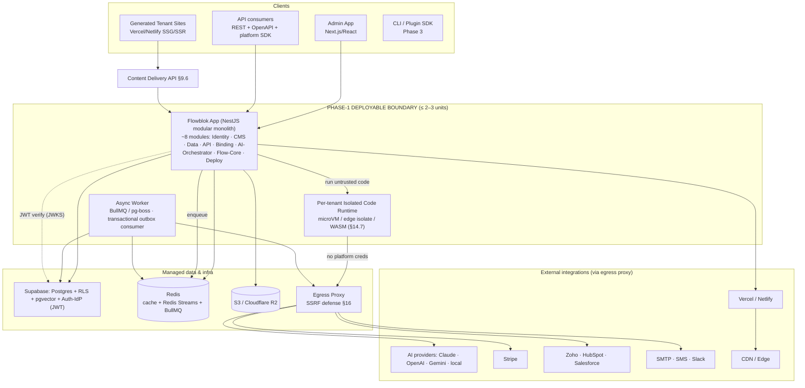

**Reading the diagram.** Clients hit the NestJS app directly (ingress auth + rate limiting are app concerns in Phase 1, not a separate gateway). Supabase is the system of record (Postgres + RLS + pgvector) **and the identity provider** — the app verifies Supabase-issued JWTs against the JWKS endpoint and never re-issues tokens. Async work flows through Redis Streams / BullMQ driven by a **transactional outbox** (not Kafka). **Every** outbound fetch — AI providers, payment, connectors, webhooks, data-binding HTTP, screenshot ingest — traverses the **egress proxy** (§16). Untrusted generated/developer code runs only in the isolated runtime (§14.7), which holds no platform credentials.

---

## 4. Logical layers

`_CONTEXT.md` describes the system through two complementary projections. Both are authoritative.

### 4.1 Per-Space stack (the tenant's editable layers)

Inside a single **Space**, the user edits a *stack* of layers from one admin (`_CONTEXT §3`):

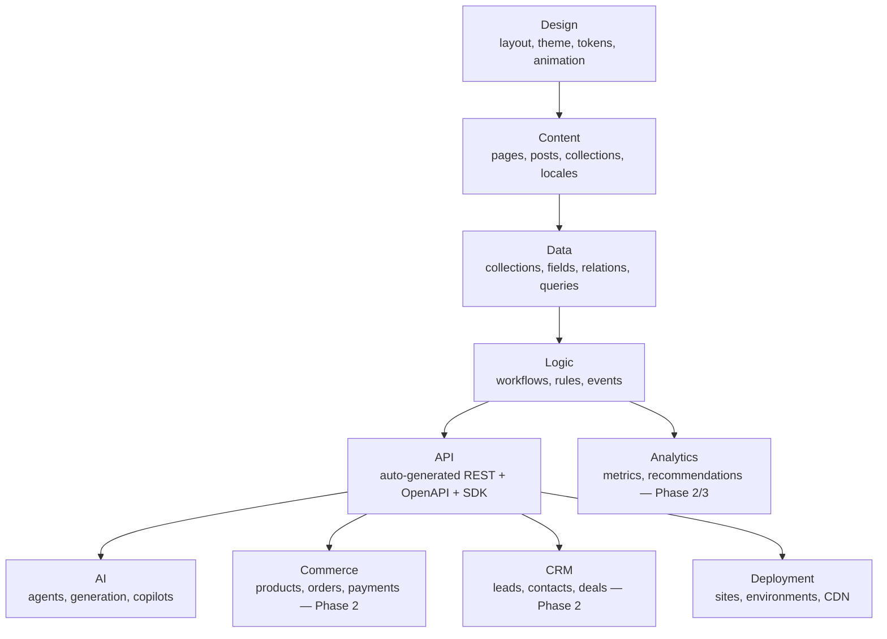

Every **block/page** exposes the seven tabs — **Design · Data · Logic · Permissions · Events · SEO · AI** — the UX surfacing of this stack at block granularity. Page structure is always `Page → Section → Row / Column / Component`.

> **Simple vs power surface (`_CONTEXT §12` decision):** the non-technical activation persona gets a **Simple editing mode** (2–3 tabs, progressive disclosure, comfortable density). The full seven-tab surface and dense ModernDark are gated to **Developer / Agency** roles. The seven tabs remain the canonical model; Simple mode is a progressive-disclosure projection of it. UX details in `04-FRONTEND-SPEC.md`.

### 4.2 Platform module layers (how the engine is built)

| Layer | Responsibility | Phase-1 NestJS module(s) |
|---|---|---|
| **Identity & Tenancy** | Org/Space/User/Role model, ABAC, JWT verification (Supabase IdP), audit hooks. | `identity` |
| **Content & Data** | Structured content (pages/posts) in platform tables; tenant-defined collections in the JSONB records store; RLS isolation. | `cms`, `data` |
| **API & Query** | Auto-generated REST + OpenAPI over content/collections via a **generic dynamic runtime handler**; one platform SDK. | `api` |
| **Binding & Render** | Universal data-binding resolver (a query planner, §9.3) feeding the visual editor and the content delivery API. | `binding` |
| **AI & Generation** | Design Generator, Code Assistant, generation pipeline, model routing, RAG over pgvector. CENTRAL inference by default. | `ai-orchestrator` |
| **Logic / Workflow** | Phase-1 **Flow Core**: form→email as a single hardcoded handler + a small node set; full engine deferred to Phase 2. | `flow-core` |
| **Delivery & Deploy** | Environments, build, one-click publish to Vercel/Netlify, CDN purge, the content delivery API. | `deploy` |

> The **per-Space stack** is what a tenant sees; the **module layers** are how Flowblok delivers it. A Space's "Logic" layer is served by the platform's `flow-core` module.

---

## 5. Module decomposition

### 5.1 The 16 modules → Phase mapping

The 16 canonical modules (`_CONTEXT §4`) each map to exactly one phase. This table is the single reconciliation point for the Tech-Arch view, the Epic roadmap, and per-ticket phases (`_CONTEXT §15`, `05-FEATURE-TICKETS.md`).

| # | Module | Phase-1 form | Phase | FB tickets (primary) |
|---|---|---|---|---|
| 1 | **Flowblok Studio** | `identity`+admin shell module (BFF) | **P1** | FB-001..FB-004 |
| 2 | **CMS** | `cms` module | **P1** | FB-011..FB-016 |
| 3 | **Data** | `data` module (JSONB records store) | **P1** | FB-023..FB-027 |
| 4 | **Auth** | Supabase Auth-IdP + `identity` consumer | **P1** | FB-005..FB-010 |
| 5 | **Flow (Workflows)** | **Flow Core** (form→email handler) | **P1 (Core) / P2 (full engine)** | FB-028..FB-032 |
| 6 | **API** | `api` module — REST + OpenAPI only | **P1** (GraphQL → P2) | FB-033, FB-035, FB-036 |
| 7 | **Commerce** | — | P2 | FB-041..FB-045 |
| 8 | **CRM** | — | P2 | FB-037..FB-040 |
| 9 | **AI** | `ai-orchestrator` (Generator subset) | **P1 (subset)** | FB-046, FB-047, FB-049, FB-050 |
| 10 | **Deploy** | `deploy` module (one-click) | **P1 (basic)** | (within FB-001/builder epics) |
| 11 | **Marketplace** | template/clone flywheel **pulled forward** | **P1–P2** (per decision) | FB-051..FB-054 |
| 12 | **Analytics** | — | P2/P3 | — |
| 13 | **Identity** | inside `identity` module | **P1** | FB-001..FB-010 |
| 14 | **Assets** | `cms`-adjacent media handling | **P1** | (builder epics) |
| 15 | **Search** | Postgres full-text fallback | P2 (ES) | — |
| 16 | **Developer** | Code viewer/fork in Studio | **P1 (viewer/fork)** / P3 (SDK/CLI) | FB-055..FB-060 |

> **GTM vs build order:** "AI Generator first" is a **value/positioning** framing, **not a build order**. The generator sits **on top of** the Builder + Data + CMS primitives (FB-046 depends on the full builder). Build order is Builder/Data/CMS → Generator-on-top.

> **Marketplace pulled forward:** the template/clone/marketplace network effect is the only credible compounding moat, so the **template + clone flywheel** (FB-004 cloning, FB-051 template install) lands in **Phase 1–2**, not Phase 3. Full marketplace governance/commission tooling (FB-052..FB-054) remains later.

### 5.2 Phase-1 deployable units (≤ 2–3)

| Deployable | Contents | Scaling profile |
|---|---|---|
| **`flowblok-app`** | NestJS modular monolith: `identity`, `cms`, `data`, `api`, `binding`, `ai-orchestrator`, `flow-core`, `deploy` + admin BFF. Serves admin API + content delivery API. | HTTP autoscale on CPU/RPS |
| **`flowblok-worker`** | Async jobs: outbox dispatch, workflow runs, AI generation jobs, webhook delivery, cache purge. Reads Redis Streams / BullMQ. | Autoscale on queue depth |
| **`tenant-runtime`** (logical, §14.7) | Isolated execution of untrusted generated/developer code. Not a NestJS service — a microVM/isolate pool. | Per-invocation isolate |

Everything else (Identity, Developer tooling, Search-via-PG-FTS) is a **logical module inside `flowblok-app`**, not a separate deployable.

### 5.3 Logical-service vs separate-deployable (MVP clarity)

| Concern | Phase-1 status | Becomes a deployable when… |
|---|---|---|
| CMS, Data, API, Binding, Identity | **Logical modules** in `flowblok-app` | never required to split unless rule below trips |
| AI generation | **Logical module**, jobs run in `flowblok-worker` | inference throughput needs dedicated GPU/scaling |
| Workflow execution | **`flow-core` module**; runs in `flowblok-worker` | full engine + independent SLA (Phase 2) |
| Untrusted code execution | **Isolated runtime pool** (separate by security necessity) | already separate from day one |
| Search | **Postgres FTS** in `data` module | ES introduced (Phase 2) |

### 5.4 Service Extraction Rule (canonical)

> **Extract a module into its own deployable service IF AND ONLY IF it has (a) an independent scaling profile that the monolith cannot satisfy without waste, OR (b) a dedicated owning team.** Absent both, it stays a NestJS module. "We might need it later" is never sufficient. Splitting on speculation is forbidden pre-PMF.

---

## 6. Technology stack

Canonical choices and noted alternatives from `_CONTEXT §5`, **as amended by the global decisions**. One ORM, no Kafka/ES/Gateway in Phase 1.

| Concern | Primary (canonical, Phase 1) | Alternatives considered | Rationale |
|---|---|---|---|
| Frontend | **Next.js + React + Tailwind** | SvelteKit, Astro, Nuxt, Vue | SSR/SSG/edge, RSC, token-driven Tailwind matches `08-DESIGN-SYSTEM.md`. |
| UI / components | **shadcn/ui on Radix + Tremor** | Aceternity, Magic UI, 21st.dev, Origin UI (marketing only) | Accessible Radix + OKLCH token contract. |
| Animation | **Framer Motion / motion.dev, GSAP** | Anime.js, Three.js, Babylon.js | Purposeful motion (120/180/240ms), gated by `prefers-reduced-motion`. |
| In-browser code | **Monaco / VSCode Web** | — | Developer Mode viewer/fork + Code Assistant. |
| Backend | **NestJS (Node/TypeScript) — modular monolith** | Strapi, Rails API, Laravel | Shared TS types with FE; modular DI lets modules become services later under the Extraction Rule. |
| **ORM / migrations** | **Prisma (single canonical tool)** | ~~TypeORM~~, ~~Flyway~~ (alternatives only) | One migration toolchain; typed client; one source of platform schema truth. |
| Database / IdP | **Supabase: Postgres + RLS + pgvector + Auth-as-IdP** | Firebase, Hasura/PostGraphile (GraphQL P2) | One engine for relational integrity, tenancy, vectors; Auth as IdP the app *consumes*. |
| JWT signing | **Asymmetric RS256/EdDSA + JWKS**, alg pinned on every verifier | (Supabase default HS256 — **rejected**) | Shared HS256 secret is a privilege-escalation risk (`03-SECURITY-AND-ACCESS.md`). |
| Cache / events / queue | **Redis (cache) + Redis Streams / BullMQ / pg-boss + transactional outbox** | ~~Kafka~~ (deferred, ADR-09), ~~Elasticsearch~~ (P2) | Durable triggers via outbox; Redis is cache/ephemeral + queue only — never the durable source of record. |
| Vector | **Supabase pgvector** | Pinecone | Embeddings co-located under tenant RLS; folded into Postgres (no standalone vector-DB line in costs). |
| Storage | **S3 / Cloudflare R2** | — | R2 egress economics; S3 compatibility. |
| AI providers | **Claude / OpenAI / Gemini / local** — **CENTRAL platform keys by default**, metered as AI credits; **BYO-key is an advanced/enterprise option** | — | Central inference is required for the generation-telemetry moat and a frictionless first session; non-technical users never need a key (`_CONTEXT §13` decision). |
| Auth | **Supabase Auth (JWT)** | Auth0, Clerk, Ory, Keycloak | App verifies tokens, does not issue them. |
| CI/CD & deploy | **Git + GitHub Actions, Docker, ECS/Cloud Run; Vercel/Netlify one-click site publish** | Kubernetes/EKS (later) | Container deploys; **Prisma** migrations gated by review on platform schema. |
| Observability | **Grafana/Prometheus or ELK + OpenTelemetry traces** | — | Metrics + logs + traces across the monolith and worker. |

> **Compact Phase-1 stack:** **FE** = Next.js / React / Tailwind / Motion · **BE** = NestJS modular monolith / Supabase Postgres (RLS + pgvector) / Redis (Streams + BullMQ) / Prisma · **Storage** = S3 / R2 · **AI** = Claude / OpenAI / Gemini / local, central keys. Kafka, Elasticsearch, and the custom API Gateway are explicitly **not** in Phase 1.

---

## 7. Data architecture

### 7.1 Multi-tenancy strategy — shared Postgres + `tenant_id` + RLS (correct under pooling)

Every tenant-owned row carries **`tenant_id`** (Organization) and **`space_id`** (Space). RLS policies key off `tenant_id` from the **request JWT claims GUC**, so a tenant **cannot** observe another tenant's rows — isolation lives in the database, not in middleware.

**RLS correctness under connection pooling (mandatory):**

1. **Every query runs inside an explicit transaction that begins with `SET LOCAL`.** `SET LOCAL` is transaction-scoped and auto-cleared on commit/rollback, so a pooled connection cannot leak one tenant's context into the next caller's query.
2. **Autocommit reads are forbidden** in any path that touches tenant data — no tenant query outside a transaction.
3. **Prefer Supabase's `request.jwt.claims` GUC** as the claims source; the app sets `request.jwt.claims` (or `app.tenant_id` / `app.space_id` / `app.user_id` / `app.role`) per transaction.
4. Document pooler mode: **transaction-mode pooling** (PgBouncer) is the assumed default; session-mode GUCs are prohibited.
5. **Every table:** `ENABLE ROW LEVEL SECURITY` **and** `FORCE ROW LEVEL SECURITY`. App database roles **never** have `BYPASSRLS` and are never table owners.
6. **A cross-tenant pooled-reuse CI test is a Phase-1 release gate** (RISK-01): connection A sets tenant X, returns to pool; connection B (tenant Y) must see zero of X's rows.

```sql
-- All policies live in 03-SECURITY-AND-ACCESS.md; these are normative templates.

ALTER TABLE posts ENABLE ROW LEVEL SECURITY;
ALTER TABLE posts FORCE  ROW LEVEL SECURITY;

-- READ: tenant + space scoped
CREATE POLICY posts_tenant_read ON posts
  FOR SELECT
  USING (
    tenant_id = current_setting('app.tenant_id')::uuid
    AND space_id = current_setting('app.space_id')::uuid
  );

-- WRITE: USING gates which rows can be targeted; WITH CHECK prevents
-- writing a row stamped with someone else's tenant_id/space_id (anti-spoof).
CREATE POLICY posts_write ON posts
  FOR UPDATE
  USING (
    tenant_id = current_setting('app.tenant_id')::uuid
    AND space_id = current_setting('app.space_id')::uuid
    AND ( author_id = current_setting('app.user_id')::uuid
          OR current_setting('app.role') IN ('owner','admin','editor') )
  )
  WITH CHECK (
    tenant_id = current_setting('app.tenant_id')::uuid
    AND space_id = current_setting('app.space_id')::uuid
  );
```

```typescript
// Canonical per-request transaction wrapper (Prisma). No tenant query escapes this.
async function withTenant<T>(ctx: TenantCtx, fn: (tx: Prisma.TransactionClient) => Promise<T>) {
  return prisma.$transaction(async (tx) => {
    await tx.$executeRawUnsafe(`SET LOCAL app.tenant_id = '${ctx.tenantId}'`);
    await tx.$executeRawUnsafe(`SET LOCAL app.space_id  = '${ctx.spaceId}'`);
    await tx.$executeRawUnsafe(`SET LOCAL app.user_id   = '${ctx.userId}'`);
    await tx.$executeRawUnsafe(`SET LOCAL app.role       = '${ctx.role}'`);
    return fn(tx); // ctx values are validated UUIDs/enums; never raw user input
  });
}
```

**Why not DB-per-tenant?** Rejected for the default tier:

| Factor | Shared DB + RLS (chosen) | DB-per-tenant |
|---|---|---|
| Scale to 50k Spaces | One cluster + replicas + partitioning | 50k databases — unmanageable |
| Migrations | One Prisma migration run | 50k runs, drift |
| Cross-tenant platform features (marketplace, analytics) | Natural | Painful federation |
| Isolation strength | Strong (RLS) | Strongest (physical) |

Dedicated schema/DB is reserved as an **Enterprise isolation tier** (and the only place PHI is ever permitted — see §15).

### 7.2 Platform tables vs tenant-defined collections

| | Platform tables (~40) | Tenant-defined "collections" |
|---|---|---|
| What | Orgs, Spaces, users, roles, pages, posts, media, workflows, ai_jobs, deployments, audit_log, outbox, … | Whatever a tenant builds in the Data/DB Builder |
| Storage | **Real DDL** (Prisma migrations) | **Rows in a generic JSONB records store** (§7.3) |
| Evolution | Git / CI / human review | Runtime online evolution, no PR (§7.4) |
| Count | Bounded (~40) | Unbounded — but **zero new physical tables** |

This single decision is what makes RLS, scale, and the DB Builder mutually compatible.

### 7.3 Tenant-defined data — JSONB records store (NOT per-tenant DDL)

A tenant "table" (collection) is a **logical schema descriptor** plus **rows in a shared records table**. 50k Spaces × dozens of collections produce **rows**, not ~1M physical tables.

```sql
-- Collection descriptor (one row per tenant-defined "table")
CREATE TABLE collections (
  id          uuid PRIMARY KEY DEFAULT gen_random_uuid(),
  tenant_id   uuid NOT NULL,
  space_id    uuid NOT NULL,
  name        text NOT NULL,
  schema      jsonb NOT NULL,          -- field defs, types, relations, validation
  created_at  timestamptz NOT NULL DEFAULT now()
);

-- Generic records store: every tenant row of every tenant collection
CREATE TABLE records (
  id            uuid PRIMARY KEY DEFAULT gen_random_uuid(),
  tenant_id     uuid NOT NULL,
  space_id      uuid NOT NULL,
  collection_id uuid NOT NULL REFERENCES collections(id),
  data          jsonb NOT NULL,
  created_at    timestamptz NOT NULL DEFAULT now(),
  updated_at    timestamptz NOT NULL DEFAULT now(),
  deleted_at    timestamptz
);

CREATE INDEX records_tenant_space_coll ON records (tenant_id, space_id, collection_id);
CREATE INDEX records_data_gin          ON records USING gin (data jsonb_path_ops);
-- Optional per-field expression indexes generated lazily for hot query fields.
```

Both `collections` and `records` carry RLS (`tenant_id` + `space_id`) identical to platform tables — **uniform RLS** is preserved because there is one physical table, not a million.

### 7.4 Schema migration split — platform vs tenant runtime evolution

| | **Platform migrations** | **Tenant schema evolution (runtime)** |
|---|---|---|
| Trigger | Engineer changes Prisma schema | Tenant adds/changes a field in the DB Builder |
| Path | Git PR → CI → review → `prisma migrate deploy` | Online, in-app, **no human PR** |
| Mechanism | DDL on ~40 platform tables | Update `collections.schema`; backfill `records.data` if needed |
| Safety | Code review + CI | **Online-migration runner** below |

**Online-migration runner (for both paths where DDL is involved):**

- **Expand → migrate → contract** (never a blocking rewrite).
- `lock_timeout` + `statement_timeout` on every DDL/backfill statement; fail fast rather than hold locks.
- **Batched backfills** (bounded row counts per batch) to avoid long transactions.
- Constraints added `NOT VALID` first, then `VALIDATE CONSTRAINT` out-of-band.
- **AI-authored DDL never auto-applies** — dry-run + diff gate + throwaway-branch validation (§11.4).

### 7.5 Canonical ERDs (platform tables)

**CMS**

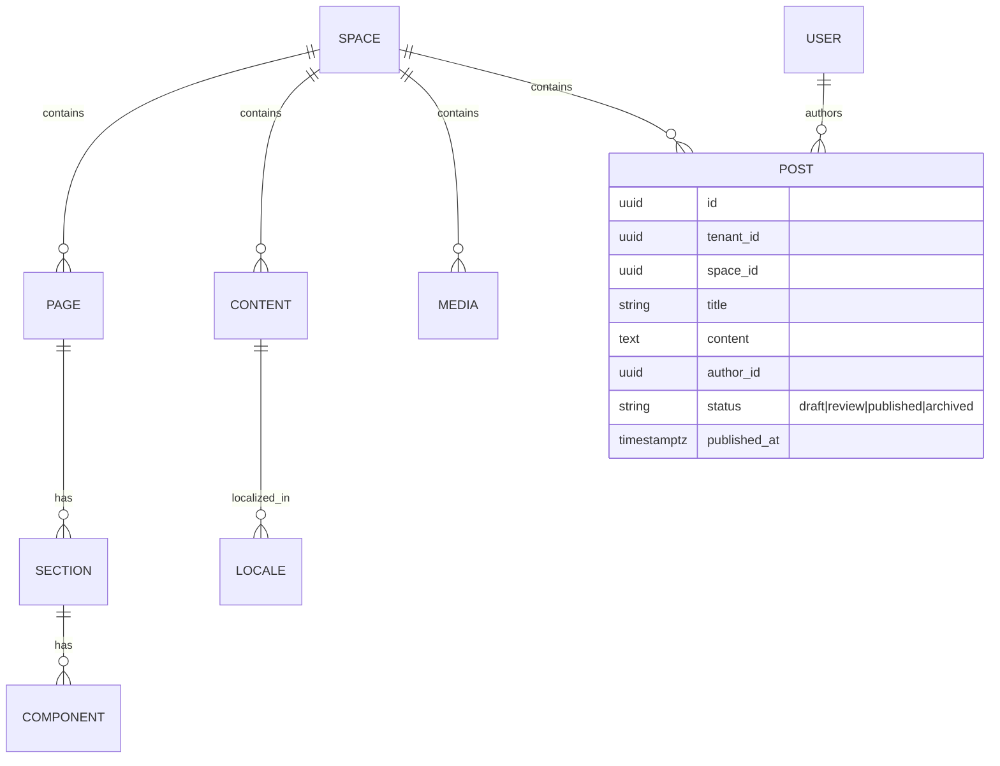

**Commerce (Phase 2 — shown for continuity)**

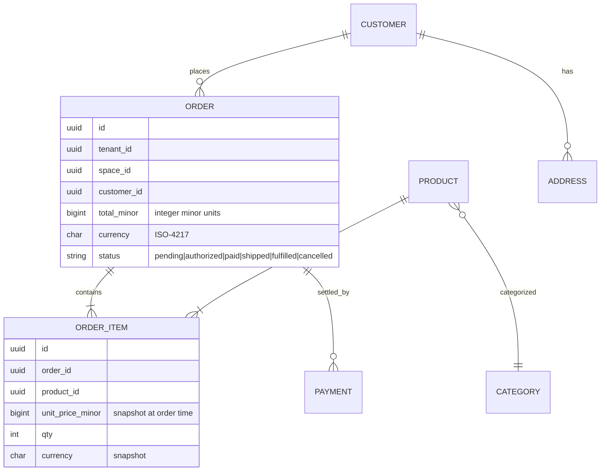

> **Money & integrity rules (memo §21):** money is **integer minor units + ISO-4217 currency**, never floats. `order_items` **snapshot** `unit_price_minor`, `qty`, and `currency` at order time. Polymorphic activity FKs are replaced with **typed columns + CHECK** constraints. Soft-deleted slugs use **partial unique indexes** (`WHERE deleted_at IS NULL`).

**CRM (Phase 2 — shown for continuity)**

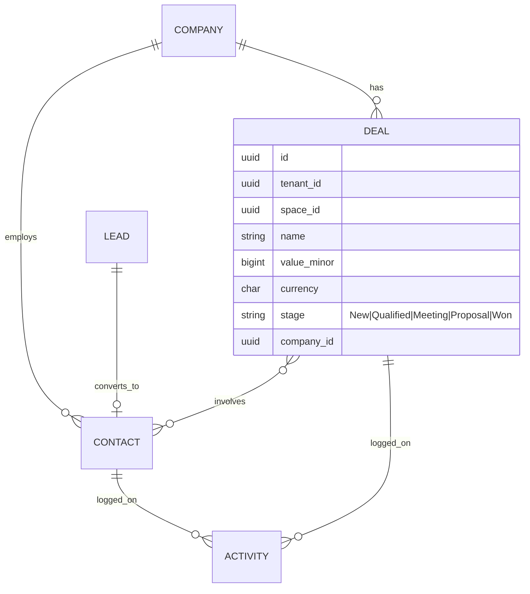

`deals ↔ contacts` is many-to-many via a join table. `activities` use **typed FK columns + CHECK** (e.g. exactly one of `contact_id` / `deal_id` set), not a polymorphic `(entity_type, entity_id)` pair. Pipeline stages: **New Lead → Qualified → Meeting → Proposal → Won**.

### 7.6 Checkout as a saga (Phase 2, specified now)

Cross-service payment is **not "atomic."** Checkout is a **saga** with compensations:

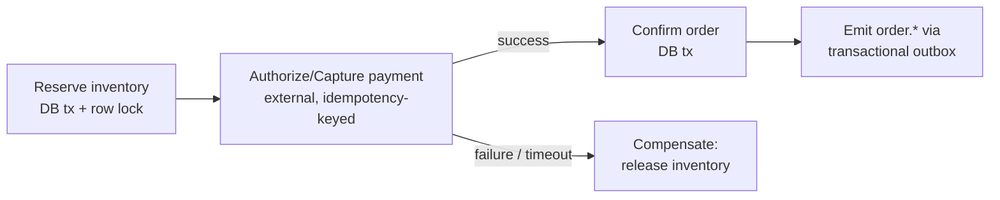

- Inventory reservation is a real DB transaction with a row lock.
- Payment authorize/capture is an external call carrying an **idempotency key** (safe to retry).
- On payment failure/timeout, a **compensating action releases the reservation**.
- Order/payment events publish via the **transactional outbox** (§10.5), never a dual-write.

### 7.7 Block / page JSON schema (single normative reference)

The page block tree is `Page → Section → Row/Column → Component`. The **flat `{ blocks: [{ type }] }` shape is illustrative only** and cannot hold the FE spec's nested `children` / `bindings` / `permissions`. The **single normative schema** for the block tree lives in `06-SRS.md` and is mirrored in `04-FRONTEND-SPEC.md`; this document references it rather than redefining it.

```jsonc
// Illustrative ONLY — normative schema is in 06-SRS.md
{
  "id": "pg_123",
  "type": "page",
  "children": [
    { "id": "sec_1", "type": "section", "children": [
      { "id": "cmp_1", "type": "ProductCard",
        "props": { "title": "..." },
        "bindings": { "title": { "source": "database", "collectionId": "...", "field": "name" } },
        "permissions": { "view": ["*"], "edit": ["editor","admin"] } }
    ]}
  ]
}
```

---

## 8. API architecture

### 8.1 Phase-1 surface = auto-generated REST + OpenAPI ONLY

When a tenant creates a collection, the `api` module exposes it via a **generic dynamic runtime handler** — **not** per-tenant code generation. There is one platform implementation that reads the Space schema descriptor at runtime.

```
Create Collection → register schema descriptor → dynamic handler serves REST + OpenAPI
```

- **REST + OpenAPI/Swagger** for every collection (FB-033, FB-036). **Webhooks** via FB-035.
- **GraphQL is deferred to Phase 2**, gated on a **Hasura/PostGraphile-vs-custom ADR** (FB-034 → P2).
- **One platform SDK** that takes a **Space schema descriptor at runtime** — there is **no per-tenant published/codegen SDK**. (Drops the v0.1 per-tenant SDK build burden.)

### 8.2 Ingress (no custom gateway in Phase 1)

Ingress concerns are **app-layer middleware** in the monolith, not a separate gateway deployable:

- **AuthN/AuthZ:** verify Supabase JWT against **JWKS**, **pin alg** (RS256/EdDSA — reject HS256), extract `tenant_id` + `space_id` + role, set them as the per-transaction GUCs (§7.1).
- **Rate limiting:** per-tenant / per-key quotas tied to tiers ($19 / $99 / $299) and AI credits.
- **WAF / IP allowlists / security headers:** owned by `03-SECURITY-AND-ACCESS.md`.

A dedicated API Gateway is a Phase-2+ extraction decision under the Service Extraction Rule, not a Phase-1 component.

### 8.3 Named endpoints (canonical)

```
POST /api/signup
POST /api/posts
PUT  /api/posts/{id}
GET  /me
POST /api/ai/generate_seo
GET  /api/products
```

### 8.4 Versioning & compatibility gate

- **Public platform API:** URI-versioned (`/v1`, `/v2`); additive within a version; breaking changes only across versions with announced deprecation windows.
- **Generated tenant APIs:** versioned with the collection schema version; webhooks carry `schema_version`.
- **API compatibility / deprecation gate (CI):** a schema change that would break an existing collection's API contract is **blocked** unless it is additive or ships behind a new version. This gate is a Phase-1 release requirement.

---

## 9. Visual editor & rendering pipeline

### 9.1 Block JSON model

A page is a tree (`Page → Section → Row/Column/Component`) persisting per the normative schema (§7.7). Each node carries the seven block tabs — **Design · Data · Logic · Permissions · Events · SEO · AI**.

### 9.2 Live preview

The editor embeds the rendered site in an iframe (Storyblok-style). Edits dispatch optimistic UI updates + a debounced `PUT /api/pages/{id}`; preview re-renders from the same content API the published site uses (WYSIWYG parity). Layout-matched skeletons (never spinners) cover load states.

### 9.3 Universal data-binding engine — a query planner (not per-block fetch)

The **Data tab** binds a source with zero code (`_CONTEXT §7`):

```
Static | Database | API | Workflow | AI | CRM | Commerce | Search
```

| Source | Resolves to | Developer Mode reveals |
|---|---|---|
| **Static** | inline value | literal props |
| **Database** | collection query over the records store | `await db.collection('products').findMany()` |
| **API** | endpoint + field map | typed SDK / `fetch` |
| **Workflow** | workflow output | `await flow.run('wf_x', input)` |
| **AI** | agent/prompt | `await ai.generate({...})` — **sampled in preview, not live** |
| **CRM** | CRM object (P2) | `await crm.deals.findMany()` |
| **Commerce** | commerce object (P2) | `await commerce.products.findMany()` |
| **Search** | search query | `await search.query('...')` |

**The resolver is a query planner**, not a per-node fetcher (memo §11):

- **Batch + dedupe** all bindings in a page tree via **DataLoader** — one round trip per distinct query.
- **One query per repeater** — per-row fetch (N+1) is forbidden by design.
- **Mandatory pagination + row caps + `statement_timeout` + a per-tenant cost budget** on every resolved query.
- **AI-bound props are never live-resolved in preview** — show a **sampled value + a badge** ("AI-generated at publish"), to avoid burning credits and to keep preview deterministic.

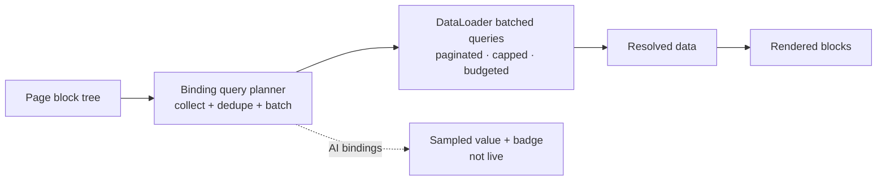

### 9.4 Developer Mode — one-way generation + explicit fork (NOT symmetric round-trip)

The moat mechanic is reframed (ADR-10, memo §5). Symmetric round-trip of arbitrary edited React is an undecidable problem and is **not attempted**.

- **Visual → Code is always available and lossless** (generation direction).
- **Code → Visual re-import is allowed ONLY for code matching the generator's lossless canonical AST grammar.** Defined edit classes that round-trip: prop value changes, style-token swaps, adding/removing/reordering known block types, text content, binding descriptors.
- **The instant a user edits outside that grammar** (arbitrary JS, new imports, control flow, unknown JSX), the block becomes a **sealed, clearly-labeled "Custom Component"** — the UI says so explicitly — and is **no longer visually editable**. It renders as-is via the isolated runtime (§14.7).
- **Per-artifact ownership:** the generator **never silently regenerates over hand edits**. Regeneration of an edited artifact requires explicit user confirmation ("keep my edits / restyle the rest", §11.5).

| Edit class | Round-trips to Visual? |
|---|---|
| Change a prop / token / text | Yes |
| Add/remove/reorder known block | Yes |
| Edit a binding descriptor | Yes |
| Arbitrary JS / new import / control flow / unknown JSX | **No → sealed Custom Component** |

> **RISK-02 is promoted from a footnote to a Phase-1 go/no-go spike** (§15): prove the canonical AST grammar + fork boundary works on the vertical slice before committing further.

### 9.5 Developer Mode surfaces

Monaco exposes, per Space/page/block: **Frontend React code, Workflow JSON, API definition, Space schema descriptor, generated handlers** — all editable, with the fork rules above. This is the concrete delivery of "own your code."

### 9.6 Published tenant-site data path (vs RLS)

A Vercel/Netlify-hosted site **cannot hold an RLS session**. The published-site data path is therefore explicit:

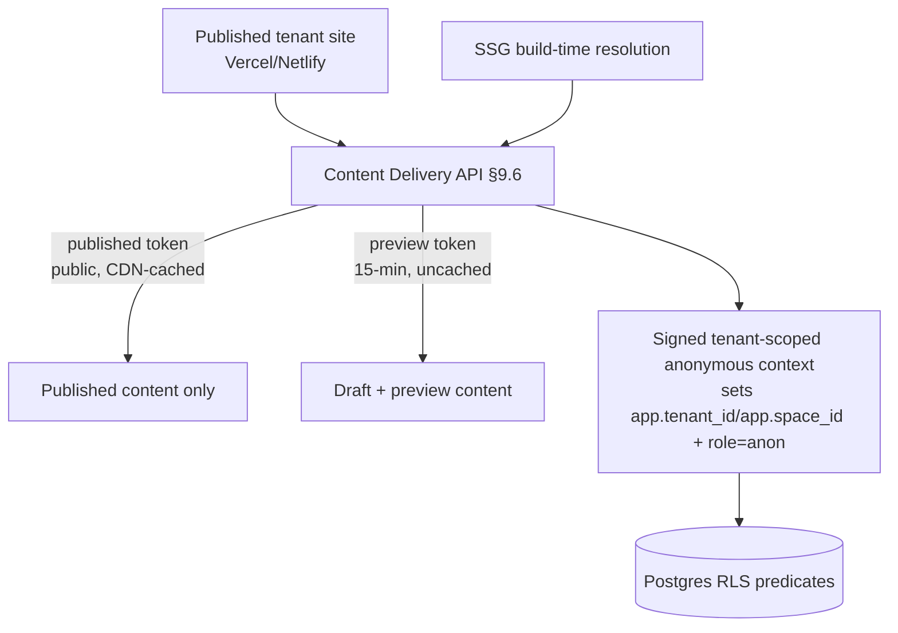

- **Two modes.** **Draft/preview:** a short-lived **preview token (15-min, per `_CONTEXT §10`)**, **uncached**, may read drafts. **Published:** a **public token**, **CDN-cached**, may read published content only.
- **Signed tenant-scoped anonymous context.** The delivery API sets `app.tenant_id` / `app.space_id` and `role = 'anon'` from a signed token, so **RLS predicates still apply** even for public reads — the public role's policies expose only published, non-PII rows of that one Space.
- **SSG build-time resolution.** Static pages resolve bindings at build time against the published token; the published artifact contains no live credentials.
- **Negative test (Phase-1 gate):** a public binding **cannot** read drafts, PII, or any other tenant's rows. This is a required CI test (links to RISK-01).

---

## 10. Workflow / integration engine

> **Guardrail (`_CONTEXT §1, §8`): do NOT expose n8n directly.** Flowblok presents a simpler **Boomi + n8n-inspired** abstraction; users never see n8n branding or its raw node catalog.

### 10.1 Phase-1 scope = Flow Core (split decision)

Per `_CONTEXT §12`, "Workflow" is split:

- **Phase-1 "Flow Core":** the **form→email path is a single hardcoded, well-tested handler**, plus a minimal node set (Trigger · Condition · Email · Webhook · DB record). This is enough to prove the vertical slice ("attach a real form→email workflow").
- **Phase-2 "full engine":** the complete node catalog, scheduler, durable suspend/resume, micro-app packaging, marketplace connectors.

### 10.2 Build-vs-buy + AGPL (ADR-12)

"n8n-style behind the scenes" carries **AGPL implications**. The Phase-1 form→email handler is **bespoke** (no n8n dependency, so no AGPL exposure). For the Phase-2 full engine, the decision is: **either** obtain legal sign-off for an n8n-derived engine **or** build on an embeddable durable-execution engine (**Temporal / Inngest / Trigger.dev**). This is an explicit ADR with legal sign-off as a gate (§15).

### 10.3 Node graph model (full engine, Phase 2)

A workflow is a directed node graph stored as JSON/YAML, versioned, deployable across environments, packageable as a reusable **micro-app**. Node types (`_CONTEXT §8`): **Trigger · Condition · Loop · API · Database · Email · SMS · Webhook · AI · CRM · Payment · Custom Code.** Form-submit targets are interchangeable: **Create DB Record · Run Workflow · Create CRM Lead · Send Email · Webhook · Multiple** — switchable across DB / Workflow / Zoho / HubSpot / Salesforce without rewiring the form.

### 10.4 Execution model + per-node journal + idempotency

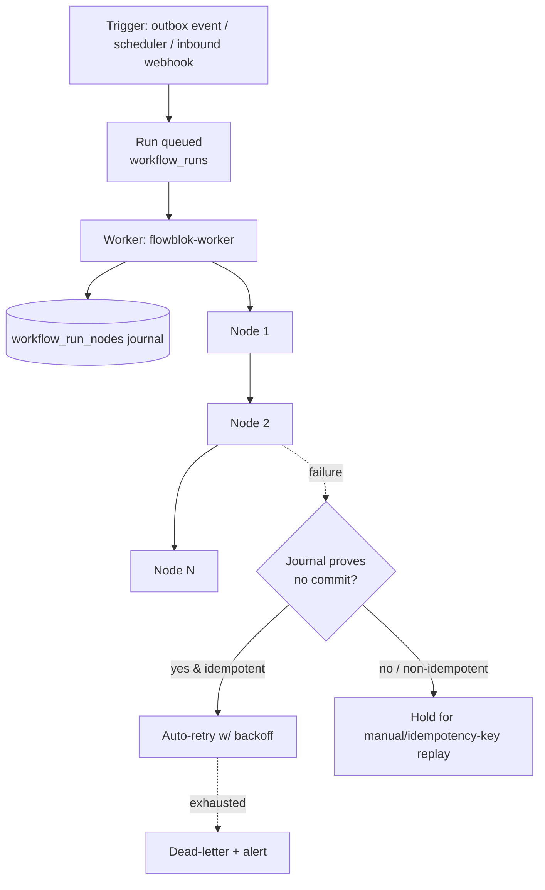

- **Per-node execution journal:** `workflow_run_nodes(run_id, node_id, attempt, status, io, error, idempotency_key)`.
- **Idempotency key per side-effecting node** (Payment / Email / SMS / Webhook / CRM). Nodes are **classified idempotent vs non-idempotent.**
- **Auto-retry only when the journal proves no commit occurred.** Non-idempotent nodes whose commit state is unknown are **never blindly retried** — they require keyed replay or manual resolution.
- **Durable suspend/resume** for **Wait / Approval** nodes (Phase 2 full engine): the run persists state and resumes on event/timer.

### 10.5 Triggers via transactional outbox (no Kafka)

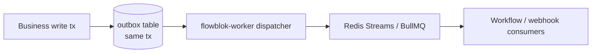

- Events (`post.published`, `order.completed`) are written to an **`outbox` table in the same transaction** as the business change, then dispatched by the worker — **no dual-write, no lost events.**
- **Redis is cache + ephemeral queue only**, never the durable source of truth. **Kafka is deferred (ADR-09)** and becomes the durable trigger source **only if/when** a measured throughput threshold is crossed.

### 10.6 Tenant-context propagation through async/worker paths

- Every event/job **stamps `tenant_id` + `space_id` + authz context** into its payload.
- The consumer **re-establishes the RLS session per message** (the §7.1 `withTenant` wrapper) before any DB access — a worker never runs queries without a tenant context.
- Internal service-to-service calls (when modules are later extracted) require **mTLS / workload identity (SPIFFE)**.
- **Negative test (gate):** a worker processing tenant A's event **cannot** touch tenant B's data (memo §16).

### 10.7 Connectors & micro-apps

- **Connector library (Phase 2):** HTTP/Webhook, Email (SMTP), SMS, Slack, Stripe, CRMs (Zoho/HubSpot/Salesforce), and Flowblok's own CMS/Commerce/CRM APIs. **All connector fetches traverse the egress proxy (§16).** New connectors install as Marketplace plugins.
- **Micro-app packaging (Phase 2):** a workflow + the forms/APIs it exposes export as a versioned package installable on another tenant (Boomi-style), feeding FB-053.
- **Patterns borrowed:** n8n's node-graph + retry/backoff; Boomi's reusable, deployable integration packages; Zapier's interchangeable trigger→action mapping with idempotent action replay.

---

## 11. AI subsystem architecture

### 11.1 Inference model — central by default, BYO-key advanced only

- **Default: platform-provided AI keys** (central inference), metered as **abundant AI credits at paid tiers** — no mid-creation meter anxiety. This is required for (a) the **proprietary prompt→app→human-edit generation telemetry moat** and (b) a frictionless first session.
- **BYO-key is an optional advanced/enterprise setting only.** The non-technical activation persona **never needs a key.**
- **Margins:** per-generation COGS + blended gross-margin tables and a worst-case tokens-per-generated-site model live in `01-PRD.md`. A **hard free-tier generation cap** and **minimal AI-credit metering are pulled into the MVP** to protect margins and prove **Starter $19 is not margin-negative**.

### 11.2 Agent roster (`_CONTEXT §6`)

AI Designer / Design Generator · AI Developer / Code Assistant · AI SEO · AI Copywriter · AI CRM Agent (P2) · AI Analytics Agent (P2/P3). Generation agents: **Page, Workflow, Database, Commerce** — but see the Phase-1 narrowing below.

### 11.3 Phase-1 generation = narrow templated surface (NOT free-form synthesis)

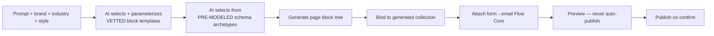

- AI **selects and parameterizes vetted block templates** and a **small set of pre-modeled schema archetypes** — it does **not** synthesize free-form schemas or arbitrary code in Phase 1.
- **FB-048 (AI-Generate-Database) is CUT from Phase 1.** Database creation in Phase 1 is archetype selection, not free-form synthesis.
- **No AI-authored migration auto-applies** (§7.4): dry-run + diff + throwaway-branch validation.
- **Workflow static analysis** blocks payment/loop nodes from being AI-introduced without explicit human approval.
- The full generation pipeline `Prompt → Database → Pages → Components → Workflows → APIs → Deploy` remains the **end-state** narrative (FB-046/047/049/050) but Phase 1 ships only the constrained slice.

### 11.4 AI Quality & Evaluation gate (Phase-1 required)

| Element | Requirement |
|---|---|
| Golden-prompt set | Curated prompts covering the vertical slice; versioned. |
| Automated scorers | renders-without-error · WCAG **AA contrast** · schema-validity. |
| Minimum pass rate | **≥ 90%** on the golden set. |
| Human-eval rubric | Quality rubric for sampled generations. |
| CI regression gate | Generation quality is a **blocking CI gate**; regressions fail the build. |
| Budgets | **latency p95** + **per-generation cost budget** enforced. |
| Generation success-rate target | Tracked; **partial-generation fallback** required (never a blank failure). |

### 11.5 Generation → refinement loop

- **Never auto-publish.** Always **preview before deploy.**
- **Partial regeneration:** "keep my edits, restyle the rest" (honors per-artifact ownership, §9.4).
- **"What the AI assumed" editable panel:** the model's assumptions (industry, sections, schema archetype) are surfaced and editable.

### 11.6 Model routing & RAG

- The `ai-orchestrator` routes per task to **Claude / OpenAI / Gemini / local** (vision→one, code→another, image→DALL·E/SD), overridable per tenant. **All provider calls traverse the egress proxy (§16).**
- **pgvector** stores embeddings co-located under tenant RLS for semantic search + grounding.
- **`designprompts/*.md`** (the 31-style catalog in `docs/design/landing/`) are retrieved and injected as RAG context for the Design Generator.

### 11.7 Screenshot → Vision pipeline (NOT in Phase-1 MVP P0)

```
Screenshot → Vision AI → Design Tokens → Component Mapping → Editable Layout
```

This is a multi-quarter research bet and is **explicitly out of the Phase-1 P0 generation funnel.** It is a Phase-2/3 capability; Phase-1 generation is prompt-driven over vetted templates (§11.3).

---

## 12. Deployment & infrastructure

### 12.1 Environments

Standard **dev / staging / prod**. Tenants are logically isolated within prod (shared cluster, `tenant_id` + RLS). Feature flags gate rollout.

### 12.2 Containers & orchestration

- **`flowblok-app`** and **`flowblok-worker`** ship as **Docker** images on **ECS / Cloud Run** (Kubernetes/EKS is a later option, not Phase 1).
- `flowblok-app` autoscales on CPU/RPS; `flowblok-worker` autoscales on queue depth.
- The **`tenant-runtime`** isolate pool (§14.7) scales per invocation.

### 12.3 CI/CD

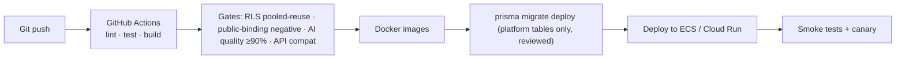

- **Prisma is the only migration tool.** Platform migrations are reviewed; **tenant schema evolution does not run here** (it is runtime, §7.4).
- The release gates (RLS, public-binding negative test, AI quality, API compatibility, cross-tenant worker test) are **blocking**.

### 12.4 One-click site deploy

The `deploy` module publishes a tenant site to **Vercel / Netlify** with one click, snapshotting content + config for promotable releases, and purges CDN cache on publish (`post.published` → invalidation via the outbox flow).

### 12.5 Supporting infrastructure (Phase 1)

| Concern | Choice | Notes |
|---|---|---|
| CDN / edge | CDN + edge runtime | Static assets, SSG output, edge SSR |
| Cache | **Redis** + CDN | API response cache for anonymous reads; short-lived data |
| Queue / events | **Redis Streams / BullMQ + transactional outbox** | Kafka deferred (ADR-09) |
| Search | **Postgres full-text** | Elasticsearch in Phase 2 |
| Storage | **S3 / Cloudflare R2** | Media, build artifacts, exports |
| Egress | **Egress proxy** | SSRF defense for all outbound fetches (§16) |
| Observability | **Grafana/Prometheus or ELK + OTel** | Metrics, logs, traces |

### 12.6 Canonical end-to-end acceptance scenario

The **Phase-1 vertical slice** is the canonical acceptance scenario:

> **Generate a page → bind it to a generated collection → attach a form→email Flow Core workflow → view/fork the code in Developer Mode → publish to a live URL.**

This (and the blogging signup → draft → AI SEO → review → publish → cache-purge flow) is promoted to a **numbered canonical acceptance scenario in `01-PRD.md` / `06-SRS.md`**. We **no longer cite the volatile "ChatGPT analysis lines 1112–1205"** as the source (memo §18); the scenario is owned by the PRD/SRS.

---

## 13. Scalability, performance & cost

### 13.1 Caching layers

1. **CDN/edge** — static + SSG + cached anonymous SSR (published token).
2. **Redis** — API response cache, computed bindings, session data.
3. **Application** — request-scoped memoization of resolved bindings (the query planner, §9.3).
4. **DB** — read replicas absorb read-heavy content queries.

### 13.2 Frontend performance

- Code splitting per route/block; RSC streaming; SSR/SSG/edge chosen per page.
- Layout-matched skeletons and density-first product UI keep perceived latency low.

### 13.3 Database scaling — committed posture (no sharding/shared-schema contradiction)

The v0.1 contradiction (§13.3 sharding vs §7.1 shared schema) is resolved by an explicit commitment:

- **Single cluster + declarative partitioning** (partition large tables — `records`, `audit_log`, events — by `tenant_id` / time).
- **Read replicas** for read-heavy paths.
- **A separate OLAP store** for analytics/marketplace rollups, fed by the **outbox event stream** (not by querying the OLTP cluster).
- **Sharding is NOT a Phase-1/2 plan.** If ever adopted, cross-shard rules (no cross-shard FK, tenant-pinned routing, global lookups via the OLAP/event store) are documented before adoption.
- Large/regulated tenants are promoted to a **dedicated schema/DB Enterprise tier** (§7.1).

### 13.4 Chart / rendering ceiling

> **SVG chart ceiling (`_CONTEXT §14`):** SVG charts cap at **~5K data points**; beyond that render via **Nivo Canvas** / WebGL. Analytics and large dashboards must honor this.

### 13.5 Cost model — bottom-up, growing with MAU

The v0.1 table (Postgres cheaper at 10× scale) was implausible and is rebuilt bottom-up; **costs grow with MAU**, platform-borne trial-generation AI cost is separated from tenant-borne usage, and the standalone vector-DB line is removed (pgvector folds into Postgres per ADR-05).

| Item | ~10k MAU | ~50k MAU | Notes |
|---|---|---|---|
| Initial 6–12 mo dev burn | ~$500K–800K (salaries) | — | One-time |
| Postgres (Supabase) + replicas | ~$1–2K / mo | ~$4–8K / mo | Grows with data + read load; pgvector included (no separate vector line) |
| Redis (cache + Streams/BullMQ) | ~$200–400 / mo | ~$800–1.5K / mo | Grows with traffic |
| Compute (`app` + `worker` + isolate runtime) | ~$1–2K / mo | ~$5–9K / mo | Autoscaled |
| Object storage (S3/R2) | ~$200–500 / mo | ~$1–3K / mo | Media-driven |
| **Platform-borne trial/free-tier AI generation** | metered, capped | metered, capped | Free-tier hard cap (§11.1); a margin line item, NOT tenant-borne |
| **Tenant-borne AI (credits / BYO)** | pass-through | pass-through | Recovered via AI credits at paid tiers |
| **Ops total (ex-salaries, ex-AI)** | **~$5–10K / mo** | **~$15–25K / mo** | Consistent with `_CONTEXT §13` at 10k MAU; scales up, not down |

Marketplace items revenue-share at the **20% commission** (`_CONTEXT §13`).

---

## 14. Build sequencing & runtime isolation

Aligned to `_CONTEXT §1` and the phase matrix (§5.1).

### 14.1 Phase 1 — Months 0–6: prove the five-layer slice on a modular monolith

- `flowblok-app` (NestJS modular monolith) + `flowblok-worker` + `tenant-runtime` isolate pool.
- Supabase Postgres + **RLS** (pooled-reuse gate) + pgvector; Redis (cache + Streams + BullMQ); app-layer auth verifying Supabase JWT via JWKS (alg pinned).
- `cms`, `data` (JSONB records store), `api` (REST + OpenAPI, dynamic handler), `binding` (query planner), `identity`, `deploy` (one-click), `ai-orchestrator` (narrow templated generation + quality gate + central keys + credit cap), **Flow Core** (form→email).
- Developer Mode **viewer + fork** (one-way generation, sealed Custom Components).
- Template/clone flywheel start (FB-004 cloning, FB-051 template install).
- Search = Postgres full-text. Egress proxy. SOC 2 evidence collection **starts now** (§15).
- **RISK-02 go/no-go spike** (canonical AST grammar / fork boundary).

### 14.2 Phase 2 — Months 6–12: CRM + Commerce + Templates + full Flow engine

- Commerce (checkout saga, §7.6) + Stripe; CRM-Lite + AI CRM Agent.
- Elasticsearch search; Analytics ingestion (5K SVG ceiling) + AI Analytics Agent.
- **Full workflow engine** (durable execution per ADR-12; suspend/resume; micro-apps); GraphQL (Hasura/PostGraphile ADR).
- Template marketplace maturation.

### 14.3 Phase 3 — Months 12–24: Marketplace + AI Agents + Enterprise

- Full Marketplace (20% commission, push-updates, review).
- Developer Platform (Plugin SDK + CLI, sandboxed plugins).
- Full agent roster; vision pipeline at scale.
- Enterprise: SSO/SAML at scale, **dedicated-schema/DB isolation tier** (the only PHI-eligible tenancy), multi-AZ HA (99.95% SLA), SOC 2 attestation, ISO 27001. **Kafka introduced only if the throughput trigger fires (ADR-09).**

### 14.7 Untrusted code rendering isolation (resolve BEFORE any code execution ships)

The shared rendering service **never SSRs arbitrary generated/developer React.** Untrusted code executes **only** in a per-tenant isolated runtime:

- **Isolation tech (decide before Phase 1 ships any code execution):** **microVM (Firecracker / gVisor) OR edge isolate OR WASM.** Default leaning: **edge isolate / WASM** for per-request render, microVM for heavier custom workloads. This ADR is gated (§15).
- **No platform credentials** in the runtime; **egress allowlist** only (via §16); **CPU / memory / wall-clock caps**; no ambient filesystem/network.
- Sealed Custom Components (§9.4) and any developer-authored handlers run here, not in `flowblok-app`.

---

## 15. Architectural decisions & risks (ADR-style)

| ID | Decision / Risk | Status | Rationale / Mitigation |
|---|---|---|---|
| ADR-01 | **Supabase = Postgres + RLS + pgvector + Auth-IdP only; NestJS modular monolith consumes JWTs (does not re-issue)** | **Accepted** | Resolves the three-incompatible-models identity crisis; one operating model. |
| ADR-02 | **NestJS modular monolith (≤ 2–3 deployables), not microservices** | **Accepted** | Fits an 8–10 person team; modules extract only per the Service Extraction Rule (§5.4). |
| ADR-03 | **Prisma is the single ORM/migration tool** | **Accepted** | TypeORM/Flyway are alternatives only; one migration toolchain. |
| ADR-04 | **Tenant data = JSONB records store, not per-tenant DDL** | **Accepted** | Avoids ~1M physical tables; preserves uniform RLS and scale (§7.3). |
| ADR-05 | **pgvector (not Pinecone)** | **Accepted** | Embeddings co-located under RLS; no standalone vector cost line. |
| ADR-06 | **Asymmetric JWT (RS256/EdDSA + JWKS), alg pinned; HS256 rejected** | **Accepted** | Closes the privilege-escalation gap (Security Analyst). |
| ADR-07 | **Split platform migrations (Git/CI/review) from runtime tenant schema evolution; AI DDL never auto-applies** | **Accepted** | Production-safety; online-migration runner (§7.4). |
| ADR-08 | **Phased rollout 1→2→3; Phase 1 proves the five-layer slice** | **Accepted** | "Everything at once = 5% success." |
| ADR-09 | **Kafka DEFERRED to Phase 3, gated on a measured throughput trigger; outbox + Redis Streams/BullMQ in Phase 1–2** | **Deferred** | Kafka is an org-scaling tool not needed pre-PMF; Redis is cache/ephemeral only. |
| ADR-10 | **Visual↔Code = one-way generation + explicit fork to sealed Custom Component (no symmetric round-trip)** | **Accepted** | General reverse-parse is undecidable; honest scoping (§9.4). |
| ADR-11 | **Phase-1 AI generation = narrow templated surface + quality eval gate; FB-048 cut from Phase 1; no AI auto-migration** | **Accepted** | Quality is the activation funnel; free-form synthesis is a research bet (§11.3/§11.4). |
| ADR-12 | **Workflow engine build-vs-buy + AGPL** — Phase-1 form→email bespoke (no AGPL); full engine = legal sign-off OR Temporal/Inngest/Trigger.dev | **Open (gated)** | "n8n behind the scenes" has AGPL implications; legal sign-off is a gate (§10.2). |
| ADR-13 | **Untrusted code runs only in a per-tenant isolated runtime** (microVM/edge isolate/WASM) — tech chosen before any code execution ships | **Open (gated)** | Never SSR arbitrary tenant code in the shared service (§14.7). |
| ADR-14 | **Single cluster + partitioning + replicas + separate OLAP via outbox; sharding not planned** | **Accepted** | Resolves the sharding-vs-shared-schema contradiction (§13.3). |
| ADR-15 | **Phase-1 API = REST + OpenAPI via dynamic handler + one platform SDK; GraphQL deferred to P2** | **Accepted** | No per-tenant codegen/SDK burden (§8.1). |
| RISK-01 | RLS leakage under pooling / public bindings | **Open — gated** | Mandatory `SET LOCAL` in tx; `FORCE RLS`; **cross-tenant pooled-reuse + public-binding negative tests are Phase-1 release gates** (§7.1, §9.6). |
| RISK-02 | Visual↔Code fidelity (canonical AST grammar / fork boundary) | **Open — Phase-1 go/no-go spike** | Promoted from footnote; must pass before further investment (§9.4). |
| RISK-03 | AI generation quality / cost / margin | **Open** | Quality eval gate ≥90% (§11.4); central keys + free-tier hard cap; partial-generation fallback. |
| RISK-04 | Premature service sprawl | **Mitigated** | Modular monolith + Service Extraction Rule (§5.4). |
| RISK-05 | Dashboards above ~5K-point SVG ceiling | **Mitigated** | Nivo Canvas/WebGL (§13.4). |
| RISK-06 | SSRF via workflow/connector/binding/screenshot fetches | **Open — mitigated** | Egress proxy (§16) blocks RFC1918/link-local/metadata; DNS-rebinding-safe; per-tenant allowlists. |
| RISK-07 | Compliance scope & claims | **Open — disciplined** | **Controller/processor data-role mapping** is the GDPR foundation; **HIPAA & 99.99% SLA demoted** to gated/contract-only (PHI prohibited on standard tenancy; honest 99.9%/99.95%); **"designed to align with," never "certified,"** before attestation; **SOC 2 evidence collection starts Phase 1** (`03-SECURITY-AND-ACCESS.md`). |

---

## 16. SSRF defense — egress proxy (top-tier concern)

**Every outbound fetch** — workflow HTTP/Webhook nodes, connectors, data-binding HTTP sources, AI provider calls, screenshot ingest — routes through a hardened **egress proxy**:

- **Blocks** RFC1918 private ranges, link-local (`169.254.0.0/16`), loopback, and **cloud metadata endpoints** (`169.254.169.254`, etc.).
- **DNS-rebinding-safe:** resolves and pins the IP at connect time; re-validates against the allow/deny rules after resolution.
- **Per-tenant allowlists** for known-good destinations; default-deny otherwise.
- Runs as the only egress path from the `tenant-runtime` isolate pool (which has no other network access) and from `flowblok-worker`.

---

*End of `02-TECHNICAL-ARCHITECTURE.md` — Version 1.0 (FINAL), 2026-06-16. Maintained in lockstep with `_CONTEXT.md`; cross-references `01-PRD.md`, `03-SECURITY-AND-ACCESS.md`, `04-FRONTEND-SPEC.md`, `05-FEATURE-TICKETS.md`, `06-SRS.md`, `07-FSD.md`, `08-DESIGN-SYSTEM.md`.*
