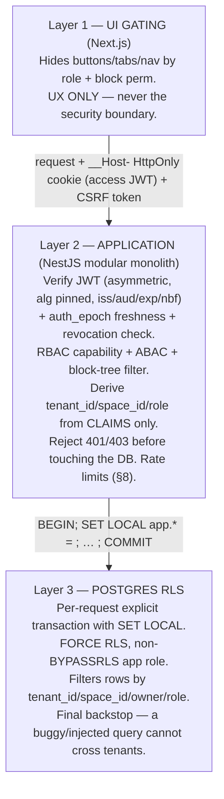

# Security & Access Document

> Layer-by-layer security, privacy, and compliance architecture for **Flowblok** — the AI-native
> visual business operating system. This document refines and operationalizes `_CONTEXT.md` §10
> (Security & access), §3 (Tenancy), and §11 (API surface), and folds in the ratified global
> decisions of the expert crew (terminology, architecture posture, identity, data-storage model,
> AI generation, and legal/compliance discipline). Where this document and `_CONTEXT.md` disagree
> on a canonical name or number, `_CONTEXT.md` wins and the conflict is raised in `00-QUESTIONS.md`.

---

## 1. Document control

| Field | Value |
|---|---|
| **Document** | `03-SECURITY-AND-ACCESS.md` |
| **Product** | Flowblok |
| **Version** | **v1.0 (FINAL)** |
| **Date** | 2026-06-16 |
| **Owner** | Security Architecture |
| **Status** | **Ratified** — Phase-1 build baseline |
| **Audience** | Engineering, DevOps, Security, Legal/Compliance, Founding team |

**Related documents (cross-reference by filename — see `_CONTEXT.md` §16):**

| File | Relationship to this document |
|---|---|
| `_CONTEXT.md` | Canonical single source of truth. This doc obeys §3 (tenancy), §10 (security), §11 (API). |
| `00-QUESTIONS.md` | Open security/legal decisions and clarifying questions. |
| `01-PRD.md` | Personas (primary = Agency; activation = non-technical), the 16 modules, tiers $19/$99/$299. |
| `02-TECHNICAL-ARCHITECTURE.md` | Modular monolith, Supabase-as-IdP ADR, JSONB records store, egress proxy, sandbox runtime. |
| `04-FRONTEND-SPEC.md` | UI role gating, the seven block tabs, Simple vs Developer editing modes. |
| `05-FEATURE-TICKETS.md` | Security-relevant tickets: FB-001/FB-002 (Space create/delete + GDPR), FB-005…FB-010 (Auth/MFA/Session), FB-046…FB-050 (AI generation), FB-051…FB-054 (Marketplace), FB-052/FB-059 (Plugin install/SDK), FB-055…FB-058 (Developer Mode / custom code/components). |
| `06-SRS.md` | Functional/non-functional security requirements traceability. |
| `07-FSD.md` | Functional spec detail for permissioned surfaces. |
| `08-DESIGN-SYSTEM.md` | Token SSOT for security-state UI (status colors pass/pending/fail + icon+label). |

### 1.1 Terminology (ratified — global decision)

The canonical user-facing entity name is **Space**. The word **"Workspace" is retired** in UI labels,
route segments, JWT claims, and ticket titles. The canonical hierarchy is:

```
Organization (tenant)  →  Space
```

| Term | Meaning | DB column |
|---|---|---|
| **Organization** | The tenant / billing + isolation boundary. | `tenant_id` |
| **Space** | A project surface inside an Organization (was "Workspace"). | `space_id` |

**Both `tenant_id` and `space_id` appear on every tenant-owned row.** **RLS keys off `tenant_id`**
(the isolation boundary); the **application scopes by `space_id`** (the project boundary). Routes are
`/app/{org}/{space}`. The legacy `workspace_id` claim/column name is removed; any residual reference
should read `space_id`.

### 1.2 Canonical constants carried from `_CONTEXT.md` (do not drift)

Access token **15 min**; refresh token **30 days**; **Secure HttpOnly cookies, never LocalStorage**;
**MFA required for admins**; **AES-256 at rest / TLS 1.3 in transit**; **secrets in Vault**;
roles = Owner, Admin, Manager, Developer, Editor, Author, Reviewer, Customer, Guest; **3-layer
enforcement** (UI → JWT claims → Postgres RLS); tiers **$19 / $99 / $299** + Enterprise custom;
marketplace commission **20%**; the **seven block tabs** = Design · Data · Logic · Permissions ·
Events · SEO · AI; tickets **FB-001 … FB-068**.

### 1.3 Ratified posture deltas from the v0.1 draft (global decisions applied)

These supersede the earlier draft and prior `_CONTEXT.md` phrasing; they are security-load-bearing:

1. **Architecture = modular monolith (Phase 1).** NestJS modules, one managed Postgres (+pgvector),
   2–3 deployable units (web/API + async worker). **No custom API Gateway, no Kafka, no Elasticsearch**
   in Phase 1. The "30+ microservices / 300+ tables" figure is **not a target** — it is a non-binding
   end-state symptom. This shrinks the attack surface a 2-BE team must defend.
2. **Identity = Supabase (managed Postgres) as IdP only.** Supabase provides Postgres + RLS + pgvector
   + Auth (token issuer). The NestJS monolith **consumes** Supabase-issued JWTs and **does not
   re-issue** them. **Asymmetric signing (RS256/EdDSA + JWKS) is mandatory end-to-end** — the default
   shared HS256 secret is prohibited (§3.1).
3. **User-defined "tables" = JSONB records store, not per-tenant DDL.** The Data Builder stores tenant
   collections as rows (`tenant_id + space_id + collection_id + JSONB payload + GIN index`), **not**
   physical per-tenant tables. Real DDL is reserved for the ~40 platform tables and an Enterprise
   dedicated-schema tier. **AI-authored DDL never auto-applies** (dry-run + diff gate). This is what
   makes uniform RLS and 50k-Space scale compatible (§6).
4. **AI inference = platform-owned keys by default.** Central inference is the default and the only
   path that yields the generation-telemetry moat; **BYO-key is an optional advanced/enterprise
   setting** (§10, §16). The non-technical activation persona never needs a key.
5. **Default sandbox for untrusted code = WASM / Firecracker microVM**, not shared-kernel containers.
   Arbitrary generated/custom React is **never SSR'd in the shared rendering service** (§9, §14.7).
6. **Compliance-claims discipline.** **HIPAA and 99.99% SLA are demoted** from "targets" to
   product-gated / contract-only capabilities. Never market SOC 2 / ISO / HIPAA as "certified" before
   an attestation exists (§12, §17).

---

## 2. Security objectives & threat model

### 2.1 Objectives

1. **Tenant isolation is absolute.** No Organization can read, write, or infer another's data
   (`_CONTEXT.md` §3: "No cross-tenant queries possible"). Isolation keys off `tenant_id`. This is the #1 invariant.
2. **Least privilege everywhere.** Every actor (user, service, plugin, **AI agent**) holds the minimum
   capability required, scoped to one Space by default. AI agents run under a **scoped per-invocation
   identity** inheriting the requesting user's RBAC/ABAC + tenant (§10) — never a broad service account.
3. **Defense in depth.** A single bypassed layer must not leak data — UI, API, and database each
   enforce independently; the database (RLS) is the non-bypassable backstop.
4. **Secrets never reach the browser or logs.** Per-tenant connector/payment keys (and BYO AI keys, if
   used) live only server-side, envelope-encrypted, in Vault, and are decrypted only in a minimal
   monitored proxy.
5. **Auditable & attributable.** Every security-relevant action is logged, attributed to user +
   Organization + Space, append-only.
6. **Safe extensibility.** Plugins, AI-generated code, and workflows execute in an isolated runtime,
   capability-scoped — extensibility never becomes an RCE, SSRF, or cross-tenant vector.

### 2.2 Attacker profiles (who we defend against)

| Profile | Capability / motive | Primary controls |
|---|---|---|
| **External unauthenticated** | Credential stuffing, token theft, SSRF, enumeration, DDoS. | WAF, rate limits, asymmetric JWT, egress proxy (§4), BOLA tests. |
| **Authenticated low-priv tenant user** (Author/Customer/Guest) | Privilege escalation, IDOR/BOLA on auto-generated APIs, reading blocks above their role. | RBAC+ABAC, RLS, block-tree filter (§7-major), object-level authz tests. |
| **Malicious agency operator** | Legitimately holds many client Spaces; **clone is cross-tenant by design**. Could harvest secrets/PII across cloned Spaces. | Clone never copies secrets or end-customer PII (§9.4); per-Space key isolation; clone audit event. |
| **Malicious marketplace seller** | Ships a plugin/template that exfiltrates data, phones home, or includes infringing/OSS-violating code. | Sandbox + capability allowlist, re-review on capability/dependency change, OSS-license scan, seller warranties + DMCA (§9). |
| **Compromised internal service / supply chain** | Stolen build credential, poisoned dependency, leaked signing key. | `FORCE RLS` + non-`BYPASSRLS` app role, signed artifacts, OIDC short-lived CI creds, SAST/SCA (§13). |
| **The AI itself (untrusted by default)** | Indirect prompt injection via RAG/tenant text drives a confused-deputy action or code with an RCE/SSRF payload. | Scoped agent identity, tool allowlist + arg validation, human-in-the-loop for side-effecting actions, output never `eval`'d (§10). |

### 2.3 Top threats (priority order)

| # | Threat | Why it matters for Flowblok | Anchor |
|---|---|---|---|
| **T1** | **Cross-tenant data leakage** | Shared Postgres + JSONB records store. A missing/incorrect RLS policy, a `tenant_id`-less query, **or a pooled connection reused across tenants** exposes every tenant. Catastrophic blast radius. | §5, §6 |
| **T2** | **Broken access control (RBAC/ABAC bypass)** | 9 roles + ABAC + per-block permissions over a JSON block tree. A claim-check gap, a stale role in a 15-min token, or an unfiltered block lets an Author publish or a Customer read others' orders. | §4, §7 |
| **T3** | **Indirect prompt injection / AI confused-deputy** | RAG/tenant-supplied text reaches agents that can call tools, write data, send email/SMS, spend money, or emit code. Injection can drive privileged actions or exfiltration. | §10 |
| **T4** | **SSRF via outbound fetch** | Workflows, connectors, data-bindings, and screenshot/vision ingest all make server-side HTTP requests — a classic path to cloud metadata creds and internal services. | §8.2 |
| **T5** | **Untrusted-code RCE / sandbox escape** | Marketplace plugins **and** AI-generated/custom React execute server-adjacent. A shared-kernel escape = host or cross-tenant compromise. Generated React SSR'd in a shared renderer is an RCE. | §9, §14.7 |
| **T6** | **Secret leakage** | Developer Mode exposes generated code/schema/API defs; connectors/BYO-keys risk being rendered into bundles, JSON, logs, or disclosed en masse if a key-handling service is compromised. | §7, §10 |
| **T7** | **Malicious or buggy generated component** | An AI-generated or forked "Custom Component" contains an XSS/SSRF/infinite-loop/credential-read payload and is rendered to other end-users or run server-side. | §9.5, §14.7 |
| **T8** | **Payment & billing abuse / DoS** | Workflow self-trigger/fan-out loops, AI spend runaway, auto-generated API mass-assignment, or card-data exposure. | §8.1, §8.4, §10 |

### 2.4 STRIDE summary

| STRIDE | Representative threat in Flowblok | Primary mitigation |
|---|---|---|
| **S**poofing | Forged/replayed JWT (HS256 secret abuse); OAuth account takeover; unsigned inbound webhook. | **Asymmetric JWT (RS256/EdDSA + JWKS), alg pinned**; MFA for admins; HttpOnly cookies + rotation; OAuth linking on `iss+sub`; HMAC-signed replay-protected webhooks. |
| **T**ampering | Modified body alters `tenant_id`/`role`; tampered plugin; mass-assignment on generated API. | Server derives `tenant_id`/`role` from verified claims only; RLS; signed plugin packages; field allowlists. |
| **R**epudiation | User denies a destructive change; AI agent action unattributed. | Append-only attributed audit log incl. agent invocations and human confirmations. |
| **I**nformation disclosure | Cross-tenant read (T1); SSRF to metadata (T4); secret in UI (T6); block above role (T2); AI exfiltration (T3). | RLS + `FORCE`; egress proxy; secrets server-side in Vault; server-side block-tree filter; scoped agent identity. |
| **D**enial of service | API flooding; runaway AI spend; workflow fan-out loops. | Rate limits, WAF, per-tenant AI credits + hard cap, per-tenant action quotas + loop detection. |
| **E**levation of privilege | Author → publish; stale role in token; plugin/generated code → host; tenant user → platform admin. | RBAC + ABAC + RLS; `auth_epoch` freshness check; WASM/microVM sandbox; non-`BYPASSRLS` app role. |

---

## 3. Identity & authentication

Identity is built on **Supabase Auth as IdP only** (ratified ADR, §1.3). Supabase **issues** tokens;
the NestJS modular monolith **verifies and consumes** them and **never re-issues**. Alternatives noted
in `_CONTEXT.md` §5 (Auth0/Ory/Keycloak) remain "alternatives considered." Tickets: FB-005 … FB-010.

### 3.1 JWT design — asymmetric signing is mandatory

> **Critical (memo #6).** Tokens are signed with **RS256 or EdDSA** using an asymmetric key; verifiers
> fetch the public key from **JWKS**. The Supabase **default shared HS256 secret is prohibited** — with
> a shared secret, any service that can read it (or any compromised module) can **mint a valid token
> for any tenant**, defeating isolation. Every verifier **pins the expected `alg`** and rejects `none`
> and any `HS*` when an `RS*`/`EdDSA` token is expected (blocks alg-confusion downgrade).

Minimum required claims (note `space_id` replaces the retired `workspace_id`):

```jsonc
{
  "sub":        "usr_8f3a…",        // user id
  "tenant_id":  "org_19de…",        // Organization id — RLS isolation key (§6)
  "space_id":   "spc_4c2b…",        // active Space — application scoping key
  "role":       "editor",           // active role within this Space (see §4 catalog)
  "auth_epoch": 7,                  // per-membership freshness counter (see §3.6)
  "iss":        "https://auth.flowblok.io",
  "aud":        "flowblok-api",
  "iat":        1718500000,
  "nbf":        1718500000,
  "exp":        1718500900,         // iat + 15 min (access token)
  "amr":        ["pwd","mfa"],      // auth methods presented (mfa => admin gate satisfied)
  "sid":        "sess_…"            // session id, used for revocation
}
```

Verification on every request (in order): **(1)** signature against JWKS with **pinned alg**; **(2)**
`iss` and `aud` exact-match; **(3)** `exp`/`nbf` within skew (≤ 60s); **(4)** `sid` not in the
revocation set; **(5)** `auth_epoch` matches the current membership epoch (§3.6).

- **`tenant_id`, `space_id`, and `role` are authoritative and server-issued.** The application and RLS
  derive identity from verified claims only — never from body, query string, or client headers
  (mitigates T2 tampering).
- A user in multiple Spaces holds **one membership row per Space**; switching Spaces issues a **new
  token** with a new `space_id`/`role`/`auth_epoch`. Tokens are single-Space scoped.

### 3.2 Authentication methods (`_CONTEXT.md` §10)

| Method | Notes |
|---|---|
| **Email + password** | **argon2id** (preferred) or bcrypt (cost ≥ 12) **with a Vault-stored pepper**; per-user salt; never logged; breach-password (k-anonymity) check at signup. |
| **OAuth: Google / Microsoft / GitHub** | Account-linking keyed on **immutable `iss` + `sub`** (never email, which is mutable/spoofable); requires **explicit in-app link confirmation** (memo #16). |
| **SAML / SSO / OIDC** | Enterprise tier; per-Organization IdP config; **pin the enterprise IdP `iss` per-org** so a different IdP cannot assert that org's users. SCIM provisioning → `00-QUESTIONS.md`. |
| **Magic Link** | Passwordless; single-use, short TTL (≤ 10 min), bound to requesting device/UA. |
| **OTP** | One-time code (email/SMS/TOTP) for passwordless login and as an MFA factor. |

### 3.3 Multi-factor authentication

- **MFA is REQUIRED for Owner and Admin** (`_CONTEXT.md` §10). Privileged actions are refused unless
  the JWT `amr` includes `mfa`.
- Strongly recommended (org-configurable as mandatory) for Manager and Developer.
- Factors: **TOTP** preferred; **WebAuthn / passkeys** on roadmap; SMS/email OTP as weaker fallback.
- **Step-up MFA** is re-prompted for high-risk actions: billing changes, role changes, **Space
  deletion**, plugin install, **BYO-key entry**, exporting tenant data.

### 3.4 Session model & token storage (contradiction resolved)

> **Minor (memo #15).** The v0.1 "in-memory **+** HttpOnly cookie" was self-contradictory. **Resolution:
> cookie-only. No token in JavaScript.**

| Token | Lifetime | Storage | Notes |
|---|---|---|---|
| **Access token** | **15 minutes** | **`__Host-` Secure HttpOnly SameSite cookie** | Verified on every API call. Never readable by JS. |
| **Refresh token** | **30 days** | **`__Host-` Secure HttpOnly SameSite=Strict cookie** | Rotated on every use (rotation + reuse detection, §3.5). |

- **NEVER LocalStorage / sessionStorage / non-HttpOnly cookies** (`_CONTEXT.md` §10) — non-negotiable.
- Cookies: `__Host-` prefix, `Secure`, `HttpOnly`, `SameSite=Strict` (`Lax` only on the OAuth-redirect
  cookie), scoped path `/`.
- **CSRF:** because auth is cookie-based, **every state-changing request carries a CSRF token**
  (double-submit or signed header), validated server-side. `SameSite` is a second line, not the only one.

### 3.5 Token refresh & revocation

- **Refresh rotation:** each refresh issues a new refresh token and invalidates the prior one. **Reuse
  of a rotated (already-consumed) refresh token revokes the entire session family** and forces
  re-authentication (detects stolen refresh tokens).
- **Revocation store:** sessions tracked by `sid` in Redis. Revoke on logout, password change, MFA
  reset, role/permission change, owner "sign out everywhere," or anomaly. The verifier checks the
  revocation set on every request, so revocation latency is immediate, not bounded by token TTL.

### 3.6 Stale-authorization window (fixed)

> **Major (memo #8).** `role` is baked into a 15-minute access token. For a **role downgrade or Space
> removal**, a 15-minute window of retained privilege is unacceptable.

- Each membership row carries an **`auth_epoch`** integer. Any role change, capability change, or Space
  removal **increments `auth_epoch`** and revokes the session family (§3.5).
- **Every request** the application compares the token's `auth_epoch` to the current membership epoch;
  a mismatch → `401`, forcing token refresh (which re-reads the role).
- For **high-impact tables** (billing, user/role management, Space deletion, plugin install), the
  effective role is **re-derived from a freshly-read membership row at action time**, not trusted from
  the token alone.

---

## 4. Authorization model

Two layers compose: **RBAC** (what a role may do) **+ ABAC** (attribute/ownership constraints on
*which rows*), enforced finally by RLS (§5). Roles per `_CONTEXT.md` §10.

### 4.1 Role catalog

| Role | Scope | Intent |
|---|---|---|
| **Owner** | Organization / Space | Full control incl. billing, deletion, transfer. One+ per org. MFA required. |
| **Admin** | Space | Manage settings, users, all content/data; no billing ownership transfer. MFA required. |
| **Manager** | Space | Operational lead: content, data, workflows, CRM/Commerce ops; limited user mgmt. |
| **Developer** | Space | Developer Mode, code editor, custom components/APIs, plugin SDK; "nothing locked" (`_CONTEXT.md` §2). |
| **Editor** | Space | Create, edit, **and publish** all content. |
| **Author** | Space | Create/edit **own** content; **cannot publish** (ABAC, §4.3). |
| **Reviewer** | Space | Read + comment + approve/reject in workflow; no direct edit/publish. |
| **Customer** | End-user (commerce/portal) | Views **own** orders/data only; no admin surface. |
| **Guest** | Public / anonymous | Read public content only. |

### 4.2 Capability matrix

Legend: ✅ allowed · 🟡 own-records only / conditional (ABAC) · ❌ denied.

| Capability | Owner | Admin | Manager | Developer | Editor | Author | Reviewer | Customer | Guest |
|---|:--:|:--:|:--:|:--:|:--:|:--:|:--:|:--:|:--:|
| Edit Pages / Content | ✅ | ✅ | ✅ | ✅ | ✅ | 🟡 own | ❌ | ❌ | ❌ |
| Edit Data (collection records) | ✅ | ✅ | ✅ | ✅ | ✅ | 🟡 own | ❌ | 🟡 own | ❌ |
| Publish | ✅ | ✅ | ✅ | ✅ | ✅ | ❌ | ❌ | ❌ | ❌ |
| Review / Approve | ✅ | ✅ | ✅ | 🟡 | ✅ | ❌ | ✅ | ❌ | ❌ |
| Manage Users / Roles | ✅ | ✅ | 🟡 limited | ❌ | ❌ | ❌ | ❌ | ❌ | ❌ |
| Access APIs (read/write) | ✅ | ✅ | ✅ | ✅ | ✅ | 🟡 own | 🟡 read | 🟡 own | ❌ |
| Manage Billing | ✅ | ❌ | ❌ | ❌ | ❌ | ❌ | ❌ | ❌ | ❌ |
| Install Plugins / Marketplace | ✅ | ✅ | ❌ | 🟡 dev plugins | ❌ | ❌ | ❌ | ❌ | ❌ |
| Use Developer Mode / Code Editor | ✅ | 🟡 | ❌ | ✅ | ❌ | ❌ | ❌ | ❌ | ❌ |
| Manage Workflows | ✅ | ✅ | ✅ | ✅ | 🟡 | ❌ | ❌ | ❌ | ❌ |
| Confirm side-effecting AI agent action | ✅ | ✅ | ✅ | ✅ | 🟡 | ❌ | ❌ | ❌ | ❌ |
| Enter BYO AI key (advanced) | ✅ | ✅ | ❌ | ❌ | ❌ | ❌ | ❌ | ❌ | ❌ |
| Manage Space Settings | ✅ | ✅ | 🟡 | ❌ | ❌ | ❌ | ❌ | ❌ | ❌ |
| Delete Space (GDPR self-delete) | ✅ | ❌ | ❌ | ❌ | ❌ | ❌ | ❌ | ❌ | ❌ |
| View Audit Log | ✅ | ✅ | 🟡 | ❌ | ❌ | ❌ | ❌ | ❌ | ❌ |
| View own orders (Commerce) | ✅ | ✅ | ✅ | ✅ | ✅ | ✅ | ✅ | 🟡 own | ❌ |

> Capabilities are data-driven (a `role_capabilities` table), so custom roles can be composed without
> code changes. The matrix above is the seeded default. UI exposure of these capabilities differs by
> editing mode: the **Simple mode** (non-technical activation persona) hides Developer Mode and the
> dense power surface; the **seven-tab power surface** is gated to Developer/Agency roles
> (`04-FRONTEND-SPEC.md`). UI gating is UX, not the security boundary.

### 4.3 ABAC layer — worked examples

RBAC says *whether* a capability exists; ABAC constrains *which rows* via attributes (`owner_id`,
`tenant_id`, `space_id`, `status`, `customer_id`). Canonical examples from `_CONTEXT.md` §10:

- **Author edits own posts but cannot publish.** `role = author` grants `posts:update` **only where
  `posts.author_id = current_user_id`** and lacks `posts:publish` entirely; the `status → published`
  transition is unreachable (enforced in RLS `WITH CHECK`, §5.2b).
- **Editor edits/publishes all.** `role = editor` grants `posts:update` + `posts:publish` across the
  Space, still bounded by `tenant_id` (RLS).
- **Customer views own orders.** `role = customer` grants `orders:read` **only where
  `orders.customer_id = current_user_id`**. No write, no other customers' rows.

### 4.4 The seven block tabs — Permissions tab (visual editor)

Per `_CONTEXT.md` §3, **every block/page exposes the seven tabs: Design · Data · Logic · Permissions ·
Events · SEO · AI.** The **Permissions** tab sets *visibility and edit access at the block level*,
layered on Space RBAC (UI detail in `04-FRONTEND-SPEC.md`).

| Permission tab option | Effect |
|---|---|
| **Guest** | Block visible to anonymous/public visitors (rendered in the published site). |
| **User** | Block visible only to authenticated end-users (e.g. logged-in Customers). |
| **Editor** | Block visible/editable to Editor+ in the editor; hidden from lower roles. |
| **Admin** | Block restricted to Admin/Owner (internal/admin-only sections). |
| **Custom roles** | Bind the block to one or more named roles (incl. custom roles, §4.2). |

Block-level permission is **enforced server-side at every read path** — not just hidden by the UI
toggle. See the dedicated **block-tree filter** requirement in §7 (memo #7); a permissioned block must
be unreachable via REST/GraphQL/SSR/preview/webhook.

---

## 5. Three-layer enforcement

Per `_CONTEXT.md` §10: **UI gating → backend JWT-claim checks → Postgres RLS.** Each layer is
independent; the database is the final, non-bypassable backstop.



### 5.1 RLS under connection pooling — the #1 bypass (CRITICAL, memo #1)

> Connection pooling is the single most dangerous RLS failure mode: a connection that carries Tenant
> A's session settings can be handed to a request for Tenant B and return A's rows. **This is a Phase-1
> gate, not a Phase-3 compliance item.**

Mandated rules:

1. **Per-request explicit transaction with `SET LOCAL`.** Every request that touches tenant data opens
   a transaction and sets session variables with **`SET LOCAL`** (transaction-scoped, auto-reset at
   `COMMIT`/`ROLLBACK`). **Autocommit reads are forbidden** — a bare autocommit `SELECT` runs outside
   any transaction and the `SET LOCAL` does not apply, so the predicate evaluates against a stale/empty
   tenant and either leaks or silently returns nothing.
2. **Pooler mode documented and pinned.** With a transaction-mode pooler (e.g. Supabase/PgBouncer
   transaction pooling), session-level `SET` does **not** survive across statements — only `SET LOCAL`
   inside a transaction is safe. The chosen mode is recorded in `02-TECHNICAL-ARCHITECTURE.md` and
   asserted at boot.
3. **App role is non-`BYPASSRLS`, non-superuser** (or RLS is silently off). Verified at boot and in CI.

```sql
-- Correct per-request pattern (transaction-scoped; safe under a transaction-mode pooler).
BEGIN;
  SET LOCAL app.current_user_id = '...';  -- from verified JWT sub
  SET LOCAL app.current_role    = '...';  -- from verified JWT role
  SET LOCAL app.tenant_id       = '...';  -- from verified JWT tenant_id (Organization)
  SET LOCAL app.space_id        = '...';  -- from verified JWT space_id
  -- ... all reads/writes for this request ...
COMMIT;  -- SET LOCAL values are discarded here; the pooled connection carries no tenant state.
```

**Merge-blocking CI test (required, memo #1):** a regression test sets tenant A's context, returns the
connection to the pool, reacquires it as tenant B, and **asserts zero rows belonging to A are
visible**. This test gates merges to `main` and runs against the real pooler configuration.

### 5.2 Example RLS policies

RLS isolation keys off **`tenant_id`** (the Organization). `space_id` is additionally enforced by the
application and may be added to policies for defense-in-depth.

**(a) Tenant isolation — applies to every tenant-scoped table (mitigates T1):**

```sql
ALTER TABLE posts ENABLE ROW LEVEL SECURITY;
ALTER TABLE posts FORCE  ROW LEVEL SECURITY;   -- applies even to the table owner

CREATE POLICY tenant_isolation ON posts
  FOR ALL
  USING      (tenant_id = current_setting('app.tenant_id')::uuid)
  WITH CHECK (tenant_id = current_setting('app.tenant_id')::uuid);
```

**(b) Posts write — Author owns, Editor/Admin all; Authors cannot publish (RBAC+ABAC; mitigates T2):**

```sql
CREATE POLICY posts_write ON posts
  FOR ALL
  USING (
    tenant_id = current_setting('app.tenant_id')::uuid
    AND (
      current_setting('app.current_role') IN ('owner','admin','manager','editor')
      OR (current_setting('app.current_role') = 'author'
          AND author_id = current_setting('app.current_user_id')::uuid)
    )
  )
  WITH CHECK (
    tenant_id = current_setting('app.tenant_id')::uuid
    AND (
      current_setting('app.current_role') IN ('owner','admin','manager','editor')
      OR (current_setting('app.current_role') = 'author'
          AND author_id = current_setting('app.current_user_id')::uuid
          AND status <> 'published')   -- Authors cannot transition into 'published'
    )
  );
```

**(c) Orders — customers see only their own (ABAC; mitigates T2/T8):**

```sql
ALTER TABLE orders ENABLE ROW LEVEL SECURITY;
ALTER TABLE orders FORCE  ROW LEVEL SECURITY;

CREATE POLICY orders_own_data ON orders
  FOR SELECT
  USING (
    tenant_id = current_setting('app.tenant_id')::uuid
    AND (
      current_setting('app.current_role') IN ('owner','admin','manager')
      OR (current_setting('app.current_role') = 'customer'
          AND customer_id = current_setting('app.current_user_id')::uuid)
    )
  );
```

**(d) The JSONB records store — user-defined collections (the Data Builder; mitigates T1):**

The Data Builder stores tenant "tables" as rows in a single generic store, **not** per-tenant DDL
(ratified §1.3). One uniform RLS policy protects *all* tenant collections — the property that makes the
records store and RLS compatible at 50k-Space scale.

```sql
-- Generic records store: tenant_id + space_id + collection_id + JSONB payload + GIN index.
CREATE TABLE collection_records (
  id            uuid PRIMARY KEY DEFAULT gen_random_uuid(),
  tenant_id     uuid NOT NULL,
  space_id      uuid NOT NULL,
  collection_id uuid NOT NULL,
  owner_id      uuid,
  payload       jsonb NOT NULL,
  created_at    timestamptz NOT NULL DEFAULT now()
);
CREATE INDEX idx_records_tenant_collection ON collection_records (tenant_id, space_id, collection_id);
CREATE INDEX idx_records_payload_gin       ON collection_records USING gin (payload jsonb_path_ops);

ALTER TABLE collection_records ENABLE ROW LEVEL SECURITY;
ALTER TABLE collection_records FORCE  ROW LEVEL SECURITY;

CREATE POLICY records_tenant_isolation ON collection_records
  FOR ALL
  USING      (tenant_id = current_setting('app.tenant_id')::uuid)
  WITH CHECK (tenant_id = current_setting('app.tenant_id')::uuid);
```

> **Standard:** every tenant-scoped table ships with (1) `ENABLE` + `FORCE` RLS, (2) a `tenant_id`
> isolation policy, and (3) any role/ownership refinements. A migration adding a tenant table **without**
> an RLS policy fails the policy-lint check in CI (§13). pgvector embedding tables are tenant-scoped and
> follow the same rule.

---

## 6. Multi-tenant isolation & the data-storage model

Per `_CONTEXT.md` §3: **shared Postgres + RLS.** Isolation boundary = **Organization (`tenant_id`)**.

- **`tenant_id` + `space_id` on every tenant row.** Every tenant-scoped row carries a non-null
  `tenant_id` (Organization) and `space_id` (Space). Composite indexes lead with `tenant_id` so
  cross-tenant full scans are impractical. **RLS keys off `tenant_id`; the app scopes by `space_id`.**
- **User-defined "tables" are JSONB records, not per-tenant DDL (ratified §1.3).** 50k Spaces × dozens
  of collections each = ~1M physical tables, which breaks Postgres and breaks uniform RLS. Instead,
  tenant collections live in `collection_records` (§5.2d) under **one** RLS policy. Real DDL is reserved
  for the **~40 platform tables** and an **Enterprise dedicated-schema tier**.
- **Two migration tracks, never conflated:**
  - **Platform migrations** (the ~40 tables): authored by engineers, version-controlled, reviewed via
    Git/CI, applied through the release pipeline. Canonical tool = **Prisma** (ratified). TypeORM/Flyway
    are "alternatives considered" only.
  - **Runtime tenant schema-evolution** (a tenant adds a field to a collection): an **online,
    lock-aware metadata update** to the collection definition — **no human PR, no DDL**. Because storage
    is JSONB, adding/removing a field is a metadata change, not an `ALTER TABLE`.
- **AI-authored DDL never auto-applies.** Any generated schema change (including from FB-049 and the
  Enterprise dedicated-schema tier) passes a **dry-run + diff gate** with human approval. There is no
  path by which an AI auto-applies a migration to the shared cluster.
- **RLS is the backstop** (§5). With `FORCE RLS` + a non-`BYPASSRLS` app role + the §5.1 pooling
  discipline, **no query — buggy, injected, or AI-authored — returns another tenant's rows.**
- **Why shared-DB + RLS over DB-per-tenant:** one schema/migration pipeline, cheaper ops, scales to the
  Y3 50k-Space target (`_CONTEXT.md` §13). DB-per-tenant / dedicated-schema is the **Enterprise/PHI**
  isolation tier only (§12, §17).

---

## 7. Data protection & field/block-level controls

| Control | Implementation (`_CONTEXT.md` §5/§10) |
|---|---|
| **At rest** | **AES-256** disk/volume + Postgres storage encryption; S3/R2 SSE; encrypted backups. **Per-tenant data key** under a KMS root for crypto-shredding (§12). |
| **In transit** | **TLS 1.3** for all external + internal traffic; HSTS; no plaintext. |
| **Secrets** | **HashiCorp Vault** (or KMS-backed equivalent). No secrets in code, repo env files, client bundles, or logs. Short-lived dynamic DB credentials where possible. |
| **Passwords** | **argon2id** (preferred) / bcrypt cost ≥ 12, per-user salt, **Vault pepper**; never logged or returned. |
| **Connector / 3rd-party creds** | Per-tenant in Vault (§9.3); **write-only** fields (never echoed back to the client). |
| **BYO AI key (optional)** | Per-tenant **envelope encryption**, **write-only** field, decrypted **only in a minimal monitored proxy** (not the full Orchestrator), anomalous-spend detection + auto-revoke (§10). Default path is platform-owned keys. |
| **Payment data** | Card data handled by the PSP (Stripe); Flowblok stores **tokens/references only**, never PANs. **PCI-DSS SAQ-A** posture by tokenization (mitigates T8). |
| **PII & consent** | Tenant-collected personal data stored under the §12 data-roles model; consent recorded with timestamp/purpose; supports export and erasure incl. **pgvector embeddings**. |

### 7.1 Block-level / sub-field permission enforcement (MAJOR, memo #7)

> **RLS is row-granular and cannot filter sub-fields of a JSON block tree.** A page is one row; an
> admin-only block is a node inside that row's JSON. RLS alone will return the whole tree, including
> blocks the requester must not see.

Mandated control — a **server-side block-tree filter on EVERY read path**:

- Applies on **REST, GraphQL, SSR, preview, and webhook** serialization paths — wherever a block tree
  is emitted.
- After RLS returns the row, the filter **walks the block tree and prunes any block whose Permissions
  tab (§4.4) excludes the requester's role** *before* serialization. Pruning happens server-side; the
  pruned block never enters the response payload.
- For highly sensitive blocks, prefer storing access-controlled blocks in **separate rows** so RLS can
  also protect them directly (defense in depth).
- **Tests (required):** assert an Admin-only block **never** appears in a Guest or Customer response on
  any of the five read paths.

---

## 8. Network, abuse-resistance & SSRF

### 8.1 Rate limiting, WAF, admin allowlists

- **API rate limiting** (`_CONTEXT.md` §10/§11): per-tenant + per-user + per-IP token buckets at the
  application edge; stricter on auth, AI generation, and write endpoints; `429` + `Retry-After`.
- **Admin IP allowlists** (`_CONTEXT.md` §10): org-configurable for admin surfaces and privileged APIs;
  default-on prompt for Enterprise.
- **WAF** on all public ingress (OWASP: SQLi, XSS, path traversal, bot mitigation).
- **Least privilege:** per-service IAM, non-`BYPASSRLS` DB role, network segmentation
  (public ingress → app tier → data tier), no direct DB access from third-party services.
- **Patching:** automated dependency/OS patching; critical CVE ≤ 72h, high ≤ 7d; managed
  Postgres/Redis on supported versions.

### 8.2 SSRF — a top threat (CRITICAL, memo #4)

> **All** server-side outbound HTTP — workflow HTTP/Webhook nodes, connectors, data-bindings to
> external APIs, and **screenshot/vision ingest** — is a SSRF vector to cloud metadata endpoints and
> internal services.

Every outbound fetch **must** route through a **hardened egress proxy**:

- **Block** RFC1918 (10/8, 172.16/12, 192.168/16), link-local `169.254/16` (incl. `169.254.169.254`
  cloud metadata), loopback, ULA/IPv6 equivalents, and `0.0.0.0`.
- **DNS-rebinding defense:** resolve the hostname, validate the **resolved IP** against the blocklist,
  then **connect to that pinned IP** (re-check after redirects). Disallow redirects to disallowed hosts.
- **Per-tenant domain allowlists** for connectors; default-deny.
- **No internal credentials** on the egress path; the proxy carries no platform identity.
- **CI SSRF probes** (required): tests attempt to reach `169.254.169.254`, RFC1918 hosts, and a
  rebinding host through each outbound feature and assert they are blocked.

### 8.3 Inbound webhook authentication (MAJOR, memo #10)

Inbound webhooks (e.g. PSP events, connector callbacks) are **HMAC-signed and replay-protected**:
verify the signature against a per-endpoint secret, enforce a timestamp window, and reject duplicate
delivery IDs (nonce store). Unsigned/inbound-spoofed events are dropped.

### 8.4 Workflow & API abuse (MAJOR, memo #10)

- **Workflow self-trigger / fan-out billing-DoS:** loop detection (a run cannot synchronously
  re-trigger its own chain beyond a depth bound), **per-tenant action quotas**, and per-tenant
  concurrency caps. Email/SMS/Payment nodes count against quota.
- **Auto-generated REST/GraphQL BOLA & mass-assignment:** **object-level authorization tests** on every
  generated endpoint; **disable GraphQL introspection in production**; **field allowlists** on writes
  (no blind mass-assignment of `tenant_id`, `role`, `owner_id`, pricing fields).

---

## 9. Plugin & marketplace security (T5) + legal framework (§9 legal, memo #13)

Marketplace runs third-party code across Themes · Templates · Components · Connectors · Workflows · AI
Agents (`_CONTEXT.md` §12). Tickets FB-051 … FB-054, FB-059. The template/clone/marketplace flywheel is
pulled forward to Phase 1–2 (ratified), so these controls ship early.

### 9.1 Isolation runtime

> **CRITICAL (memo #3).** Default to **WASM or Firecracker microVMs** for untrusted code — **not**
> shared-kernel containers. The §14.7 sandbox decision is resolved before any code-execution feature ships.

- Plugin/connector/workflow-custom-code executes in a **WASM sandbox or Firecracker microVM**: no host
  network, no host FS, egress only through the §8.2 proxy, CPU/memory/wall-clock caps, no ambient DB
  access. Data is reached only through **brokered, capability-scoped APIs**.
- A plugin has **no platform credentials** and **no cross-tenant reach** by construction.

### 9.2 Capability model

- Each plugin declares a **manifest of fine-grained, time-scoped capabilities** (e.g. `read:posts`,
  `network:stripe.com`, `workflow:emit`). **Network is default-deny.**
- The admin approves capabilities at install (**step-up MFA**); the sandbox enforces them; default deny.
- **Re-review (not just re-signature) on any capability or dependency change** — a benign plugin that
  adds `network:*` or a new dependency is re-evaluated.

### 9.3 Connector credentials

Third-party connector credentials are stored **per-tenant in Vault** (§7), write-only, decrypted only in
the brokered call path, never exposed to plugin code or the client.

### 9.4 Clone safety (malicious-agency profile, §2.2)

Agency clone (FB-004) is cross-tenant **by design**. Therefore **clone copies structure and content but
NEVER copies secrets or end-customer PII**: connector/BYO-API keys, OAuth tokens, payment references,
Customer records, and collected form submissions are **excluded** from a clone. Cloning emits an audit
event. (PRD/tickets reference; security invariant stated here.)

### 9.5 Supply chain & code review

- **Signed packages:** every published package is cryptographically signed; runtime verifies signature
  + integrity hash before execution (mitigates tampering / supply chain).
- **Pre-listing review:** manual + automated (SAST, dependency scan, secret scan).
- **OSS-license scanning** on every submission; incompatible/copyleft-violating licenses are flagged
  and blocked.
- **Semantic versioning** + automated test pipeline on every submission/update; push-updates gated on
  passing tests + signature + (on capability/dependency change) re-review.

### 9.6 Marketplace legal framework (memo #13)

| Element | Requirement |
|---|---|
| **Seller agreement** | Originality + non-infringement **warranties** and an **indemnity** to Flowblok and buyers. |
| **Buyer license** | Clear license grant per item; scope and restrictions stated at purchase. |
| **DMCA** | Registered DMCA agent; **notice-and-takedown**; **repeat-infringer** termination policy. |
| **Payouts / tax** | Payout tax handling (W-8/W-9, VAT/GST where applicable); 20% commission (`_CONTEXT.md` §13) flows through §7 payment controls. |
| **Capability changes** | Re-review on plugin capability/dependency changes (§9.2). |

---

## 10. AI-specific security (T3, T6) + AI IP/AUP (memo #14)

Flowblok is AI-native (`_CONTEXT.md` §6). **Inference defaults to platform-owned keys** (ratified
§1.3/§16); BYO-key is an advanced/enterprise option. The LLM boundary is a first-class surface.

### 10.1 Redo of the AI threat model (CRITICAL, memo #2)

- **Scoped per-invocation agent identity.** Every agent runs under an identity that **inherits the
  requesting user's RBAC/ABAC + `tenant_id` + `space_id`** — **never a broad service account**. The
  agent cannot read or write anything the requesting user cannot.
- **Untrusted data on a separate channel.** All **RAG content and tenant-supplied text is treated as
  untrusted data**, kept on a separate channel from trusted system instructions (structured prompts,
  delimiters, role separation). Model output never silently authorizes a privileged action.
- **Human-in-the-loop for side effects.** Any agent action that **writes data, sends email/SMS, calls a
  connector, or spends money** requires **explicit human confirmation** (capability gated in §4.2).
- **Per-agent tool allowlists + argument validation.** Each agent has an explicit allowlist of callable
  tools; arguments are schema-validated and bounded before execution; tool calls are audited (§11).
- **Indirect prompt injection (T3) and tool-confused-deputy** are first-class threat rows (§2.3, §2.4).

### 10.2 Generated-code & generated-component safety (T5, T7)

- **AI output is data, not code, until explicitly run.** LLM output is **never `eval`'d** and **never
  rendered as raw HTML/Markdown** without sanitization.
- **Arbitrary generated/custom React is NEVER SSR'd in the shared rendering service** (memo #3). It runs
  only in a **per-tenant isolated runtime** (WASM/microVM, §9.1) with **no platform credentials, egress
  allowlist, and resource caps** — addressing T7 (malicious/buggy generated component).
- **One-way generation + explicit fork (ratified).** Generation is **Visual → Code** always. Code → Visual
  re-import succeeds **only** for code matching the generator's lossless canonical AST grammar; the
  instant a user edits outside it, the block becomes a **sealed, labeled "Custom Component"** — no longer
  visually editable and treated as untrusted code (sandboxed per §9.1). The platform **never silently
  regenerates over hand edits**.
- **Narrow generation surface (ratified).** Phase-1 generation selects/parameterizes vetted block
  templates and pre-modeled schema archetypes — **not free-form schema synthesis**. FB-048
  (AI-Generate-Database) is **out of Phase-1 scope**; this shrinks the generated-code attack surface.

### 10.3 Key isolation, metering & spend protection (memo #9, T6/T8)

- **Default = platform-owned keys + per-tenant metering** (preserves first-session activation and the
  telemetry moat). AI usage is metered as **AI credits** (`_CONTEXT.md` §13) with a **hard free-tier cap**
  to protect margins and prevent abuse-DoS.
- **BYO-key (optional)**: write-only field, **per-tenant envelope encryption**, decrypted **only in a
  minimal monitored proxy** (never the full Orchestrator), **anomalous-spend detection + auto-revoke**.
- **T-row: "Orchestrator compromise → mass key disclosure"** is mitigated by confining decryption to the
  minimal proxy and never holding plaintext keys in the Orchestrator.
- Keys are **never** returned to the client or embedded in generated code (T6).

### 10.4 PII handling toward providers (reframed, memo #18)

- **PII redaction before provider calls is defense-in-depth, NOT the boundary.** The **real control** is
  **zero-retention / no-train DPAs** with providers (§11/§12) plus **per-tenant data-handling settings**.
  Redaction reduces residual exposure; it does not substitute for contractual no-train guarantees.
- Prompts/responses are logged with PII scrubbed; per-tenant opt-out of provider training where supported.

### 10.5 AI Quality & Evaluation gate (ratified — security-relevant)

Generation passes an automated eval gate before reaching users: renders-without-error, AA-contrast,
schema-validity, minimum pass rate ≥ 90%, CI regression gate, latency p95 + per-generation cost budget.
A generation that fails safety/validity is not surfaced. **Never auto-publish** — preview-before-deploy,
with a "what the AI assumed" editable panel.

### 10.6 AI output IP liability, AUP & ToS (memo #14)

| Element | Requirement |
|---|---|
| **Output ownership** | Output delivered **"as generated"**; the **tenant is responsible for clearing rights** to use it. |
| **Provider output-indemnity** | Passes through to the tenant **only** with **platform-managed access + safety filters ON**; **BYO-key voids it** (state this at the BYO-key entry step). |
| **Prohibited-content / AUP** | Covers email/SMS/webhook abuse — **CAN-SPAM, CASL, TCPA** compliance is the tenant's obligation; spam/phishing/illegal content prohibited. |
| **Consent / suppression** | Flow **Email/SMS nodes** enforce consent capture and a suppression/unsubscribe list. |
| **Liability cap** | ToS includes a liability cap and disclaims warranties on generated output. |

---

## 11. Auditing & monitoring

Per `_CONTEXT.md` §10: audit captures **Login, Content Changes, Workflow Changes, API Calls, Permission
Changes**, and **tenant owners can view** their trail.

| Event class | Examples captured |
|---|---|
| **Login** | Sign-in success/failure, MFA challenge, magic-link/OTP, new-device, logout, session revoke, `auth_epoch` bump. |
| **Content changes** | Create/update/delete/publish of pages, components, content, collection records; before/after diff ref. |
| **Workflow changes** | Workflow create/edit/activate/deactivate; trigger/action changes; manual runs; quota breaches. |
| **API calls** | Privileged + write API calls (actor, tenant, space, endpoint, status); generated API-key use. |
| **Permission changes** | Role grants/revokes, invites/removals, block-permission changes, billing/role escalations. |
| **AI agent actions** | Each agent invocation, tool call + arguments, and the **human confirmation** for side-effecting actions (§10.1). |
| **Clone events** | Space clone (FB-004), recording that secrets/PII were excluded (§9.4). |

- **Attribution:** every event carries `tenant_id`, `space_id`, `user_id`, `role`, timestamp, source IP,
  request id. Append-only / tamper-evident.
- **Tenant-owner visibility:** Owner/Admin see only their Organization's log (RLS applies to the audit
  table too).
- **Retention:** default **≥ 1 year** for security events (configurable per tier); on GDPR deletion,
  audit is crypto-shredded except the minimal metadata lawfully retained (§12).
- **Alerting:** real-time on repeated auth failures, refresh-token reuse, **cross-tenant access
  attempts / RLS denials spiking**, **SSRF-proxy blocks**, AI spend-cap breaches, sandbox escapes, and
  privilege escalations. Wired to Grafana/Prometheus or ELK. SIEM export → `00-QUESTIONS.md`.

---

## 12. Data roles, lawful basis & GDPR mechanics (CRITICAL, memo #5/#12)

### 12.1 Controller / processor data-role mapping (foundation)

> **All GDPR obligations derive from this table.** For tenant-collected personal data Flowblok is a
> **processor**; for account/billing/telemetry Flowblok is a **controller**.

| Data category | Flowblok role | Lawful basis | Typical retention |
|---|---|---|---|
| Tenant end-customer records (CRM contacts, form submissions, Customer accounts) | **Processor** (tenant is controller) | Per tenant's basis (consent/contract) | Tenant-defined; deleted on tenant instruction or Space deletion |
| Tenant content / collection records (`collection_records`) | **Processor** | Per tenant's basis | Tenant-defined |
| Account holder data (Org users: name, email, auth) | **Controller** | Contract (provide the service) | Life of account + statutory window |
| Billing / payment references | **Controller** | Contract + legal obligation (tax) | Statutory (e.g. 7 yrs) |
| Product telemetry / generation telemetry (the moat) | **Controller** | Legitimate interest (improve service) | Aggregated/retained per policy; opt-out where required |
| Security/audit logs | **Controller** | Legal obligation + legitimate interest | ≥ 1 yr (§11) |

### 12.2 DPA & sub-processor register (MAJOR, memo #11)

- A **Data Processing Agreement (Art. 28(3) clause checklist)** is offered to all paid tenants
  (scope, instructions-only processing, confidentiality, security measures, sub-processor terms,
  assistance with data-subject rights, breach notice, deletion/return, audit rights).
- A **published sub-processor register** is maintained with **tenant change-notification + objection
  rights**:

| Sub-processor | Role | Location | Data categories | Transfer mechanism | No-train / zero-retention status |
|---|---|---|---|---|---|
| OpenAI | AI inference | US | Prompt/content (PII-redacted) | SCCs / DPF | **Resolve before GA** (→ `00-QUESTIONS.md`) |
| Anthropic | AI inference | US | Prompt/content (PII-redacted) | SCCs / DPF | **Resolve before GA** |
| Google (Gemini) | AI inference | US/EU | Prompt/content (PII-redacted) | SCCs / DPF | **Resolve before GA** |
| Stripe | Payments | US/EU | Payment references, billing PII | SCCs / DPF | N/A (PSP) |
| Supabase | Postgres / Auth / pgvector | Region-pinned | All tenant data at rest | SCCs / DPF | Hosting — no model training |
| AWS | Infra / storage (S3/R2 alt) | Region-pinned | All data at rest | SCCs / DPF | Hosting |
| Twilio | SMS / email (Flow nodes) | US/EU | Recipient contact + message | SCCs / DPF | Carrier |

> The **AI-provider no-train / zero-retention status is an Open Question that MUST be resolved before
> GA** (§16). PII redaction (§10.4) is defense-in-depth, not a substitute.

### 12.3 GDPR erasure vs immutable audit/versioning/backups (memo #12)

> **Tension:** GDPR Art. 17 hard-delete vs immutable audit, content versioning, and backups.
> **Canonical resolution: crypto-shredding.**

- Each Organization has a **per-tenant data key**. **Erasure = destroy that key**, rendering all
  encrypted tenant data (live rows, content versions, **pgvector embeddings**, search indexes, S3/R2
  objects, and backups) **cryptographically irrecoverable** without waiting out backup retention.
- **Lawfully retained minimal metadata** (Art. 17(3)): the minimum needed for legal/accounting
  obligations and fraud/abuse defense (e.g. invoice records, the fact that a deletion occurred) is
  retained in non-personal/pseudonymized form.
- **Space deletion (FB-002):** Owner-only, **step-up MFA**, confirmation/grace window, then
  crypto-shred + a completion certificate logged to the audit trail. Deletion scope explicitly includes
  pgvector embeddings.

### 12.4 Breach-notification runbook (memo #12)

A documented runbook with defined roles and timers: **processor → controller (the tenant) without undue
delay**; **GDPR 72h** to the supervisory authority where Flowblok is controller; **HIPAA 60d** where the
gated PHI tier applies; plus applicable **US state-law** timelines. Includes detection → triage →
containment → notification → post-incident review.

---

## 13. Secure SDLC

Per `_CONTEXT.md` §5 (Git + GitHub Actions, Docker) and §9 (schema-as-code); ties to
`02-TECHNICAL-ARCHITECTURE.md`.

- **CI/CD + code review:** all changes via PR; protected `main`; no direct pushes. Auth, RLS, payments,
  sandbox, and egress-proxy changes require a **security reviewer**.
- **Merge-blocking security tests (required):**
  - **Pooled cross-tenant reuse test** (§5.1) — set tenant A, return connection, reacquire as B, assert
    zero A rows.
  - **RLS policy lint** — every new tenant-scoped table must `ENABLE`+`FORCE` RLS and have a
    `tenant_id` isolation policy or the build fails.
  - **Block-tree filter tests** (§7.1) — Admin-only block never appears for Guest/Customer on all five
    read paths.
  - **SSRF probes** (§8.2) — metadata/RFC1918/rebinding hosts blocked on every outbound feature.
  - **Object-level authz (BOLA) tests** (§8.4) on generated REST/GraphQL endpoints.
- **Boot-time assertions:** app DB role is non-`BYPASSRLS`/non-superuser; pooler mode is the expected
  transaction mode; JWT verifiers have `alg` pinned and JWKS reachable.
- **Secret scanning** (pre-commit + CI), **SCA / dependency scanning** (fail on known-critical CVE,
  container image scan), **SAST/DAST**, **OSS-license scan** for marketplace submissions (§9.5).
- **Least-privilege CI:** OIDC to cloud (no long-lived keys), scoped deploy creds, signed artifacts.
- **SOC 2 evidence collection starts in Phase 1** (ratified), not Phase 3.

---

## 14. Sandbox & runtime isolation decisions

### 14.7 Sandbox decision (RESOLVED — CRITICAL, memo #3)

| Concern | Decision |
|---|---|
| **Untrusted code default** | **WASM sandbox or Firecracker microVM** — not shared-kernel containers. |
| **Generated/custom React SSR** | **Never SSR'd in the shared rendering service.** Per-tenant isolated runtime only. |
| **Platform credentials in runtime** | **None.** No ambient DB/secret access; data via brokered capability APIs. |
| **Egress** | Only through the §8.2 hardened proxy with per-tenant allowlist. |
| **Resource caps** | CPU/memory/wall-clock caps; kill on breach; counts against tenant quota. |
| **Threat addressed** | T5 (RCE/sandbox escape) and T7 (malicious/buggy generated component). |

The remaining WASM-vs-Firecracker performance trade-off is an engineering tuning detail recorded in
`02-TECHNICAL-ARCHITECTURE.md`; the **isolation posture above is fixed** and gates any code-execution feature.

---

## 15. Compliance & governance

| Program | Posture (ratified — compliance-claims discipline, §17) |
|---|---|
| **SOC 2 Type II** | **In progress** — evidence collection starts Phase 1. Status: *Designed to align with; not yet certified.* |
| **GDPR** | Data-roles model (§12), DPA + sub-processor register, crypto-shred erasure, breach runbook. |
| **HIPAA** | **Product-gated** — PHI prohibited on standard tenancy; allowed **only** on the isolated/dedicated-schema tier **with a signed BAA chain** (§17). Status: *Not offered on standard tier.* |
| **ISO 27001** | Target for enterprise; *Designed to align with; not yet certified.* |
| **Data residency** | Region pinning (EU/US) via Supabase/AWS region selection; commitments per Enterprise contract. |
| **SLA** | **Honest tiers (ratified):** **99.9% Business**; **99.95% only with multi-AZ HA**. The prior **99.99% target is demoted** — unachievable on a single-cluster Postgres with one DevOps. |
| **Pen-testing & audits** | **Annual** third-party pen test + security audit; remediation tracked to closure. |

---

## 16. AI inference & key model (summary cross-reference)

Default = **platform-owned keys**, metered as **AI credits** with a **hard free-tier cap**; the
non-technical activation persona never enters a key. **BYO-key is an optional advanced/enterprise
setting** (Owner/Admin only, §4.2) and **voids the provider output-indemnity** (§10.6). Central
inference is required for the **generation-telemetry moat**. Detail in §10; cost/margin tables live in
`01-PRD.md`.

---

## 17. Compliance-claims discipline (memo #17)

- **Never** market SOC 2 / ISO 27001 / HIPAA as "certified" before an attestation exists. Use language
  such as **"designed to align with."** Every compliance row carries a **status column** with values
  **Designed / In-audit / Certified**.
- **HIPAA** is **product-gated**, not a marketing "target": no PHI on standard tenancy; requires the
  isolated tier + a complete **BAA chain** (incl. AI sub-processors). Sales/marketing copy is reviewed
  against this discipline.
- The demoted **99.99% SLA** must not be quoted; use the §15 honest tiers.

---

## 18. Open security questions

Tracked in **`00-QUESTIONS.md`**:

1. **AI-provider no-train / zero-retention** contractual status (OpenAI/Anthropic/Google) — **must
   resolve before GA** (§12.2).
2. **SCIM / automated provisioning** for SAML/SSO enterprise tenants — scope/timing.
3. **WebAuthn / passkeys** as a first-class MFA factor — timeline vs TOTP-only at launch.
4. **Enterprise dedicated-schema / isolated tier** (HIPAA + residency) — billing and rollout.
5. **Custom roles** — granularity ceiling before the capability matrix (§4.2) needs a redesign.
6. **SIEM / log export** for Enterprise — supported destinations and retention.
7. **WASM vs Firecracker** final selection for the isolation runtime (perf detail; posture fixed §14.7).
8. **One-way round-trip grammar (RISK-02)** — Phase-1 go/no-go spike on the lossless canonical AST
   boundary (which edit classes round-trip vs fork, §10.2).

---

*End of `03-SECURITY-AND-ACCESS.md` — **v1.0 (FINAL)**, 2026-06-16. Consistent with `_CONTEXT.md` §3,
§10, §11 and the ratified global decisions. Conflicts on canonical names/numbers resolve in favor of
`_CONTEXT.md`; flag them in `00-QUESTIONS.md`.*
