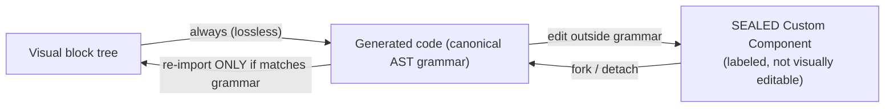

# Flowblok — Frontend Specification Document

## 1. Document control

| Field | Value |
|---|---|
| **Document** | 04-FRONTEND-SPEC.md — Frontend Specification |
| **Product** | Flowblok — the AI website generator that doesn't trap you |
| **Version** | **v1.0 (FINAL)** |
| **Date** | 2026-06-16 |
| **Owner** | Principal Frontend Architect / Product Design |
| **Status** | FINAL — approved for build |
| **Canonical source** | [`_CONTEXT.md`](./_CONTEXT.md) — this doc obeys §3 (tenancy/Space), §4 (16 modules + 7 tabs), §7 (universal binding), §8 (workflow), §14 (design system). **All token/color truth is delegated to [`08-DESIGN-SYSTEM.md`](./08-DESIGN-SYSTEM.md).** |

**Related documents** (cross-reference, keep consistent):

- [`01-PRD.md`](./01-PRD.md) — Product Requirements Document (positioning, personas, phasing, north-star)
- [`02-TECHNICAL-ARCHITECTURE.md`](./02-TECHNICAL-ARCHITECTURE.md) — Technical Architecture (modular monolith, Supabase-as-IdP, records store)
- [`03-SECURITY-AND-ACCESS.md`](./03-SECURITY-AND-ACCESS.md) — Security & Access (roles, RLS keyed on `tenant_id`, 3-layer enforcement)
- [`04-FRONTEND-SPEC.md`](./04-FRONTEND-SPEC.md) — this document
- [`05-FEATURE-TICKETS.md`](./05-FEATURE-TICKETS.md) — Feature Ticket List (FB-001 … FB-068)
- [`06-SRS.md`](./06-SRS.md) — Software Requirements Specification
- [`07-FSD.md`](./07-FSD.md) — Functional Specification Document
- [`08-DESIGN-SYSTEM.md`](./08-DESIGN-SYSTEM.md) — **Design System & Tokens — single source of truth (SSOT)** for the OKLCH ramps, semantic tokens, and machine-readable `tokens` file
- [`_CONTEXT.md`](./_CONTEXT.md) — Canonical Planning Context

> **Token SSOT delegation (authoritative).** This document does **not** define color hex, OKLCH ramps, or the semantic token contract. Those live in **`08-DESIGN-SYSTEM.md`** + its machine-readable tokens file. Where this spec references "neutral step 8" or "accent step 11", that step resolves against the OKLCH ramps in `08-DESIGN-SYSTEM.md`. The legacy practice of token truth living in 4–5 disagreeing files with a precedence tie-breaker is **retired**. The stitch file `docs/stitch/flowblok_os/DESIGN.md` is now a historical mockup only; its Material-You tonal palette (`secondary/tertiary/*-container/surface-tint`) is **deprecated and must not be implemented** — it violates the one-accent rule.

### 1.1 Canonical terminology (applies throughout)

| Term | Meaning |
|---|---|
| **Organization** | Tenant. Top of the hierarchy. DB column `tenant_id`. RLS keys off `tenant_id`. |
| **Space** | The user-facing workspace inside an Organization. DB column `space_id`. App scopes by `space_id`. |
| **Route shape** | `/app/{org}/{space}/…` |
| ~~Workspace~~ | **Retired.** Never appears in UI labels, route segments, JWT claims, component names, or ticket titles. Use **Space**. |

Hierarchy: **Organization (tenant) → Space → { Pages, Content, Database, Workflows, … }.**

---

## 2. Scope, positioning & persona-driven UX

### 2.1 What the frontend is selling (the wedge)

Flowblok's public positioning for the first 18 months: **"The AI website generator that doesn't trap you: prompt → an editable, hosted site with a real database and real APIs. Own your code."** The frontend exists to make the **Phase-1 vertical slice provable in one session**:

```
Generate a page  →  bind a block to a generated table  →  attach a real form→email workflow
                 →  view/fork the code in Developer Mode  →  preview  →  publish to a live URL
```

The 16-module surface (`_CONTEXT.md §4`) is the *end-state*. The funded build front-loads exactly the surfaces that prove the five-layer thesis (Visual + Data + Workflow + Code + AI) on that one slice, plus the **template/clone flywheel** pulled forward into Phase 1–2.

> **"AI Generator first" is GTM framing, not build order.** The generator sits *on top of* the Builder + Data + CMS primitives. The frontend builds the primitives first; the generation entry point is a thin orchestration layer over them. FB-046 (Generate Page) depends on the full builder existing.

### 2.2 Primary persona for the funded build

| Persona | Status | Frontend consequence |
|---|---|---|
| **Agency** | **Primary** (budget, repeat usage, drives the template/clone flywheel) | Full power surface: dense ModernDark, seven-tab inspector, Developer Mode, multi-Space switching, clone/template authoring. |
| **Non-technical** | **Primary activation persona** | **Simple editing mode by default** (§2.3). Never sees code, keys, or DDL. |
| **Developer** | Served (activates with Developer Mode in Phase 1) | "Nothing is locked": code view/fork, Monaco, generated services. |
| **Enterprise** | Served later (Phase 3 — dedicated tier, internal tools) | Same chrome; gated capabilities (dedicated schema, SSO/SAML). |

### 2.3 The non-technical UX default (resolves the KISS-vs-power-user contradiction)

The editor ships **two postures**, selected by the user's role (via the existing role system in `03-SECURITY-AND-ACCESS.md`), with a manual override:

| | **Simple mode (default for Author/Editor/Customer = non-technical)** | **Pro mode (default for Developer/Agency roles)** |
|---|---|---|
| Inspector tabs | **2–3 tabs**: inline text/image editing + **Design (basic)**; everything else collapsed under "More" with progressive disclosure | Full **seven tabs** (Design · Data · Logic · Permissions · Events · SEO · AI) |
| Density | **Comfortable** (40px rows, roomy controls) | **Compact** (32px rows, dense) |
| Theme | Light or dark per user preference; not forced dark | **ModernDark** dense by default |
| Code | Hidden entirely | Developer Mode one toggle away |
| Data/Logic/Permissions/Events | Hidden behind progressive disclosure; AI does the wiring | First-class, always visible |

Mode is persisted per user; an Agency owner can flip a client editor into Simple mode. The default is **Simple** — the activation persona must never face the seven-tab power surface or the dense dark tool on first run.

---

## 3. Design philosophy & north star

**North star (visual):** *"Apple designed a developer operating system."* Flowblok is an engineered surface, not a dashboard with rounded cards and gradients. If a border, label, or card can be removed, it is removed.

**Six adjectives, applied to every screen:**

| Adjective | What it means in the UI |
|---|---|
| **Fast** | Sub-100ms interaction feedback; layout-matched skeletons not spinners; Cmd+K executes instantly; no layout shift. The normalized editor store (§7) is the foundation of the sub-100ms promise. |
| **Quiet** | Neutral chrome, one accent, no decorative motion. Color appears only to carry meaning (status, chart series, the single accent). |
| **Technical** | Mono/tabular numerals on every figure; dense rows; keyboard-first; code is one toggle away (Pro mode). |
| **Premium** | Inter Display headings, layered ModernDark depth, precise 8px rhythm, restrained micro-motion. |
| **Precise** | Pixel-honest alignment, single `--radius` knob, deterministic entity→color maps, AA-verified contrast on the OKLCH ramps. |
| **Minimal** | Border-first cards, shadows only when necessary, asymmetric layouts, no template aesthetics. |

**App default theme = ModernDark** for Pro-mode surfaces (deep near-blacks, single indigo/blue accent, layered depth). Light and high-contrast are first-class alternates. **Simple mode is not forced dark.** The canonical dark-first token ramp is defined in `08-DESIGN-SYSTEM.md`.

**The density doctrine — two postures:**

- **In the app (Pro):** density over whitespace. Power-user tool. Compact rows, tight leading, density toggle. Marketing padding and marketing motion are banned in the app.
- **On marketing/landing:** spectacle is welcome — generous whitespace, 120px section rhythm, the marketing-only animation libraries (§14).

**Inspiration set (product):** Linear, Vercel, Raycast, Stripe Dashboard, Framer, Arc, Notion Calendar. **The Workflow Builder hero** additionally draws on Temporal and GitHub Actions.

---

## 4. Design tokens (delegated to 08-DESIGN-SYSTEM.md)

> **This section is a usage guide, not a token definition.** The canonical OKLCH ramps (neutral 1–12, accent 1–12 for light / dark / high-contrast), the shadcn ~27-var semantic contract, and the machine-readable tokens file are defined **once** in [`08-DESIGN-SYSTEM.md`](./08-DESIGN-SYSTEM.md). Every "step N" reference below resolves there. Never hardcode hex in a component.

### 4.1 The three sealed color domains (never cross them)

Color carries meaning in exactly three namespaces. **A chart color is never reused as a status color.** Saturated red/orange is reserved for waste / error / over-budget only.

| Domain | Purpose | Rule |
|---|---|---|
| **1. UI-semantic** | Chrome, surfaces, text, the one accent | One accent only (indigo/blue). Chrome stays neutral. No rainbows, no gradients in-app. |
| **2. Categorical-chart** | Multi-series chart palettes (`chart-1 … chart-5`) | Color-blind-safe; prefer blue/orange over red/green. Bound only to chart series. |
| **3. Status / pipeline** | State of a thing (`pass`, `pending`, `fail`, `info`, `neutral`) | Always paired with **icon + label** — never color alone. |

### 4.2 Token usage rules (the load-bearing constraints)

- **Authoring:** all tokens authored in **OKLCH** in `08-DESIGN-SYSTEM.md`; consumed as CSS vars via Tailwind v4 `@theme`. Re-theme by overriding the same vars under `:root`, `:root.dark`, `:root.high-contrast`.
- **Dark-first:** the dark ramp is the primary authored ramp; light is the override. `background` never pure `#000`; `foreground` never pure `#FFF` in dark.
- **One `--radius` knob** (`0.75rem` default) derives `sm 60% · md 80% · lg 100% · xl 140%`. Buttons & cards = 8px.
- **Focus ring:** `focus-visible:ring-ring focus-visible:ring-[3px]` mapped to accent step 8.

### 4.3 Typography (per `_CONTEXT.md §14`)

Font: **Inter** (body) + **Inter Display** (headings). Weights **400 / 500 / 600 only — never 700+**. **Mono / tabular numerals** (Geist Mono / JetBrains Mono) for every KPI figure and every numeric table column.

| Role | Size | Weight | Line-height | Tracking |
|---|---|---|---|---|
| **Display** | 64–80px (72 default) | 600 | 0.95 | -0.04em |
| **Heading** | 32–48px (40 default) | 600 | 1.2 | -0.02em |
| **Title** | 20–24px | 600 | 1.3 | -0.01em |
| **Body** | 16px | 400 | 1.6 | 0 |
| **Body-medium** | 16px | 500 | 1.6 | 0 |
| **UI / dense body** | 13–14px | 400/500 | 1.45 | 0 |
| **Label-caps** | 12–13px | 600 | 1.0 | 0.08em (UPPERCASE) |
| **Numerals (KPI/table)** | inherits | 500 | — | tabular (mono) |
| **Code** | 13px | 400 | 1.5 | 0 (mono) |

### 4.4 Spacing, elevation, motion (summary; full scale in `08-DESIGN-SYSTEM.md`)

- **Spacing:** 8px system (4px for dense inset only); gutter 24px; page margin 40px (24px dense); marketing section rhythm 120px; max-width 1200px (marketing) / 1280px (app). Density toggle: row 40px ↔ 32px.
- **Elevation:** border-first. `e1` border only · `e2` border + faint diffuse (hover/selected) · `e3` popover/palette (border-highlight + diffuse + ambient) · `e4` drawer/modal/dragging card (multi-layer + slight accent glow on drag). Never a single flat shadow.
- **Motion:** Micro 120ms (≤4px, ease-out) · Standard 180ms (≤8px, expo-out) · Deliberate 240–300ms (expo-out). Opacity + position only. No bounce/elastic. **All motion gated behind `prefers-reduced-motion`** → instant opacity swaps.

---

## 5. Tech & component stack

| Concern | Library | Notes |
|---|---|---|
| Framework | **Next.js (App Router) + React** | RSC for read-heavy surfaces; per-surface runtime policy (§16) |
| Styling | **Tailwind v4** | Tokens via CSS vars; `@theme` maps OKLCH from `08-DESIGN-SYSTEM.md` |
| Components | **shadcn/ui on Radix Primitives** | Own the source; Radix gives focus trap, Esc-dismiss, ARIA |
| Variants/states | **class-variance-authority (cva)** | Every component encodes variants/states |
| State (editor) | **Zustand** (normalized store, §7.1) | Fine-grained selectors; id-keyed Map; Immer for command apply/invert |
| Server cache | **TanStack Query** | List/detail fetching, optimistic mutations, etag/version conflict handling |
| Dashboard charts | **Tremor** (rides Recharts) | KPI cards, BarList, Tracker, area/line/donut |
| Specialty charts | **Nivo** (per-package) | Calendar, HeatMap, TreeMap, Bump; Canvas variants at scale |
| Bespoke viz | **visx** | Pipeline DAG, dependency-lineage |
| Table virtualization | **TanStack Virtual** | Long data tables; read-only windowed tree outline (§7.5) |
| Command palette | **cmdk** | Cmd/Ctrl+K — executes actions |
| Drag & drop | **dnd-kit** | Custom tree strategy (§7.5), kanban, workflow nodes |
| Icons | **lucide-react** | One consistent set, app-wide |
| Motion | **Framer Motion** | Gated by reduced-motion; product motion budget only |
| In-browser code | **Monaco / VSCode Web** | Developer Mode editor (§6 integration, §11) |
| Realtime (co-edit) | **Yjs** (CRDT) — Phase-2 gated | Phase-1 uses soft-lock + presence (§7.6) |
| Fonts | Inter + Inter Display + Geist Mono / JetBrains Mono | mono for numerals/code |

**Marketing-only libraries** — **Magic UI** (bento, beams, marquee) and **Aceternity** (aurora, spotlight, 3D), plus GSAP / Three.js — **must NOT leak into the operational app**. Enforced via an ESLint import boundary: app routes cannot import from `@/marketing/*` or those packages.

### 5.1 RSC client/server boundary policy

`'use client'`-only libraries — **dnd-kit, Monaco, Framer Motion, cmdk, Tremor** — are forbidden in server components. Enforced via an ESLint boundary rule (`react-server` condition / custom rule): importing any of these from a non-client module is a CI error. See §16 for the per-surface runtime matrix and bundle budgets.

---

## 6. App shell / chrome

**One chrome across every module** — the inverted-L. Drift between modules is the #1 risk for a product spanning builder + dashboards + workflows + CRM + commerce; Linear-style unification is mandatory.

```
┌─────────────────────────────────────────────────────────────┐
│ [≡] Org ▸ Space ▾        Breadcrumbs        ⌘K  🔔 ☾ 👤     │  ← unified header, 56px
├──────────┬──────────────────────────────────────────────────┤
│ SIDEBAR  │                                                    │
│ (collap- │              MODULE VIEW                           │
│  sible)  │                                                    │
│ 16 nav   │                                                    │
│ items    │                                                    │
└──────────┴──────────────────────────────────────────────────┘
```

### 6.1 Top header (56px)

- Height **56px**, "invisible" feel, minimal separators, no boxed menu items.
- Left: sidebar collapse toggle, **Org ▸ Space switcher** (Organization → Space; recent + starred), breadcrumbs.
- Right: **Cmd/Ctrl+K** affordance, notifications, **theme switch (light / dark / high-contrast)**, account menu.
- **Space switching lives ONLY in this header switcher.** There is no nav item that switches Spaces from inside a Space-scoped route (resolves the DRY-chrome defect — see §6.2).
- Module-specific view controls (filters, view switch, density toggle) sit in a thin unified sub-bar directly beneath.

### 6.2 Left sidebar — the 16-item nav

Collapsible and resizable; dimmed; starred/recent/pinned at top. Active state is **subtle**: thin left indicator + soft background + medium-weight (500) text. No boxed items.

> **DRY-chrome fix:** the previous "Spaces" nav item that lived *inside* a Space-scoped route is **removed**. Space switching = header switcher only. The sidebar nav below is purely intra-Space module navigation. An Organization-level "All Spaces" landing exists at `/app/{org}/spaces` (reached from the header switcher or the org dashboard), not as an in-Space sidebar item.

| # | Nav item | Module / target |
|---|---|---|
| 1 | Dashboard | Space overview / role dashboard |
| 2 | Pages | Visual Page Builder entry (FB-017…022) |
| 3 | Content | CMS entries (FB-011…016) |
| 4 | Components | Block/component library + Infinite Components |
| 5 | Database | Visual table builder (FB-023…027) |
| 6 | Workflows | Workflow Builder hero (FB-028…032) |
| 7 | APIs | REST/GraphQL/Webhooks/Swagger (FB-033…036) |
| 8 | CRM | Leads, contacts, deals (FB-037…040 · served later) |
| 9 | Commerce | Products, orders, inventory (FB-041…045 · served later) |
| 10 | AI | Agents, generation, AI SEO/copy (FB-046…050) |
| 11 | Analytics | Dashboards & breakdowns |
| 12 | Marketplace | Templates, plugins, agents (FB-051…054) |
| 13 | Assets | Media library |
| 14 | Users | Users, roles, permissions |
| 15 | Settings | Space & org settings, billing, AI credits, API keys, audit log |
| 16 | Developer | Developer Platform entry (Code viewer/editor, CLI, SDK · FB-055…060), Pro/Developer roles only |

> Note: this is the 16-item module nav of `_CONTEXT.md §4`. The retired "Spaces" item is replaced by **Developer** so the sidebar stays 16 module entries while Space switching moves to the header. CRM/Commerce show a "served later" badge until their phase activates (§17).

### 6.3 Command palette (Cmd/Ctrl+K) — executes, not just searches

The palette is the **primary action surface** and must *do things*:

- **Navigate** — jump to any module / Space / page / record.
- **Execute** — set a block property, move a kanban card, change a workflow node config, toggle Developer Mode, switch theme, publish a page.
- **Trigger AI** — "Generate a pricing page", "Add a contact form bound to Leads", "Explain this workflow".
- **Search** — content, components, tables, assets (semantic where available).

Result rows show icon, label, contextual scope breadcrumb, shortcut hint. Keyboard-first: arrows / J-K to move, Enter to run, Tab to drill into a command's args. Built on **cmdk** inside a Radix dialog.

### 6.4 Theme switch

Three themes, same token vars: **light · dark (default for Pro) · high-contrast**. High-contrast pushes text to step 12, borders to step 8, drops low-contrast muted. Persists per user; respects OS `prefers-color-scheme` on first load. Simple mode honors the user's light/dark preference (not forced dark).

---

## 7. Visual Page Builder (the hero surface)

The signature surface. Three-pane layout, block-based, seven-tab inspector (Pro) / 2–3-tab (Simple), universal data binding. Covers FB-017…022.

### 7.1 Editor state architecture (the foundation of sub-100ms)

> **This is the load-bearing decision for editor performance.** The editor state is a **normalized, id-keyed store** (Zustand + Immer). The nested page JSON is **serialization-only** — it is never the in-memory working representation.

```ts
// In-memory editor store (normalized)
interface EditorState {
  rootId: BlockId;
  nodes: Map<BlockId, BlockNode>;        // flat: every block by id
  childrenOf: Map<BlockId, BlockId[]>;   // adjacency (ordered children)
  parentOf: Map<BlockId, BlockId | null>;
  selection: BlockId[];
  // command stack (see below)
  past: Command[];
  future: Command[];
}

interface BlockNode {
  id: BlockId;
  type: string;                 // layout primitive or component / Infinite Component
  props: Record<string, unknown>;
  bindings: BindingMap;         // Data tab (§7.4)
  events: EventMap;             // Events tab
  permissions: PermissionMap;   // Permissions tab (UI-hide only)
  seo: SeoMeta;
  ai: AiMeta;
  componentRef?: { masterId: string; version: number }; // Infinite Components (§7.7)
  custom?: { sealed: true; codeHash: string };          // sealed Custom Component (§7.3)
}
```

**Why normalized:**

- **Fine-grained selectors** — a prop edit re-renders exactly one node, not the tree. Each rendered block subscribes to `nodes.get(id)` via a Zustand selector with referential equality; siblings and ancestors do not re-render.
- **O(1) structural ops** — move/insert/delete touch only adjacency maps, not a deep clone of nested JSON.
- **Serialization is a pure fold** — `serialize(rootId)` walks `childrenOf` to emit the `{ id, blocks: [{ type, props, children }] }` page JSON (`_CONTEXT.md §9`) for save/publish. The wire format and the working format are deliberately different.

**Command / transaction model (undo/redo):**

```ts
interface Command {
  apply(state: EditorState): void;   // mutate via Immer draft
  invert(state: EditorState): void;  // exact inverse
  coalesceKey?: string;              // debounce-merge key (e.g. "prop:blockId:fontSize")
  label: string;                     // for history UI
}
```

- Every mutation (move, edit prop, bind, delete, paste) is a `Command` with an exact `invert`.
- **Debounce coalescing:** rapid same-prop edits (typing in a number field, dragging a slider) merge into one history entry via `coalesceKey` + a trailing debounce, so undo steps are meaningful, not per-keystroke.
- `Cmd/Ctrl+Z` / `Cmd/Ctrl+Shift+Z`. Undo is **per-user** (see §7.6).
- Optimistic apply locally; persistence is a separate concern (§7.6 conflict model).

### 7.2 Three-pane layout

```
┌────────────┬───────────────────────────────┬───────────────┐
│ PAGE TREE  │   VISUAL EDITOR (preview)      │  PROPERTIES   │
│ (left)     │                               │  (right)      │
│            │  [Desktop] [Tablet] [Mobile]  │  Simple: 2–3  │
│ Page       │   ┌─────────────────────────┐ │  Pro: 7 tabs  │
│ ├ Section  │   │  shared block-renderer  │ │  Design       │
│ │ ├ Row    │   │  in an <iframe>;        │ │  Data         │
│ │ │ └ Comp │   │  edits flow via         │ │  Logic        │
│ │ └ Column │   │  postMessage (no net)   │ │  Permissions  │
│ └ Section  │   └─────────────────────────┘ │  Events/SEO/AI│
└────────────┴───────────────────────────────┴───────────────┘
```

- **Left — Page Tree:** structural outline `Page → Section → Row / Column / Component`. Drag to reorder/nest (§7.5), click to select (syncs canvas + properties), inline rename, show/hide, lock, search/filter (FB-017). Rendered from `childrenOf` adjacency, memoized rows.
- **Center — Visual Editor:** live, editable rendering inside an iframe via the **shared block-renderer** (§7.4). Responsive preview toolbar (Desktop / Tablet / Mobile + custom width · FB-019). Selecting a block highlights it in tree + loads it in properties. Inline text editing; on-canvas drag handles, resize, "+" insert affordance between blocks.
- **Right — Properties:** the inspector — **seven tabs in Pro mode, 2–3 in Simple mode** (§2.3, §7.8). Collapsible, contextual, lightweight.

### 7.3 Visual ↔ Code: one-way by default + sealed Custom Component (resolves RISK-02)

> **The moat mechanic is reframed honestly.** Symmetric round-trip of arbitrary edited React back into a block tree is an undecidable, research-grade problem. Flowblok does **one-way generation + a controlled escape hatch**, not symmetric round-trip.



**The boundary — exact edit classes:**

| Edit class | Round-trips to Visual? | Mechanism |
|---|---|---|
| Prop value change, reorder, add/remove a known block | **Yes** | Stays in the normalized tree; code is regenerated. |
| Code edit that still matches the generator's **lossless canonical AST grammar** (known block types, known prop shapes, structured markers intact) | **Yes** | Parser re-imports against the grammar; structured markers + per-block `codeHash` validate identity. |
| Any edit outside the grammar (arbitrary JSX, new imports, custom hooks, hand logic) | **No → sealed** | The block becomes a **Custom Component**: clearly labeled in tree + canvas, no longer visually editable, edited only in Developer Mode. |

**Identity & safety:**

- Each generated block carries **structured markers + a manifest** (block id, type, version) and a **content-hash** of its canonical source.
- On re-import, hash mismatch outside the grammar → seal, never silently re-parse.
- **Per-artifact ownership:** the generator **never silently regenerates over hand edits.** Regeneration diffs and surfaces conflicts; sealed Custom Components are preserved untouched.
- **RISK-02 is a Phase-1 go/no-go spike** (was a footnote): prove the lossless grammar + re-import on the narrow Phase-1 block set before committing the round-trip UX. If the spike fails the bar, ship one-way + seal only.

### 7.4 Live preview & the shared block-renderer (resolves the preview contradiction)

> **Contradiction resolved.** Architecture §9.2 said "iframe re-renders via the published API"; this spec previously said "client-side after hydration." Both are wrong as a round-trip path. **WYSIWYG parity = same renderer + same data, NOT same request path.**

**The model:**

- A single **framework-agnostic block-renderer package** (`@flowblok/renderer`) renders a block tree to DOM. It is consumed by **both** the editor canvas (inside the iframe) **and** the published site. Same code → same pixels.
- The editor hosts the renderer in an **`<iframe>`**. Editor → iframe communication is **`postMessage`** (Storyblok / Builder.io bridge pattern), **with no network round-trip** for edits.
- On a prop/structure change, the editor posts a **patch** (the affected `BlockNode`(s)) to the iframe; the iframe applies it to its renderer instance and re-renders the affected subtree only.

**postMessage protocol (documented contract):**

| Direction | Message | Payload |
|---|---|---|
| editor → iframe | `INIT` | `{ tree, theme, mode, sampleData }` |
| editor → iframe | `PATCH_NODE` | `{ id, props?, childrenOf?, bindings? }` |
| editor → iframe | `SELECT` | `{ id }` (highlight overlay) |
| editor → iframe | `SET_BREAKPOINT` | `{ width }` |
| iframe → editor | `READY` | `{}` |
| iframe → editor | `BLOCK_CLICKED` | `{ id, rect }` (selection sync) |
| iframe → editor | `INLINE_EDIT` | `{ id, prop, value }` (debounced; becomes a Command) |
| iframe → editor | `MEASURE` | `{ id, domNodeCount }` (perf budget telemetry) |

Origin-locked, schema-validated messages only. The published site uses the same renderer fed from the published data API (the network path) — that path is for *runtime*, never for editor edits.

### 7.5 Drag-drop architecture (dnd-kit over the normalized tree)

> **A real nested-tree DnD architecture, not raw `SortableContext` nesting.** `SortableContext` does not model arbitrary nested trees; nesting it is the documented anti-pattern that produces janky drops and O(n) re-renders.

**Design:**

- **Single flat `DndContext`** over the whole tree. Drop targets are derived from the normalized `childrenOf`/`parentOf` maps, **not** nested sortable contexts.
- **Custom collision / drop-zone strategy:** a `closestEdge`-style resolver computes, for the pointer position, the target parent + insert index (before/after/inside) by hit-testing memoized row rects. Container rules (`canDrop(parentType, childType)`) reject invalid nests (e.g. Section inside a leaf Component).
- **`DragOverlay`** renders the dragged node; **rows are memoized** (`React.memo` keyed on node version) so only the over/active rows re-render during a drag.
- **Keyboard sensor** for a11y: arrow keys move the focused node; Space picks up / drops; nested moves announced via a live region ("Moved Button into Hero, position 2 of 3").
- A drop commits a single `MoveCommand{ apply, invert }` mutating only the adjacency maps.

**Performance budget & virtualization reconciliation:**

| Surface | Budget | Strategy |
|---|---|---|
| Editable page tree | **60fps to ~1,000 nodes** | Non-virtualized to budget (DnD + virtualization conflict); memoized rows. |
| Tree beyond ~1,000 nodes | degrade gracefully | **Windowed read-only outline** (TanStack Virtual); editing requires expanding a windowed branch. |
| Data tables (Content/CRM/Commerce/Query results) | smooth at 100k+ rows | **TanStack Virtual** (named), not DnD. |

`domNodeCount` from the iframe `MEASURE` message feeds the budget; exceeding it raises an editor warning (§13).

### 7.6 Real-time collaboration model (decided now — it dictates the store)

> **Phase-1 model (minimum viable, decided):** per-page **soft lock + presence + optimistic-with-conflict-detection.** True co-editing (CRDT) is Phase-2, gated.

**Phase 1:**

- **Soft lock per page:** when a user opens a page in the builder, a soft lock + presence avatar shows who else is here. A second editor enters **read-only with a "request edit / take over" affordance** (not a hard block).
- **Version/etag on the page record:** every save carries the version it was based on. The server **rejects a stale `PUT`** (412) and returns the current version.
- **Patch/diff, never whole-tree overwrite:** saves send the changed `BlockNode`s (a diff derived from the command stack since last save), not the full tree. This makes conflicts narrow and resolvable.
- **Undo is per-user** — the command stack is local; a remote save does not enter your undo history.

**Phase 2 (gated, Yjs):** if true concurrent co-editing is greenlit, the normalized store is **already CRDT-ready** — `nodes`/`childrenOf` map cleanly to Yjs `Y.Map`/`Y.Array`. Mandate Yjs from the start of that work; do not bolt OT on later.

### 7.7 Component versioning (Infinite Components: instance vs master)

> Infinite Components (`_CONTEXT.md §0`) are AI-generated reusable components. Instances must survive master changes safely.

- **Versioned prop schema:** each master component has a `version` and a typed prop schema.
- **Instances pin a version** (`componentRef.version`). A master edit **creates a new version** + a **migration mapping** old props → new props.
- **Affected-instance preview:** changing a master shows how many instances are affected and a before/after preview per breaking change; the author chooses migrate-now / migrate-on-touch / leave-pinned.
- **AI regeneration diffs the schema** and surfaces breaking changes (renamed/removed props) rather than silently dropping data.
- This reuses the same **schema-as-code review machinery** as the Database Builder (§8) and the dry-run/diff gate.

### 7.8 The block inspector tabs

**Pro mode — the seven tabs** (mandated by `_CONTEXT.md §4/§14`: every block/page exposes these):

| Tab | Contains |
|---|---|
| **Design** | Layout (size, spacing, align, flex/grid), typography overrides, color (semantic tokens only), border/radius, background, per-breakpoint visibility, animation (gated motion budget · FB-022), theme binding (FB-021). |
| **Data** | The **universal data-binding UI** (§7.9) — bind any prop to Static / Database / API / Workflow / AI / CRM / Commerce / Search and visually map fields. |
| **Logic** | Conditional rendering (show if…), loops/repeaters (one block per bound row), state & computed values, simple expressions — no code unless Developer Mode. |
| **Permissions** | Role-based visibility/edit gating (Owner…Guest + capability flags). Mirrors `03-SECURITY-AND-ACCESS.md`; **UI-layer hide only — backend + RLS still enforce.** |
| **Events** | Trigger → action wiring: onClick / onSubmit / onView → Navigate · Run Workflow · Create DB Record · Create CRM Lead · Send Email · Call API · Webhook · Trigger AI. Form-submit targets are interchangeable (DB / Workflow / Zoho / HubSpot / Salesforce) per `_CONTEXT.md §8`. |
| **SEO** | Per-block/page meta (title, description, OG/Twitter, canonical, structured data), slug, sitemap inclusion, **AI SEO** suggestions inline. |
| **AI** | Per-block AI actions: regenerate, rewrite copy (AI Copywriter), restyle, "explain", suggest variants. Context = this block + page + schema. |

**Simple mode** surfaces **Edit (inline text/image)** + **Design (basic)** and an optional **More…** disclosure; Data/Logic/Permissions/Events/SEO/AI are wired by AI and hidden unless the user is upgraded to Pro. See §2.3.

### 7.9 Universal data-binding UI (zero-code)

Mandated by `_CONTEXT.md §7`. On the **Data** tab, any bindable prop opens the binder:

1. **Choose source:** `Static | Database | API | Workflow | AI | CRM | Commerce | Search`.
2. **Pick collection/table** (e.g. Database → `products`) via a searchable picker. Tenant "tables" resolve against the **JSONB records store** (`tenant_id + space_id + collection_id`), not physical per-tenant DDL (`02-TECHNICAL-ARCHITECTURE.md`).
3. **Fields auto-load** from the selected source's schema.
4. **Visual field mapping** — two-column panel (block slots ↔ source fields): *Card Title ← Product.title*, *Price ← Product.price*, *Image ← Product.image*.
5. **Filters / sort / limit** for collections; **params** for API/Workflow; **prompt** for AI.

The system silently generates data access (e.g. `await db.products.findMany()`); the user never sees it unless they toggle **Developer Mode** (§11).

### 7.10 Binding resolution & preview data policy (protects prod + AI credits)

> Editing must never hammer production or burn AI credits.

| Concern | Policy |
|---|---|
| **Batching** | Bound queries resolved through a **DataLoader** — coalesce + batch within a render tick; **one query per repeater**, never one fetch per row. |
| **Repeaters** | A repeater issues a single bounded query (limit + page) for the whole list; rows render from that one result set. |
| **AI-bound props** | **Never live-resolved in preview.** Show a representative **sample value + an "AI" badge**; real generation runs only on explicit action or at publish. This is the credit-safety rule. |
| **Row caps** | Preview enforces a hard row cap (e.g. 50) with a "+ N more at runtime" affordance. |
| **Sample / mock mode** | A **mock/sample-data mode** lets the editor render bound blocks against generated sample rows so editing doesn't touch prod data at all; toggle to "live (sampled)" to pull capped real rows. |
| **Caching** | Preview reads cached via TanStack Query with short TTL; debounced on binder edits. |

### 7.11 Version history (FB-015)

Named/auto snapshots, side-by-side diff, restore; draft → review → published states (FB-014). Content versioned via copy-on-write / audit tables (`_CONTEXT.md §9`). **Never auto-publish** — preview before deploy; a generation→refinement loop supports partial regeneration ("keep my edits, restyle the rest") and a "what the AI assumed" editable panel (`_CONTEXT.md` AI decisions; FB-046).

---

## 8. Database Builder UI

Visual table modeling, Strapi-style. Covers FB-023…027.

> **Storage reality (per `02-TECHNICAL-ARCHITECTURE.md`):** tenant-defined "tables" are rows in a generic **JSONB records store** (`tenant_id + space_id + collection_id + payload + GIN indexes`), **not** physical per-tenant DDL. The Database Builder is a UI over that store. Real DDL is reserved for the ~40 platform Phase-1 tables and the Enterprise dedicated-schema tier.

- **Tables canvas:** each table is a card listing fields (name · type · constraints). Drag to arrange; **drag a field to another table to create a relation** (1—1, 1—*, *—* with junction auto-suggested). Thin, cardinality-labeled relation lines.
- **Field editor (FB-024):** type picker (text, number, boolean, date, enum, JSON, relation, media, rich-text), required/unique/default/validation, index toggle. Inline, no modal-heavy flow.
- **Relations (FB-025):** visual connector + config popover (on delete: cascade/restrict/null; mapped field name).
- **Indexes (FB-026):** index management per table; composite indexes via multi-field select (map to GIN expression indexes on the JSONB payload).
- **Schema-as-code & the dry-run gate:** every change previews the **generated migration diff** before apply.
  - **Platform migrations** (the ~40 tables) go through Git / CI / human review.
  - **Runtime tenant schema-evolution** (records-store collection changes) is online, lock-aware, no human PR — but **generated DDL/schema changes NEVER auto-apply**: a **dry-run + diff gate** is mandatory.
  - Auto-generates REST/GraphQL/Swagger for the collection (links to APIs module).

**Query Builder (FB-027):** visual composer — pick table → filters (field/op/value, AND/OR groups) → select fields → sort → limit → joins via relations. Live result preview (mono numerals, density toggle, TanStack Virtual). A "Show SQL/Prisma" toggle reveals the generated query (Developer Mode). Saved queries are reusable data sources in the binder (§7.9).

---

## 9. Workflow Builder UI (engineering-tool feel)

The most "engineering" surface — Linear / Figma / Temporal / GitHub Actions, **not** a colorful no-code toy. Covers FB-028…032. Engine is the n8n/Boomi-inspired abstraction (never expose n8n directly · `_CONTEXT.md §8`). Phase 1 ships **Flow Core** (trigger + a small action set, the form→email slice); the full engine is Phase 2 (§17).

### 9.1 Canvas (themed token, not hardcoded)

> **Fix:** the canvas is **not** a hardcoded `#0A0A0A`. It is a **fourth themed token context** authored in OKLCH in `08-DESIGN-SYSTEM.md` (`--wf-canvas`, `--wf-grid`, `--wf-connector`, `--wf-node-surface`).

- The canvas defaults to a **deep neutral** matching the dark ramp, but **honors `prefers-contrast` / high-contrast**: line and connector contrast are raised, node/status colors are re-mapped so every node label and status meets **AA on whatever surface** is active.
- **Subtle grid**, pan/zoom, snap. **Thin connection lines** (1px, neutral; animated dash only during an active run, gated by reduced-motion). No neon, no cartoon styling.
- Minimap + zoom controls in a corner, quiet.

### 9.2 Node card anatomy

```
┌───────────────────────────┐
│ [icon] Node title    [⋮]   │  ← type icon (lucide) + title + menu
│ short config summary line  │  ← e.g. "POST /api/orders"
│ ● in            out ●      │  ← thin connection ports
└───────────────────────────┘
   status dot: idle/running/ok/fail  (status domain + icon + label)
```

Border-first, minimal shadow, status via the status color domain **+ icon + label** (never color alone), AA-verified on `--wf-node-surface`.

### 9.3 Node palette

From `_CONTEXT.md §8`: **Trigger · Condition · Loop · API · Database · Email · SMS · Webhook · AI · CRM · Payment · Custom Code.**

- **Triggers:** form submission · order completed · post published · scheduled time (cron · FB-031).
- **Actions:** HTTP · Email/SMS · wait/delay · condition branch · loop · DB read/write · call CRM API · payment · run AI · custom code.

Searchable left rail; drag a node onto canvas (dnd-kit · FB-030); triggers (FB-029) are visually distinct entry nodes. **Phase-1 Flow Core** exposes Trigger (form/schedule), Condition, Email, DB, Webhook, AI — the form→email slice; the rest activate in Phase 2.

### 9.4 Config panels & runs

- **Config panel** (right Radix drawer): per-node typed fields; references to prior nodes via a `{{ node.output }}` picker; per-node test-run.
- **Run / Logs view (FB-032):** runs list (status pill + duration + timestamp, mono numerals) → click a run for a stage-by-stage **inspectable timeline** (color-blocked per node, WakaTime-style durations) with input/output payloads, errors, retries. Stored as versioned JSON node graph; deployable across environments; packageable as reusable "micro-apps."

---

## 10. Dashboards & analytics

WakaTime three-tier pattern, Tremor-first, strict semantic color, progressive disclosure (Stripe). Covers Analytics + Space/role dashboards.

### 10.1 Three-tier layout (every dashboard)

1. **Lead with one health metric** for the persona.
2. **KPI row** — Tremor KPI cards: **big number (mono) + signed % delta + sparkline.** NumberTicker on change (240ms, gated).
3. **Full-width time-series** (area/line + target ReferenceLine).
4. **Grid of horizontal-bar breakdown cards** — all rendered by ONE **Universal Breakdown** component fed `{ label, value, percent, color }`; horizontal bar lists, **never pie charts** for ranked breakdowns. Deterministic entity→color map.
5. **Calendar heatmap** (year grid) where relevant.

### 10.2 Role dashboards

| Role | Leads with | Then |
|---|---|---|
| **CEO** | Org health grade (A–F) + headline % / Waste% | spend/usage trend, value-per-shipped, adoption |
| **CTO** | Efficiency + **risk HeatMap** | per-repo/per-model breakdowns, DORA-style KPIs, optimize findings |
| **Manager** | Team flow (cumulative-flow) | per-member/feature breakdown, Top-5 outliers, throughput Bump |
| **Dev** | Own activity (sessions, queue) | activity Calendar, assigned items, personal breakdowns |

### 10.3 Activation & north-star instrumentation (the frontend must emit)

> Per the canonical metrics decision. The frontend is responsible for emitting the events that define activation and the north-star — these are not vanity first-session-publish metrics.

- **Activation (within 7 days of Space creation):** ran a generation **AND** made ≥1 manual edit to a generated block **AND** published to a live URL. The editor emits `generation.ran`, `block.manual_edit`, `space.published` with `space_id` + `tenant_id`.
- **North-star:** weekly count of Spaces that are both **live** (reachable URL) **AND edited** in the trailing 7 days.
- **Layer Depth metric:** the editor tags each edit with which of the five layers it touched (Visual / Data / Workflow / Code / AI) so we can report **distinct layers edited per Space in 30 days** — verifying the five-layer moat is actually used.
- **State model surfaced in UI:** Space cards show state (Created → Activated → Engaged → Retained → Paying).

### 10.4 Chart → library map

| Metric / viz | Chart type | Library |
|---|---|---|
| KPI (number + Δ + sparkline) | KPI card + sparkline | Tremor |
| Time-series / DORA-style | line / stacked-area + ReferenceLine | Tremor / Recharts |
| Ranked breakdown | horizontal BarList | Tremor |
| Cost / spend nested | TreeMap + BarList | Nivo + Tremor |
| Risk matrix | HeatMap (sequential single-hue) | Nivo |
| Activity over a year | Calendar heatmap | Nivo |
| Leaderboard / rank-change | BarList / Bump | Tremor / Nivo |
| Pipeline / gate flow | cumulative-flow / funnel · Tracker | Tremor / visx |
| Composed / pipeline DAG | bespoke | visx |

**Render-mode ceiling (measured, not a flat number):** Tremor/Recharts are SVG; the limit is a **measured DOM-node budget** per chart, not a flat "5K points." When a chart's projected node count exceeds the budget, switch to **Nivo Canvas** variants — **and** provide an **accessible data-table fallback** so Canvas mode keeps keyboard navigation and tooltips reachable (axe-verified). Install only the `@nivo/*` packages used.

---

## 11. Developer Mode (Visual ↔ Code)

A toggle (header / Cmd+K) on any builder that reveals the generated code. Covers FB-055/056. **"Nothing is locked"** (Developer/Agency). Gated off for Simple-mode roles.

**Surfaces revealed (all editable, Monaco):**

| Visual surface | Code surface revealed |
|---|---|
| Page / block | **React/TSX component** for the page + block props |
| Data binding | generated query / data-access (`db.x.findMany()`) + generated **service / controller** |
| Workflow | **Workflow JSON / YAML** node graph |
| API | **API definition** (REST route / GraphQL schema / OpenAPI) |
| Database | **schema diff** (records-store collection change or platform Prisma migration) |

### 11.1 Monaco integration (concrete)

> Monaco is a `'use client'`-only library (§5.1) and a large dependency — it is integrated deliberately.

- **Lazy-loaded behind Developer Mode** — never in the default app bundle; dynamically imported on first toggle, in its own async chunk (§16).
- **Worker configuration** for the chosen bundler under the App Router: Monaco's editor/JSON/TS workers are configured via `MonacoEnvironment.getWorker` pointing at bundler-emitted worker URLs (Next.js + Turbopack/webpack worker plugin); workers are same-origin.
- **CSP / `worker-src` plan:** CSP includes `worker-src 'self' blob:` (Monaco spawns workers, some via blob URLs); `script-src` does not need `unsafe-eval`. Documented in `03-SECURITY-AND-ACCESS.md` CSP.
- **IntelliSense fed per-Space types:** the generated **per-Space `d.ts`** (collection types, generated query signatures, component prop types) is fed via `monaco.languages.typescript.typescriptDefaults.addExtraLib(...)` so the user gets accurate autocomplete for *their* schema.
- 13px mono, dark by default, diff view, multi-file tabs.

### 11.2 Round-trip behavior (per §7.3)

- **One-way by default:** edits inside the canonical grammar reflect back to the visual surface; edits outside it **seal** the block as a labeled Custom Component (§7.3) — not silently re-parsed.
- **Per-artifact ownership:** regenerate never overwrites hand edits silently; conflicts surface a non-destructive prompt; sealed components are preserved.
- Read-only for roles without the `Access APIs` / code capability; editing gated by role (§13 + `03-SECURITY-AND-ACCESS.md`).

---

## 12. Core component inventory

All on shadcn/ui + Radix; variants/states via cva; overlays on Radix. Every component specifies the full state set: **hover · focus-visible (ring step 8) · active · drag · loading (skeleton) · empty · error · success · disabled.**

| Component | Variants | Key states / notes |
|---|---|---|
| **Button** | default / secondary / outline / ghost / destructive / link · xs/sm/default/lg/icon | 36–40px, 8px radius, minimal shadow; loading = inline dot + disabled; focus ring 3px |
| **Input / Select / Textarea** | text/number/search/password · select/combobox | subtle border, quiet focus (ring step 8); error = red border + icon + helper; success tick; loading skeleton |
| **Card** | default / interactive / stat | border-first; shadow only on hover/drag; e1→e2 on hover |
| **Table** | default / dense | primary data surface; sticky header; mono numeric columns; row hover/selected; **TanStack Virtual** for long lists; skeleton rows; empty + error; multi-select batch bar |
| **Panel / Drawer** | left/right/bottom · collapsible | Radix dialog/drawer; 240ms slide gated |
| **Modal** | confirm / form / fullscreen | Radix Dialog; focus trap; Esc-dismiss; used sparingly |
| **Status pill** | pass/pending/fail/info/neutral | status color **+ icon + label** (never color alone) |
| **KPI card** | default / with-sparkline | big mono number + signed % delta + sparkline; NumberTicker on change |
| **Universal Breakdown row** | bar / stacked | `{label, value, percent, color}` → horizontal bar; deterministic color; mono percent |
| **Kanban card** | compact / detailed | id + title + status pill + priority + avatar; drag state (e4 glow) |
| **Command palette** | — | cmdk in Radix dialog; **executes**; keyboard-first |
| **Toast** | info / success / warning / error | auto-dismiss; action button; icon + label |
| **Tabs** | line / segmented | inspector tabs; underline indicator |
| **Tree** | page tree | drag-nest (§7.5), inline rename, show/hide/lock, keyboard moves |
| **Skeleton** | block / row / card / chart | **layout-matched, never spinners** |
| **Binder** | source picker + field-map | universal data binding (§7.9); sample/AI badge states |
| **Sealed Custom Component** | — | labeled, non-editable-in-canvas marker (§7.3); "edit in Developer Mode" affordance |

**Mandatory state examples:** loading = layout skeleton; empty = teaching empty state + primary action; error = recoverable inline error pill; success = quiet toast + state change.

---

## 13. Responsive & accessibility

### 13.1 Responsive editor strategy

> The builder is a desktop-class power tool. We separate **editor-chrome breakpoints** from the **previewed-page breakpoint** (the latter is the responsive preview of the *built site*, set in the canvas toolbar — independent of the editor's own layout).

| Breakpoint | Width | Editor-chrome behavior |
|---|---|---|
| `< lg` | < 1024 | **Builder is preview/inspect-only** with an explicit **"edit on a larger screen"** affordance. Not a degraded drawer editor. Non-builder app screens stack to single-pane. |
| `lg` | 1024–1280 | **Full editing enabled.** Inverted-L; three-pane builder with collapsible side panes. |
| `xl` | ≥ 1280 | App max-width 1280px; comfortable/compact density available. |

- Sidebar: expanded ↔ icon-rail ↔ hidden (auto by width; manual toggle persists).
- **Touch targets ≥ 44×44px** in touch contexts; density toggle never shrinks below.
- The **previewed-page breakpoint** (Desktop/Tablet/Mobile/custom) is visually distinct from editor chrome — a labeled device frame in the canvas, never confused with the app shrinking.

### 13.2 Accessibility (WCAG AA minimum)

- **AA contrast** verified on the OKLCH ramps (`08-DESIGN-SYSTEM.md`) — especially muted-on-muted, chart-on-card, and the **workflow canvas** node/connector contrast across normal **and** high-contrast.
- **Full keyboard nav:** `J/K` next/prev, arrows in trees/canvas/tables, `Cmd/Ctrl+K` palette, `Ctrl+[` back/collapse, `Esc` dismiss, `Tab` order honored, visible focus ring (step 8, 3px). **Keyboard nested moves** in the page tree (§7.5).
- **Never state-by-color-alone** — status/severity always color + icon + label.
- **Canvas-mode charts** keep keyboard + tooltip a11y via an **accessible data-table fallback**.
- **Radix Primitives** supply roles, focus trap/return, ARIA.
- **`prefers-reduced-motion`** gates all motion → instant opacity swaps. **`prefers-contrast`** honored, including the workflow canvas.
- Screen-reader labels on icon-only buttons; live regions for async results (saves, runs, AI generation, DnD moves).

---

## 14. Marketing / landing mode

Separate posture — spectacle is welcome *here and only here*. The public wedge messaging (§2.1) leads; the 16-module DXOS vision is an internal appendix, not the landing headline.

- **31-style catalog** in `docs/design/landing/`. Pick one style per campaign; keep the **product** on one system, let **landing** express range.
- **Storytelling:** Attention → Curiosity → Trust → Value → Proof → Desire → Conversion. 120px rhythm, 1200px max width, Display 64–80px.
- **Spectacle libs (landing routes only, never `/app`):** Magic UI, Aceternity, GSAP, Three.js.

**Stitch variants and their use** (`docs/stitch/`):

| Variant | Use |
|---|---|
| **Flowblok OS** (mono + blue) | App reference mockup (historical; tokens now live in `08-DESIGN-SYSTEM.md`) |
| **Professional Visual Development System** (5-accent) | Marketing — developer/platform landing |
| **Teal Precision** (teal accent) | Marketing / alt theme |
| **Minimalist Community** (warm teal) | Marketing / alt theme |

---

## 15. Editor quality (test & verification gates)

> The editor is the moat surface; its correctness is enforced in CI, not by hope.

| Gate | What it covers |
|---|---|
| **Playwright e2e** | Drag-nest into containers; undo/redo coalescing; binding a block to a collection; form→email workflow wiring; publish-to-URL happy path. |
| **Golden-file snapshots** | Visual→Code generation output; Code→Visual re-import for in-grammar edits; **seal behavior** for out-of-grammar edits (asserts the block becomes a labeled Custom Component, not a silent re-parse). |
| **Visual regression** | Per-theme screenshots (light / dark / **high-contrast**), including the workflow canvas. |
| **axe-core a11y** | Per surface (builder, dashboards, workflow canvas, Developer Mode, Canvas-chart fallback). |
| **Perf budgets** | DnD 60fps to ~1,000 nodes; bundle size gate (§16); `domNodeCount` budget from the iframe. |
| **RISK-02 spike** | Phase-1 go/no-go: lossless grammar + in-grammar re-import on the narrow block set (§7.3). |

---

## 16. Frontend performance, bundle budgets & runtime policy

### 16.1 Bundle budgets (CI-enforced)

Each heavy surface is an **async chunk**, lazy-loaded; the app shell stays lean.

| Chunk | Budget (gzip) | Loading |
|---|---|---|
| **App shell** (chrome + nav + palette) | **< 250 KB** | eager |
| Builder (canvas + dnd-kit + renderer host) | own chunk | lazy on `…/pages/{id}/build` |
| Monaco (Developer Mode) | own chunk | lazy on Developer Mode toggle (§11.1) |
| Workflow canvas | own chunk | lazy on Workflows |
| Charts (Tremor/Nivo/visx) | own chunk(s) | lazy on Analytics/dashboards |

A **CI size gate** fails the build if the shell exceeds budget or a forbidden lib lands in it.

### 16.2 RSC client/server boundary (ESLint-enforced)

`'use client'`-only libs — **dnd-kit, Monaco, Framer Motion, cmdk, Tremor** — are **forbidden in server components** via an ESLint boundary rule (CI error). Marketing spectacle libs are forbidden in `/app` (§5).

### 16.3 Per-surface runtime

| Surface | Runtime |
|---|---|
| Marketing / landing | **SSG / ISR** |
| Dashboards (read-heavy) | **Node SSR** under a thin RSC shell |
| Builder / editor | **client island** under a thin RSC shell (hydrates, then `postMessage`-driven · §7.4) |
| Personalized pages | **Node SSR** (not edge — needs DB + auth context) |

### 16.4 Other levers

| Lever | Practice |
|---|---|
| **Loading states** | Layout-matched skeletons, never spinners. |
| **Chart ceilings** | Measured DOM-node budget → Nivo Canvas + accessible table fallback (§10.4). |
| **Images** | `next/image`, responsive `srcset`, AVIF/WebP, lazy below-fold; Assets serves transformed CDN variants (S3/R2). |
| **Interaction budget** | < 100ms feedback (normalized store + postMessage patches · §7.1/§7.4); optimistic UI with rollback; debounced binder/query previews. |
| **Motion cost** | Off the drag/scroll hot path; reduced-motion gated; opacity+transform only. |
| **Data** | Virtualize long tables/trees (TanStack Virtual); DataLoader-batched bindings (§7.10); paginate CRM/Commerce; TanStack Query / RSC cache. |

---

## 17. Phase mapping (frontend surfaces)

Build order is primitives-first; "AI Generator first" is GTM framing (§2.1). Phase assignments below align with the authoritative phase matrix in `_CONTEXT.md` / `01-PRD.md`.

| Surface | Phase | Notes |
|---|---|---|
| App shell, chrome, palette, theme system | **1** | Inverted-L, header Space switcher, 16-item nav |
| Visual Page Builder + 7-tab inspector + Simple mode | **1** | FB-017…022; normalized store; one-way Visual→Code + seal |
| Universal data binding + records-store binder | **1** | FB binding UI; sample/AI-badge preview policy |
| Database Builder + Query Builder | **1** | FB-023…027 over JSONB records store |
| Workflow **Flow Core** (form→email slice) | **1** | FB-028…032 subset; full engine → Phase 2 |
| Developer Mode + Monaco | **1** | FB-055/056; lazy chunk; per-Space `d.ts` |
| AI Generate Page + refinement loop + quality gate | **1** | FB-046; narrow templated surface; **FB-048 AI-Generate-Database cut from Phase 1** |
| Template/clone flywheel (Spaces clone, template authoring) | **1–2** | Pulled forward; the network-effect moat |
| Dashboards / Analytics, role views | **1–2** | Activation + north-star + Layer-Depth instrumentation |
| CRM, Commerce surfaces | **2 (served later)** | FB-037…045; "served later" badge until activated |
| Marketplace, AI Agents, Enterprise (dedicated schema, SSO) | **3** | FB-051…054; Yjs co-editing gated here |

---

*End of 04-FRONTEND-SPEC.md — v1.0 (FINAL), 2026-06-16.*
