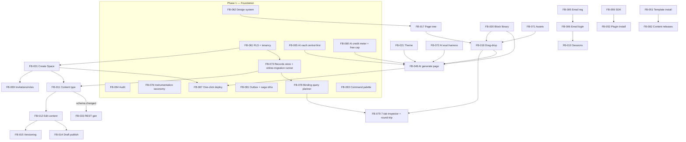

# Feature Ticket List

> Groomed delivery backlog for **Flowblok**: 12 canonical epics, tickets FB-001 … FB-068
> (canonical backbone FB-001…FB-060 + foundational additions FB-061…FB-068), plus newly
> identified foundation/integration tickets **FB-069 … FB-082**. This document is finalized
> against the GLOBAL DECISIONS of the expert crew and the per-document change memo. It stays
> 100% consistent with `_CONTEXT.md` — the single source of truth for IDs, titles, names,
> numbers, tiers, tokens, and product decisions.

---

## 1. Document control

| Field | Value |
|---|---|
| **Document** | 05-FEATURE-TICKETS.md — Feature Ticket List |
| **Product** | Flowblok — AI website generator that doesn't trap you (AI-Native Visual Business OS) |
| **Version** | **v1.0 (FINAL)** |
| **Date** | 2026-06-16 |
| **Owner** | Delivery Lead / Product Owner |
| **Status** | Final — approved for estimation and sprint loading |

**Related documents (cross-reference by filename):**

| File | Purpose |
|---|---|
| `01-PRD.md` | Product Requirements Document (positioning, personas, phases, success metrics, goals G1–G5) |
| `02-TECHNICAL-ARCHITECTURE.md` | Technical Architecture (modular monolith, data models, JSONB records store, API generation, Flow engine) |
| `03-SECURITY-AND-ACCESS.md` | Security & Access (roles/ABAC, RLS, JWT/JWKS, audit, plugin sandbox, data lifecycle) |
| `04-FRONTEND-SPEC.md` | Frontend Specification (block inspector tabs, builder canvas, command palette, Simple vs Developer mode) |
| `05-FEATURE-TICKETS.md` | **This document** — Feature Ticket List (epics + FB-### tickets) |
| `06-SRS.md` | Software Requirements Specification |
| `07-FSD.md` | Functional Specification Document |
| `08-DESIGN-SYSTEM.md` | Single source of truth design-system + machine-readable tokens (OKLCH ramps, dark-first) |
| `_CONTEXT.md` | Canonical Planning Context (authoritative for all of the above) |

> **Terminology note (canonical, applies throughout):** The user-facing entity is **Space**.
> The hierarchy is **Organization (tenant) → Space**. DB columns: `tenant_id` = Organization id;
> `space_id` = Space id; both appear on every tenant-owned row. RLS keys off `tenant_id`; the
> app scopes by `space_id`. The word "Workspace" is retired everywhere (UI labels, routes
> `/app/{org}/{space}`, JWT claims, ticket prose). Ticket **titles** retain their canonical
> wording from `_CONTEXT §15` (e.g., "Create Workspace") as stable identifiers only; all
> behavior, descriptions, and acceptance criteria use "Space".

---

## 2. How to read this doc

Each ticket is a structured card. The legend below defines every field.

| Field | Meaning |
|---|---|
| **ID** | `FB-###` — stable identifier. FB-001…FB-060 = canonical backbone (`_CONTEXT §15`); FB-061…FB-068 = foundational additions now promoted into `_CONTEXT §15` as **Epic 0 — Foundation**; FB-069+ = additions identified during finalization. **Never renumber.** |
| **Priority** | `P0` = must-have for its phase / blocker; `P1` = important, scheduled in-phase; `P2` = deferrable. |
| **Phase** | Maps to the authoritative phase matrix in §3.1 (which reconciles PRD, Tech-Arch §5 "MVP?", the epic roadmap, and per-ticket phases). Every module and every FB-### maps to **exactly one** phase. |
| **Estimate** | T-shirt size **S / M / L / XL** with story-point band: S ≈ 1–2 SP, M ≈ 3–5 SP, L ≈ 8 SP, XL ≈ 13+ SP (must be split before sprint entry). |
| **Dependencies** | Other `FB-###` that must land first or in parallel. The full dependency graph is topologically sorted in §3.2 (all crew-flagged cycles broken). |
| **Status** | `Backlog` default. Lifecycle: `Backlog` → `Ready` → `In Progress` → `In Review` → `Done`. |

Acceptance criteria use Given/When/Then or testable checklist bullets and are written to be genuinely verifiable by QA, with explicit numeric thresholds and edge/error/concurrency cases on every P0 ticket.

### 2.1 Standing Definition of Done (applies to EVERY ticket)

A ticket is **Done** only when, in addition to its acceptance criteria, it satisfies all of:

- **Accessibility:** meets WCAG 2.1 **AA**; fully **keyboard operable** (J/K, arrows, Cmd/Ctrl+K, Ctrl+[); respects `prefers-reduced-motion`; never conveys state by color alone (icon + label).
- **Tenancy:** any data path is `tenant_id` + `space_id` scoped and proven isolated by an automated cross-tenant test returning **zero** rows.
- **Instrumentation:** emits the product-analytics events in its card (or, if none named, the relevant funnel events) per the FB-076 event taxonomy, and **names the KPI / funnel stage it moves** (see PRD G1–G5 trace in §4.0).
- **States:** ships layout-matched skeletons, a teaching empty state, recoverable error pills, and success feedback (never raw spinners).
- **Design:** consumes design tokens from `08-DESIGN-SYSTEM.md` (no hardcoded hex); honors Simple vs Developer mode density (per the decision in §3.3).
- **Tests:** unit + integration green in CI; P0 tickets include the named edge/error/concurrency cases.

---

## 3. Roadmap, phasing, dependencies, and modes

### 3.0 Positioning & MVP framing (authoritative)

Per the GLOBAL DECISION on positioning, the public wedge for the first 18 months is:

> **"The AI website generator that doesn't trap you: prompt → an editable, hosted site with a real database and real APIs, own your code."**

- **Primary funded-build persona = Agency** (budget, repeat usage, drives the template/clone flywheel). **Non-technical = activation persona** (Simple mode, never sees code). Enterprise and Developer are **served later** (Phase 2/3) and labeled as such.
- The 16-module / "13-leaders-in-one" / "DXOS" framing is an **internal vision appendix**, not MVP scope.
- **"AI Generator first" is a GTM/value framing, not a build order.** The generator sits **on top of** the Builder + Data + CMS primitives (FB-046 depends on the full builder). Build order follows the dependency sort in §3.2.
- **The moat (stated, compounding, and PROVABLE in Phase 1):** (a) proprietary **prompt → app → human-edit generation telemetry** (requires CENTRAL inference by default — see FB-065/FB-080), and (b) the **template / clone / marketplace network effect** (flywheel pulled forward to Phase 1–2). The five-layer thesis (Visual + Data + Workflow + Code + AI) is proven on **one narrow vertical slice** in Phase 1 (see §3.4).

### 3.1 Authoritative phase matrix (single source for phasing)

This matrix reconciles the PRD rollout, Tech-Arch §5 "MVP?" column, the epic roadmap, and per-ticket phases. **It is authoritative; if any other doc disagrees, this matrix wins** (and that doc is to be corrected). Phases: **Phase 1** (months 0–6, the wedge MVP), **Phase 2** (months 6–12, depth + monetization + flywheel), **Phase 3** (months 12–24, marketplace network effect + developer platform + enterprise).

| Epic | Module(s) | Phase 1 | Phase 2 | Phase 3 |
|---|---|---|---|---|
| 0 Foundation | Identity/Tenancy, Design, Audit, AI vault, Billing meter, Deploy, Observability | FB-061, FB-062, FB-063, FB-064, FB-065, FB-067, **FB-080** (credit meter, MVP) | FB-066 (full billing), FB-068 (observability) | — |
| 1 Workspace (Space) Mgmt | Identity | FB-001, FB-003, **FB-069** (invitations/roles) | FB-002, FB-004 (cloning), **FB-070** (export/GDPR) | — |
| 2 Authentication | Auth | FB-005, FB-006, FB-010 | FB-007, FB-008, FB-009 (MFA, opt-in) | FB-009 mandatory (Enterprise only) |
| 3 CMS | CMS | FB-011, FB-012, FB-014, FB-015 | FB-013, FB-016, **FB-082** (Content Releases) | — |
| 4 Visual Builder | Studio/CMS | FB-017, FB-018, FB-019, FB-020, FB-021, **FB-079** (7-tab inspector + round-trip), **FB-071** (assets/media) | FB-022 | — |
| 5 Database (Data) | Data | — (records store via FB-061/FB-073) | FB-023, FB-024, FB-025, FB-027 | FB-026 (index mgmt) |
| 6 Flow (Workflow) | Flow | **FB-028a** (Flow Core: trigger + linear actions) | FB-028b (full engine), FB-029, FB-030, FB-031, FB-032, **FB-074** (connections), **FB-075** (trigger registry) | — |
| 7 API Layer | API | FB-033 (REST, internal) | FB-034, FB-035, FB-036 | FB-049 (AI scaffold) |
| 8 CRM | CRM | — | FB-037, FB-038, FB-039, FB-040 | — |
| 9 Commerce | Commerce | — | FB-041, FB-042, FB-043, FB-044, FB-045 | — |
| 10 AI | AI | FB-046 (page-from-prompt only), FB-050, **FB-072** (eval-harness P0) | FB-046 (screenshot/Vision), FB-047, **FB-048** (AI Generate DB) | FB-046 (AI-authored new components), FB-049 |
| 11 Marketplace | Marketplace | — | **FB-051** (template install + clone flywheel, pulled forward) | FB-052, FB-053, FB-054 |
| 12 Developer Platform | Developer | FB-055 (read-only code view, narrow) | FB-056, FB-057 | FB-058, FB-059, FB-060 |
| Search | Search | — | **FB-077** (full-text + pgvector) | — |
| Analytics | Analytics | **FB-076** (instrumentation/taxonomy, P0) | Analytics dashboards | — |

**Workflow split (resolves the "MVP basic vs Phase 2" contradiction):** FB-028 is split. **FB-028a Flow Core** (Phase 1): event trigger + linear actions only (email / create-record / HTTP / condition / cache-purge), no visual branching canvas. **FB-028b Full Flow Engine** (Phase 2): the full node set + visual canvas + loops + saga.

**Backend foundation P0 tickets** (FB-073, FB-078, FB-081, plus FB-080) are Phase 1 and listed under Epic 0 plumbing where they belong.

> **Capacity reality check (Backend memo #10):** With **2 BE engineers over 6 months**, the original Phase-1 set was ~2× team capacity. This matrix removes free-form DB Builder, GraphQL, Swagger/SDK, multi-target deploy, Vision-AI, and AI-Generate-DB from Phase 1, and splits the XL tickets (FB-018, FB-046). Phase-1 story points must be rolled up against measured velocity before commit; if over, FB-019/FB-079 scope is the first negotiable.

### 3.2 Dependency graph (topologically sorted; all crew-flagged cycles broken)

The crew flagged four cycles and one inverted dependency direction. Resolutions:

1. **FB-011 ↔ FB-012 ↔ FB-015 (CMS ↔ edit ↔ version)** — broken by extracting versioning primitives into **FB-015** as a *provider* that FB-012 consumes; FB-011 no longer depends on FB-015. Order: `FB-011 → FB-012 → FB-015` is now acyclic (FB-015 depends only on FB-012's write path via an event, not vice-versa). FB-014 depends on FB-012 (not FB-015).
2. **FB-020 ↔ FB-046 (Block Library ↔ AI Generate Page)** — broken by making FB-046 **consume** the curated block set; the library does **not** depend on AI generation in Phase 1 (AI-registered components are a Phase 3 capability). Order: `FB-020 → FB-046`.
3. **FB-052 ↔ FB-059 (Plugin Install ↔ SDK)** — broken: the **SDK/sandbox contract (FB-059)** is the provider; **FB-052** consumes it. Order: `FB-059 → FB-052`.
4. **API generation direction inverted** — FB-033/FB-034/FB-036 now **react to** `schema.changed` events emitted by FB-011 / FB-023 (event-driven, via the outbox in FB-081), instead of FB-011/FB-023 depending on the API tickets. This removes the bidirectional coupling that made the CMS/DB tickets un-shippable without the API layer.
5. **FB-012/FB-014 (P0) depended on FB-015 (P1)** — fixed: FB-015 is **P0/Phase 1** (promoted), and FB-012/FB-014 depend only on FB-012's event stream.

### 3.3 KISS vs power-user — editing modes (authoritative)

Per the GLOBAL DECISION reconciling KISS-vs-power-user:

- **Simple mode (default for the non-technical activation persona):** 2–3 tabs, progressive disclosure, comfortable density, no code surfaces. This is the **default** editing experience.
- **Developer/Agency mode:** the full **seven block tabs** (Design · Data · Logic · Permissions · Events · SEO · AI) and the dense **ModernDark** power surface are **gated** behind the Developer and Agency roles and an explicit toggle.
- The seven-tab inspector and Visual↔Code round-trip are owned by **FB-079** (newly added; the moat had no owning ticket — memo #5).

### 3.4 Phase-1 wedge MVP slice (the true wedge)

Per the GLOBAL DECISION and memo #3, the Phase-1 MVP is a **true wedge**, not the everything-platform:

> **prompt → editable multi-page marketing site (fixed/curated block set + theme tokens) → publish to a Flowblok subdomain.**

The five-layer thesis is proven on **one narrow vertical slice**: *generate a page → bind it to a generated table (records store) → attach a real form→email Flow (FB-028a) → view/fork the code in Developer Mode (FB-055) → publish (FB-067).*

**Explicitly CUT from Phase 1** (moved per the matrix): free-form DB Builder (FB-023/024/027 → Phase 2), dynamic free-form data binding beyond the curated slice, GraphQL (FB-034), Webhooks (FB-035), auto-gen Swagger/SDK (FB-036), the multi-target deploy matrix (FB-067 ships subdomain-only in Phase 1), **FB-048 AI Generate Database** (→ Phase 2), screenshot/Vision-AI in FB-046 (→ Phase 2), AI-authored *new* components (→ Phase 3, behind the sandbox).

**MVP ticket set (Phase 1):**

- **Foundation:** FB-061, FB-062, FB-063, FB-064, FB-065, FB-067, FB-073, FB-076, FB-078, FB-080, FB-081
- **Space & Auth:** FB-001, FB-003, FB-069, FB-005, FB-006, FB-010
- **CMS:** FB-011, FB-012, FB-014, FB-015
- **Builder:** FB-017, FB-018, **FB-019 (P0 — output is a website)**, FB-020, FB-021, FB-071, FB-079
- **API (internal):** FB-033
- **Flow Core:** FB-028a
- **AI:** FB-046 (prompt→page only), FB-050, **FB-072 (eval harness, P0)**

---

## 4. Epic roadmap

The 12 canonical epics plus Epic 0 (Foundation, promoted into `_CONTEXT §15`), the build sequence they serve, and the phase each primarily lands in (per §3.1).

| # | Epic | Goal | Primary phase | Tickets |
|---|---|---|---|---|
| 0 | **Foundation** (cross-cutting) | Tenancy/RLS, design system, audit, AI vault + credit meter, records store, instrumentation, deploy, observability, command palette. | Phase 1 (mostly) | FB-061…FB-068, FB-073, FB-076, FB-078, FB-080, FB-081 |
| 1 | **Workspace (Space) Management** | Multi-tenant Spaces with RLS isolation, settings, invitations/roles, cloning, export. | Phase 1–2 | FB-001…FB-004, FB-069, FB-070 |
| 2 | **Authentication** | JWT (JWKS) auth, OAuth, optional MFA, secure sessions. | Phase 1–2 | FB-005…FB-010 |
| 3 | **CMS** | Content types, draft→publish, versioning, localization, releases. | Phase 1–2 | FB-011…FB-016, FB-082 |
| 4 | **Visual Builder** | Drag-drop page/block builder, 7-tab inspector + round-trip, responsive preview, themes, assets, animation. | Phase 1–2 | FB-017…FB-022, FB-071, FB-079 |
| 5 | **Database (Data)** | Tenant-defined collections over the JSONB records store, fields, relations, query builder. | Phase 2–3 | FB-023…FB-027 |
| 6 | **Flow (Workflow)** | Flow Core (linear) then full node-graph engine + connections + triggers. | Phase 1–2 | FB-028a/b, FB-029…FB-032, FB-074, FB-075 |
| 7 | **API Layer** | Internal REST then GraphQL + Webhooks + Swagger per content type/collection. | Phase 1–3 | FB-033…FB-036 |
| 8 | **CRM** | CRM Lite: leads, contacts, deal pipeline, activities. | Phase 2 | FB-037…FB-040 |
| 9 | **Commerce** | Native commerce core: products, inventory, orders, coupons, payments. | Phase 2 | FB-041…FB-045 |
| 10 | **AI** | Constrained generation (page, content) → workflow/DB → AI-authored components. | Phase 1–3 | FB-046…FB-050, FB-072 |
| 11 | **Marketplace** | Template install (flywheel, Phase 2) then plugins, workflows, AI agents (sandboxed). | Phase 2–3 | FB-051…FB-054 |
| 12 | **Developer Platform** | Code viewer/editor (Monaco), custom APIs/components, plugin SDK, CLI. | Phase 1–3 | FB-055…FB-060 |
| — | **Search** | Full-text + pgvector search over content/records. | Phase 2 | FB-077 |

---

## 4.0 PRD goal traceability

Every PRD goal maps to owning tickets. (PRD goal numbering per `01-PRD.md`.)

| PRD Goal | Statement (summary) | Owning tickets |
|---|---|---|
| **G1 — Frictionless activation** | Non-technical user goes prompt → edited → published live within 7 days. | FB-046, FB-079, FB-018, FB-067, FB-080, FB-072, FB-076 |
| **G2 — The five-layer moat (Visual↔Code together)** | Visual + Data + Workflow + Code + AI editable together; one-way generation + explicit fork. | **FB-079 (primary owner)**, FB-055, FB-027/FB-078, FB-028a, FB-046 |
| **G3 — Own your code (no trap)** | View/fork generated code; export. | FB-055, FB-070, FB-079 |
| **G4 — Compounding moat (telemetry + flywheel)** | Central-inference generation telemetry + template/clone/marketplace network effect. | FB-065, FB-080, FB-076, FB-051, FB-004 |
| **G5 — Trust & compliance** | RLS isolation, audit, data lifecycle, honest compliance claims. | FB-061, FB-064, FB-070, FB-069, data-lifecycle policy (FB-070) |

---

## 5. Tickets — FB-001 … FB-060 (canonical backbone)

### Epic 1 — Workspace (Space) Management

---

#### FB-001 — Create Workspace
- **Epic:** Workspace (Space) Management
- **Priority / Phase / Estimate:** P0 / Phase 1 / M
- **User story:** As an Organization owner, I want to create a new Space so that my team has an isolated environment for its pages, data, and settings.
- **Description:** Provision a new Space under an Organization with a unique slug, default settings, and a fully isolated tenant boundary. Seeds the curated block set, the default left-nav, and an empty layer stack. Route is `/app/{org}/{space}`.
- **Acceptance criteria:**
  - Given an authenticated Owner/Admin, when they submit a Space name, then a Space row is created with a unique `space_id` (and inherits `tenant_id` from the Organization), a unique slug, and the creator is assigned the Owner role.
  - Given a created Space, when any row is written to any tenant-owned table, then it carries the correct `tenant_id` **and** `space_id`, and RLS (keyed on `tenant_id`) plus app-level `space_id` scoping prevent reads from other tenants/Spaces (verified by an automated cross-tenant/cross-space query returning **zero** rows).
  - Given Space creation, when it completes in < 3s p95, then the curated nav and empty layer stack initialize and a `space.created` analytics event fires.
  - Given a duplicate slug within the Organization, when creation is attempted, then it is rejected with a clear validation error.
- **Dependencies:** FB-005/FB-006 (auth), FB-061 (RLS foundation)
- **KPI / funnel stage:** Activation funnel — Space Created (state model: Created).
- **Key references:** `_CONTEXT §3` (tenancy), `03-SECURITY-AND-ACCESS.md`, `02-TECHNICAL-ARCHITECTURE.md`

---

#### FB-002 — Delete Workspace
- **Epic:** Workspace (Space) Management
- **Priority / Phase / Estimate:** P1 / Phase 2 / M
- **User story:** As a Space Owner, I want to delete a Space and all its data so that I can decommission a project and satisfy GDPR erasure.
- **Description:** Soft-delete with a defined retention window, then crypto-shred per the **Data Lifecycle & Retention policy** (FB-070), reconciling GDPR erasure against immutable version/audit history (memo #14). Cascades teardown of assets and deployed sites.
- **Acceptance criteria:**
  - Given an Owner, when they confirm deletion via a typed-confirmation guard, then the Space is soft-deleted and all rows scoped to its `space_id` enter the retention window; after the window (default 30 days trash), data is crypto-shredded.
  - Given GDPR erasure vs immutable audit/version (FB-015/FB-064), when erasure runs, then the policy applies **crypto-shred** of PII-bearing payloads while retaining tamper-evident audit metadata for the numeric retention window defined in FB-070.
  - Given deletion, when it runs, then assets in S3/R2 and any deployed sites are scheduled for teardown and the live URL is released.
  - Given a non-Owner role, when they attempt deletion, then the action is hidden in UI and rejected at the backend.
  - Given a completed delete, when an audit query runs, then a lifecycle audit entry records who deleted what and when.
- **Dependencies:** FB-001, FB-064 (audit), FB-070 (data lifecycle policy)
- **KPI / funnel stage:** Trust/compliance; churn (decommission).
- **Key references:** `_CONTEXT §10` (GDPR self-delete, audit), `03-SECURITY-AND-ACCESS.md`

---

#### FB-003 — Workspace Settings
- **Epic:** Workspace (Space) Management
- **Priority / Phase / Estimate:** P1 / Phase 1 / M
- **User story:** As a Space Admin, I want to manage Space settings (name, locale defaults, environments, custom domain, integrations) so that I can configure the Space.
- **Description:** Settings surface for general info, default/locale list, environments (dev/staging/prod), **custom domain + TLS** (FB-071 media aside; domain handled here, ties to FB-067), and per-Space integration references (credentials live in FB-074). Simple-mode default density.
- **Acceptance criteria:**
  - Given an Admin, when they update settings, then changes persist and reflect across the Space within 2s.
  - Given a custom domain is added, when DNS verification + TLS issuance complete, then the live site is reachable over HTTPS on that domain (ties into FB-067).
  - Given locale defaults set here, when content is created, then the default locale applies (ties into FB-016).
  - Given a non-Admin, when they open Settings, then restricted fields are read-only per role capabilities (FB-069).
  - Given an environment is added, when saved, then it becomes a selectable deploy target (FB-067).
- **Dependencies:** FB-001, FB-069
- **KPI / funnel stage:** Engagement; retention (custom domain = retained value).
- **Key references:** `_CONTEXT §3`, `_CONTEXT §14` (density), `03-SECURITY-AND-ACCESS.md`

---

#### FB-004 — Workspace Cloning
- **Epic:** Workspace (Space) Management
- **Priority / Phase / Estimate:** P1 / Phase 2 / L
- **User story:** As an Agency user, I want to clone an existing Space so that I can reuse a proven setup as the starting point for a new client.
- **Description:** Deep-copy a Space's pages, content models, collections (records-store data), Flows, themes, and assets into a brand-new tenant/Space boundary with regenerated IDs. Core agency flywheel input (feeds FB-051 templates). Implemented as a **resumable saga** (FB-081).
- **Acceptance criteria:**
  - Given a source Space, when an Agency user clones it, then a new Space is created with its own `space_id` and all copied rows are re-tenanted (no reference leaks to the source `tenant_id`/`space_id`).
  - Given the clone completes, when opened, then pages, schema/collections, Flows, and themes are functionally identical to the source.
  - Given a clone of a Space with **in-flight Flows and large assets**, when the operation runs, then in-flight Flow runs are quiesced/snapshotted, large assets copy via copy-on-write references, and the saga is **resumable** after a worker crash without producing a partial or duplicate Space.
  - Given assets, when cloned, then media is referenced via copy-on-write without exposing source-tenant storage.
  - Given a clone failure midway, when it occurs, then the saga compensates and leaves no partial Space.
- **Dependencies:** FB-001, FB-017, FB-021, FB-073, FB-081, FB-071
- **KPI / funnel stage:** G4 flywheel; Agency repeat usage.
- **Key references:** `_CONTEXT §2` (Agency persona), `_CONTEXT §3`, `02-TECHNICAL-ARCHITECTURE.md`

---

### Epic 2 — Authentication

---

#### FB-005 — Email Registration
- **Epic:** Authentication
- **Priority / Phase / Estimate:** P0 / Phase 1 / M
- **User story:** As a new user, I want to register with email and password so that I can create an account and start using Flowblok.
- **Description:** Email/password sign-up via Supabase Auth (IdP only — Supabase issues JWTs; the NestJS modular monolith **consumes** them and does not re-issue). bcrypt-hashed passwords; email verification. Endpoint `POST /api/signup`.
- **Acceptance criteria:**
  - Given valid email + strong password, when the user submits `POST /api/signup`, then an account is created with a bcrypt-hashed password and a verification email is sent.
  - Given an unverified account, when the user tries protected actions, then access is denied until verification.
  - Given a weak or breached password, when submitted, then it is rejected with policy feedback.
  - Given a duplicate email, when registration is attempted, then a non-enumerating error is returned.
- **Dependencies:** FB-061, FB-064 (audit: Login)
- **KPI / funnel stage:** Top-of-funnel signup.
- **Key references:** `_CONTEXT §10` (auth, bcrypt), `_CONTEXT §11`, `03-SECURITY-AND-ACCESS.md`

---

#### FB-006 — Email Login
- **Epic:** Authentication
- **Priority / Phase / Estimate:** P0 / Phase 1 / M
- **User story:** As a registered user, I want to log in with email and password so that I can access my Spaces securely.
- **Description:** Supabase-issued JWT: 15-minute access token + 30-day refresh token in Secure HttpOnly cookies (never LocalStorage). **Asymmetric signing (RS256/EdDSA) with JWKS** end-to-end; every verifier pins `alg` (no HS256 shared-secret default). Claims carry `tenant_id` and `space_id`.
- **Acceptance criteria:**
  - Given valid credentials, when the user logs in, then an access token (15 min) and refresh token (30 days) are issued in Secure HttpOnly cookies.
  - Given any issued JWT, when verified by any service, then it is **RS256/EdDSA** validated against the JWKS endpoint and the `alg` header is pinned (an HS256-forged token is rejected — automated test).
  - Given a login, when tokens are set, then no token is written to LocalStorage or readable by JS (verified in browser).
  - Given invalid credentials, when login is attempted repeatedly, then rate limiting throttles further attempts.
  - Given a successful login, when it completes, then a `Login` audit event is recorded.
- **Dependencies:** FB-005, FB-064
- **KPI / funnel stage:** Activation (return logins).
- **Key references:** `_CONTEXT §10`, `03-SECURITY-AND-ACCESS.md` (JWKS/alg pinning ADR)

---

#### FB-007 — Google OAuth
- **Epic:** Authentication
- **Priority / Phase / Estimate:** P1 / Phase 2 / S
- **User story:** As a user, I want to sign in with Google so that I can onboard without managing another password.
- **Description:** Google OAuth 2.0 / OIDC via Supabase Auth, linking to an existing account by verified email.
- **Acceptance criteria:**
  - Given the Google provider, when a user authorizes, then an account is created/linked by verified email and JWT cookies are issued identically to FB-006.
  - Given an email already registered via password, when Google sign-in matches it, then identities are linked (not duplicated).
  - Given OAuth failure/cancel, when it returns, then the user lands on a recoverable error state, not a broken page.
- **Dependencies:** FB-006
- **Key references:** `_CONTEXT §10`, `03-SECURITY-AND-ACCESS.md`

---

#### FB-008 — GitHub OAuth
- **Epic:** Authentication
- **Priority / Phase / Estimate:** P1 / Phase 2 / S
- **User story:** As a developer, I want to sign in with GitHub so that my developer identity ties into plugin publishing and the CLI.
- **Description:** GitHub OAuth via Supabase Auth; the GitHub identity is reusable by the Developer Platform (CLI auth, Git push of plugins).
- **Acceptance criteria:**
  - Given the GitHub provider, when a developer authorizes, then an account is created/linked and JWT cookies are issued as in FB-006.
  - Given a linked GitHub identity, when the CLI (FB-060) authenticates, then it can reuse this identity/token grant.
  - Given OAuth scope changes, when re-consent is required, then the user is prompted clearly.
- **Dependencies:** FB-006
- **Key references:** `_CONTEXT §10`, `_CONTEXT §12`, `03-SECURITY-AND-ACCESS.md`

---

#### FB-009 — MFA
- **Epic:** Authentication
- **Priority / Phase / Estimate:** **P1** / Phase 2 / M  *(was P0 — demoted; mandatory TOTP at first login kills activation, memo #7)*
- **User story:** As a security-conscious user (and required for Enterprise), I want multi-factor authentication so that privileged accounts are protected.
- **Description:** TOTP-based MFA (with OTP/Magic Link options). **Optional/encouraged for all roles; mandatory only on the Enterprise tier.** Never blocks first-session activation for standard tenants.
- **Acceptance criteria:**
  - Given a standard-tier account, when a user logs in for the first time, then MFA is **offered but not required** (activation is never blocked by MFA).
  - Given an **Enterprise** Organization, when a privileged user logs in, then MFA enrollment is mandatory and login cannot complete without a second factor.
  - Given MFA enrolled, when a user authenticates, then a valid TOTP/OTP is required before tokens are issued.
  - Given recovery codes, when generated, then they are shown once and stored hashed.
  - Given an MFA change, when it occurs, then a security audit event is recorded.
- **Dependencies:** FB-006, FB-064
- **Key references:** `_CONTEXT §10`, `03-SECURITY-AND-ACCESS.md`

---

#### FB-010 — Session Management
- **Epic:** Authentication
- **Priority / Phase / Estimate:** P0 / Phase 1 / M
- **User story:** As a user, I want to view and revoke active sessions and have tokens refresh transparently so that I stay secure without friction.
- **Description:** Silent refresh-token rotation, active-session listing, per-session and global revoke ("sign out everywhere"), idle/absolute expiry honoring the 15-min/30-day policy.
- **Acceptance criteria:**
  - Given a valid refresh token, when the access token expires, then it is silently rotated without re-login.
  - Given a user views sessions, when they revoke one, then that session's tokens are invalidated immediately.
  - Given "sign out everywhere", when invoked, then all refresh tokens for the user are revoked.
  - Given a revoked/expired refresh token, when used, then it is rejected and re-authentication is forced.
- **Dependencies:** FB-006
- **Key references:** `_CONTEXT §10`, `03-SECURITY-AND-ACCESS.md`

---

### Epic 3 — CMS

---

#### FB-011 — Create Content Type
- **Epic:** CMS
- **Priority / Phase / Estimate:** P0 / Phase 1 / L
- **User story:** As an editor, I want to define content types (Pages/Posts/Collections/Categories/Tags) with custom fields so that my content has structure.
- **Description:** Content-model builder backed by the **JSONB records store** (FB-073), not per-tenant DDL. Saving a content type **emits a `schema.changed` event** (via the outbox, FB-081); the API layer (FB-033) reacts to it — FB-011 does **not** depend on the API tickets (cycle broken, memo #2).
- **Acceptance criteria:**
  - Given an editor, when they define a content type with fields, then a `collection` definition is persisted to the records store and a `schema.changed` event is emitted.
  - Given the canonical `posts` shape, when modeling a Post, then it supports `id, title, content, author_id, tenant_id, space_id, status[draft|review|published|archived], published_at`.
  - Given field validation rules, when content is saved, then invalid entries are rejected with field-level messages.
  - Given a `schema.changed` event, when consumed by FB-033, then REST endpoints regenerate **asynchronously** (FB-011 does not block on API generation).
- **Dependencies:** FB-001, FB-073 (records store)
- **KPI / funnel stage:** Layer Depth (Data layer touched).
- **Key references:** `_CONTEXT §9`, `_CONTEXT §11`, `02-TECHNICAL-ARCHITECTURE.md`

---

#### FB-012 — Edit Content
- **Epic:** CMS
- **Priority / Phase / Estimate:** P0 / Phase 1 / M
- **User story:** As an author, I want to create and edit content entries so that I can publish and maintain my site's content.
- **Description:** CRUD editing against a content type with role-aware ABAC (authors edit own; editors edit all). Endpoints `POST /api/posts`, `PUT /api/posts/{id}`. Carries an **optimistic-concurrency `version` column** (memo #13). On save, emits an event that FB-015 consumes to snapshot a version (one-way dependency; cycle broken).
- **Acceptance criteria:**
  - Given an author, when they edit their own post, then changes save; when they attempt another author's post, then it is blocked (ABAC).
  - Given an editor, when they edit any post, then changes save.
  - Given **concurrent edits**, when two users save against the same `version`, then the second save is rejected with a 409 conflict and a merge/overwrite prompt (no silent overwrite).
  - Given a successful save, when committed, then a version-snapshot event is emitted to FB-015.
- **Dependencies:** FB-011
- **KPI / funnel stage:** **Activation — manual edit of a generated block** (north-star input).
- **Key references:** `_CONTEXT §10` (ABAC), `_CONTEXT §11`, `03-SECURITY-AND-ACCESS.md`

---

#### FB-013 — Delete Content
- **Epic:** CMS
- **Priority / Phase / Estimate:** P1 / Phase 2 / S
- **User story:** As an editor, I want to delete content entries so that outdated material is removed safely.
- **Description:** Soft-delete with trash/restore (retention window per FB-070) and permission gating; removing published content requires publish capability.
- **Acceptance criteria:**
  - Given an entry, when an authorized user deletes it, then it moves to trash and is removed from public APIs.
  - Given a trashed entry within the retention window, when restored, then it returns to its prior state.
  - Given an author without publish rights, when deleting a published entry, then the action is blocked.
  - Given a delete, when it occurs, then a Content Change audit event is logged.
- **Dependencies:** FB-012, FB-064, FB-070
- **Key references:** `_CONTEXT §10`, `03-SECURITY-AND-ACCESS.md`

---

#### FB-014 — Draft Publishing
- **Epic:** CMS
- **Priority / Phase / Estimate:** P0 / Phase 1 / M
- **User story:** As an editor, I want a draft → review → publish workflow so that content is reviewed before going live.
- **Description:** Status lifecycle `draft | review | published | archived` with publish-capability gating and `published_at` stamping. Depends on FB-012 only (not FB-015 — inversion fixed, memo #7).
- **Acceptance criteria:**
  - Given a draft, when an author submits it, then status moves to `review` (author cannot move it to `published`).
  - Given a reviewer/editor with publish capability, when they publish, then status becomes `published` and `published_at` is set.
  - Given a published entry, when archived, then it is removed from public read APIs but retained.
  - Given each transition, when it happens, then it is captured in version history (FB-015) and audit log.
- **Dependencies:** FB-012
- **Key references:** `_CONTEXT §9`, `_CONTEXT §10`, `01-PRD.md`

---

#### FB-015 — Version History
- **Epic:** CMS
- **Priority / Phase / Estimate:** **P0** / Phase 1 / L  *(promoted from P1: FB-012/FB-014 depend on it — memo #7)*
- **User story:** As an editor, I want content version history and rollback so that I can recover from mistakes.
- **Description:** Versioning **provider** consuming FB-012's save events; copy-on-write/audit-table snapshots with field-level diff and one-click restore. Subject to the FB-070 retention window (reconciled with GDPR erasure).
- **Acceptance criteria:**
  - Given a save event from FB-012, when received, then a new immutable version is recorded with author, timestamp, and `version` number.
  - Given two versions, when compared, then a field-level diff is shown.
  - Given a prior version, when restored, then it becomes the current version (and the restore is itself versioned).
  - Given version history, when queried, then it is scoped to the tenant via RLS.
- **Dependencies:** FB-012 *(one-way; FB-011 no longer depends on FB-015)*
- **Key references:** `_CONTEXT §10`, `02-TECHNICAL-ARCHITECTURE.md`

---

#### FB-016 — Localization
- **Epic:** CMS
- **Priority / Phase / Estimate:** P1 / Phase 2 / L
- **User story:** As a content manager, I want to localize content into multiple locales so that I can serve international audiences.
- **Description:** Per-locale content variants tied to the Space's locale list (FB-003), with default-locale fallback and per-field/entry translation status.
- **Acceptance criteria:**
  - Given a Space with multiple locales, when an entry is localized, then each locale stores its own field values linked to one logical entry.
  - Given a missing locale, when content is requested, then it falls back to the default locale.
  - Given a locale variant, when published, then it can be published independently of other locales.
  - Given locale content, when queried via API, then a `locale` parameter returns the correct variant.
- **Dependencies:** FB-011, FB-003, FB-014
- **Key references:** `_CONTEXT §9`, `_CONTEXT §3`, `01-PRD.md`

---

### Epic 4 — Visual Builder

---

#### FB-017 — Page Tree
- **Epic:** Visual Builder
- **Priority / Phase / Estimate:** P0 / Phase 1 / L
- **User story:** As a builder, I want a page tree (Page → Section → Row/Column/Component) so that I can navigate and structure my page hierarchy.
- **Description:** Hierarchical outline reflecting `Page → Section → Row / Column / Component` with add/reorder/nest/delete, kept in sync with the canvas.
- **Acceptance criteria:**
  - Given a page, when opened, then its tree renders the Section/Row/Column/Component hierarchy.
  - Given the tree, when a node is reordered/re-nested, then the canvas updates and the page JSON `{id, blocks:[{type}]}` persists.
  - Given a node, when selected in the tree, then it is highlighted on the canvas (and vice-versa).
  - Given keyboard nav (J/K, arrows), when used, then tree navigation works without a mouse.
- **Dependencies:** FB-001, FB-062
- **Key references:** `_CONTEXT §3`, `_CONTEXT §9`, `_CONTEXT §14`, `04-FRONTEND-SPEC.md`

---

#### FB-018 — Drag-Drop Components
- **Epic:** Visual Builder
- **Priority / Phase / Estimate:** P0 / Phase 1 / **L** *(split from XL — inspector/round-trip extracted to FB-079, memo #10)*
- **User story:** As a non-technical user, I want to drag blocks onto the canvas and configure them so that I can build pages without code.
- **Description:** Core visual editor: drag curated blocks from the library onto the canvas, insert at drop target, persist to page JSON. The **7-tab inspector and Visual↔Code round-trip are owned by FB-079** (this ticket covers placement, selection, reorder, and Simple-mode basic config only).
- **Acceptance criteria:**
  - Given the block library, when a user drags a block to the canvas, then it inserts at the drop target and persists to page JSON.
  - Given a drop invalid for the target (e.g., column-into-column rules), when attempted, then it is prevented with feedback.
  - Given **undo/redo**, when invoked (Cmd/Ctrl+Z / Shift+Z), then the last N=50 structural operations are reversible without data loss.
  - Given **multi-select** (Shift/Cmd-click or marquee), when applied, then move/delete/duplicate operate on the selection atomically.
  - Given a selected block in Simple mode, when its inspector opens, then 2–3 comfortable-density tabs appear (full 7-tab surface is gated to Developer/Agency via FB-079).
- **Dependencies:** FB-017, FB-020, FB-071, FB-062
- **KPI / funnel stage:** Activation (manual edit); Layer Depth (Visual).
- **Key references:** `_CONTEXT §3`, `_CONTEXT §7`, `04-FRONTEND-SPEC.md`

---

#### FB-019 — Responsive Preview
- **Epic:** Visual Builder
- **Priority / Phase / Estimate:** **P0** / Phase 1 / M  *(promoted from P1 — MVP output is a website, memo #7)*
- **User story:** As a builder, I want to preview my page at mobile/tablet/desktop breakpoints so that it looks right on all devices.
- **Description:** Breakpoint switcher with per-breakpoint overrides for layout/visibility, honoring the 8px spacing system and app max-widths.
- **Acceptance criteria:**
  - Given a page, when a breakpoint is selected, then the canvas renders at that viewport with per-breakpoint overrides applied.
  - Given a property override at one breakpoint, when set, then it does not affect other breakpoints unless inherited.
  - Given a preview, when toggled to a real-device frame, then interactive elements remain functional and the published page meets **LCP < 2.5s p75** on a 4G mobile profile.
  - Given `prefers-reduced-motion`, when active, then preview animations respect it.
- **Dependencies:** FB-018
- **Key references:** `_CONTEXT §14`, `04-FRONTEND-SPEC.md`

---

#### FB-020 — Block Library
- **Epic:** Visual Builder
- **Priority / Phase / Estimate:** P0 / Phase 1 / L
- **User story:** As a builder, I want a searchable library of curated blocks so that I can find and insert the components I need.
- **Description:** Categorized, searchable library of the **curated/vetted block set** that AI generation parameterizes (FB-046). In Phase 1 the library is the **provider** to FB-046 (no dependency on AI — cycle broken, memo #2). AI-authored *new* components register here only in **Phase 3** (behind the sandbox, FB-052/058) — this is the honest scoping of "Infinite Components".
- **Acceptance criteria:**
  - Given the library, when searched/filtered, then matching blocks list with previews in < 200ms p95.
  - Given a block, when inserted, then it carries default props per its `{component, props}` shape.
  - Given the curated set, when the catalog grows, then there is no hard cap on entries (counters Storyblok's 200-block limit).
  - Given Phase 3, when an AI-authored component passes the sandbox/review (FB-052/058), then it registers here and is reusable.
- **Dependencies:** FB-018
- **Key references:** `_CONTEXT §0`, `_CONTEXT §9`, `04-FRONTEND-SPEC.md`

---

#### FB-021 — Theme Management
- **Epic:** Visual Builder
- **Priority / Phase / Estimate:** P1 / Phase 1 / M
- **User story:** As a builder, I want to manage themes (colors, typography, radius, spacing tokens) so that my site is consistent and on-brand.
- **Description:** Theme/token editor authored in **OKLCH** against the single design-system SSOT (`08-DESIGN-SYSTEM.md`): full neutral 1–12 and accent 1–12 ramps for light/dark/high-contrast, single `--radius` knob, one accent (no Material-You tonal palette). App is **dark-first (ModernDark)**; light is an override.
- **Acceptance criteria:**
  - Given the theme editor, when a token is changed, then it propagates across all components consuming that token (no hardcoded hex).
  - Given theme modes, when switched, then dark (default) / light / high-contrast render correctly and meet WCAG AA contrast (verified against the OKLCH ramps).
  - Given the three color domains, when configured, then UI-semantic, categorical-chart, and status/pipeline colors remain separate (no chart color reused as status).
  - Given a saved theme, when applied to a Space, then it persists and is cloneable (FB-004).
- **Dependencies:** FB-018, FB-062
- **Key references:** `_CONTEXT §14`, `08-DESIGN-SYSTEM.md`, `04-FRONTEND-SPEC.md`

---

#### FB-022 — Animation Management
- **Epic:** Visual Builder
- **Priority / Phase / Estimate:** P2 / Phase 2 / M
- **User story:** As a builder, I want tasteful per-block animations so that pages feel polished without being noisy.
- **Description:** Per-block animation presets (opacity + position) using the canonical motion language — 120/180/240ms or 200–300ms expo-out, ≤8px, no bounce/elastic — gated behind `prefers-reduced-motion`.
- **Acceptance criteria:**
  - Given a block, when a preset is applied, then it uses approved durations/easings and ≤8px displacement.
  - Given `prefers-reduced-motion`, when enabled, then animations are reduced/disabled automatically.
  - Given the preset list, when browsed, then no bounce/elastic easing is available.
  - Given an animated block, when published, then the animation renders identically on the live site.
- **Dependencies:** FB-018
- **Key references:** `_CONTEXT §14`, `04-FRONTEND-SPEC.md`

---

### Epic 5 — Database (Data) Builder

> **Architecture note (GLOBAL DECISION):** Tenant-defined "tables" are **collections stored as rows in the generic JSONB-backed records store** (`tenant_id + space_id + collection_id + JSONB payload + GIN indexes`) — **never per-tenant physical DDL**. Real DDL is reserved for the ~40 platform tables and an Enterprise dedicated-schema tier. Runtime collection evolution is online/lock-aware (FB-073); generated DDL never auto-applies (dry-run + diff gate). This entire epic is **Phase 2** (cut from the Phase-1 wedge, memo #3).

---

#### FB-023 — Create Table
- **Epic:** Database (Data) Builder
- **Priority / Phase / Estimate:** P1 / Phase 2 / L  *(was P0/Phase 1 — cut from wedge, memo #3)*
- **User story:** As a user, I want to create data collections visually so that I can model my app's data without SQL.
- **Description:** No-code **collection** creation in the JSONB records store with mandatory `tenant_id`/`space_id` and RLS enforced by the store, plus an online, lock-aware schema-evolution path (FB-073). Emits `schema.changed` for API generation (FB-033 reacts).
- **Acceptance criteria:**
  - Given a user, when they create a collection, then a `collection` definition is persisted (records store), with `tenant_id`/`space_id` scoping and RLS-enforced isolation.
  - Given collection creation, when confirmed, then schema evolution runs **online** (no exclusive locks, no human PR) via FB-073 and a `schema.changed` event is emitted.
  - Given a cross-tenant read attempt, when executed, then RLS returns zero rows (automated test).
  - Given AI-proposed DDL (FB-048), when surfaced, then it is **dry-run + diff-gated** and never auto-applied.
- **Dependencies:** FB-001, FB-061, FB-073
- **Key references:** `_CONTEXT §3`, `_CONTEXT §9`, `02-TECHNICAL-ARCHITECTURE.md`

---

#### FB-024 — Create Field
- **Epic:** Database (Data) Builder
- **Priority / Phase / Estimate:** P1 / Phase 2 / M
- **User story:** As a user, I want to add and configure fields (types, defaults, validation) so that my data is well-structured.
- **Description:** Field editor over the records-store collection: text, number, boolean, date, enum, JSON, relation, media, with defaults/required/validation. Field changes evolve the collection online (FB-073).
- **Acceptance criteria:**
  - Given a collection, when a field is added with a type and constraints, then the JSONB schema + GIN indexing update online.
  - Given a required field added to a non-empty collection, when applied, then the user is prompted for a backfill/default strategy.
  - Given a field type, when chosen, then the matching input renders automatically in forms/data binding.
  - Given a field deletion, when confirmed, then data loss is warned and audited.
- **Dependencies:** FB-023, FB-073
- **Key references:** `_CONTEXT §9`, `02-TECHNICAL-ARCHITECTURE.md`

---

#### FB-025 — Create Relation
- **Epic:** Database (Data) Builder
- **Priority / Phase / Estimate:** P1 / Phase 2 / L
- **User story:** As a user, I want to define relationships (1:1, 1:M, M:N) so that my data model reflects real associations.
- **Description:** Visual relation builder over collections, generating reference fields or join collections, mirroring canonical patterns (CUSTOMER 1—* ORDER; deals M:N contacts).
- **Acceptance criteria:**
  - Given two collections, when a 1:M relation is defined, then a tenant-scoped reference is created.
  - Given an M:N relation, when defined, then a join collection is generated automatically.
  - Given a relation, when used in data binding, then related records are selectable/expandable in the visual mapper.
  - Given referential integrity, when a parent is deleted, then the configured on-delete behavior (restrict/cascade/null) is enforced.
- **Dependencies:** FB-023, FB-024
- **Key references:** `_CONTEXT §9`, `02-TECHNICAL-ARCHITECTURE.md`

---

#### FB-026 — Index Management
- **Epic:** Database (Data) Builder
- **Priority / Phase / Estimate:** P2 / **Phase 3** / S  *(moved from Phase 1 — memo #7)*
- **User story:** As a developer, I want to add indexes (GIN/expression) to collections so that queries stay fast as data grows.
- **Description:** Create/drop GIN/expression indexes over JSONB collection fields via the visual builder, surfacing performance hints. Online index builds only.
- **Acceptance criteria:**
  - Given a collection, when an index is created, then it builds online (CONCURRENTLY) and is visible in the schema view.
  - Given a unique index, when data violates it, then the violating write is rejected.
  - Given a slow query pattern, when detected, then an index suggestion is surfaced (advisory).
  - Given an index drop, when confirmed, then it is removed online.
- **Dependencies:** FB-023
- **Key references:** `_CONTEXT §1` (performance-first principle), `_CONTEXT §5` (performance targets), `02-TECHNICAL-ARCHITECTURE.md`
  *(Fixed broken citation: previously cited `_CONTEXT §32` which does not exist — memo #15.)*

---

#### FB-027 — Query Builder
- **Epic:** Database (Data) Builder
- **Priority / Phase / Estimate:** P1 / Phase 2 / L
- **User story:** As a builder, I want to build queries visually and bind them to blocks so that I display data with zero code.
- **Description:** The universal data-binding engine behind each block's Data tab, executed by the **binding query planner (FB-078)**: pick Database → choose collection → auto-load fields → visually map. The planner generates a safe, RLS-respecting query; code is hidden unless Developer Mode (FB-055) is toggled.
- **Acceptance criteria:**
  - Given a block's Data tab, when Database is selected, then collections list and the chosen collection's fields auto-load for visual mapping (e.g., Card Title ← Product Title).
  - Given a visual mapping, when saved, then FB-078 generates the equivalent query without showing code by default.
  - Given **large result sets / pagination / query timeout**, when a binding returns many rows, then results are paginated (cursor, default page 25, max 200), and a query exceeding the budget (default 5s) is cancelled with a recoverable error.
  - Given Developer Mode, when on, then the generated query/service/controller is visible and editable (Visual ↔ Code).
  - Given filters/sort/limit set visually, when applied, then results reflect them and respect RLS.
- **Dependencies:** FB-023, FB-024, FB-025, FB-018, FB-078
- **Key references:** `_CONTEXT §7`, `04-FRONTEND-SPEC.md`

---

### Epic 6 — Flow (Workflow) Builder

> **Split per GLOBAL DECISION + memo #1:** FB-028 is split into **FB-028a Flow Core (Phase 1)** and **FB-028b Full Flow Engine (Phase 2)**. The canonical node list now includes **Wait/Delay** (memo #16). Generated workflows land **disabled**, pass a graph validator, and flag side-effecting nodes for review (memo #6).

---

#### FB-028a — Create Workflow (Flow Core)
- **Epic:** Flow (Workflow) Builder
- **Priority / Phase / Estimate:** P0 / **Phase 1** / M
- **User story:** As a builder, I want a minimal linear automation (event trigger → ordered actions) so that I can wire a form→email flow without code.
- **Description:** **Flow Core**: a single event trigger plus an ordered, **linear** action list — **Email · Create Record · HTTP · Condition (single branch) · Cache Purge** — no visual branching canvas, no loops, no saga. This is the Flow layer of the Phase-1 vertical slice (form→email).
- **Acceptance criteria:**
  - Given the Flow Core editor, when a user adds a trigger and ordered actions, then the flow is stored as a versioned JSON node list (`{trigger, actions:[]}`).
  - Given the form→email slice, when a form is submitted, then the flow runs Create Record then Send Email, with each step journaled (FB-081).
  - Given a step failure, when it occurs, then the run is marked failed, recorded in the run journal, and is **idempotent on retry** (FB-081) so retries do not double-send.
  - Given a generated flow (from FB-047 in Phase 2), when produced, then it lands **disabled** and must pass a graph validator before enabling.
- **Dependencies:** FB-001, FB-062, FB-081
- **KPI / funnel stage:** G2 five-layer slice (Workflow layer); Layer Depth.
- **Key references:** `_CONTEXT §8`, `02-TECHNICAL-ARCHITECTURE.md`

---

#### FB-028b — Create Workflow (Full Flow Engine)
- **Epic:** Flow (Workflow) Builder
- **Priority / Phase / Estimate:** P0 / **Phase 2** / L
- **User story:** As a builder, I want a full visual node-graph workflow canvas so that I can model branching business logic without code.
- **Description:** Full node-graph editor (a simpler Boomi + n8n-inspired abstraction; the engine runs behind the scenes, never exposing n8n). Node types: **Trigger · Condition · Loop · API · Database · Email · SMS · Webhook · AI · CRM · Payment · Wait/Delay · Custom Code**. Canvas uses the dark `#0A0A0A` builder aesthetic.
- **Acceptance criteria:**
  - Given the canvas, when nodes are added/connected, then the workflow is stored as a versioned JSON/YAML node graph.
  - Given the node palette, when opened, then all canonical node types (including Wait/Delay) are available.
  - Given a saved workflow, when executed, then the engine runs it via the run journal (FB-081) without exposing n8n internals.
  - Given the canvas UI, when rendered, then it matches the dark grid / thin-line / elegant-node-card spec.
- **Dependencies:** FB-028a, FB-074, FB-075, FB-081
- **Key references:** `_CONTEXT §8`, `_CONTEXT §14`, `02-TECHNICAL-ARCHITECTURE.md`

---

#### FB-029 — Add Trigger
- **Epic:** Flow (Workflow) Builder
- **Priority / Phase / Estimate:** P0 / Phase 2 / M
- **User story:** As a builder, I want to configure what starts a workflow so that automations run at the right moment.
- **Description:** Trigger configuration (form submission, order completed, post published, scheduled time, inbound webhook, event) registered via the **trigger_subscriptions registry (FB-075)**, with event-payload mapping into downstream nodes.
- **Acceptance criteria:**
  - Given a workflow, when a trigger type is chosen, then a subscription is registered in FB-075 and the workflow listens for that event.
  - Given a form-submit trigger, when a form is submitted, then the workflow fires with the submission payload available to nodes.
  - Given a trigger, when configured, then its event schema is exposed for mapping into subsequent nodes.
  - Given a disabled workflow, when its trigger fires, then no execution occurs.
- **Dependencies:** FB-028b, FB-075
- **Key references:** `_CONTEXT §8`, `02-TECHNICAL-ARCHITECTURE.md`

---

#### FB-030 — Add Action
- **Epic:** Flow (Workflow) Builder
- **Priority / Phase / Estimate:** P0 / Phase 2 / L
- **User story:** As a builder, I want action nodes so that workflows perform HTTP calls, send email, branch, wait, or call CRM/commerce.
- **Description:** Action nodes including HTTP, Email, Wait/Delay, Condition, and CRM calls. Form-submit actions are interchangeable targets — Create DB Record · Run Workflow · Create CRM Lead · Send Email · Webhook · Multiple (DB / Workflow / Zoho / HubSpot / Salesforce). Outbound calls use credentials from the **Connection Manager (FB-074)**.
- **Acceptance criteria:**
  - Given a workflow, when an action node is added, then it can be configured and connected to upstream output.
  - Given a form-submit action, when its target is changed, then targets are interchangeable without rebuilding the flow.
  - Given a condition node, when evaluated, then branches route execution correctly.
  - Given an action failure, when it occurs, then it is captured in the run journal (FB-081/FB-032) and retry/error handling applies.
- **Dependencies:** FB-028b, FB-029, FB-074
- **Key references:** `_CONTEXT §8`, `02-TECHNICAL-ARCHITECTURE.md`

---

#### FB-031 — Schedule Workflow
- **Epic:** Flow (Workflow) Builder
- **Priority / Phase / Estimate:** P1 / Phase 2 / M
- **User story:** As a builder, I want to schedule workflows (cron/interval) so that recurring automations run automatically.
- **Description:** Scheduled-time triggers (cron/interval), timezone-aware, with enable/disable; deployable across environments. Registered in FB-075.
- **Acceptance criteria:**
  - Given a scheduled trigger, when a cron/interval is set, then the workflow runs at the specified times in the Space's timezone.
  - Given a schedule, when disabled, then no runs occur until re-enabled.
  - Given environments, when a scheduled workflow is promoted, then its schedule deploys across environments.
  - Given overlapping runs, when a prior run is still executing, then the configured concurrency policy is honored.
- **Dependencies:** FB-028b, FB-029
- **Key references:** `_CONTEXT §8`, `02-TECHNICAL-ARCHITECTURE.md`

---

#### FB-032 — Workflow Logs
- **Epic:** Flow (Workflow) Builder
- **Priority / Phase / Estimate:** P1 / Phase 2 / M
- **User story:** As a builder, I want execution logs so that I can debug failures and confirm runs.
- **Description:** Per-execution run history surfaced from the **`workflow_run_nodes` execution journal (FB-081)** with node-level status, inputs/outputs, timing, errors; feeds observability (FB-068) and audit (Workflow Changes). Supports replay/resume.
- **Acceptance criteria:**
  - Given a run, when it completes/fails, then a log records overall status, per-node status, and duration.
  - Given a failed node, when inspected, then its error and input/output payload are visible; the run can be **replayed/resumed** from the failed node.
  - Given log retention, when exceeded, then old runs are pruned per the FB-070 policy.
  - Given workflow definition changes, when made, then a Workflow Changes audit event is recorded.
- **Dependencies:** FB-028b, FB-064, FB-068, FB-081
- **Key references:** `_CONTEXT §8`, `_CONTEXT §10`, `02-TECHNICAL-ARCHITECTURE.md`

---

### Epic 7 — API Layer

> **Dependency direction inverted (memo #2):** FB-033/034/036 **react to `schema.changed`** from FB-011/FB-023 (via FB-081 outbox); they do not block the CMS/DB tickets. Phase 1 ships **internal REST only**; GraphQL/Webhooks/Swagger are Phase 2 (cut from wedge, memo #3).

---

#### FB-033 — REST API Generation
- **Epic:** API Layer
- **Priority / Phase / Estimate:** P0 / **Phase 1** / L  *(internal REST for the slice; public/curated only)*
- **User story:** As the platform, I want REST endpoints auto-generated for each content type/collection so that bound blocks and the editor read/write data.
- **Description:** Event-driven REST CRUD generation per content type/collection, triggered by `schema.changed`. Internal in Phase 1 (consumed by the editor/bindings); public exposure hardens in Phase 2. Auth + rate limits enforced in the app layer (no separate API Gateway in Phase 1 per the architecture ADR).
- **Acceptance criteria:**
  - Given a `schema.changed` event, when consumed, then REST CRUD endpoints regenerate asynchronously and become callable.
  - Given a request, when it hits an endpoint, then JWT (JWKS/RS256) auth and per-tenant rate limits are enforced before the handler runs.
  - Given a tenant-scoped request, when served, then RLS ensures only that tenant/Space's rows return.
  - Given endpoint naming, when generated, then it follows `/api/<resource>`, `/api/<resource>/{id}`.
- **Dependencies:** FB-011 or FB-023 *(reacts to their events; does not block them)*, FB-081
- **Key references:** `_CONTEXT §11`, `02-TECHNICAL-ARCHITECTURE.md`

---

#### FB-034 — GraphQL API Generation
- **Epic:** API Layer
- **Priority / Phase / Estimate:** P1 / Phase 2 / L
- **User story:** As a developer, I want an auto-generated GraphQL schema + explorer so that I can query exactly what I need.
- **Description:** Generate GraphQL types/queries/mutations per content type/collection with a GraphiQL-style explorer, reacting to `schema.changed`.
- **Acceptance criteria:**
  - Given a `schema.changed` event, when consumed, then matching GraphQL types/queries/mutations regenerate.
  - Given the API Explorer, when opened, then a GraphiQL-style interface runs authenticated queries.
  - Given a query, when executed, then auth, rate limits, and RLS are enforced identically to REST.
  - Given a schema change, when a field is added/removed, then the GraphQL schema updates accordingly.
- **Dependencies:** FB-033
- **Key references:** `_CONTEXT §11`, `02-TECHNICAL-ARCHITECTURE.md`

---

#### FB-035 — Webhooks
- **Epic:** API Layer
- **Priority / Phase / Estimate:** P1 / Phase 2 / M
- **User story:** As a developer, I want outbound webhooks on data/content events so that external systems stay in sync.
- **Description:** Configurable outbound webhooks per resource/event with HMAC-signed payloads, retries with backoff, and delivery logs; integrates with the Flow Webhook node and the outbox (FB-081).
- **Acceptance criteria:**
  - Given a resource event (create/update/delete/publish), when it fires, then registered endpoints receive a signed payload (via the outbox, no lost events).
  - Given a failed delivery, when it occurs, then retries with exponential backoff are attempted and logged.
  - Given a webhook secret, when set, then payloads are HMAC-signed for verification.
  - Given delivery history, when viewed, then status and response codes are visible per attempt.
- **Dependencies:** FB-033, FB-030, FB-081
- **Key references:** `_CONTEXT §11`, `_CONTEXT §8`, `02-TECHNICAL-ARCHITECTURE.md`

---

#### FB-036 — Swagger / OpenAPI Generation
- **Epic:** API Layer
- **Priority / Phase / Estimate:** P1 / Phase 2 / M
- **User story:** As a developer, I want auto-generated OpenAPI/Swagger docs and an SDK so that I integrate quickly.
- **Description:** Generate OpenAPI/Swagger + client SDK (`Generate APIs → Generate Swagger → Generate SDK`), kept in sync via `schema.changed`.
- **Acceptance criteria:**
  - Given generated APIs, when a content type/collection exists, then a valid OpenAPI/Swagger spec is produced and browsable.
  - Given the spec, when SDK generation runs, then a client SDK is produced for download.
  - Given a `schema.changed` event, when consumed, then the Swagger spec and SDK regenerate to match.
  - Given the Swagger UI, when opened, then endpoints can be tried with auth.
- **Dependencies:** FB-033, FB-034
- **Key references:** `_CONTEXT §11`, `02-TECHNICAL-ARCHITECTURE.md`

---

### Epic 8 — CRM

---

#### FB-037 — Lead Management
- **Epic:** CRM
- **Priority / Phase / Estimate:** P0 / Phase 2 / L
- **User story:** As a sales user, I want to capture and manage leads so that I can track and convert prospects.
- **Description:** CRM Lite leads entity with capture (incl. form-submit Flow actions creating CRM leads), qualification, and conversion to contact/deal.
- **Acceptance criteria:**
  - Given a lead source (manual or form-submit Flow action), when a lead is created, then a `leads` row is stored tenant/Space-scoped.
  - Given a lead, when qualified, then it can convert into a contact and/or deal carrying over its data.
  - Given a lead list, when filtered/sorted, then it renders in the table-first data surface with mono/tabular numerals.
  - Given lead changes, when made, then activities (FB-040) capture the history.
- **Dependencies:** FB-001, FB-030 (form→CRM lead)
- **Key references:** `_CONTEXT §1`, `_CONTEXT §9`, `_CONTEXT §8`, `01-PRD.md`

---

#### FB-038 — Contact Management
- **Epic:** CRM
- **Priority / Phase / Estimate:** P0 / Phase 2 / M
- **User story:** As a sales user, I want to manage contacts and the companies/accounts they belong to so that I have a single view of relationships.
- **Description:** Contacts and companies (accounts) with canonical associations (contacts linked to companies; deals M:N to contacts).
- **Acceptance criteria:**
  - Given a contact, when created/edited, then it can be associated with a company/account.
  - Given a company, when viewed, then its related contacts and deals are listed.
  - Given a contact, when linked to deals, then the M:N relationship is preserved.
  - Given contact data, when queried, then it respects RLS tenant/Space scoping.
- **Dependencies:** FB-037
- **Key references:** `_CONTEXT §9`, `01-PRD.md`

---

#### FB-039 — Deal Pipeline
- **Epic:** CRM
- **Priority / Phase / Estimate:** P0 / Phase 2 / L
- **User story:** As a sales user, I want a Kanban deal pipeline so that I can move opportunities through stages and forecast.
- **Description:** Deals/opportunities on a drag-drop board with canonical stages **New → Qualified → Meeting → Proposal → Won** (first stage renamed from "New Lead" to **"New"** to avoid colliding with the Lead entity — memo #16). Pipeline colors use the dedicated status/pipeline color domain (never chart colors).
- **Acceptance criteria:**
  - Given the pipeline, when rendered, then columns are exactly **New → Qualified → Meeting → Proposal → Won**.
  - Given a deal card, when dragged to a new stage, then its stage and history update.
  - Given pipeline visuals, when colored, then they use the status/pipeline domain (pass/pending/fail with icon+label, not color alone).
  - Given a stage change, when it happens, then an activity entry is logged.
- **Dependencies:** FB-038
- **Key references:** `_CONTEXT §9`, `_CONTEXT §14`, `04-FRONTEND-SPEC.md`

---

#### FB-040 — Activities
- **Epic:** CRM
- **Priority / Phase / Estimate:** P1 / Phase 2 / M
- **User story:** As a sales user, I want to log activities, notes, tasks, and emails against contacts and deals so that I have a full interaction history.
- **Description:** Polymorphic activities (notes, tasks, emails, calls) linked to contacts/deals, with a timeline and task due dates.
- **Acceptance criteria:**
  - Given a contact or deal, when an activity is added, then it links polymorphically and appears on that record's timeline.
  - Given a task with a due date, when overdue, then it is flagged.
  - Given an email/note, when logged, then it is timestamped and attributed.
  - Given activities, when queried, then they respect RLS scoping.
- **Dependencies:** FB-038, FB-039
- **Key references:** `_CONTEXT §9`, `_CONTEXT §1`, `01-PRD.md`

---

### Epic 9 — Commerce

---

#### FB-041 — Products
- **Epic:** Commerce
- **Priority / Phase / Estimate:** P0 / Phase 2 / L
- **User story:** As a merchant, I want to manage products and categories (with variants) so that I can sell goods on my site.
- **Description:** Native products/categories with variants (separate tables or JSON metadata), media, pricing, SEO; "better than WooCommerce" core.
- **Acceptance criteria:**
  - Given a merchant, when they create a product, then it stores price, media, category, and optional variants.
  - Given variants, when defined, then each carries its own SKU/price/inventory hook.
  - Given a product, when bound to a block via the Data tab (Commerce source), then its fields map visually (FB-027).
  - Given product data, when served via `GET /api/products`, then RLS scopes it to the tenant/Space.
- **Dependencies:** FB-001, FB-023, FB-027
- **Key references:** `_CONTEXT §1`, `_CONTEXT §9`, `_CONTEXT §7`, `01-PRD.md`

---

#### FB-042 — Inventory
- **Epic:** Commerce
- **Priority / Phase / Estimate:** P1 / Phase 2 / M
- **User story:** As a merchant, I want inventory tracking so that stock stays accurate and overselling is prevented.
- **Description:** Stock per product/variant, decrement on order, low-stock thresholds, back-in-stock signals (can trigger Flows).
- **Acceptance criteria:**
  - Given a product/variant, when an order completes, then stock decrements atomically.
  - Given stock at/below threshold, when reached, then a low-stock indicator and optional Flow trigger fire.
  - Given insufficient stock, when checkout is attempted, then the purchase is blocked with feedback.
  - Given inventory adjustments, when made, then they are audited.
- **Dependencies:** FB-041, FB-043
- **Key references:** `_CONTEXT §1`, `_CONTEXT §8`, `01-PRD.md`

---

#### FB-043 — Orders
- **Epic:** Commerce
- **Priority / Phase / Estimate:** P0 / Phase 2 / L
- **User story:** As a merchant, I want orders with line items and customer/address records so that I can fulfill and track sales.
- **Description:** Orders with order_items, customers, addresses per the canonical model. Order completion emits the `order completed` Flow trigger. Payment/order writes are **idempotent and reconciled** (memo #13).
- **Acceptance criteria:**
  - Given a cart, when checkout completes, then an `orders` row with `order_items` is created linked to customer and address.
  - Given an order, when completed, then it fires the `order completed` Flow trigger (FB-029).
  - Given **payment succeeded but the order write failed**, when this occurs, then a reconciliation job (idempotency key on the payment intent) completes or refunds the order — no charged-without-order and no double-order.
  - Given a customer, when viewed, then they see their own orders only (ABAC).
  - Given order data, when queried, then RLS enforces tenant/Space scoping.
- **Dependencies:** FB-041, FB-045, FB-081
- **Key references:** `_CONTEXT §9`, `_CONTEXT §10`, `_CONTEXT §8`, `01-PRD.md`

---

#### FB-044 — Coupons
- **Epic:** Commerce
- **Priority / Phase / Estimate:** P2 / Phase 2 / M
- **User story:** As a merchant, I want coupons and discounts so that I can run promotions.
- **Description:** Percentage/fixed coupons with usage limits, expiry, minimum spend, product/category scoping at checkout.
- **Acceptance criteria:**
  - Given a coupon, when created, then its type (%/fixed), limits, and scope are configurable.
  - Given a valid coupon at checkout, when applied, then the order total adjusts correctly.
  - Given an expired/over-limit coupon, when applied, then it is rejected with feedback.
  - Given a coupon scoped to products/categories, when applied, then it only discounts eligible items.
- **Dependencies:** FB-043
- **Key references:** `_CONTEXT §1`, `01-PRD.md`

---

#### FB-045 — Payments
- **Epic:** Commerce
- **Priority / Phase / Estimate:** P0 / Phase 2 / L
- **User story:** As a merchant, I want to accept payments so that customers pay securely and orders confirm.
- **Description:** Payments entity + provider integration (e.g., Stripe) capturing charges, statuses, refunds; success advances the order and can drive Flows (Payment node). **Idempotent** via provider idempotency keys + the reconciliation path in FB-043.
- **Acceptance criteria:**
  - Given a checkout, when payment is submitted, then a `payments` row records provider, amount, status, and idempotency key.
  - Given a successful payment, when confirmed, then the order moves to paid/completed and inventory decrements.
  - Given a failed payment, when it occurs, then the order is not completed and the user is informed.
  - Given a webhook retry from the provider, when received, then it is idempotent (no double order/charge).
  - Given a refund, when issued, then payment status updates and is audited.
- **Dependencies:** FB-043, FB-042, FB-081
- **Key references:** `_CONTEXT §1`, `_CONTEXT §8`, `_CONTEXT §9`, `01-PRD.md`

---

### Epic 10 — AI

> **Constrained surface (GLOBAL DECISION):** Phase-1 generation is limited to a **narrow, validated surface** — AI **selects/parameterizes vetted block templates** and a small set of **pre-modeled schema archetypes**, NOT free-form schema synthesis. Every generation runs through the **eval-harness (FB-072)**, never auto-publishes, supports partial regeneration, and shows a "what the AI assumed" editable panel. **FB-048 (AI Generate Database) is cut from Phase 1 → Phase 2.**

---

#### FB-046 — AI Generate Page
- **Epic:** AI
- **Priority / Phase / Estimate:** P0 / Phase 1 / **L** *(split from XL — memo #4; Phase-1 scope is prompt+style→page only)*
- **User story:** As a non-technical user, I want to generate an editable multi-page marketing site from a prompt + brand + industry + style so that I start from a finished design, then edit it visually.
- **Description:** **Phase 1:** prompt + style → an editable page assembled from the **curated block set (FB-020)** parameterized by the chosen DesignPrompt style and OKLCH theme tokens. **Phase 2:** screenshot / Vision-AI input. **Phase 3:** AI-authored *new* components (true "Infinite Components") behind the sandbox (FB-052/058). Uses **central inference by default** (FB-065) and is metered by the credit meter (FB-080). Never auto-publishes; preview-before-deploy with partial regeneration ("keep my edits, restyle the rest").
- **Acceptance criteria (rewritten around FB-072 — memo #6):**
  - Given a prompt + brand + industry + style, when generation runs, then a multi-section page is assembled from curated blocks and rendered on the canvas, and the output passes the **FB-072 eval gate** (renders-without-error, AA-contrast, schema-validity) with the run's pass-rate recorded.
  - Given a generated page, when opened, then every element is editable in the visual editor (no locked output) and a "what the AI assumed" panel exposes editable assumptions.
  - Given **generation failure / partial output / timeout / a moderation block**, when any occurs, then the user sees a recoverable error, any partial result is clearly marked, and **no credits are double-charged** (FB-080 reserve/reconcile); the run is logged to generation telemetry (FB-076).
  - Given a user edit followed by **partial regeneration**, when invoked, then hand-edited blocks are preserved (per-artifact ownership; never silently regenerated) and only the targeted region is restyled.
  - Given a chosen DesignPrompt style, when applied, then colors/spacing/typography/animation follow that style and the OKLCH token contract.
- **Dependencies:** FB-017, FB-018, FB-020, FB-021, FB-065, FB-072, FB-080
- **KPI / funnel stage:** **G1 activation** (generation run) — north-star input; generation telemetry (G4 moat).
- **Key references:** `_CONTEXT §6`, `_CONTEXT §0`, `_CONTEXT §14`, `04-FRONTEND-SPEC.md`

---

#### FB-047 — AI Generate Workflow
- **Epic:** AI
- **Priority / Phase / Estimate:** P1 / Phase 2 / L
- **User story:** As a builder, I want to describe an automation in natural language and have the AI build the workflow so that I don't assemble nodes manually.
- **Description:** Workflow generation agent emitting a valid node graph using canonical node types, ready to edit on the canvas. **Generated flows land DISABLED**, must pass a graph validator, and **side-effecting nodes are flagged for explicit review** before enabling (memo #6).
- **Acceptance criteria:**
  - Given a natural-language description, when generated, then a valid node graph is produced using only supported node types and it **lands disabled**.
  - Given the generated workflow, when opened on the canvas, then it is fully editable; it cannot run until it passes the graph validator and the user enables it.
  - Given side-effecting nodes (Email/HTTP/Payment/CRM), when present, then each is flagged for explicit review before enabling.
  - Given an ambiguous prompt, when generation runs, then the agent asks clarifying questions or surfaces defaults in the "what the AI assumed" panel.
  - Given generation, when complete, then it consumes credits via FB-080 and logs telemetry (FB-076).
- **Dependencies:** FB-028b, FB-029, FB-030, FB-065, FB-072, FB-080
- **Key references:** `_CONTEXT §6`, `_CONTEXT §8`, `02-TECHNICAL-ARCHITECTURE.md`

---

#### FB-048 — AI Generate Database
- **Epic:** AI
- **Priority / Phase / Estimate:** P1 / **Phase 2** / L  *(cut from Phase 1 — GLOBAL DECISION / memo #3)*
- **User story:** As a user, I want to describe my data needs and have the AI propose collections, fields, and relations from pre-modeled archetypes so that my schema starts fast.
- **Description:** Database generation agent constrained to **pre-modeled schema archetypes** (not free-form synthesis). Proposals target the JSONB records store with tenant/Space scoping + RLS, and produce **dry-run + diff-gated** changes that **never auto-apply** (FB-073).
- **Acceptance criteria:**
  - Given a description, when generated, then collections/fields/relations are proposed from vetted archetypes with `tenant_id`/`space_id` + RLS.
  - Given the proposal, when accepted, then changes are **dry-run previewed with a diff** and applied online only on explicit confirm (never auto-applied).
  - Given the generated schema, when created, then `schema.changed` fires and APIs regenerate (Epic 7).
  - Given generation, when run, then it passes FB-072 schema-validity scorers and meters credits via FB-080.
- **Dependencies:** FB-023, FB-024, FB-025, FB-065, FB-072, FB-073, FB-080
- **Key references:** `_CONTEXT §6`, `_CONTEXT §3`, `02-TECHNICAL-ARCHITECTURE.md`

---

#### FB-049 — AI Generate API
- **Epic:** AI
- **Priority / Phase / Estimate:** P2 / **Phase 3** / M
- **User story:** As a developer, I want the AI to scaffold custom API endpoints/logic so that I extend beyond auto-generated CRUD quickly.
- **Description:** API generation agent producing endpoint definitions + handler scaffolding within the API layer, feeding Swagger/SDK.
- **Acceptance criteria:**
  - Given a described API need, when generated, then endpoint definitions + handler scaffolding are produced and registered behind the app-layer auth/rate-limit.
  - Given generated endpoints, when created, then they appear in Swagger/SDK output (FB-036).
  - Given the scaffold, when opened in the code editor (FB-056), then it is editable.
  - Given generation, when run, then it meters credits (FB-080) and passes FB-072 validity checks.
- **Dependencies:** FB-033, FB-036, FB-057, FB-065, FB-080
- **Key references:** `_CONTEXT §6`, `_CONTEXT §11`, `02-TECHNICAL-ARCHITECTURE.md`

---

#### FB-050 — AI Generate Content
- **Epic:** AI
- **Priority / Phase / Estimate:** P1 / Phase 1 / M
- **User story:** As a content creator, I want AI copywriting and SEO assistance so that I produce on-brand, optimized content fast.
- **Description:** AI Copywriter + AI SEO across content fields and the block AI tab, incl. `POST /api/ai/generate_seo`; outputs editable and brand-aware. Central inference (FB-065), metered (FB-080), eval-gated (FB-072).
- **Acceptance criteria:**
  - Given a content field or block AI tab, when generation is invoked, then on-brand copy is inserted as editable text and passes FB-072 content scorers.
  - Given an SEO request, when `POST /api/ai/generate_seo` is called, then title/meta/keywords suggestions return for the page/content.
  - Given generated content, when reviewed, then the user can accept/edit/regenerate.
  - Given generation, when run, then it meters credits (FB-080) and logs telemetry (FB-076).
- **Dependencies:** FB-011, FB-018, FB-065, FB-072, FB-080
- **Key references:** `_CONTEXT §6`, `_CONTEXT §11`, `04-FRONTEND-SPEC.md`

---

### Epic 11 — Marketplace

---

#### FB-051 — Template Install
- **Epic:** Marketplace
- **Priority / Phase / Estimate:** P1 / **Phase 2** / L  *(pulled forward from Phase 3 — the clone/template flywheel is the network-effect moat, GLOBAL DECISION)*
- **User story:** As a builder, I want to install a template from the marketplace so that I can launch a site quickly from a proven starting point.
- **Description:** Browse and install templates (Schools, Restaurants, Ecommerce, Services) into a Space, applying pages/content models/themes. Feeds the **clone flywheel** (FB-004). Semantic versioning + push-updates. **"1000+ templates" is a goal, not an acceptance criterion** (memo #16) — this ticket accepts on installing **one** template end-to-end.
- **Acceptance criteria:**
  - Given the template catalog, when browsed/filtered by category, then templates display with previews.
  - Given **one** template, when installed, then its pages, content models, and theme apply into the target Space (re-tenanted to the new `tenant_id`/`space_id`) — this is the acceptance bar.
  - Given a template version, when a newer version is published, then the user can opt into push-updates (semver).
  - Given a paid template, when purchased, then the 20% marketplace commission is recorded (FB-066).
- **Dependencies:** FB-017, FB-021, FB-004, FB-066
- **KPI / funnel stage:** G4 flywheel / network effect.
- **Key references:** `_CONTEXT §12`, `_CONTEXT §13`, `02-TECHNICAL-ARCHITECTURE.md`

---

#### FB-052 — Plugin Install
- **Epic:** Marketplace
- **Priority / Phase / Estimate:** P1 / Phase 3 / L
- **User story:** As an admin, I want to install plugins/connectors so that I can extend my Space safely.
- **Description:** Install plugins (Themes/Components/Connectors) that run inside a containerized sandbox after passing code review; in-admin App Store. **Consumes the FB-059 SDK/sandbox contract** (cycle broken — FB-059 is the provider, memo #2).
- **Acceptance criteria:**
  - Given a plugin, when installed, then it executes inside a containerized sandbox isolated from other tenants (no cross-tenant data access).
  - Given a plugin submission, when published, then it must have passed code review before appearing in the App Store.
  - Given an installed plugin, when it requests permissions, then the admin must grant scoped capabilities explicitly.
  - Given a plugin, when uninstalled, then its resources are cleanly removed.
- **Dependencies:** FB-059, FB-066
- **Key references:** `_CONTEXT §10`, `_CONTEXT §12`, `03-SECURITY-AND-ACCESS.md`

---

#### FB-053 — Workflow Marketplace
- **Epic:** Marketplace
- **Priority / Phase / Estimate:** P2 / Phase 3 / M
- **User story:** As a builder, I want to install reusable workflows ("micro-apps") so that I adopt automations without building them.
- **Description:** Distribute packaged workflow node graphs as installable, versioned micro-apps that drop into the Flow builder.
- **Acceptance criteria:**
  - Given the workflow marketplace, when a workflow is installed, then its node graph is added to the Space and editable on the canvas (landing disabled until validated).
  - Given installed workflow connectors, when configured, then credentials are requested via the secure Connection Manager (FB-074).
  - Given a new version, when published, then push-updates with semver apply.
  - Given a paid install, when completed, then the 20% commission is recorded.
- **Dependencies:** FB-028b, FB-051, FB-074
- **Key references:** `_CONTEXT §8`, `_CONTEXT §12`, `_CONTEXT §13`, `02-TECHNICAL-ARCHITECTURE.md`

---

#### FB-054 — AI Agent Marketplace
- **Epic:** Marketplace
- **Priority / Phase / Estimate:** P2 / Phase 3 / M
- **User story:** As an admin, I want to install AI agents (CRM follow-up, analytics recommendations) so that I add intelligent automation.
- **Description:** Install AI agents (AI CRM Agent, AI Analytics Agent) that run sandboxed using central inference + the tenant's credits, with scoped permissions.
- **Acceptance criteria:**
  - Given an AI agent, when installed, then it runs sandboxed and meters credits via FB-080.
  - Given an agent's permissions, when requested, then the admin grants scoped access explicitly.
  - Given an installed CRM agent, when active, then it follows up on leads per its configuration.
  - Given a paid agent, when billed, then the 20% commission applies.
- **Dependencies:** FB-052, FB-065, FB-066, FB-080
- **Key references:** `_CONTEXT §6`, `_CONTEXT §12`, `_CONTEXT §13`, `03-SECURITY-AND-ACCESS.md`

---

### Epic 12 — Developer Platform

---

#### FB-055 — Code Viewer
- **Epic:** Developer Platform
- **Priority / Phase / Estimate:** P1 / **Phase 1** / M  *(narrow read-only view supports the Phase-1 vertical slice / G3)*
- **User story:** As a developer, I want to view/fork the code Flowblok generates so that nothing is locked away.
- **Description:** Read-only Developer Mode surface exposing generated Frontend React, Flow JSON, API definitions, and the binding query (Visual ↔ Code, view side). Implements the **one-way generation + explicit fork** model: viewing/forking is read-only; editing outside the lossless canonical AST grammar seals the block as a labeled **Custom Component** (no longer visually editable) — see FB-079.
- **Acceptance criteria:**
  - Given Developer Mode, when toggled on (Developer/Agency role), then the generated React, Flow JSON, API definition, and binding query are visible for the current artifact via Monaco/VSCode Web.
  - Given a visual change, when made, then the corresponding generated code view updates to reflect it.
  - Given a **fork** action, when invoked, then the artifact's code is copied into an editable Custom Component and labeled as sealed from visual round-trip.
  - Given a non-developer role, when accessing, then Developer Mode follows role capabilities (hidden in Simple mode).
- **Dependencies:** FB-027, FB-018, FB-028a, FB-079
- **KPI / funnel stage:** **G3 own-your-code**; G2 five-layer slice (Code layer).
- **Key references:** `_CONTEXT §7`, `_CONTEXT §5`, `04-FRONTEND-SPEC.md`

---

#### FB-056 — Code Editor
- **Epic:** Developer Platform
- **Priority / Phase / Estimate:** P1 / Phase 2 / L
- **User story:** As a developer, I want to edit generated code in an in-browser IDE with AI assistance so that I customize beyond the visual tools.
- **Description:** Monaco-based editor making generated code editable, with the AI Code Assistant (context = user code + schema). Edits outside the canonical AST grammar permanently seal the block as a Custom Component (FB-079).
- **Acceptance criteria:**
  - Given the Monaco editor, when a developer edits generated code, then changes save and reflect at runtime.
  - Given the AI Code Assistant, when invoked, then it uses the user's code + schema as context to generate/refactor (central inference, metered).
  - Given an edit, when it introduces a build error, then the error is surfaced inline before deploy.
  - Given an edit outside the AST grammar, when saved, then the block becomes a sealed Custom Component (no silent regeneration over hand edits).
  - Given edits, when saved, then they are versioned and audited.
- **Dependencies:** FB-055, FB-065, FB-064, FB-080
- **Key references:** `_CONTEXT §5`, `_CONTEXT §6`, `04-FRONTEND-SPEC.md`

---

#### FB-057 — Custom API
- **Epic:** Developer Platform
- **Priority / Phase / Estimate:** P1 / Phase 2 / L
- **User story:** As a developer, I want to define custom API endpoints with my own logic so that I implement behavior beyond auto-generated CRUD.
- **Description:** Author custom endpoints (route + handler) in the editor; they register in the app-layer auth/rate-limit path and appear in Swagger/SDK.
- **Acceptance criteria:**
  - Given a custom endpoint, when defined and deployed, then it is reachable with auth and rate limits enforced.
  - Given the endpoint, when created, then it is included in OpenAPI/Swagger and SDK output.
  - Given custom logic, when it queries data, then RLS tenant/Space scoping still applies.
  - Given a handler error, when deployed, then it is caught and logged via observability (FB-068).
- **Dependencies:** FB-056, FB-033, FB-036
- **Key references:** `_CONTEXT §11`, `02-TECHNICAL-ARCHITECTURE.md`

---

#### FB-058 — Custom Component
- **Epic:** Developer Platform
- **Priority / Phase / Estimate:** P1 / Phase 3 / L
- **User story:** As a developer, I want to build custom React components and register them in the block library so that non-technical users reuse them visually.
- **Description:** Author custom components in the IDE that register into the Block Library (FB-020) with a props schema, exposing the standard block tabs. This is the controlled path to true "Infinite Components" — AI-authored new components flow through this **sandboxed** path in Phase 3.
- **Acceptance criteria:**
  - Given a custom component, when authored and registered, then it appears in the Block Library and is draggable onto the canvas.
  - Given its props schema, when defined, then the Design/Data tabs render appropriate controls automatically.
  - Given a registered custom component, when used, then it supports the canonical seven block tabs.
  - Given component code, when saved, then it is versioned and runs within the tenant's sandbox boundary.
- **Dependencies:** FB-056, FB-020, FB-018, FB-059
- **Key references:** `_CONTEXT §0`, `_CONTEXT §3`, `_CONTEXT §9`, `04-FRONTEND-SPEC.md`

---

#### FB-059 — Plugin SDK
- **Epic:** Developer Platform
- **Priority / Phase / Estimate:** P1 / Phase 3 / L
- **User story:** As a third-party developer, I want a Plugin SDK so that I can build, test, and publish plugins to the marketplace.
- **Description:** SDK + CLI scaffolding defining plugin manifest, capability declarations, lifecycle hooks, and the **sandbox contract** that FB-052 consumes; automated test pipeline; publish via Git push → review → App Store. Semver + push-updates. *(FB-059 is the provider; FB-052 the consumer — cycle broken.)*
- **Acceptance criteria:**
  - Given the SDK, when a developer scaffolds a plugin, then a valid manifest with declared capabilities and lifecycle hooks is generated.
  - Given a plugin, when pushed via Git, then the automated test pipeline runs and code review gates publication.
  - Given the sandbox contract, when a plugin runs, then it is confined to declared capabilities (containerized).
  - Given a new version, when published, then semver and push-updates are supported.
- **Dependencies:** FB-060 *(no longer depends on FB-052)*
- **Key references:** `_CONTEXT §12`, `_CONTEXT §10`, `03-SECURITY-AND-ACCESS.md`

---

#### FB-060 — CLI
- **Epic:** Developer Platform
- **Priority / Phase / Estimate:** P1 / Phase 3 / M
- **User story:** As a developer, I want a CLI so that I can scaffold, develop locally, and deploy plugins/components from my terminal.
- **Description:** Command-line tool for scaffolding, local dev, auth (reusing GitHub identity), and publishing/deploying to the marketplace and Spaces.
- **Acceptance criteria:**
  - Given the CLI, when `scaffold` runs, then a plugin/component skeleton consistent with the SDK is generated.
  - Given CLI auth, when a developer logs in, then it reuses their Flowblok/GitHub identity (FB-008) securely.
  - Given a local plugin, when published via CLI, then it enters the same Git push → review pipeline.
  - Given CLI deploy, when targeting a Space, then it respects role/capability permissions.
- **Dependencies:** FB-008
- **Key references:** `_CONTEXT §12`, `02-TECHNICAL-ARCHITECTURE.md`

---

## 6. Epic 0 — Foundation & cross-cutting (FB-061 … FB-068, promoted into `_CONTEXT §15`)

> Per memo #11, these load-bearing P0/P1 tickets are promoted into `_CONTEXT §15` as **Epic 0 — Foundation**. IDs are stable.

---

#### FB-061 — Multi-tenant RLS Foundation
- **Epic:** Foundation
- **Priority / Phase / Estimate:** P0 / Phase 1 / L
- **User story:** As the platform, I want strict tenant isolation at the database layer so that no cross-tenant access is ever possible.
- **Description:** The shared-Postgres multi-tenancy substrate: every tenant-owned row carries `tenant_id` (Organization) **and** `space_id` (Space); **RLS keys off `tenant_id`**; the app scopes by `space_id`. Session context derives from the verified Supabase JWT (RS256/EdDSA, JWKS, `alg` pinned). Substrate for FB-001 and every data-bearing ticket. Runs as a **modular monolith** (NestJS modules) on one managed Postgres + pgvector (no microservices target, no Kafka in Phase 1).
- **Acceptance criteria:**
  - Given any tenant-owned table, when created, then `tenant_id` + `space_id` columns and an RLS policy are mandatory (lint/CI enforced; build fails otherwise).
  - Given a request, when its JWT is verified, then the DB session derives the tenant context and RLS filters all rows.
  - Given a deliberate cross-tenant or cross-Space query, when executed, then it returns **zero** rows in automated tests.
  - Given a pooled connection (PgBouncer), when reused across requests, then the **FB-078/test harness** proves tenant context cannot leak between requests.
- **Dependencies:** —
- **Key references:** `_CONTEXT §3`, `_CONTEXT §10`, `03-SECURITY-AND-ACCESS.md`, `02-TECHNICAL-ARCHITECTURE.md`

---

#### FB-062 — Design System & Token Setup
- **Epic:** Foundation
- **Priority / Phase / Estimate:** P0 / Phase 1 / L
- **User story:** As a frontend engineer, I want the shared design system and token contract in place so that every module is consistent and on-brand.
- **Description:** Implement the **single SSOT** design system from `08-DESIGN-SYSTEM.md`: full **OKLCH ramps** (neutral 1–12, accent 1–12) for **dark-first (ModernDark)** / light / high-contrast, shadcn ~27-var contract, single `--radius`, **one accent (no Material-You tonal palette)**, three color domains, Inter + mono numerals, 8px spacing, inverted-L chrome, first-class states. Honors Simple vs Developer mode density (§3.3).
- **Acceptance criteria:**
  - Given any component, when built, then it consumes tokens (no hardcoded hex) and passes WCAG AA contrast against the OKLCH ramps.
  - Given any "step N" token reference (1–12), when resolved, then it exists in the machine-readable tokens file (no dangling references).
  - Given the three color domains, when used, then UI-semantic / chart / status colors never overlap.
  - Given the app shell, when rendered, then a single collapsible left sidebar + unified top header (inverted-L) is used across modules.
  - Given loading/empty/error states, when triggered, then layout-matched skeletons / teaching empty / recoverable error pills appear (never raw spinners).
- **Dependencies:** —
- **Key references:** `_CONTEXT §14`, `08-DESIGN-SYSTEM.md`, `04-FRONTEND-SPEC.md`

---

#### FB-063 — Command Palette (Cmd/Ctrl+K)
- **Epic:** Foundation
- **Priority / Phase / Estimate:** P1 / Phase 1 / M
- **User story:** As a power user, I want a command palette that executes actions so that I navigate and operate Flowblok at speed.
- **Description:** A Cmd/Ctrl+K palette that **executes** (moves cards, sets properties, navigates, triggers AI) — not merely search — consistent across modules. Gated visibility appropriate to role/mode.
- **Acceptance criteria:**
  - Given any screen, when Cmd/Ctrl+K is pressed, then the palette opens and lists context-relevant executable commands within 100ms.
  - Given a command (navigate / set property / move card / trigger AI), when selected, then it performs the action, not just a search jump.
  - Given full keyboard nav (J/K, arrows, Ctrl+[), when used, then the palette and app are operable without a mouse.
- **Dependencies:** FB-062
- **Key references:** `_CONTEXT §14`, `04-FRONTEND-SPEC.md`

---

#### FB-064 — Audit Logging
- **Epic:** Foundation
- **Priority / Phase / Estimate:** P0 / Phase 1 / M
- **User story:** As a tenant owner, I want an audit log of sensitive events so that I can meet compliance and investigate incidents.
- **Description:** Centralized, tenant-scoped, append-only audit log covering Login, Content Changes, Workflow Changes, API Calls, Permission Changes; viewable by tenant owners. **SOC 2 evidence collection starts here in Phase 1** (not Phase 3). Retention per FB-070; reconciled with GDPR erasure (crypto-shred PII, retain tamper-evident metadata).
- **Acceptance criteria:**
  - Given any of the five canonical event categories, when one occurs, then an immutable audit entry (actor, action, target, timestamp, tenant_id, space_id) is recorded.
  - Given a tenant owner, when they open the audit log, then they see only their tenant's events (RLS).
  - Given audit entries, when written, then they cannot be edited or deleted by tenant users.
  - Given the FB-070 retention window, when exceeded, then entries are handled per the data lifecycle policy.
- **Dependencies:** FB-061
- **Key references:** `_CONTEXT §10`, `03-SECURITY-AND-ACCESS.md`

---

#### FB-065 — Per-Tenant AI Key Vault (central-inference default)
- **Epic:** Foundation
- **Priority / Phase / Estimate:** P0 / Phase 1 / M
- **User story:** As a tenant admin, I want AI features to work out of the box on platform credits, with the option to bring my own key, so that creation is never blocked by key setup.
- **Description:** Per the GLOBAL DECISION on inference: **default to PLATFORM-provided keys (central inference)** so the non-technical persona never needs a key; **BYO-key is an optional advanced/Enterprise setting** stored in an encrypted vault (AES-256, secrets in Vault, RS256-verified access). Central inference is what produces the **generation-telemetry moat (G4)**. Used by all AI tickets (FB-046…FB-050, FB-054, FB-056); metered by FB-080.
- **Acceptance criteria:**
  - Given a non-technical user with **no key**, when they run any AI feature, then it works on platform credits (central inference) without prompting for a key.
  - Given an advanced/Enterprise tenant, when they add a BYO key, then it is stored encrypted (AES-256), never returned in plaintext, and used only for that tenant.
  - Given any AI call, when run, then generation telemetry (prompt → output → subsequent human edits) is captured for the moat (subject to privacy policy), and credits meter via FB-080.
  - Given a key, when accessed, then it is scoped strictly to its tenant (no cross-tenant use).
- **Dependencies:** FB-061
- **Key references:** `_CONTEXT §5`, `_CONTEXT §10`, `_CONTEXT §13`, `03-SECURITY-AND-ACCESS.md`

---

#### FB-066 — Billing & Subscription Tiers
- **Epic:** Foundation
- **Priority / Phase / Estimate:** P1 / Phase 2 / L
- **User story:** As the business, I want subscription tiers and marketplace commission billing so that Flowblok monetizes per the business model.
- **Description:** Subscription management for **Starter $19 / Professional $99 / Business $299 / Enterprise custom**, the **20% marketplace commission**, and the **entitlement matrix (tier × feature/limit)** referenced from FB-001/FB-065/FB-069/FB-080/marketplace (memo #14). Full billing builds on the MVP credit meter (FB-080).
- **Acceptance criteria:**
  - Given the four tiers, when a Space subscribes, then the entitlement matrix applies plan limits and feature gates.
  - Given a marketplace purchase, when completed, then a 20% commission is recorded and split.
  - Given AI usage metered by FB-080, when billed, then credit consumption appears on the invoice with no mid-creation meter anxiety (abundant credits at paid tiers).
  - Given a downgrade/cancel, when processed, then entitlements adjust at the period boundary.
- **Dependencies:** FB-080, FB-051, FB-052
- **Key references:** `_CONTEXT §13`, `01-PRD.md`

---

#### FB-067 — One-Click Deploy Pipeline
- **Epic:** Foundation
- **Priority / Phase / Estimate:** P0 / Phase 1 / L
- **User story:** As a builder, I want to publish my site with one click so that my generated site goes live without DevOps.
- **Description:** The deploy step of the generation flow. **Phase 1: publish to a Flowblok subdomain only** (the wedge); the **multi-target matrix (Vercel/Netlify/Docker/K8s/ECS/Cloud Run) is Phase 2** (memo #3). Custom domain + TLS via FB-003.
- **Acceptance criteria:**
  - Given a Space, when "Publish" is clicked, then the site builds and publishes to a reachable Flowblok subdomain (Phase 1) with a live URL shown and recorded.
  - Given environments (dev/staging/prod from FB-003), when promoting, then the deploy targets the chosen environment.
  - Given a failed build, when it occurs, then the deploy is blocked and the error is surfaced (recoverable).
  - Given a successful publish, when complete, then a `site.published` event fires (north-star input) and the URL is reachable.
- **Dependencies:** FB-001, FB-003, FB-046
- **KPI / funnel stage:** **Activation — published to a live URL** (north-star).
- **Key references:** `_CONTEXT §5`, `_CONTEXT §6`, `02-TECHNICAL-ARCHITECTURE.md`

---

#### FB-068 — Observability & Logging
- **Epic:** Foundation
- **Priority / Phase / Estimate:** P1 / Phase 2 / M
- **User story:** As an operator, I want metrics, logs, and traces so that I can monitor health and meet our honest SLA.
- **Description:** Platform observability (Grafana/Prometheus or ELK) with structured logs, metrics, alerting across the **modular monolith (web/API app + async worker)** — not "30+ microservices". Feeds workflow logs (FB-032) and custom-code error surfacing. **SLA targets are honest: 99.9% Business / 99.95% only with multi-AZ HA** (the 99.99% target is dropped — GLOBAL DECISION / memo #16).
- **Acceptance criteria:**
  - Given any service/module, when it runs, then it emits structured logs and key metrics to the observability stack.
  - Given an error/latency breach, when detected, then an alert fires per the honest SLA thresholds (99.9% / 99.95% multi-AZ).
  - Given a request, when traced, then it can be followed across the app and worker for debugging.
- **Dependencies:** —
- **Key references:** `_CONTEXT §5`, `_CONTEXT §10`, `02-TECHNICAL-ARCHITECTURE.md`

---

## 7. New foundation, capability, and integration tickets (FB-069 … FB-082)

> Identified during finalization (memos #5, #8, #9, #10, #12). IDs continue from FB-068. All carry the standing Definition of Done (§2.1).

---

#### FB-069 — User Invitation & Role / Capability Management
- **Epic:** Workspace (Space) Management / Identity — *addition*
- **Priority / Phase / Estimate:** P0 / Phase 1 / L
- **User story:** As an admin, I want to invite users and assign roles/capabilities at the Org and Space level so that ABAC actually has a user surface to enforce against.
- **Description:** The **"Users" surface every ABAC AC depends on** (memo #8): invitations (email/link), the canonical roles (Owner, Admin, Manager, Developer, Editor, Author, Reviewer, Customer, Guest), the capability set (Edit Pages · Edit Data · Publish · Manage Users · Access APIs), and **Org-vs-Space membership** distinction.
- **Acceptance criteria:**
  - Given an admin, when they invite a user by email, then an invitation is created, the invitee accepts, and membership is recorded at the correct scope (Org and/or specific Space).
  - Given a role assignment, when set, then the user's capabilities derive from the role and gate UI + backend + RLS consistently (3-layer enforcement).
  - Given Org-vs-Space membership, when a user is an Org member but not a Space member, then they cannot access that Space's data.
  - Given a role/capability change, when made, then a Permission Changes audit event is logged.
- **Dependencies:** FB-001, FB-061, FB-064
- **KPI / funnel stage:** Agency activation (multi-seat); G5 trust.
- **Key references:** `_CONTEXT §10` (roles, capabilities, ABAC), `03-SECURITY-AND-ACCESS.md`

---

#### FB-070 — Space Export / GDPR Portability & Data Lifecycle Policy
- **Epic:** Workspace (Space) Management / Foundation — *addition*
- **Priority / Phase / Estimate:** P1 / Phase 2 / M
- **User story:** As a tenant owner, I want to export my Space and have a clear data-retention policy so that I own my data and we satisfy GDPR portability/erasure.
- **Description:** Space export (portable archive of content, schema, assets) + the **Data Lifecycle & Retention policy** that reconciles GDPR erasure (FB-002) with immutable version/audit (FB-015/FB-064): **crypto-shred + numeric retention windows** for trash (30d), versions (configurable, default 365d), audit (default 365d+), and workflow logs (default 90d). Includes the controller/processor data-role mapping foundation.
- **Acceptance criteria:**
  - Given a tenant owner, when they request an export, then a complete, importable archive of the Space is produced.
  - Given GDPR erasure, when invoked, then PII-bearing payloads are crypto-shredded while tamper-evident audit metadata is retained per the numeric windows above.
  - Given each data class, when its retention window elapses, then data is purged automatically per policy.
  - Given a controller/processor mapping, when documented, then each data class names its role for GDPR.
- **Dependencies:** FB-002, FB-015, FB-064
- **KPI / funnel stage:** G3 own-your-code; G5 trust.
- **Key references:** `_CONTEXT §10` (GDPR), `03-SECURITY-AND-ACCESS.md`

---

#### FB-071 — Assets / Media Library
- **Epic:** Visual Builder / Assets — *addition*
- **Priority / Phase / Estimate:** P0 / Phase 1 / M
- **User story:** As a builder, I want a media library so that I can upload, organize, and reuse images/files in my site.
- **Description:** Tenant/Space-scoped media library on S3/R2 with upload, folders/tags, image transforms, and reuse across pages; the asset source for FB-018 and FB-046. Copy-on-write referenced by clone (FB-004).
- **Acceptance criteria:**
  - Given a user, when they upload media, then it is stored in tenant/Space-scoped storage with a signed-URL access path (no public bucket enumeration).
  - Given media, when browsed, then it is searchable by name/tag/folder and previewable.
  - Given an image, when inserted into a block, then responsive variants are generated and served.
  - Given a clone, when assets are copied, then references use copy-on-write without exposing source storage.
- **Dependencies:** FB-001, FB-061
- **Key references:** `_CONTEXT §4` (Assets module), `_CONTEXT §5` (storage), `04-FRONTEND-SPEC.md`

---

#### FB-072 — AI Quality & Evaluation Harness
- **Epic:** AI — *addition*
- **Priority / Phase / Estimate:** P0 / Phase 1 / L
- **User story:** As the team, I want an automated AI quality eval-harness so that "good generation" is measurable and we gate regressions in CI.
- **Description:** Per the GLOBAL DECISION, the **AI Quality & Evaluation spec**: a **golden-prompt set**, automated scorers (renders-without-error, AA-contrast, schema-validity), a **minimum pass rate ≥ 90%**, a human-eval rubric, a **CI regression gate**, and **latency p95 + per-generation cost budget** tracking. FB-046/047/048/050 acceptance is rewritten around this (replaces untestable "sane defaults"/"a page is produced").
- **Acceptance criteria:**
  - Given the golden-prompt set, when the harness runs in CI, then automated scorers compute renders-without-error, AA-contrast, and schema-validity, and the build **fails if the pass rate drops below 90%**.
  - Given a generation, when scored, then its **latency p95** and **per-generation cost** are recorded against budget thresholds and alert on breach.
  - Given a human-eval rubric, when applied to a sample, then scores are logged for trend tracking.
  - Given a regression (new model/prompt), when it lowers the pass rate, then the CI gate blocks the change.
- **Dependencies:** FB-065, FB-076
- **KPI / funnel stage:** G1 activation quality; protects the funnel.
- **Key references:** GLOBAL DECISION (AI eval gate), `_CONTEXT §6`, `01-PRD.md`

---

#### FB-073 — Records Store & Online-Migration Runner
- **Epic:** Foundation / Backend — *addition*
- **Priority / Phase / Estimate:** P0 / Phase 1 / L
- **User story:** As the platform, I want a JSONB records store with an online, lock-aware schema-evolution runner so that tenant-defined collections scale without per-tenant DDL.
- **Description:** Per the GLOBAL DECISION on the data storage model: tenant-defined tables are **rows in a generic JSONB-backed records store** (`tenant_id + space_id + collection_id + JSONB payload + GIN indexes`). Splits **platform migrations** (Git/CI/review) from **runtime tenant schema-evolution** (online, lock-aware, no human PR). Generated DDL **never auto-applies** (dry-run + diff gate). Substrate for Epic 5 and FB-011.
- **Acceptance criteria:**
  - Given a tenant collection, when created/altered, then it is represented in the records store (no physical per-tenant table) with mandatory `tenant_id`/`space_id` and GIN indexing.
  - Given a runtime schema-evolution, when applied, then it runs **online** without exclusive locks and without a human PR.
  - Given a platform migration, when proposed, then it follows the Git/CI/review path (separate from runtime evolution).
  - Given any generated DDL, when surfaced, then it is **dry-run + diff-gated** and never auto-applied.
- **Dependencies:** FB-061
- **Key references:** GLOBAL DECISION (records store), `_CONTEXT §9`, `02-TECHNICAL-ARCHITECTURE.md`

---

#### FB-074 — Connection / Credential Manager
- **Epic:** Flow (Workflow) / Integration — *addition*
- **Priority / Phase / Estimate:** P1 / Phase 2 / L
- **User story:** As a builder, I want a typed, encrypted, reusable connection manager so that workflows and integrations share credentials safely across environments.
- **Description:** Typed connections with **encrypted storage, OAuth2 refresh, reusability, and environment-scoping** (memo #9). Consumed by FB-030/FB-053 and any outbound integration.
- **Acceptance criteria:**
  - Given a connection, when created, then credentials are stored encrypted (AES-256) and typed by connector.
  - Given an OAuth2 connection, when its token nears expiry, then it auto-refreshes without user intervention.
  - Given environments, when a connection is environment-scoped, then dev/staging/prod use the correct credentials.
  - Given a connection, when reused across workflows, then it is referenced (not copied) and revocable centrally.
- **Dependencies:** FB-061, FB-065
- **Key references:** memo #9, `_CONTEXT §8`, `03-SECURITY-AND-ACCESS.md`

---

#### FB-075 — Trigger Subscriptions Registry & Inbound Webhook Minting
- **Epic:** Flow (Workflow) / Integration — *addition*
- **Priority / Phase / Estimate:** P1 / Phase 2 / M
- **User story:** As the Flow engine, I want a trigger_subscriptions registry so that webhook/poll/schedule/event triggers are managed uniformly and inbound webhook URLs are minted per workflow.
- **Description:** A registry of trigger subscriptions (**webhook / poll-with-dedup / schedule / event**) plus **inbound webhook URL minting** (memo #9). Backs FB-029/FB-031.
- **Acceptance criteria:**
  - Given a workflow trigger, when configured, then a subscription row is registered with its type and dedup/poll config.
  - Given an inbound webhook trigger, when created, then a unique signed inbound URL is minted and verified on receipt.
  - Given a poll trigger, when it runs, then dedup prevents reprocessing the same source record.
  - Given a schedule trigger, when registered, then it integrates with FB-031.
- **Dependencies:** FB-028b
- **Key references:** memo #9, `_CONTEXT §8`, `02-TECHNICAL-ARCHITECTURE.md`

---

#### FB-076 — Product Analytics & Instrumentation
- **Epic:** Analytics / Foundation — *addition*
- **Priority / Phase / Estimate:** P0 / Phase 1 / M
- **User story:** As the team, I want an event taxonomy and funnel instrumentation so that activation, north-star, and Layer-Depth metrics are actually measurable.
- **Description:** The **event taxonomy + funnel** (memo #8) implementing the GLOBAL DECISION metrics: **Activation** = within 7 days of Space creation, ran a generation AND made ≥1 manual edit to a generated block AND published to a live URL. **North-star** = weekly count of Spaces that are both live AND edited in the trailing 7 days. State model **Created → Activated → Engaged → Retained → Paying**. **Layer Depth** = distinct layers edited per Space in 30 days (verifies the five-layer moat is used). Targets 1k/10k/50k are **trailing-28-day retained Spaces**, re-baselined from MVP launch (month 6).
- **Acceptance criteria:**
  - Given any DoD-instrumented action, when it occurs, then a typed event in the taxonomy is emitted with `tenant_id`/`space_id`.
  - Given the activation definition, when a Space satisfies generation + manual edit + live publish within 7 days, then it is marked **Activated**.
  - Given the north-star query, when run weekly, then it returns Spaces that are both live (reachable URL) and edited in the trailing 7 days.
  - Given Layer Depth, when computed over 30 days, then it reports distinct layers (Visual/Data/Workflow/Code/AI) edited per Space.
- **Dependencies:** FB-061
- **KPI / funnel stage:** Defines all funnel stages.
- **Key references:** GLOBAL DECISION (north-star/activation), `_CONTEXT §13`, `01-PRD.md`

---

#### FB-077 — Search (Full-Text + pgvector)
- **Epic:** Search — *addition*
- **Priority / Phase / Estimate:** P1 / Phase 2 / M
- **User story:** As a user, I want full-text and semantic search across content and records so that I can find things quickly.
- **Description:** Search over content/records using Postgres full-text + **pgvector** (no Elasticsearch in Phase 1–2 per the architecture decision). Tenant/Space-scoped.
- **Acceptance criteria:**
  - Given indexed content/records, when a full-text query runs, then ranked results return within 300ms p95, RLS-scoped.
  - Given a semantic query, when run, then pgvector similarity results return RLS-scoped.
  - Given new/updated content, when saved, then it is (re)indexed asynchronously via the outbox (FB-081).
  - Given no results, when a query matches nothing, then a teaching empty state is shown.
- **Dependencies:** FB-073, FB-081
- **Key references:** `_CONTEXT §4` (Search module), `_CONTEXT §5` (pgvector), `02-TECHNICAL-ARCHITECTURE.md`

---

#### FB-078 — Binding Query Planner & Pooled-Connection Tenant-Context Test Harness
- **Epic:** Foundation / Backend — *addition*
- **Priority / Phase / Estimate:** P0 / Phase 1 / L
- **User story:** As the platform, I want a safe binding query planner and a test harness that proves tenant context cannot leak through pooled connections so that data binding is both powerful and isolated.
- **Description:** The query planner behind FB-027 universal binding (translates visual mappings to safe, parameterized, RLS-respecting queries), plus the **pooled-connection tenant-context test harness** (memo #10) that asserts PgBouncer/connection reuse never leaks `tenant_id`/`space_id` between requests.
- **Acceptance criteria:**
  - Given a visual binding, when planned, then the planner emits a parameterized, RLS-respecting query with enforced pagination/limit budgets (ties FB-027 edge cases).
  - Given pooled connections under concurrency, when the harness runs, then it proves zero tenant-context leakage across 10k interleaved requests.
  - Given a malformed/over-broad binding, when planned, then it is rejected before execution.
- **Dependencies:** FB-061, FB-073
- **Key references:** memo #10, `_CONTEXT §7`, `02-TECHNICAL-ARCHITECTURE.md`

---

#### FB-079 — Unified 7-Tab Block Inspector + Visual↔Code Round-Trip (the moat)
- **Epic:** Visual Builder — *addition (owns PRD Goal G2)*
- **Priority / Phase / Estimate:** P0 / Phase 1 / L
- **User story:** As a developer/agency user, I want the seven-tab block inspector with a one-way generation + explicit-fork code round-trip so that the five-layer moat is real and editable together.
- **Description:** **The core differentiator's owning ticket** (memo #5). Implements the canonical **seven tabs — Design · Data · Logic · Permissions · Events · SEO · AI** (gated to Developer/Agency per §3.3) and the **one-way generation + explicit fork** model (GLOBAL DECISION): **Visual→Code always**; **Code→Visual re-import only** for code matching the generator's **lossless canonical AST grammar**; the instant a user edits outside that grammar, the block becomes a **sealed, clearly-labeled "Custom Component"** no longer visually editable. Defines the exact edit classes that round-trip vs fork. **RISK-02 (round-trip feasibility) is a Phase-1 go/no-go spike**, not a footnote. Per-artifact ownership: never silently regenerate over hand edits.
- **Acceptance criteria:**
  - Given a selected block in Developer/Agency mode, when its inspector opens, then all seven tabs are present and **functional** (each tab defined: Design = tokens/layout controls; Data = binding via FB-027/078; Logic = events→Flow; Permissions = role/capability gating; Events = analytics/event hooks; SEO = meta; AI = generate/refine).
  - Given a visual edit, when made, then the generated code (FB-055) reflects it (Visual→Code always).
  - Given code matching the **lossless canonical AST grammar**, when re-imported, then it round-trips back into a visually editable block.
  - Given an edit **outside** that grammar, when saved, then the block is sealed and labeled "Custom Component" and is excluded from future regeneration (no silent overwrite of hand edits).
  - Given the **RISK-02 spike**, when run in Phase 1, then a documented go/no-go decision with the supported edit-class matrix is produced before committing the full round-trip.
- **Dependencies:** FB-018, FB-027, FB-055, FB-078
- **KPI / funnel stage:** **G2 — five-layer moat** (primary owner); Layer Depth.
- **Key references:** GLOBAL DECISION (one-way + fork), `_CONTEXT §3` (block tabs), `_CONTEXT §7`, `04-FRONTEND-SPEC.md`

---

#### FB-080 — AI Credit Metering & Free-Tier Hard Cap
- **Epic:** Foundation — *addition*
- **Priority / Phase / Estimate:** P0 / Phase 1 / M
- **User story:** As the business, I want minimal AI-credit metering with a hard free-tier cap so that margins are protected during the highest-burn validation window.
- **Description:** Per the GLOBAL DECISION + memo #12: pull **minimal AI-credit metering + a hard free-tier cap** into the MVP. **Two-phase credit model: reserve pre-call, reconcile post-call, idempotent so retries don't double-bill.** Credits are invisible/abundant at paid tiers (no mid-creation meter anxiety); the free tier has a hard cap. Worst-case tokens-per-site and blended gross-margin tables live in `01-PRD.md`; this ticket enforces them.
- **Acceptance criteria:**
  - Given an AI generation call, when initiated, then credits are **reserved** before the provider call and **reconciled** to actual usage after, **idempotently** (a retried call with the same idempotency key does not double-charge).
  - Given a free-tier Space at the cap, when it attempts another generation, then it is blocked with an upgrade prompt (no margin-negative overrun).
  - Given a paid tier, when generating normally, then no mid-creation meter wall appears (abundant credits).
  - Given usage, when metered, then it feeds FB-066 billing and FB-076 telemetry.
- **Dependencies:** FB-065, FB-061
- **KPI / funnel stage:** Margin protection; Paying-state input.
- **Key references:** GLOBAL DECISION (credits/COGS), `_CONTEXT §13`, `01-PRD.md`

---

#### FB-081 — Transactional Outbox, Saga Infra & Workflow Idempotency Journal
- **Epic:** Foundation / Backend — *addition*
- **Priority / Phase / Estimate:** P0 / Phase 1 / L
- **User story:** As the platform, I want a transactional outbox, saga infrastructure, and a workflow run journal so that events are never lost, multi-step operations are reliable, and retries are idempotent.
- **Description:** Per the architecture decision (no Kafka in Phase 1): **transactional-outbox + Redis Streams / pg-boss / BullMQ** for async work; **saga/compensation** infra (used by clone FB-004 and order/payment FB-043/045); and the **`workflow_run_nodes` execution journal** (replay/resume; idempotency) backing FB-028a/b and FB-032. Kafka is deferred to Phase 3 gated on a measured throughput threshold.
- **Acceptance criteria:**
  - Given a state change with side effects, when committed, then the event is written to the outbox in the same transaction and delivered at-least-once (no lost events under crash).
  - Given a multi-step operation (clone, order+payment), when a step fails, then the saga compensates and the operation is resumable.
  - Given a workflow run, when nodes execute, then each is journaled with inputs/outputs/status enabling **replay/resume**; retries are **idempotent** (no double side-effects).
  - Given throughput below the Phase-3 Kafka threshold, when measured, then Redis Streams/pg-boss/BullMQ is sufficient (Kafka not introduced).
- **Dependencies:** FB-061
- **Key references:** GLOBAL DECISION (architecture posture), `_CONTEXT §8`, `02-TECHNICAL-ARCHITECTURE.md`

---

#### FB-082 — Content Releases / Pipelines
- **Epic:** CMS / Integration — *addition*
- **Priority / Phase / Estimate:** P2 / Phase 2 / M
- **User story:** As a content manager, I want to batch content changes into a Release and publish them together so that coordinated launches are atomic.
- **Description:** Content Releases/Pipelines (memo #9) — group draft changes across entries into a named Release, preview together, and publish atomically; the explicitly-countered Storyblok "Releases" capability and the **Datasources** replacement (typed reusable key-value/option sets bound in the Data tab) ship under this ticket.
- **Acceptance criteria:**
  - Given multiple draft changes, when added to a Release, then they can be previewed together as a coherent set.
  - Given a Release, when published, then all its changes go live atomically (all-or-nothing).
  - Given a Datasource, when defined, then it is reusable and bindable in the block Data tab (replacing Storyblok's 10-datasource cap with no hard cap).
  - Given a Release, when scheduled, then it publishes at the scheduled time via FB-075.
- **Dependencies:** FB-011, FB-014, FB-051
- **Key references:** memo #9, `_CONTEXT §7` (Data tab binding), `_CONTEXT §0` (counters Storyblok caps), `02-TECHNICAL-ARCHITECTURE.md`

---

## 8. Phase-1 MVP slice — the true wedge (summary)

The first shippable MVP is the wedge from §3.4: **prompt → editable multi-page marketing site (curated blocks + theme tokens) → publish to a Flowblok subdomain**, with the five-layer thesis proven on one vertical slice (generate page → bind to a generated table → form→email Flow → view/fork code → publish).

**Foundation (must land first):** FB-061, FB-062, FB-064, FB-065, FB-073, FB-078, FB-080, FB-081, FB-076, FB-067, FB-063
**Auth & Space:** FB-001, FB-003, FB-069, FB-005, FB-006, FB-010
**CMS:** FB-011, FB-012, FB-014, FB-015
**Builder:** FB-017, FB-018, FB-019 (P0), FB-020, FB-021, FB-071, FB-079
**API (internal):** FB-033
**Flow Core:** FB-028a
**AI (lead capability):** FB-046 (prompt→page only), FB-050, FB-072 (eval harness, P0)

> Everything else (FB-002, FB-004, FB-007/008/009, FB-013/016, FB-022, FB-023–027, FB-028b/029–032, FB-034/035/036, all CRM, all Commerce, FB-047/048/049, FB-051–054, FB-055[Phase1 narrow]/056–060, FB-066, FB-068, FB-070, FB-074/075, FB-077, FB-082) is scheduled into Phase 2 / Phase 3 per the authoritative matrix in §3.1.

---

## 9. Change log (v0.1 → v1.0 FINAL)

| Area | Change |
|---|---|
| Terminology | "Workspace" retired in prose/behavior; "Space" canonical; `tenant_id` (Org) + `space_id` (Space) on every row; titles kept as stable IDs. |
| Phasing | Authoritative phase matrix (§3.1) added; Workflow split into FB-028a (P1) / FB-028b (P2); FB-023/024/027 → Phase 2; FB-048 → Phase 2; FB-026 → Phase 3; FB-049 → Phase 3; FB-051 pulled forward to Phase 2; FB-055 narrowed into Phase 1. |
| Dependency cycles | FB-011↔012↔015, FB-020↔046, FB-052↔059 broken; API-gen inverted to react to `schema.changed`; FB-015 promoted P0. |
| MVP wedge | §3.4 true-wedge defined; DB free-form, GraphQL, Webhooks, Swagger/SDK, multi-target deploy, Vision-AI cut from Phase 1. |
| Priorities | FB-009 MFA P0→P1 (Enterprise-mandatory only); FB-019 P1→P0; FB-015 P1→P0; FB-026 → Phase 3. |
| Moat | FB-079 added as owning ticket for the 7-tab inspector + one-way/round-trip (G2); FB-046 split (XL→L), rewritten around FB-072. |
| New tickets | FB-069 (invites/roles), FB-070 (export/lifecycle), FB-071 (assets), FB-072 (AI eval), FB-073 (records store/migration), FB-074 (connections), FB-075 (trigger registry), FB-076 (analytics), FB-077 (search), FB-078 (query planner/pool harness), FB-079 (moat), FB-080 (credit meter), FB-081 (outbox/saga/journal), FB-082 (releases/datasources). |
| Edge cases | Added concurrency/error/idempotency ACs to FB-004, FB-012, FB-018, FB-027, FB-043, FB-045, FB-046. |
| Compliance | HIPAA/99.99% demoted; honest SLA 99.9%/99.95%; SOC 2 evidence starts Phase 1 (FB-064); data lifecycle policy (FB-070); crypto-shred reconciliation. |
| Architecture | Modular monolith; no Kafka/Elasticsearch Phase 1; Supabase = Postgres+RLS+pgvector+IdP only; JWKS/RS256 alg-pinning; JSONB records store; Prisma canonical. |
| Citations | Fixed FB-026 `_CONTEXT §32` → `§1`/`§5`; deal stage "New Lead" → "New"; added Wait/Delay node; "1000+ templates" demoted to goal; numeric ACs (LCP<2.5s p75, ≥90% eval pass). |
| DoD | Standing Definition of Done (§2.1) added; PRD G1–G5 traceability (§4.0). |

---

*End of 05-FEATURE-TICKETS.md (v1.0 FINAL, 2026-06-16). Authoritative for FB-### tickets; consistent with `_CONTEXT.md`; cross-references 01-PRD.md, 02-TECHNICAL-ARCHITECTURE.md, 03-SECURITY-AND-ACCESS.md, 04-FRONTEND-SPEC.md, 06-SRS.md, 07-FSD.md, 08-DESIGN-SYSTEM.md.*
