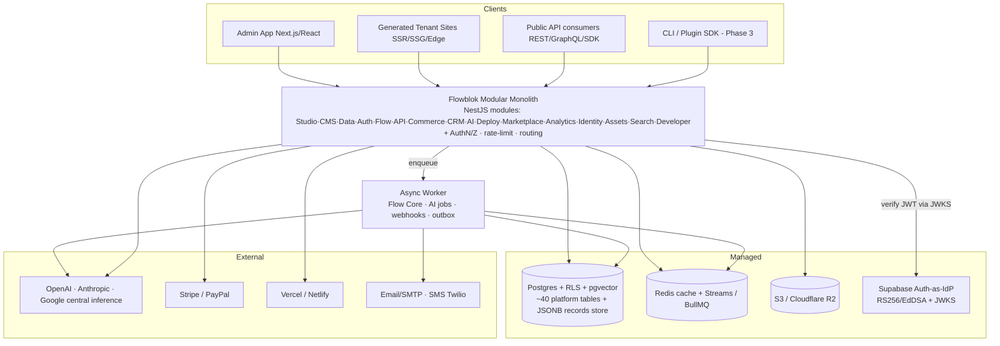
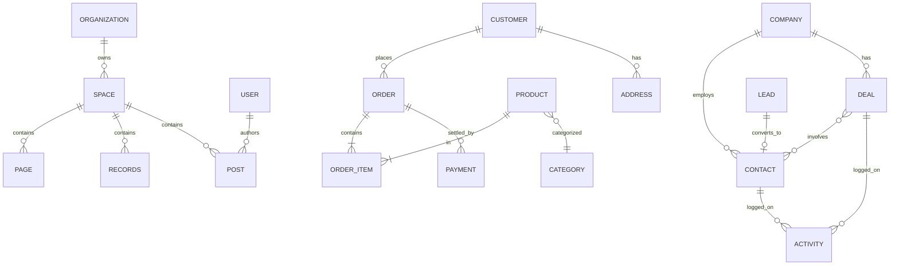

# Flowblok — Software Requirements Specification (IEEE-830 style)

## 1. Document Control

| Field | Value |
|---|---|
| **Document** | 06-SRS.md — Software Requirements Specification (IEEE-830 style) |
| **Product** | Flowblok — AI-Native Visual Business Operating System (DXOS) |
| **Version** | **1.0 — FINAL** |
| **Status** | FINAL — baselined for build |
| **Owner** | Principal Author / Systems Engineering |
| **Author email** | dharamraj.nagar@dotsquares.com |
| **Date** | 2026-06-16 |
| **Canonical source of truth** | `_CONTEXT.md` — this SRS must not contradict it |

### Related documents (cross-references)

| File | Purpose |
|---|---|
| [`_CONTEXT.md`](./_CONTEXT.md) | Canonical Planning Context — authoritative SSOT for names, numbers, decisions |
| [`01-PRD.md`](./01-PRD.md) | Product Requirements Document — goals, personas, phases, KPIs |
| [`02-TECHNICAL-ARCHITECTURE.md`](./02-TECHNICAL-ARCHITECTURE.md) | System architecture, modular monolith, data layer, tenancy |
| [`03-SECURITY-AND-ACCESS.md`](./03-SECURITY-AND-ACCESS.md) | Roles, ABAC, auth, RLS, crypto, compliance |
| [`04-FRONTEND-SPEC.md`](./04-FRONTEND-SPEC.md) | Design system, app chrome, component specs |
| [`05-FEATURE-TICKETS.md`](./05-FEATURE-TICKETS.md) | The 12 epics and FB-001…FB-068 tickets in detail |
| **`06-SRS.md`** | **This document** — traceable functional/non-functional contract tying the five layers together |
| [`07-FSD.md`](./07-FSD.md) | Functional Specification Document — screen/field-level behavior that references the SR-### and system-wide rules here |
| [`08-DESIGN-SYSTEM.md`](./08-DESIGN-SYSTEM.md) | Single machine-readable design system + tokens (SSOT for color/type/spacing) |

> **What this document is.** The SRS is the *traceable contract* that binds the PRD's "why/what" (`01`), the architecture's "how" (`02`), the security model (`03`), the design system (`08`), and the delivery backlog (`05`) into one verifiable specification. Every functional requirement (**SR-###**) carries a statement, rationale, priority, source persona/journey, ≥1 owning **FB-###** ticket, and ≥1 acceptance-test id (**AT-###**). Every non-functional requirement (**NFR-###**) carries an explicit metric, a measurement method, a target, and an owner. Section 6 (Traceability) closes the loop both forward (Goal → ticket → test) and backward (journey step → service → endpoint → table → ticket → test).

> **Reading order for a new engineer.** (1) `_CONTEXT.md` for canonical vocabulary and decisions → (2) `01-PRD.md` for the wedge, personas and phases → (3) **this SRS** for the requirement contract and acceptance gates → (4) `02-TECHNICAL-ARCHITECTURE.md` for the build → (5) `03`/`04`/`08` for security and UI depth → (6) `05-FEATURE-TICKETS.md` for executable cards.

---

## 1A. Authoritative decisions applied in this baseline

This FINAL baseline incorporates the cross-document decisions made by the expert review crew. Where a decision refines a phrasing in a sibling draft, **this SRS and `_CONTEXT.md` govern**.

| # | Decision (summary) | Effect in this SRS |
|---|---|---|
| D1 | **Canonical entity name = "Space".** Hierarchy = **Organization (tenant) → Space**. DB columns: `tenant_id` = Organization id, `space_id` = Space id, both on every tenant-owned row. RLS keys off `tenant_id`; app scopes by `space_id`. The word **"Workspace" is retired** (UI, routes `/app/{org}/{space}`, JWT claims, ticket titles). | §1.3 glossary; §3 tenancy SRs; §5 data requirements; RTM. Legacy `workspace_id` in `05` is read as `space_id`. |
| D2 | **Positioning wedge.** Public framing (first 18 months): *"The AI website generator that doesn't trap you: prompt → an editable, hosted site with a real database and real APIs — own your code."* Primary funded persona = **Agency**; activation persona = **Non-technical**. Enterprise/Developer "served later". | §2.3 user classes; §2.1 product perspective. |
| D3 | **Moat = compounding asset, provable in Phase 1.** (a) Proprietary prompt→app→human-edit telemetry (requires **central inference**), (b) template/clone/marketplace network effect pulled forward to Phase 1–2. Five-layer thesis must be PROVABLE on one vertical slice. | SR-MOAT-01 (§3.13); NFR availability of telemetry; metrics §7. |
| D4 | **AI inference = central by default, BYO-key optional.** Platform-provided keys metered as **AI credits**; non-technical users never need a key. Hard free-tier cap + per-generation cost cap protect margins. | §3.3 AI SRs; NFR-AI; §5 credit ledger; §6 system rules; Assumptions §4. |
| D5 | **Architecture = modular monolith for Phase 1.** NestJS modules (not 30 deployables); ≤2–3 deployable units (web/API + async worker). The "30+ services / 300+ tables" figure is a non-binding end-state symptom, **not a target**. Kafka/Elasticsearch deferred (transactional outbox + Redis Streams / pg-boss / BullMQ in Phase 1–2). | §2.4 operating environment; NFR-SCAL; §4 dependencies. |
| D6 | **Supabase = Postgres + RLS + pgvector + Auth-as-IdP only.** NestJS **consumes** Supabase-issued JWTs (does not re-issue). Asymmetric JWT (RS256/EdDSA + JWKS), alg pinned on every verifier. **Prisma** is the single canonical ORM/migration tool. | §3.1 identity SRs; NFR-SEC; §4 dependencies. |
| D7 | **Tenant "tables" = JSONB records store**, not per-tenant DDL. `tenant_id + space_id + collection_id + JSONB payload + GIN indexes`. Real DDL reserved for the ~40 platform tables and an Enterprise dedicated-schema tier. Generated DDL never auto-applies (dry-run + diff gate). | §3.5 data-builder SRs; §5 data model. |
| D8 | **Visual↔Code = one-way generation + explicit fork.** Visual→Code always. Code→Visual re-import only for code matching the lossless canonical AST grammar; any out-of-grammar edit seals the block as a labeled **Custom Component** (no longer visually editable). Round-trip fidelity is a Phase-1 go/no-go spike. | SR-DEV-01/02 (§3.12); NFR-MAINT; RISK note §4. |
| D9 | **AI generation = narrow templated surface + eval gate + refinement loop.** AI selects/parameterizes vetted block templates and pre-modeled schema archetypes — not free-form schema synthesis. ≥90% pass-rate CI gate. Never auto-publish; preview + partial regeneration + "what the AI assumed" panel. **FB-048 (AI-Generate-Database) is cut from Phase 1.** | §3.3 AI SRs; §7 AI Quality & Evaluation; phase column in RTM. |
| D10 | **North-star & activation = retained value.** Activation = within 7 days of Space creation: ran a generation AND made ≥1 manual edit to a generated block AND published to a live URL. North-star = weekly count of Spaces that are both **live** (reachable URL) AND **edited** in the trailing 7 days. Targets (1k/10k/50k) = trailing-28-day **retained Spaces**, re-baselined from MVP launch (month 6). | §7 metrics; SR-SPACE/SR-PUB SRs; glossary. |
| D11 | **Compliance discipline.** Controller/processor data-role mapping is the foundation. **HIPAA and 99.99% SLA are demoted** from canonical targets to gated/contract-only. Honest SLA = **99.9% Business / 99.95% HA**. Never market "certified" before attestation; SOC 2 evidence starts Phase 1. | NFR-AVAIL; NFR-SEC; §4; §2.5 constraints. |
| D12 | **Phasing & non-technical UX default.** Workflow split into **Phase-1 Flow Core** (form→email) + **Phase-2 full engine**. "AI Generator first" is GTM framing, not build order (generator sits on top of Builder+DB+CMS). Non-technical persona gets a **Simple editing mode** (2–3 tabs, progressive disclosure); the seven-tab power surface + dense ModernDark are gated to Developer/Agency. | §3 SR phase tags; §2.3 user classes; §3.4 builder SRs. |

> **SLA correction notice.** The task brief and `_CONTEXT §10` cite a **99.99%** SLA. Per decision **D11** this baseline records the honest, achievable targets **99.9% (Business)** and **99.95% (HA)** and explicitly retires 99.99% as a single-cluster target. NFR-AVAIL-01 is authoritative.

---

## 1.1 Purpose

This SRS specifies the complete software requirements for **Flowblok**, an AI-native visual business operating system. It defines *what the system shall do* (functional requirements, §3), *how well it shall do it* (non-functional requirements, §4), the *data it operates on* (§5), the *system-wide rules* every feature obeys (§6), the *AI quality bar* (§7), and the *traceability* that proves every PRD goal and KPI is covered by tickets and tests (§6/RTM). It is the verification contract used by Engineering, QA, Security, and Product to accept or reject an increment.

## 1.2 Scope

**In scope (the product Flowblok builds):** a multi-tenant platform where a user generates an editable, hosted website with a real database and real APIs from a prompt, then edits the **five layers — Visual + Database + Workflow + Code + AI — together** from one interface, across the **16 modules** (Studio · CMS · Data · Auth · Flow · API · Commerce · CRM · AI · Deploy · Marketplace · Analytics · Identity · Assets · Search · Developer).

**Phase boundary (MVP = end of Phase 1):** prompt → generated database + pages + components + auto-generated APIs → edit visually (seven block tabs, gated by role) → publish to a live URL, plus **Flow Core** (form → email/record). CRM, Commerce, full Workflow engine, full Marketplace, and most of the Developer Platform are Phase 2/3.

**Out of scope (explicit non-goals, from `01-PRD §4.2`):** building Salesforce/HubSpot (CRM is "CRM Lite"); exposing n8n directly; building everything at once; a full BI/data-warehouse; being a payment processor (Stripe/PayPal integrated, no raw card data held).

## 1.3 Definitions, Acronyms & Glossary / Data Dictionary

| Term | Canonical definition |
|---|---|
| **Organization** | Top of the tenancy hierarchy = the **tenant**. Owns one or more Spaces. DB key: `tenant_id` (uuid). |
| **Space** | **Canonical** unit a user works in (was "Workspace" — *retired term*). Owns Pages, Content, Data, Flows, APIs, Assets, AI, Commerce, CRM, Analytics, Settings. DB key: `space_id` (uuid). Every tenant-owned row carries **both** `tenant_id` and `space_id`. |
| **Workspace** | **RETIRED.** Any occurrence in sibling drafts or `_CONTEXT` (incl. `workspace_id`) is read as **Space** / `space_id`. Route segment is `/app/{org}/{space}`. |
| `tenant_id` | Organization id. **RLS isolation key** (security boundary). |
| `space_id` | Space id. **Application scope key** (what the UI filters by). |
| **The five layers** | Visual + Database + Workflow + Code + AI — editable together. The moat (`_CONTEXT §0`). |
| **Seven block tabs** | Every block/page exposes: **Design · Data · Logic · Permissions · Events · SEO · AI** (`_CONTEXT §3`). Gated; non-technical default = Simple mode (subset). |
| **Page structure** | `Page → Section → Row / Column / Component` (always). |
| **Universal data binding** | A block's Data tab binds a source with zero code: `Static \| Database \| API \| Workflow \| AI \| CRM \| Commerce \| Search`. |
| **Collection / "table"** | A tenant-defined data set. Physically stored as rows in a **JSONB records store** (`tenant_id + space_id + collection_id + payload + GIN indexes`), **not** physical per-tenant DDL (D7). |
| **Flow Core** | Phase-1 minimal workflow: form-submitted trigger → validate → store record / send email. Full engine = Phase 2. |
| **Developer Mode** | Toggle exposing generated code (React, Flow JSON, API def, schema, services/controllers). Generation is **one-way**; out-of-grammar edits seal a **Custom Component** (D8). |
| **Custom Component** | A block whose code was edited outside the lossless AST grammar; clearly labeled, no longer visually editable, never silently regenerated. |
| **AI credits** | Metered unit of platform-provided ("central") AI inference. Default model (D4). **BYO-key** = optional advanced/enterprise setting. |
| **Generation** | One run of the AI pipeline that produces editable artifacts (page/components/schema-archetype/content). |
| **Session** | A browser auth session backed by a 15-min access token + 30-day refresh token in Secure HttpOnly cookies. |
| **First session** | The first authenticated session following Space creation. Used in funnel analysis, **not** as north-star (D10). |
| **Published** | Content/site reachable at a **live URL** (distinct from **Preview**, an internal, non-public render). |
| **Activation** | Within 7 days of Space creation: ran a generation AND made ≥1 manual edit to a generated block AND published to a live URL (D10). |
| **North-star** | Weekly count of Spaces that are both **live** and **edited** in the trailing 7 days (retained value) (D10). |
| **Layer Depth** | Distinct layers (of the five) edited per Space in 30 days — verifies the moat is actually used. |
| **Companies = Accounts** | CRM synonyms; canonical term **Companies** (a.k.a. Accounts). |
| **Deals = Opportunities** | CRM synonyms; canonical term **Deals** (a.k.a. Opportunities). |
| **RLS** | PostgreSQL Row-Level Security; isolation enforced in the DB, keyed off `tenant_id`. |
| **RTM** | Requirements Traceability Matrix (§6). |
| **SR-### / NFR-### / AT-###** | Functional requirement / non-functional requirement / acceptance-test identifiers defined herein. |
| **FB-###** | Feature ticket id (`05-FEATURE-TICKETS.md`), FB-001…FB-068. |
| **DXOS** | Digital Experience Operating System (product category). |
| **PSP** | Payment Service Provider (Stripe/PayPal). |
| **JWKS** | JSON Web Key Set (asymmetric JWT verification, D6). |

**Acronyms:** SRS, PRD, FSD, ADR, RLS, RTM, ABAC, RBAC, JWT, JWKS, MFA, TOTP, OIDC, SAML, SSO, REST, GraphQL, SDK, OpenAPI, RUM, LCP, p75/p95/p99, RPO, RTO, COGS, MRR, LTV, CAC, GDPR, SOC 2, ISO 27001, HIPAA, PSP, CDN, SSG, SSR, OKLCH, WCAG.

## 1.4 References

- `_CONTEXT.md` (SSOT) — all §-citations in this document refer to it unless prefixed by another filename.
- `01-PRD.md` §4 (Goals), §5 (Personas), §8 (Journeys), §10 (Phases), §11 (KPIs), §12 (Business model).
- `02-TECHNICAL-ARCHITECTURE.md` §5 (services), §7 (data), §8 (API), §9 (editor/binding), §10 (workflow), §11 (AI).
- `05-FEATURE-TICKETS.md` FB-001…FB-068 and §6 (Phase-1 MVP slice).
- IEEE Std 830-1998 — Recommended Practice for Software Requirements Specifications (structure basis).

---

## 2. Overall Description

### 2.1 Product perspective

Flowblok replaces a fragmented stack (Webflow/Builder.io + Storyblok/Contentful + Strapi/Supabase + n8n/Zapier + Zoho/HubSpot + Shopify/WooCommerce + Vercel) with **one platform, one interface**. Architecturally it is a **modular monolith** (D5): a single NestJS application organized into modules aligned to the 16 product modules, plus one async worker, fronted by Next.js/React. It consumes a managed Postgres (Supabase) that provides **Postgres + RLS + pgvector + Auth-as-IdP only** (D6); Flowblok verifies, but does not re-issue, the asymmetric JWT.



### 2.2 Product functions (summary)

1. **Tenancy & identity** — Organization → Space; Supabase-IdP JWT; RBAC/ABAC; audit.
2. **Space lifecycle** — create, configure, clone, delete (GDPR self-delete).
3. **AI generation pipeline** — prompt → editable page/components, schema **archetypes**, content; preview-first; refinement loop; central inference metered as credits.
4. **Visual builder + block model** — page tree, drag-drop, responsive preview, block library (Infinite Components), theme, animation; Simple vs power editing modes.
5. **Universal data binding** — bind any block to one of eight sources with zero code.
6. **CMS content lifecycle** — content types, edit, draft→review→publish, version history, localization.
7. **Workflow** — Flow Core (Phase 1) → full node-graph engine (Phase 2).
8. **Auto-API** — REST/GraphQL/Webhooks/OpenAPI/SDK generated per collection/content type.
9. **Publish/deploy** — one-click to Vercel/Netlify; live URL.
10. **Billing/credits** — tiers $19/$99/$299/Enterprise; 20% marketplace commission; AI-credit metering with hard caps.
11. **Commerce / CRM / Marketplace / Developer Platform** — Phase 2/3.

### 2.3 User classes & characteristics

| User class | Funding role | Editing default | Primary jobs |
|---|---|---|---|
| **Non-technical user** | **Activation persona** | **Simple mode** (2–3 tabs, progressive disclosure, comfortable density); never needs an AI key | Generate a site from a prompt; edit text/images/layout; capture leads via a form. |
| **Agency** | **Primary funded persona** (drives template/clone flywheel) | Power surface (seven tabs, dense ModernDark) available | Spin up client Spaces from templates; clone proven Spaces; manage roles; reuse components/workflows. |
| **Developer** | Served later (Phase 3 platform) | Power surface + Developer Mode | Open generated code; build custom component/API/plugin; CLI + SDK. |
| **Enterprise** | Served later (Phase 3) | Power surface + governance | Internal portals/tools; ABAC; audit; SSO/SAML; isolation tier. |

Roles (`_CONTEXT §10`): Owner, Admin, Manager, Developer, Editor, Author, Reviewer, Customer, Guest. Capabilities: Can Edit Pages · Edit Data · Publish · Manage Users · Access APIs. Detailed matrix in `03-SECURITY-AND-ACCESS.md`.

### 2.4 Operating environment

- **Clients:** evergreen desktop browsers (Chrome/Edge/Firefox/Safari, last 2 majors); responsive admin; generated sites delivered via SSR/SSG/edge.
- **Server (Phase 1):** NestJS modular monolith + one async worker, containerized (Docker) on a single managed orchestrator (ECS / Cloud Run / small K8s). **No Kafka, no Elasticsearch in Phase 1** (D5).
- **Data:** one managed Postgres (Supabase) with RLS + pgvector; Redis (cache + Streams/BullMQ + outbox relay); S3 / Cloudflare R2 for objects.
- **Identity:** Supabase Auth as IdP (RS256/EdDSA, JWKS); Flowblok verifies only (D6).
- **AI:** central platform inference via OpenAI / Anthropic / Google; BYO-key optional.
- **External:** Stripe/PayPal (PSP), Vercel/Netlify (deploy), Twilio/SMTP (comms).
- **Scale end-state ("symptom", non-binding):** the "30+ services / 300+ tables" figure is descriptive of a hypothetical mature org and is **not** a Phase-1 commitment; the service-extraction rule (split only on independent scaling profile OR dedicated owning team) governs any future split.

### 2.5 Design & implementation constraints

- **Canonical vocabulary/numbers** from `_CONTEXT` are binding: Flowblok; Space (not Workspace); 16 modules; tiers $19/$99/$299/Enterprise; 20% commission; tokens 15-min access / 30-day refresh; seven block tabs; FB-001…FB-068; OKLCH design tokens (SSOT in `08-DESIGN-SYSTEM.md`, dark-first, one accent).
- **Single ORM/migration tool = Prisma** (D6). TypeORM/Flyway are "alternatives considered" only.
- **Tenant data = JSONB records store** (D7); platform DDL ≈ 40 tables; generated DDL never auto-applies (dry-run + diff gate).
- **Visual→Code is one-way** with explicit fork (D8).
- **AI generation constrained to vetted templates + schema archetypes** with a ≥90% eval gate (D9); **no auto-publish**.
- **Central AI inference by default**; hard free-tier cap + per-generation cost cap (D4).
- **Compliance discipline** (D11): no "certified" claims pre-attestation; PHI prohibited on standard tenancy; honest SLA 99.9%/99.95%.
- **KISS/DRY/performance-first/open-source-friendly** product principles (`_CONTEXT §1`).

### 2.6 Assumptions & dependencies (overview; full register §4)

The system assumes availability of model providers, Supabase/Postgres, Stripe/PayPal, Vercel/Netlify, and Twilio/SMTP; §4 specifies the assumption, impact-if-false, and fallback for each, including the **no-key / quota-exhausted / provider-down** behavior for AI, **PSP-down** behavior, and **deploy-target-down** behavior.

---

## 3. Specific Requirements (Functional)

Requirements are grouped by **capability**, not by UI screen. Each SR: **id · statement · rationale · priority · source persona/journey · owning FB-### · acceptance test AT-###**. Priority: P0 (phase blocker) / P1 / P2. Phase tag reflects the reconciled matrix (D9/D12).

> **Verb convention:** "shall" = mandatory. Acceptance tests are defined inline (AT-### ids) and rolled into §6.

### 3.1 Tenancy & Identity

| SR | Statement | Rat. | Pri | Source | FB | AT |
|---|---|---|---|---|---|---|
| **SR-TEN-01** | Every tenant-owned row shall carry both `tenant_id` (Organization) and `space_id` (Space); a row without both shall be rejected by CI lint and DB constraint. | Isolation key + app scope (D1). | P0 | All / J8.1 | FB-061 | AT-001 |
| **SR-TEN-02** | The system shall enforce isolation via Postgres RLS keyed on `tenant_id`; a deliberate cross-tenant read shall return **zero rows** in automated negative tests. | Isolation in DB, not middleware. | P0 | All | FB-061 | AT-002 |
| **SR-TEN-03** | The application shall scope all queries by `space_id` derived from request context, in addition to RLS. | App scope (D1). | P0 | All | FB-061 | AT-003 |
| **SR-ID-01** | The system shall authenticate users via Supabase-issued JWTs and shall **verify** them with an asymmetric algorithm (RS256/EdDSA) against JWKS, pinning `alg` on every verifier; it shall never re-issue or accept HS256. | Privilege-escalation prevention (D6). | P0 | All | FB-005,FB-006 | AT-004 |
| **SR-ID-02** | Email registration shall create a bcrypt-hashed credential and send email verification; protected actions shall be denied until verified; duplicate-email errors shall be non-enumerating. | Account safety. | P0 | Non-tech / J8.2 | FB-005 | AT-005 |
| **SR-ID-03** | Login shall issue a **15-min** access token and **30-day** refresh token in **Secure HttpOnly** cookies, never LocalStorage/JS-readable. | `_CONTEXT §10`. | P0 | All | FB-006 | AT-006 |
| **SR-ID-04** | Google and GitHub OAuth/OIDC sign-in shall create or link by verified email (no duplicate identities). | Frictionless onboarding. | P1 | All | FB-007,FB-008 | AT-007 |
| **SR-ID-05** | MFA (TOTP, with OTP/Magic Link options) shall be **mandatory for Owner/Admin** and optional for others; recovery codes shown once, stored hashed. | `_CONTEXT §10`. | P0 | Agency/Ent | FB-009 | AT-008 |
| **SR-ID-06** | Sessions shall support silent refresh-rotation, active-session listing, per-session and global revoke; revoked/expired refresh tokens shall be rejected. | Secure-without-friction. | P0 | All | FB-010 | AT-009 |
| **SR-ID-07** | The system shall enforce roles (Owner…Guest) and ABAC (e.g., Author edits own posts, cannot publish) across three layers: UI hide → backend JWT-claim check → DB RLS. | `_CONTEXT §10`. | P0 | All / J8.2 | FB-061 | AT-010 |

### 3.2 Space lifecycle

| SR | Statement | Rat. | Pri | Source | FB | AT |
|---|---|---|---|---|---|---|
| **SR-SPACE-01** | An authenticated Owner/Admin shall create a Space with a unique slug under an Organization; the creator becomes Owner; default left-nav and empty layer stack initialize; duplicate slug is rejected with a clear error. | `_CONTEXT §3`. | P0 | Agency/Non-tech / J8.1 | FB-001 | AT-011 |
| **SR-SPACE-02** | The route segment for a Space shall be `/app/{org}/{space}` (no "workspace"). | Terminology (D1). | P0 | All | FB-001 | AT-012 |
| **SR-SPACE-03** | An Owner shall delete a Space behind a typed-confirmation guard; all rows scoped to its `space_id`, its assets (S3/R2), and deployed sites shall be purged or scheduled for purge within the retention window, satisfying **GDPR self-delete**; the action is audited. | `_CONTEXT §10`. | P1 | Owner/Ent | FB-002 | AT-013 |
| **SR-SPACE-04** | Space Settings shall manage name, locale defaults, environments (dev/staging/prod), custom domains, and integration keys; non-Admins see restricted fields read-only. | `_CONTEXT §3`. | P1 | Admin | FB-003 | AT-014 |
| **SR-SPACE-05** | An Agency user shall clone a Space (pages, content models, schema/collections, flows, APIs, themes, assets) into a **new** tenant boundary with regenerated ids and no reference leakage to the source; a mid-clone failure rolls back leaving no partial Space. | Agency flywheel (D3). | P1 | Agency | FB-004 | AT-015 |
| **SR-SPACE-06** | The Space lifecycle state shall be modeled as **Created → Activated → Engaged → Retained → Paying** and emitted to analytics. | Metrics definition (D10). | P1 | Product | FB-001,FB-066 | AT-016 |

### 3.3 AI generation pipeline

| SR | Statement | Rat. | Pri | Source | FB | AT |
|---|---|---|---|---|---|---|
| **SR-AI-01** | From a prompt + brand + industry + style, the system shall generate an editable page with sections/components rendered on the canvas; every element shall be editable (no locked output) and generated components shall register in the Block Library. | The wedge (D2) + Infinite Components. | P0 | Non-tech / J8.1 | FB-046 | AT-017 |
| **SR-AI-02** | AI generation shall be constrained to a **narrow validated surface**: selecting/parameterizing **vetted block templates** and a small set of **pre-modeled schema archetypes** — not free-form schema synthesis. | Quality/safety (D9). | P0 | Non-tech | FB-046 | AT-018 |
| **SR-AI-03** | The pipeline shall **never auto-publish**: it shall produce a **Preview** first, expose a **"what the AI assumed" editable panel**, and support **partial regeneration** ("keep my edits, restyle the rest"). | Churn-driver fix (D9/D10). | P0 | Non-tech / J8.1 | FB-046 | AT-019 |
| **SR-AI-04** | AI inference shall default to **platform-provided ("central") keys**, metered as **AI credits**; non-technical users shall never be required to supply a key. **BYO-key** shall be an optional advanced/enterprise setting only. | Frictionless first session + data moat (D4). | P0 | Non-tech | FB-065,FB-066 | AT-020 |
| **SR-AI-05** | Each generation shall record prompt→app→human-edit **telemetry** (proprietary moat asset) under tenant RLS. | Compounding moat (D3). | P0 | Product | FB-046 | AT-021 |
| **SR-AI-06** | AI Copywriter + AI SEO (incl. `POST /api/ai/generate_seo`) shall produce on-brand, editable copy and title/meta/keyword suggestions; user may accept/edit/regenerate. | `_CONTEXT §6`. | P1 | Non-tech | FB-050 | AT-022 |
| **SR-AI-07** | The screenshot→layout (Vision) path shall be treated as a **research bet, deferred from Phase-1 P0**; Phase-1 generation is prompt+style-driven over vetted templates. | De-risk MVP (D9). | P2 | Non-tech | FB-046 | AT-023 |
| **SR-AI-08** | AI workflow generation shall emit a **valid** node graph using only supported node types, fully editable on the canvas. | `_CONTEXT §6`. | P1 (Phase 2) | Builder | FB-047 | AT-024 |
| **SR-AI-09** | **AI Generate Database (FB-048) is excluded from Phase 1**; in Phase 1, AI may only instantiate pre-modeled **schema archetypes** (per SR-AI-02), and any resulting DDL follows the dry-run+diff gate (SR-DATA-05). | Production-safety (D9/D7). | P0 (exclusion) | Non-tech | FB-048 | AT-025 |
| **SR-AI-10** | Every generation shall pass the **AI Quality & Evaluation gate** (§7) before being offered to the user as a completed result; generations failing automated scorers shall be flagged, not silently shipped. | Activation funnel quality (D9). | P0 | Product/Non-tech | FB-046,FB-050 | AT-026 |

### 3.4 Visual builder & block model

| SR | Statement | Rat. | Pri | Source | FB | AT |
|---|---|---|---|---|---|---|
| **SR-BLD-01** | The builder shall render a **Page Tree** (`Page → Section → Row/Column/Component`) with add/reorder/nest/delete, kept in sync with the canvas and keyboard-navigable (J/K, arrows). | `_CONTEXT §3,§14`. | P0 | Builder | FB-017 | AT-027 |
| **SR-BLD-02** | Users shall drag blocks from the library onto the canvas; dropped blocks persist to page JSON; invalid drops are prevented with feedback. | Core editor. | P0 | Non-tech | FB-018 | AT-028 |
| **SR-BLD-03** | The block inspector shall expose the seven tabs **Design · Data · Logic · Permissions · Events · SEO · AI**, but the **default editing mode for the Non-technical persona shall be Simple mode** (2–3 tabs, progressive disclosure); the full seven-tab power surface and dense ModernDark are gated to Developer/Agency roles. | KISS-vs-power resolution (D12). | P0 | Non-tech / Agency | FB-018,FB-062 | AT-029 |
| **SR-BLD-04** | The Block Library shall be searchable and **uncapped** (Infinite Components); AI-generated and custom components register alongside built-ins; each block carries default props per its `{component, props}` shape. | Counters Storyblok 200-cap (`_CONTEXT §0`). | P0 | All | FB-020 | AT-030 |
| **SR-BLD-05** | Responsive preview shall provide mobile/tablet/desktop breakpoints with per-breakpoint overrides; previews shall honor `prefers-reduced-motion`. | `_CONTEXT §14`. | P1 | Builder | FB-019 | AT-031 |
| **SR-BLD-06** | Theme management shall edit OKLCH tokens (shadcn ~27-var contract, single `--radius`) for Light / **Dark (default ModernDark)** / high-contrast, with the three color domains (UI-semantic, categorical-chart, status/pipeline) kept separate; no hardcoded hex. | `_CONTEXT §14` + design SSOT (`08`). | P1 | Builder | FB-021,FB-062 | AT-032 |
| **SR-BLD-07** | Animation presets shall use only approved motion (120/180/240ms or 200–300ms expo-out, ≤8px, no bounce/elastic), gated behind `prefers-reduced-motion`. | `_CONTEXT §14`. | P2 | Builder | FB-022 | AT-033 |

### 3.5 Universal data binding & the Data/DB Builder

| SR | Statement | Rat. | Pri | Source | FB | AT |
|---|---|---|---|---|---|---|
| **SR-DATA-01** | A block's **Data tab** shall bind one of eight sources — `Static \| Database \| API \| Workflow \| AI \| CRM \| Commerce \| Search` — with zero code; choosing Database lets the user pick a collection, auto-load fields, and **visually map** (e.g., *Card Title ← Product Title*). | `_CONTEXT §7` / J8.3. | P0 | Non-tech / J8.3 | FB-027,FB-018 | AT-034 |
| **SR-DATA-02** | On a saved mapping the system shall silently generate the equivalent data access (e.g., `db.products.findMany()`), hidden unless Developer Mode is on. | Zero-code UX. | P0 | Non-tech | FB-027 | AT-035 |
| **SR-DATA-03** | Tenant-defined collections ("tables") shall be stored as rows in a **generic JSONB records store** (`tenant_id + space_id + collection_id + JSONB payload + GIN indexes`), **not** as physical per-tenant DDL. | Scale/RLS uniformity (D7). | P0 | Non-tech/Dev | FB-023 | AT-036 |
| **SR-DATA-04** | Real DDL shall be reserved for the platform's ~40 tables and an Enterprise dedicated-schema tier. | D7. | P0 | Platform | FB-023 | AT-037 |
| **SR-DATA-05** | Platform schema migrations (Git/CI/Prisma/human review) shall be split from runtime tenant collection evolution (online, lock-aware, no human PR); any **generated DDL shall never auto-apply** — a **dry-run + diff gate** is mandatory. | Production-safety (D7). | P0 | Platform/Dev | FB-023,FB-024 | AT-038 |
| **SR-DATA-06** | Field creation shall support text/number/boolean/date/enum/JSON/relation/media with defaults/required/validation; adding a required field to a non-empty collection prompts a backfill/default strategy. | `_CONTEXT §9`. | P0 | Non-tech | FB-024 | AT-039 |
| **SR-DATA-07** | Relations (1:1, 1:M, M:N) shall be definable, with M:N modeled via a join collection and on-delete behavior (restrict/cascade/null) enforced; relations are selectable in the visual mapper. | `_CONTEXT §9`. | P1 | Builder | FB-025 | AT-040 |
| **SR-DATA-08** | Indexes (incl. GIN on JSONB paths and unique) shall be creatable via the builder with advisory performance hints; unique violations reject the write. | Performance-first. | P2 | Dev | FB-026 | AT-041 |
| **SR-DATA-09** | The query builder shall apply filters/sort/limit visually, returning results that **respect RLS** and `space_id` scope. | Isolation. | P1 | Builder | FB-027 | AT-042 |

### 3.6 CMS content lifecycle

| SR | Statement | Rat. | Pri | Source | FB | AT |
|---|---|---|---|---|---|---|
| **SR-CMS-01** | Editors shall define content types (Pages/Posts/Collections/Categories/Tags) with fields; saving auto-generates a **reviewable** migration and the REST/GraphQL/Swagger surface. | `_CONTEXT §9` schema-as-code. | P0 | Editor | FB-011 | AT-043 |
| **SR-CMS-02** | The canonical `posts` shape shall be `id, title, content, author_id, tenant_id, space_id, status[draft\|review\|published\|archived], published_at`. | `_CONTEXT §9` (+`space_id` per D1). | P0 | Editor | FB-011 | AT-044 |
| **SR-CMS-03** | Content edit shall be role-aware: Authors edit **own** entries and **cannot publish**; Editors edit all; concurrent saves shall not silently overwrite (optimistic lock / conflict prompt). | ABAC (`_CONTEXT §10`) / J8.2. | P0 | Author/Editor / J8.2 | FB-012 | AT-045 |
| **SR-CMS-04** | The status lifecycle `draft → review → published → archived` shall gate publish on the Publish capability and stamp `published_at`; each transition is versioned and audited. | `_CONTEXT §9,§10`. | P0 | Editor/Reviewer | FB-014 | AT-046 |
| **SR-CMS-05** | Content shall be versioned (audit tables / copy-on-write) with field-level diff and one-click restore; history is RLS-scoped. | `_CONTEXT §10`. | P1 | Editor | FB-015 | AT-047 |
| **SR-CMS-06** | Delete shall be soft-delete with trash/restore; deleting published content requires Publish capability; deletes are audited. | Safety. | P1 | Editor | FB-013 | AT-048 |
| **SR-CMS-07** | Localization shall store per-locale field values for one logical entry with default-locale fallback and independent per-locale publish; API `locale` param returns the correct variant. | `_CONTEXT §9`. | P1 (Phase 2) | Content mgr | FB-016 | AT-049 |

### 3.7 Workflow — Flow Core (Phase 1) & full engine (Phase 2)

| SR | Statement | Rat. | Pri | Source | FB | AT |
|---|---|---|---|---|---|---|
| **SR-FLOW-01** | **Flow Core (Phase 1):** a Form block's **Events** tab shall offer interchangeable submit targets — `Create DB Record · Run Workflow · Create CRM Lead · Send Email · Webhook · Multiple` — and shall support at minimum **Form Submitted → Validate → Store Record / Send Email** without exposing any engine internals. | Phase split (D12) / J8.4. | P0 | Non-tech / J8.4 | FB-030 (Flow Core),FB-029 | AT-050 |
| **SR-FLOW-02** | **Full engine (Phase 2):** the visual node-graph builder shall store workflows as versioned JSON/YAML (`{trigger, actions:[]}`) using node types **Trigger · Condition · Loop · API · Database · Email · SMS · Webhook · AI · CRM · Payment · Custom Code**, with the dark `#0A0A0A` canvas aesthetic and **no n8n branding/internals exposed**. | `_CONTEXT §8,§14`. | P0 (Phase 2) | Builder | FB-028 | AT-051 |
| **SR-FLOW-03** | Triggers (form submission, order completed, post published, scheduled time) shall expose their event schema for mapping into downstream nodes; disabled workflows do not execute. | `_CONTEXT §8`. | P0 (Phase 2) | Builder | FB-029 | AT-052 |
| **SR-FLOW-04** | Action nodes shall support HTTP/email/wait/condition/CRM; condition branches route correctly; failures are captured in logs with retry/backoff. | `_CONTEXT §8`. | P0 (Phase 2) | Builder | FB-030 | AT-053 |
| **SR-FLOW-05** | Scheduled workflows shall run on cron/interval in the Space timezone with a concurrency policy for overlapping runs. | `_CONTEXT §8`. | P1 (Phase 2) | Builder | FB-031 | AT-054 |
| **SR-FLOW-06** | Each run shall log overall + per-node status, inputs/outputs, timing, and errors; definition changes emit a Workflow Changes audit event. | `_CONTEXT §8,§10`. | P1 (Phase 2) | Builder | FB-032 | AT-055 |
| **SR-FLOW-07** | Phase-1 async execution shall use **transactional outbox + Redis Streams/BullMQ/pg-boss** (not Kafka); Kafka is deferred to Phase 3 gated on a measured throughput threshold. | Architecture posture (D5). | P0 | Platform | FB-068 | AT-056 |

### 3.8 Auto-API

| SR | Statement | Rat. | Pri | Source | FB | AT |
|---|---|---|---|---|---|---|
| **SR-API-01** | On creating a content type/collection the system shall auto-generate REST CRUD (`/api/<resource>`, `/api/<resource>/{id}`), immediately callable, with auth + rate limits enforced before the handler and RLS scoping rows. | `_CONTEXT §11`. | P0 | Dev | FB-033 | AT-057 |
| **SR-API-02** | A GraphQL schema (types/queries/mutations) shall be generated per content type/collection with a GraphiQL-style Explorer; auth/rate-limit/RLS identical to REST. | `_CONTEXT §11`. | P1 | Dev | FB-034 | AT-058 |
| **SR-API-03** | OpenAPI/Swagger spec and a typed SDK shall be generated (`Generate APIs → Swagger → SDK`) and regenerate on schema change; Swagger UI supports authenticated try-it. | `_CONTEXT §11`. | P1 | Dev | FB-036 | AT-059 |
| **SR-API-04** | Outbound webhooks shall fire on create/update/delete/publish with **HMAC-signed** payloads, retries+backoff, and per-attempt delivery logs. | `_CONTEXT §11` + §6 signing rule. | P1 (Phase 2) | Dev | FB-035 | AT-060 |
| **SR-API-05** | Public platform API shall be URI-versioned (`/v1`); generated tenant APIs carry a `schema_version`; webhooks include `schema_version`. | `02 §8.5`. | P1 | Dev | FB-033,FB-036 | AT-061 |

### 3.9 Publish / Deploy

| SR | Statement | Rat. | Pri | Source | FB | AT |
|---|---|---|---|---|---|---|
| **SR-PUB-01** | One-click Deploy shall build and publish a Space's site to the selected environment/target (Vercel/Netlify one-click, or container target), returning and recording the **live URL**. | `_CONTEXT §5,§6` / J8.1. | P0 | Non-tech / J8.1 | FB-067 | AT-062 |
| **SR-PUB-02** | "Published" shall denote a reachable live URL, distinct from "Preview"; a failed build blocks deploy and surfaces the error. | Glossary clarity (D10). | P0 | All | FB-067 | AT-063 |
| **SR-PUB-03** | Promotion across dev/staging/prod environments (from Space Settings) shall target the chosen environment. | `_CONTEXT §5`. | P1 | Agency/Ent | FB-067,FB-003 | AT-064 |
| **SR-PUB-04** | On publish, the system shall purge CDN cache and may fire post-publish hooks (sitemap/webhooks) via Flow Core/outbox. | `02 §12.4`. | P1 | Editor | FB-067,FB-035 | AT-065 |

### 3.10 Billing / Credits

| SR | Statement | Rat. | Pri | Source | FB | AT |
|---|---|---|---|---|---|---|
| **SR-BILL-01** | The system shall offer tiers **Starter $19 / Professional $99 / Business $299 / Enterprise custom**, applying per-tier entitlements and quotas (collections, pages, storage, AI credits, seats). | `_CONTEXT §13`. | P1 (Phase 2) | Business | FB-066 | AT-066 |
| **SR-BILL-02** | AI usage shall be **metered as credits** with a **hard free-tier cap** and a **per-generation cost cap**; on cap exhaustion the user is informed and generation is soft-blocked (never silently billed beyond cap). | Margin protection (D4). | P0 (cap in MVP) | All | FB-065,FB-066 | AT-067 |
| **SR-BILL-03** | Marketplace purchases shall record and split a **20% commission** on templates/plugins/agents. | `_CONTEXT §13`. | P1 (Phase 3) | Marketplace | FB-066,FB-051 | AT-068 |
| **SR-BILL-04** | Downgrade/cancel shall adjust entitlements at the period boundary. | Billing correctness. | P1 (Phase 2) | Business | FB-066 | AT-069 |

### 3.11 Commerce & CRM (Phase 2)

| SR | Statement | Rat. | Pri | Source | FB | AT |
|---|---|---|---|---|---|---|
| **SR-COM-01** | Merchants shall manage products/categories with variants (separate collection or JSON metadata), media, pricing, SEO; products bind to blocks via the Commerce data source; `GET /api/products` is RLS-scoped. | `_CONTEXT §1,§9`. | P0 (Phase 2) | Merchant | FB-041 | AT-070 |
| **SR-COM-02** | Inventory shall decrement atomically on order completion, signal low-stock thresholds (optionally triggering a workflow), and block checkout on insufficient stock. | `_CONTEXT §1`. | P1 (Phase 2) | Merchant | FB-042 | AT-071 |
| **SR-COM-03** | Orders shall follow `CUSTOMER 1—* ORDER 1—* ORDER_ITEM *—1 PRODUCT; CUSTOMER 1—* ADDRESS`; order completion fires the `order completed` trigger; a Customer sees **only their own** orders (ABAC). | `_CONTEXT §9,§10`. | P0 (Phase 2) | Merchant/Customer | FB-043 | AT-072 |
| **SR-COM-04** | Coupons (%/fixed) shall support usage limits, expiry, min-spend, and product/category scope, applied at checkout. | `_CONTEXT §1`. | P2 (Phase 2) | Merchant | FB-044 | AT-073 |
| **SR-COM-05** | Payments shall integrate a PSP (Stripe/PayPal), recording provider/amount/status and refunds; **no raw card data** is held; success advances the order and decrements inventory. | `_CONTEXT §1` + PCI minimization. | P0 (Phase 2) | Merchant | FB-045 | AT-074 |
| **SR-CRM-01** | CRM Lite leads shall be capturable manually or via form-submit workflow action, qualified, and converted to Contact and/or Deal. | `_CONTEXT §1,§8` / J8.4. | P0 (Phase 2) | Sales / J8.4 | FB-037 | AT-075 |
| **SR-CRM-02** | Contacts shall associate with **Companies (Accounts)**; **Deals (Opportunities)** relate M:N to Contacts; data is RLS-scoped. | `_CONTEXT §9` + glossary. | P0 (Phase 2) | Sales | FB-038 | AT-076 |
| **SR-CRM-03** | The Deal pipeline shall render exactly **New Lead → Qualified → Meeting → Proposal → Won** with drag-to-stage and history; stage colors use the **status/pipeline color domain** (icon+label, never color alone). | `_CONTEXT §9,§14`. | P0 (Phase 2) | Sales | FB-039 | AT-077 |
| **SR-CRM-04** | Activities (notes/tasks/emails/calls) shall attach polymorphically to Contacts/Deals on a timeline; overdue tasks are flagged; RLS-scoped. | `_CONTEXT §9`. | P1 (Phase 2) | Sales | FB-040 | AT-078 |

### 3.12 Developer Platform (Phase 3; viewer earlier) & the Round-Trip Moat

| SR | Statement | Rat. | Pri | Source | FB | AT |
|---|---|---|---|---|---|---|
| **SR-DEV-01** | Developer Mode shall expose generated React, Flow JSON, API definition, DB schema, and services/controllers in Monaco; visual changes update the code view. Generation is **one-way (Visual→Code)**. | `_CONTEXT §7`, moat (D8). | P1 (Phase 3; viewer Phase 1) | Dev | FB-055 | AT-079 |
| **SR-DEV-02** | **Code→Visual re-import** shall succeed **only** for code matching the generator's **lossless canonical AST grammar**; the instant a user edits outside that grammar, the block shall become a **sealed, clearly-labeled Custom Component**, no longer visually editable and **never silently regenerated** over hand edits. | Honest round-trip scope (D8). | P1 (Phase 3) | Dev | FB-055,FB-058 | AT-080 |
| **SR-DEV-03** | The Code Editor shall save/version/audit edits, surface build errors inline before deploy, and offer an AI Code Assistant (context = user code + schema). | `_CONTEXT §5,§6`. | P1 (Phase 3) | Dev | FB-056 | AT-081 |
| **SR-DEV-04** | Custom APIs shall register behind the gateway (auth+rate-limit), appear in Swagger/SDK, and keep RLS scope. | `_CONTEXT §11`. | P1 (Phase 3) | Dev | FB-057 | AT-082 |
| **SR-DEV-05** | Custom components shall register in the Block Library with a props schema and the canonical block tabs, running within the tenant boundary. | `_CONTEXT §0,§3`. | P1 (Phase 3) | Dev | FB-058 | AT-083 |
| **SR-DEV-06** | Plugin SDK + CLI shall scaffold plugins with manifest + capability declarations + lifecycle hooks; publish via Git push → automated tests → code review → App Store; semver + push-updates; plugins run **containerized/sandboxed** confined to declared capabilities. | `_CONTEXT §10,§12`. | P1 (Phase 3) | Dev | FB-059,FB-060 | AT-084 |

### 3.13 Marketplace (Phase 3; install pulled forward per D3) & the Five-Layer Moat SR

| SR | Statement | Rat. | Pri | Source | FB | AT |
|---|---|---|---|---|---|---|
| **SR-MKT-01** | Template install shall apply a template's pages/content models/theme into a Space (re-tenanted), browsable by category (Schools/Restaurants/Ecommerce/Services), with semver push-updates; paid templates record the 20% commission. | `_CONTEXT §12,§13` + flywheel (D3). | P1 (install Phase 1–2; full Phase 3) | Agency | FB-051,FB-066 | AT-085 |
| **SR-MKT-02** | Plugins/connectors shall install only after passing code review and shall run in a containerized sandbox with explicitly granted scoped capabilities; uninstall removes resources cleanly. | `_CONTEXT §10,§12`. | P1 (Phase 3) | Admin | FB-052 | AT-086 |
| **SR-MKT-03** | Workflow micro-apps and AI agents shall be installable (versioned), running sandboxed; AI agents use the tenant's credits/keys and explicitly granted permissions; the 20% commission applies to paid items. | `_CONTEXT §6,§8,§12`. | P2 (Phase 3) | Admin | FB-053,FB-054 | AT-087 |
| **SR-MOAT-01** | **The moat (Goal G2) shall be a testable requirement:** for a single block, a user shall — within the same block context — (1) bind it to a generated collection via the **Data** tab, (2) attach a form→email/record automation via the **Events** tab (Flow Core), (3) set role visibility via the **Permissions** tab, (4) restyle it via the **AI** tab, and (5) view/fork its generated code via **Developer Mode** — proving Visual + Database + Workflow + Code + AI are editable **together** on one vertical slice in Phase 1. | Five-layer thesis provable in Phase 1 (D3). | P0 | Agency/Dev / J8.1,J8.3,J8.4 | FB-018,FB-027,FB-030,FB-055,FB-050 | AT-088 |

---

## 3X. External Interface Requirements

### 3X.1 User interfaces (UI)
- **One inverted-L chrome** (collapsible left sidebar + unified top header) across every module; left-nav = Dashboard · Spaces · Pages · Content · Components · Database · Workflows · APIs · CRM · Commerce · AI · Analytics · Marketplace · Assets · Users · Settings.
- **Cmd/Ctrl+K command palette EXECUTES** (moves cards, sets properties, navigates, triggers AI) — not just search (FB-063).
- **Editing modes:** Non-technical default = **Simple mode**; Developer/Agency = seven-tab power surface + dense ModernDark (D12).
- **States are first-class:** layout-matched skeletons (never spinners), teaching empty states, recoverable error pills, success feedback.
- **Theme:** dark-first (ModernDark) per `08-DESIGN-SYSTEM.md` (SSOT); Light/high-contrast overrides; one accent; OKLCH tokens.
- **Accessibility:** WCAG **AA** minimum; full keyboard nav (J/K, arrows, Cmd+K, Ctrl+[); never state-by-color-alone (see NFR-USE).

### 3X.2 Hardware interfaces
- No bespoke hardware. Client = any device running a supported browser. Server = commodity container compute on the managed orchestrator. No device drivers, no peripheral integration.

### 3X.3 Software interfaces
| Interface | Direction | Protocol / contract |
|---|---|---|
| Supabase Auth (IdP) | inbound JWT verify | RS256/EdDSA via JWKS; alg pinned (SR-ID-01) |
| Postgres (Supabase) + pgvector | bidirectional | SQL via Prisma; RLS keyed on `tenant_id` |
| Redis | bidirectional | cache + Streams/BullMQ + outbox relay |
| Object storage (S3/R2) | bidirectional | S3-compatible API |
| AI providers (OpenAI/Anthropic/Google) | outbound | HTTPS model APIs; central keys default, BYO optional |
| PSP (Stripe/PayPal) | outbound + webhook | HTTPS + signed webhooks; no raw card data |
| Deploy (Vercel/Netlify) | outbound | deploy API; one-click publish |
| Comms (SMTP/Twilio) | outbound | email/SMS APIs |

### 3X.4 Communications interfaces
- **TLS 1.3** for all transport; HSTS; security headers via the app edge.
- **REST + GraphQL** public/generated APIs; **webhooks** HMAC-signed (§6); **OpenAPI/SDK** generated.
- Cookies: Secure, HttpOnly, SameSite for session tokens.

---

## 4. Non-Functional Requirements

Each NFR: **metric · measurement method · target · owner**. (Availability per D11; **99.99% retired**.)

| NFR | Requirement | Metric & method | Target | Owner |
|---|---|---|---|---|
| **NFR-PERF-01** | Published-site load | **LCP**, RUM (field) p75 | **< 2.5s** | FE/Deploy |
| **NFR-PERF-02** | Admin builder interaction feedback | input-to-visual-feedback latency, instrumented p95 | **< 100ms** | FE |
| **NFR-PERF-03** | API latency | server-side p99 per endpoint, APM | **< 300ms** (reads), < 600ms (writes) | BE |
| **NFR-AI-01** | AI generation latency | end-to-end p95, with **hard timeout** + **graceful fallback** to template default | p95 **< 30s**; timeout 60s | AI |
| **NFR-AI-02** | AI per-generation cost | tokens × price, metered per run | **≤ per-generation cost cap**; worst-case site modeled (§7) | AI/Finance |
| **NFR-AI-03** | AI quality gate | automated scorers (§7) pass rate in CI | **≥ 90%** | AI |
| **NFR-SCAL-01** | Concurrent editors per Space | load test, soft-lock conflict rate | support **≥ 10**; conflicts surfaced, none silently lost | BE |
| **NFR-SCAL-02** | Tenancy scale | retained Spaces on one Postgres cluster (+replicas/shard-by-`tenant_id` plan) | **50k** Spaces (Y3) | Platform |
| **NFR-SCAL-03** | Architecture | deployable units in Phase 1 | **≤ 3** (web/API + worker); modular monolith (D5) | Platform |
| **NFR-SEC-01** | Tenant isolation | cross-tenant negative tests in CI | **0** cross-tenant rows (SR-TEN-02) | Security |
| **NFR-SEC-02** | JWT verification | static + runtime check of alg pinning | **RS256/EdDSA only**, HS256 rejected | Security |
| **NFR-SEC-03** | Crypto | config audit | **AES-256** at rest, **TLS 1.3** transit, secrets in Vault, bcrypt passwords, MFA for admins | Security |
| **NFR-SEC-04** | Rate limiting | per-tenant/per-key quotas at the edge | values per §6; 429 with `Retry-After` | BE |
| **NFR-AVAIL-01** | Uptime SLA | monthly uptime, measurement window = calendar month, excluding scheduled maintenance | **99.9% (Business)** / **99.95% (HA, multi-AZ)** — **NOT 99.99%** (D11) | Platform |
| **NFR-AVAIL-02** | Disaster recovery | restore drills | **RPO ≤ 15 min**, **RTO ≤ 4h** (Business) | Platform |
| **NFR-AVAIL-03** | Data residency | region pinning per Org | region honored; documented | Platform |
| **NFR-USE-01** | Accessibility | automated + manual WCAG audit | **WCAG 2.1 AA**; OKLCH contrast verified; no color-only state | Design/FE |
| **NFR-USE-02** | Non-technical usability | task success in moderated tests (generate→edit→publish) | **≥ 80%** unaided completion | Product |
| **NFR-MAINT-01** | Maintainability | single ORM (Prisma); test coverage on platform modules | coverage **≥ 70%**; one migration tool | BE |
| **NFR-MAINT-02** | Round-trip fidelity | grammar-conformance tests for Visual↔Code | in-grammar edits round-trip; out-of-grammar reliably seals to Custom Component (D8) | FE/BE |
| **NFR-PORT-01** | Portability | container portability across ECS/Cloud Run/K8s | builds run unmodified; "own your code" export | Platform |
| **NFR-CONC-01** | Collaborative editing | concurrency decision recorded | **Phase 1 = soft-lock** (presence + conflict prompt); CRDT deferred (revisit Phase 2) | FE/BE |
| **NFR-QUOTA-01** | Per-tier quotas | enforced limits | collections/pages/storage/AI-credits/seats per tier (SR-BILL-01) | BE |

> **Performance, scalability, security, availability/SLA, usability/a11y, maintainability, portability** are all covered above. The brief's "99.99%" line is intentionally superseded by **NFR-AVAIL-01** per decision D11; treat any 99.99% reference in sibling drafts as an error to be corrected to 99.9%/99.95%.

---

## 4A. Assumptions & Dependencies Register

| Dependency | Assumption | Impact if false | Fallback / behavior |
|---|---|---|---|
| **AI providers** (OpenAI/Anthropic/Google) | Central inference reachable within SLA; cost per token stable | Generation fails or margins erode | **No key/quota-exhausted:** soft-block with clear message + use last template default (SR-BILL-02). **Provider-down:** route to alternate provider; if all down, serve cached/last-good generation and queue retry; never auto-publish a degraded result. |
| **Supabase / Postgres + RLS** | Managed Postgres + RLS + pgvector + Auth-IdP available; JWKS reachable | Auth/data outage | Read-replica failover; cached JWKS with bounded TTL; degrade to read-only; alert. |
| **Stripe / PayPal (PSP)** | PSP available; webhooks delivered | Checkout/billing blocked | **PSP-down:** disable checkout with a clear retry message; queue order as "payment pending"; reconcile on webhook recovery; never hold raw card data. |
| **Vercel / Netlify (deploy)** | Deploy API available | Publish blocked | **Deploy-target-down:** retain Preview; queue publish; offer alternate target/container deploy; surface error (SR-PUB-02). |
| **Twilio / SMTP (comms)** | Email/SMS deliverable | Notifications/auth emails delayed | Retry with backoff; fall back to secondary provider; surface delivery status; auth verification has resend. |
| **Object storage (S3/R2)** | Available, durable | Asset upload/serve impaired | Multi-region/replicated bucket; signed-URL retry; serve from CDN cache. |

> **Single ORM/migration tool dependency:** Prisma is canonical (D6); a regression in Prisma migration tooling is mitigated by the platform-migration review gate (SR-DATA-05) and reversible migrations.

---

## 5. Data Requirements

### 5.1 Tenancy keys (mandatory on every tenant-owned row)
`tenant_id uuid NOT NULL` (Organization; RLS key) **and** `space_id uuid NOT NULL` (Space; app scope). Enforced by CI lint + DB constraint (SR-TEN-01).

### 5.2 Platform tables (~40, real DDL) — illustrative core
`organizations`, `spaces`, `users`, `memberships`, `roles`, `sessions`, `oauth_links`, `audit_log`, `pages`, `sections`, `components`, `content`, `content_versions`, `locales`, `media`, `collections` (catalog), **`records`** (JSONB store), `relations`, `indexes_meta`, `api_definitions`, `webhooks`, `workflows`, `workflow_runs`, `ai_jobs`, `ai_generation_telemetry`, `embeddings` (pgvector), `prompts`, `deployments`, `environments`, `credit_ledger`, `subscriptions`, `invoices`, `marketplace_listings`, `installs`, `versions` (+ Phase-2/3: `products`, `categories`, `orders`, `order_items`, `customers`, `addresses`, `payments`, `contacts`, `companies`, `deals`, `deal_contacts`, `activities`, `leads`).

### 5.3 Tenant collection store (JSONB — the DB Builder; D7)
```sql
-- Generic records store: NO per-tenant DDL.
CREATE TABLE records (
  id           uuid PRIMARY KEY DEFAULT gen_random_uuid(),
  tenant_id    uuid NOT NULL,      -- Organization (RLS key)
  space_id     uuid NOT NULL,      -- Space (app scope)
  collection_id uuid NOT NULL,     -- which tenant "table"
  payload      jsonb NOT NULL,     -- the row's fields
  created_at   timestamptz DEFAULT now(),
  updated_at   timestamptz DEFAULT now()
);
CREATE INDEX records_payload_gin ON records USING GIN (payload jsonb_path_ops);
CREATE INDEX records_scope ON records (tenant_id, space_id, collection_id);

-- RLS keys off tenant_id (the isolation boundary).
ALTER TABLE records ENABLE ROW LEVEL SECURITY;
CREATE POLICY tenant_isolation ON records
  USING (tenant_id = current_setting('app.tenant_id')::uuid);
```

### 5.4 Canonical entity shapes
```jsonc
// posts (platform CMS) — note BOTH tenancy keys
{ "id":"uuid", "title":"...", "content":"...", "author_id":"uuid",
  "tenant_id":"uuid", "space_id":"uuid",
  "status":"draft|review|published|archived", "published_at":"ts|null" }

// Page block tree
{ "id":"pg_123", "blocks":[ { "type":"hero" }, { "type":"grid" } ] }

// Component
{ "component":"ProductCard", "props":{ "title":"...", "price":0 } }

// Workflow (Flow Core / full engine)
{ "trigger":"form.submitted", "actions":[ {"type":"create_record"}, {"type":"send_email"} ] }

// Binding descriptor (Data tab)
{ "source":"database", "collection_id":"...", "map":{ "Card Title":"Product Title" } }

// AI generation telemetry (moat asset, D3)
{ "generation_id":"uuid", "tenant_id":"uuid", "space_id":"uuid",
  "prompt":"...", "template_ids":[...], "archetype_ids":[...],
  "produced_block_ids":[...], "human_edits":[...], "retained":true,
  "credits_spent":0, "scores":{ "renders":true, "contrast_aa":true } }

// Credit ledger entry
{ "tenant_id":"uuid", "generation_id":"uuid", "credits":0, "cap_state":"ok|soft_block" }
```

### 5.5 Canonical ERDs (Phase 2/3 relational domains)


### 5.6 Retention, versioning, residency
- Content versioned via audit tables / copy-on-write (SR-CMS-05); restorable; RLS-scoped.
- `audit_log` immutable to tenant users; covers Login, Content Changes, Workflow Changes, API Calls, Permission Changes (`_CONTEXT §10`).
- GDPR self-delete cascades by `space_id` (SR-SPACE-03). Data residency pinned per Organization (NFR-AVAIL-03).
- Backups + DR per NFR-AVAIL-02 (RPO ≤ 15 min / RTO ≤ 4h).

### 5.7 Controller/processor data-role mapping (foundation for GDPR; D11)
| Data category | Controller | Processor | Notes |
|---|---|---|---|
| Tenant end-user content & records | Tenant (Organization) | Flowblok | Tenant owns; Flowblok processes under DPA. |
| Account / billing data | Flowblok | Stripe/PayPal | PSP is processor for payment data; no raw card data stored. |
| AI prompts/telemetry (central inference) | Flowblok (+ tenant) | Model providers | Disclosed; opt-out for BYO-key tier; **PHI prohibited** on standard tenancy. |
| Auth identities | Flowblok | Supabase | IdP processor. |

---

## 6. System-wide Functional Rules (the SRS/FSD shared layer)

Feature tickets and `07-FSD.md` reference these by id.

| Rule | Specification |
|---|---|
| **RULE-PAGE (pagination)** | Default page size **25**, max **100**; cursor-based for large/JSONB sets; responses include `next_cursor` + `total` (approx for JSONB). |
| **RULE-ERR (error taxonomy)** | JSON error `{ code, message, details?, request_id }`. Codes: `AUTH_*`, `PERM_*`, `VALIDATION_*`, `RATE_LIMITED`, `NOT_FOUND`, `CONFLICT`, `QUOTA_EXCEEDED`, `AI_CAP_REACHED`, `PROVIDER_DOWN`, `INTERNAL`. HTTP mapped accordingly (4xx client, 5xx server). |
| **RULE-IDEM (idempotency)** | All non-GET writes accept `Idempotency-Key`; replays return the original result; required for payments, deploys, generations. |
| **RULE-RATE (rate limits)** | Default **60 req/min** per user (auth), **600 req/min** per Org API key, AI generation **per-tier credit cap**; 429 + `Retry-After`. Admin IP allowlists supported. |
| **RULE-HOOK (webhook signing)** | **HMAC-SHA256** signature in `X-Flowblok-Signature` with timestamp; secrets rotatable; rotation supports an overlap window (old+new valid) of 24h. |
| **RULE-TIME (timezone/date)** | Store UTC (`timestamptz`); render in Space timezone; schedules evaluate in Space timezone (SR-FLOW-05); ISO-8601 on the wire. |
| **RULE-NOTIFY (notifications)** | Providers: SMTP/email + Twilio SMS; retries with backoff; deliverability tracked; bounce handling; secondary-provider fallback. |
| **RULE-BACKUP (backup/restore + DR)** | Daily full + PITR; restore drills quarterly; RPO ≤ 15 min, RTO ≤ 4h (NFR-AVAIL-02). |
| **RULE-AUDIT** | Five canonical categories (above) immutable, RLS-scoped, owner-viewable. |
| **RULE-AICAP** | Generations check the credit ledger pre-run; on `AI_CAP_REACHED` soft-block and inform; never silently exceed the per-generation cost cap (SR-BILL-02). |
| **RULE-DDLGATE** | Any generated/runtime DDL passes a dry-run + diff gate; platform DDL additionally requires Git/CI/human review (SR-DATA-05). |

---

## 7. AI Quality & Evaluation Specification

Generation quality is the activation funnel; it is governed, not assumed (D9).

### 7.1 Golden prompt set
- Per industry × style (e.g., Education×Luxury — the "Dubai luxury school"; Restaurant×Fine-Dining; Ecommerce×Fashion; Services×Agency), maintained as a versioned fixture set.

### 7.2 Automated scorers (CI gate)
| Scorer | Pass condition |
|---|---|
| **Renders-without-error** | Generated page mounts without runtime error. |
| **AA contrast** | All text/background pairs meet WCAG AA (OKLCH-verified). |
| **Schema-valid** | Any generated workflow/DB **archetype** validates against its schema. |
| **Token-conformance** | Output uses design tokens (no hardcoded hex). |
| **Latency budget** | Within NFR-AI-01 p95. |
| **Cost budget** | Within NFR-AI-02 per-generation cap. |

**Gate:** combined automated pass rate **≥ 90%** in CI; a regression below the gate **blocks release** (NFR-AI-03).

### 7.3 Human-eval rubric
Reviewers score (1–5) on layout coherence, brand fidelity, copy quality, editability; sampled per release; rubric averages tracked over time.

### 7.4 Generation Success Score (GSS) — product metric
GSS aggregates: **completed** (produced a usable preview), **layer-coverage %** (how many of the five layers the generation touched), **post-generation block-retention** (proxy: blocks kept vs discarded after human edit), **time-to-preview p50/p90**, and **regeneration rate**. GSS feeds the moat-usage view (Layer Depth, §below).

### 7.5 Refinement loop (mandatory behavior)
Never auto-publish (SR-AI-03); preview before deploy; partial regeneration ("keep my edits, restyle the rest"); editable "what the AI assumed" panel.

---

## 7A. North-star, Activation & Moat-usage Metrics (D10)

| Metric | Definition | Target/direction |
|---|---|---|
| **North-star** | Weekly count of Spaces that are **live** (reachable URL) **AND** edited in the trailing 7 days | grow |
| **Activation** | Within 7 days of Space creation: generated **AND** ≥1 manual edit to a generated block **AND** published to a live URL | grow |
| **Active (retained) Spaces** | Trailing-28-day retained Spaces; re-baselined from MVP launch (month 6) | **Y1 1k · Y2 10k · Y3 50k** |
| **Layer Depth** | Distinct of the five layers edited per Space in 30 days | rising (verifies moat use) |
| **Space state model** | Created → Activated → Engaged → Retained → Paying | conversion tracked |
| **MRR / LTV:CAC / churn** | per `01-PRD §11` | LTV:CAC ≥ 3:1; churn low |

> "First-session publish" is **demoted** from north-star to a funnel diagnostic only (it optimizes for half-right sites — a churn driver).

---

## 8. Traceability

### 8.1 Forward RTM — PRD Goals & KPIs → satisfying FB-### + verification method

| PRD Goal (`01 §4.1`) | SR(s) | FB tickets | Verification |
|---|---|---|---|
| **G1** One-prompt business generation | SR-AI-01..05, SR-DATA-03, SR-PUB-01 | FB-046, FB-050, FB-023, FB-067 | AT-017..021, AT-036, AT-062; §7 eval gate |
| **G2** Five layers editable **together** (moat) | **SR-MOAT-01**, SR-DEV-01/02, SR-DATA-01, SR-FLOW-01 | FB-018, FB-027, FB-030, FB-055, FB-050 | **AT-088** (vertical-slice test) + Layer Depth metric |
| **G3** Infinite Components | SR-BLD-04, SR-DEV-05 | FB-020, FB-046, FB-058 | AT-030, AT-083 |
| **G4** Nothing locked (Developer Mode) | SR-DEV-01..05 | FB-055, FB-056, FB-057, FB-058 | AT-079..083 |
| **G5** Multi-tenant Organization → Space | SR-TEN-01..03, SR-ID-01, SR-SPACE-01/02 | FB-061, FB-001 | AT-001..003, AT-011/012 |
| **G6** Sequenced delivery (AI-generator-first GTM) | phase tags throughout; SR-AI-09 exclusion | §6 MVP slice (`05`) | phase-gate review |

| KPI (`01 §11`) | SR/metric | FB | Verification |
|---|---|---|---|
| North-star (retained live+edited) | §7A | FB-001, FB-067 | analytics emission (SR-SPACE-06) |
| Activation | §7A | FB-046, FB-067 | event funnel |
| MRR / LTV:CAC / churn | SR-BILL-01..04 | FB-066 | billing reports |
| Page load | NFR-PERF-01 | FB-067 | RUM p75 LCP |
| Plugin/template adoption | SR-MKT-01 | FB-051 | install events |
| Layer Depth (moat used) | §7A / GSS | FB-018,FB-027 | telemetry (SR-AI-05) |

**Orphan check:** Goals with ≥1 ticket = G1–G6 (no orphan goals). Tickets present in `05` but **not Phase-1** (served later, intentionally): FB-004, FB-007/008, FB-013, FB-015, FB-016, FB-022, FB-025, FB-026, FB-028–032 (full Flow, Phase 2; Flow Core is Phase 1), FB-034, FB-035, FB-037–045 (CRM/Commerce), FB-051–054 (Marketplace), FB-055–060 (Developer Platform), FB-066, FB-068. **FB-048 is intentionally excluded from Phase 1** (D9) and re-scoped to schema-archetype instantiation. No FB-### lacks an owning SR.

### 8.2 Reverse RTM (worked example) — the canonical "Dubai luxury school" flow

Step ids (J8.1-S#) are the shared reference all docs use.

| Step | Journey step | Module/service (`02`) | API endpoint | Primary table | FB | SR | AT |
|---|---|---|---|---|---|---|---|
| **J8.1-S1** | New Space → Generate with AI | Studio/Identity | `POST /api/spaces` | `spaces` | FB-001 | SR-SPACE-01 | AT-011 |
| **J8.1-S2** | Enter prompt + brand/industry/style | AI | `POST /api/ai/generate` | `ai_jobs` | FB-046 | SR-AI-01/02 | AT-017/018 |
| **J8.1-S3** | Generate schema **archetypes** (no free-form) | Data | `POST /api/collections` | `collections`,`records` | FB-023 (FB-048 excluded) | SR-AI-09, SR-DATA-03 | AT-025/036 |
| **J8.1-S4** | Generate pages/components, bind to collections | Studio/CMS | `POST /api/pages` | `pages` | FB-046, FB-018 | SR-AI-01, SR-DATA-01 | AT-017/034 |
| **J8.1-S5** | Enquiry form → Flow Core (validate→store→email) | Flow (Core) | `POST /api/flows/run` | `workflows`,`workflow_runs` | FB-030 (Flow Core) | SR-FLOW-01 | AT-050 |
| **J8.1-S6** | Auto-generate REST/Swagger per collection | API | `GET /api/<resource>` | `api_definitions` | FB-033, FB-036 | SR-API-01/03 | AT-057/059 |
| **J8.1-S7** | **Preview** (never auto-publish) + "what AI assumed" | AI/Studio | `GET /api/preview/{id}` | `ai_jobs` | FB-046 | SR-AI-03 | AT-019 |
| **J8.1-S8** | Edit visually (Design/AI/SEO tabs), Developer Mode fork | Studio/Developer | `PUT /api/pages/{id}` | `pages`,`content_versions` | FB-018, FB-055 | SR-BLD-03, SR-DEV-01/02 | AT-029/079/080 |
| **J8.1-S9** | Publish to live URL | Deploy | `POST /api/deploy` | `deployments` | FB-067 | SR-PUB-01/02 | AT-062/063 |
| **J8.1-S10** | Moat proof on one block (5 layers together) | all five | (composite) | (composite) | FB-018/027/030/055/050 | **SR-MOAT-01** | **AT-088** |

> All sibling documents reference these **J8.1-S#** step ids so the worked example stays identical across `01`/`02`/`05`/`07`.

---

## 9. Acceptance Test Index (AT-### → SR)

| AT | Verifies | AT | Verifies | AT | Verifies |
|---|---|---|---|---|---|
| AT-001..003 | SR-TEN-01..03 | AT-034..035 | SR-DATA-01/02 | AT-066..069 | SR-BILL-01..04 |
| AT-004..010 | SR-ID-01..07 | AT-036..042 | SR-DATA-03..09 | AT-070..074 | SR-COM-01..05 |
| AT-011..016 | SR-SPACE-01..06 | AT-043..049 | SR-CMS-01..07 | AT-075..078 | SR-CRM-01..04 |
| AT-017..026 | SR-AI-01..10 | AT-050..056 | SR-FLOW-01..07 | AT-079..084 | SR-DEV-01..06 |
| AT-027..033 | SR-BLD-01..07 | AT-057..061 | SR-API-01..05 | AT-085..087 | SR-MKT-01..03 |
| | | AT-062..065 | SR-PUB-01..04 | **AT-088** | **SR-MOAT-01** |

---

*End of 06-SRS.md (v1.0 FINAL, 2026-06-16). The traceable contract for Flowblok. Governs alongside `_CONTEXT.md`; cross-references `01-PRD.md`, `02-TECHNICAL-ARCHITECTURE.md`, `03-SECURITY-AND-ACCESS.md`, `04-FRONTEND-SPEC.md`, `05-FEATURE-TICKETS.md`, `07-FSD.md`, `08-DESIGN-SYSTEM.md`. Where this baseline applies an expert-crew decision (§1A), it supersedes the corresponding draft phrasing in sibling documents — notably the SLA correction from 99.99% to 99.9%/99.95% (NFR-AVAIL-01).*
