# Flowblok — Functional Specification Document

## 1. Document Control

| Field | Value |
|---|---|
| **Document** | 07-FSD.md — Functional Specification Document |
| **Product** | Flowblok — the AI website generator that doesn't trap you (real database, real APIs, code you own) |
| **Version** | 1.0 — FINAL |
| **Status** | Final / approved for build |
| **Owner** | Principal Author (Product + Engineering, in concert with PM/BA) |
| **Author email** | dharamraj.nagar@dotsquares.com |
| **Date** | 2026-06-16 |
| **Canonical source of truth** | [`_CONTEXT.md`](./_CONTEXT.md) — this FSD must not contradict it |

### 1.1 Related documents (cross-references)

| File | Purpose |
|---|---|
| [`_CONTEXT.md`](./_CONTEXT.md) | Canonical names, numbers, decisions — the single source of truth |
| [`01-PRD.md`](./01-PRD.md) | Product Requirements: the wedge, personas, phases, success metrics |
| [`02-TECHNICAL-ARCHITECTURE.md`](./02-TECHNICAL-ARCHITECTURE.md) | Modular-monolith architecture, records store, tenancy, ADRs |
| [`03-SECURITY-AND-ACCESS.md`](./03-SECURITY-AND-ACCESS.md) | Roles, ABAC, auth/JWT, RLS, crypto, compliance posture |
| [`04-FRONTEND-SPEC.md`](./04-FRONTEND-SPEC.md) | App chrome, editing modes (Simple vs power), component specs, preview bridge |
| [`05-FEATURE-TICKETS.md`](./05-FEATURE-TICKETS.md) | The 12 epics and FB-001…FB-068 tickets in detail |
| [`06-SRS.md`](./06-SRS.md) | Software Requirements Specification (SR-### functional/non-functional) |
| [`08-DESIGN-SYSTEM.md`](./08-DESIGN-SYSTEM.md) | Single machine-readable design system + tokens (SSOT) |

### 1.2 Purpose & scope

This FSD bridges *what* (PRD/SRS) to *how each function behaves screen-by-screen* for Flowblok's hero flows. It specifies, per surface and per flow: inputs, outputs, validation rules, state machines, business rules, role-based behavior, error handling, and end-to-end orchestration. Where a behavior implements a requirement, it cites the SRS requirement id (`SR-###`) and the originating ticket (`FB-###`).

> **Requirement-id convention.** `SR-###` ids in this document refer to functional/non-functional requirements catalogued in [`06-SRS.md`](./06-SRS.md). Each FSD section opens with a **Traceability** line listing the `SR-###` and `FB-###` it satisfies. Where the SRS uses a different local numbering, `06-SRS.md` is authoritative; this document maps behavior to it.

### 1.3 How to read a flow

Every flow uses **numbered step lists** for the happy path, a **state machine** (mermaid `stateDiagram-v2`) where the entity has lifecycle, a **sequence diagram** (mermaid `sequenceDiagram`) for cross-component orchestration, and an **inputs / outputs / validation** table. Error handling uses the **error taxonomy** of §4.4.

### 1.4 Terminology (canonical — obeys `_CONTEXT.md §3`)

The user-facing entity is a **Space**. The hierarchy is **Organization (tenant) → Space**. The word "Workspace" is retired across UI, routes (`/app/{org}/{space}`), JWT claims, and tickets. In the data model `tenant_id` = Organization id and `space_id` = Space id; both columns exist on every tenant-owned row. RLS keys off `tenant_id`; the application scopes by `space_id`. (Some sibling tickets still carry the legacy column name `workspace_id`; treat it as a synonym for `space_id` until the global rename lands — see `02`.)

---

## 2. System Context & Scope of This Spec

### 2.1 Product posture this FSD encodes

Flowblok ships Phase 1 as a **modular monolith** (NestJS modules) on one managed Postgres (+pgvector), with at most a web/API app and an async worker. The behaviors below assume:

- **Tenant-defined "tables" are a JSONB-backed records store** (`tenant_id + space_id + collection_id + JSONB payload + GIN indexes`), **not** per-tenant DDL. The Database Builder (§9) manipulates *collections* in this store, not physical schema.
- **AI inference is platform-provided by default**, metered as invisible/abundant credits; BYO-key is an advanced/enterprise setting (`_CONTEXT §; 01-PRD §12`). The non-technical activation persona never needs a key.
- **Visual↔Code is one-way generation + explicit fork**, never symmetric round-trip (§13).
- **Generation is constrained**: AI selects/parameterizes vetted block templates and pre-modeled schema archetypes — not free-form DDL (FB-048 AI-Generate-Database is **cut from Phase 1**; behavior documented in §17 for completeness/Phase-1.5).
- **The non-technical persona owns Simple mode (2–3 tabs)**; the seven-tab power surface and dense ModernDark are gated to Developer/Agency roles (§5, §8).

### 2.2 Hero flows specified end-to-end

| # | Flow | Primary section | Tickets |
|---|---|---|---|
| F1 | One-prompt generation (page → table → form→email → code → publish) | §16 | FB-046, FB-050, FB-023/024, FB-033, FB-067 |
| F2 | Onboarding & first-run (wizard, demo Space, import) | §6 | FB-001, FB-005/006, FB-046 |
| F3 | Blogging publish lifecycle with roles | §11 | FB-011…FB-015 |
| F4 | Universal data binding | §10 | FB-027, FB-018 |
| F5 | Form → Flow Core → CRM → Email | §12 | FB-029/030, FB-037, Flow Core |
| F6 | Workflow execution & run journal | §12.6 | FB-028…FB-032 |
| F7 | AI generation pipeline (job state machine) | §15 | FB-046…FB-050 |
| F8 | Checkout saga (vision-tier, documented for completeness) | §12.8 | FB-043/045 |
| F9 | Developer-Mode conflict resolution / fork-to-custom | §13 | FB-055/056/058 |
| F10 | Publish & deploy (staging → production, rollback) | §14 | FB-014, FB-067 |
| F11 | Command palette execution | §7 | FB-063 |

### 2.3 Phase mapping of behaviors (obeys `01-PRD §10.3`)

| Behavior | Phase |
|---|---|
| Onboarding, generation (constrained), Simple-mode editing, records store, REST gen, **Flow Core** (form→email + store-record), staging+publish, template install + clone | **Phase 1** |
| Full workflow engine, Developer Mode GA (view/fork), GraphQL/Webhooks, CRM v1 (≤4 objects) prep, Analytics, billing (FB-066) | **Phase 2** |
| Marketplace economy, Plugin SDK/CLI, AI Agents, Enterprise (SSO/isolation), CRM v1, narrow Commerce (gated) | **Phase 3** |

> Flows F6 (full engine), F8 (checkout), and parts of F9 describe **Phase 2/3** behavior; they are specified now so the Phase-1 Flow Core and Developer-Mode-read surfaces are forward-compatible. Each such section is labelled with its phase.

---

## 3. Actors, Roles & Role-Based Behavior

Traceability: SR (security/RBAC) · FB-061 · `03-SECURITY-AND-ACCESS.md` · `_CONTEXT §10`.

### 3.1 Roles (canonical) and default editing surface

| Role | Default editing surface | Code access | Publish | Manage users |
|---|---|---|---|---|
| **Owner** | Power (7 tabs) | Yes (Dev Mode) | Yes | Yes |
| **Admin** | Power (7 tabs) | Yes (Dev Mode) | Yes | Yes |
| **Manager** | Power (7 tabs) | Read | Yes | Limited |
| **Developer** | Power (7 tabs) + Developer Mode | Yes (view/fork/edit) | Per capability | No |
| **Editor** | Power (7 tabs) | No | Yes | No |
| **Author** | **Simple mode (Design · Data · AI)** | No | **No** (submit for review only) | No |
| **Reviewer** | Power (read-biased) | No | Yes (review→publish) | No |
| **Customer** | Front-of-site only | No | No | No |
| **Guest** | Read public | No | No | No |

> **Simple-vs-power resolution (per surface).** The non-technical **activation persona** (mapped to Author/Editor-lite by default) sees **Simple mode**: the block inspector shows only **Design · Data · AI** (§8.2). Developer/Agency roles (Owner/Admin/Developer/Manager) see the full seven tabs. The mode is **role-driven and progressively disclosed** — a Simple-mode user can be granted "Show advanced" by an Admin, which reveals Logic/Permissions/Events/SEO without a re-login.

### 3.2 Three-layer enforcement (every behavior below obeys this)

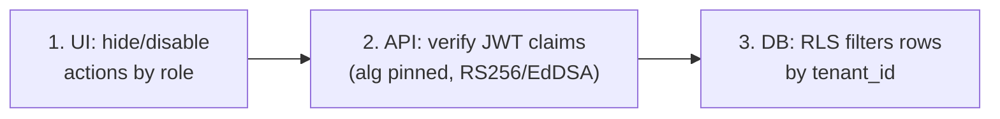

**Business rule (universal):** UI hiding is never the security boundary. Any action a role cannot perform is (a) hidden/disabled in UI, (b) rejected by the API after JWT-claim check, and (c) impossible at the row level via RLS. A behavior is only "done" when all three layers agree (SR-RBAC-*; FB-061).

---

## 4. Cross-Cutting UX Contract (states, errors, microcopy)

This section is referenced by every screen spec. It implements `04-FRONTEND-SPEC §12/§13` and `_CONTEXT §14`.

### 4.1 The mandatory state set per surface

Every interactive surface specifies all of: **default · hover · focus-visible · active · drag · loading · empty · error · success · disabled.**

| State | Concrete anatomy (the contract) |
|---|---|
| **hover** | `e1→e2` elevation; ≤4px move; 120ms ease-out. No color change except status. |
| **focus-visible** | `ring-ring` at **3px** (Radix step-8 mapping). Always visible on keyboard focus. |
| **active** | Pressed: −1 elevation step or 0.98 inset; no bounce. |
| **drag** | `e4` + faint accent glow; 240ms handoff; valid drop zones highlight (step-8 dashed). |
| **loading** | **Layout-matched skeleton** (block/row/card/chart shape) — **never a spinner**. Live region announces "Loading …". |
| **empty** | **Teaching empty state** (§4.2). |
| **error** | Per **error taxonomy** (§4.4). |
| **success** | Quiet toast + state change; mono numerals tick (240ms, gated). No exclamation marks. |
| **disabled** | 0.5 opacity, `cursor: not-allowed`, `aria-disabled`, tooltip explaining *why* (e.g., "Publish requires the Publish capability"). |

### 4.2 Teaching empty state — exact anatomy

No stock illustration. The empty state teaches the next action.

| Element | Spec |
|---|---|
| **Icon** | One `lucide` glyph, 24px, `muted-foreground`. |
| **Headline** | Title type (20–24px / 600), terse, technical. e.g., "No collections yet." |
| **Body** | Body (16px / 400 / 1.6), one sentence on what this surface is for. |
| **Primary action** | One filled button (the obvious next step), e.g., "Create collection". |
| **Optional ghost action** | A secondary ghost button (e.g., "Import CSV" or "Learn more"). |

### 4.3 Microcopy voice

Terse, technical, **no exclamation marks**, sentence case for body, no marketing tone in the app. Verbs first ("Bind data", "Promote to production"). Errors state the cause and the fix.

### 4.4 Error taxonomy & decision rule

| Tier | Use when | UI form | Retry affordance |
|---|---|---|---|
| **Inline field error** | A single input is invalid | Red border + icon + helper text under the field | Fix-in-place; no retry button |
| **Row pill** | One row/item in a list failed (e.g., one webhook delivery) | Status pill in the row (`fail` red + x icon + label) | Per-row "Retry" |
| **Page-level banner** | The whole surface cannot load/operate (e.g., generation pipeline down) | Top banner inside the content area, recoverable, with cause | "Retry" / "Reload" |
| **Toast** | Transient, async result of an action the user already moved on from (save failed, run completed) | Bottom-right toast, icon + label + optional action | Action button (e.g., "Undo", "View") |

**Decision rule:** scope of failure picks the tier — *one field → inline; one row → pill; whole surface → banner; background/async → toast.* Never show a raw stack trace; never use color alone (always icon + label).

### 4.5 Optimistic UI & undo

Edits apply optimistically (<100ms feedback) and roll back on server rejection with an error toast. Destructive/irreversible actions are **never** optimistic — they confirm first (§7.3, §13.4). Every mutation is an undoable command on the command stack where the surface supports undo (builder, content, kanban).

---

## 5. App Shell Behavior (chrome, navigation, scoping)

Traceability: SR-NAV-* · FB-062, FB-063 · `04-FRONTEND-SPEC §5`.

### 5.1 Route scoping & guard behavior

All app routes are `/app/{org}/{space}/…`. On every navigation:

1. The router resolves `{org}` and `{space}` from the path.
2. The app verifies the session JWT carries claims for that `org`/`space` (the API re-verifies; UI is not the boundary).
3. If the JWT lacks the claim → redirect to an **access-denied** page (page-level banner: "You don't have access to this Space."), never a blank 403.
4. If the session is expired → silent refresh (FB-010); on refresh failure → redirect to `/login` preserving the return URL.

### 5.2 Org/Space switcher

- Shows recent + starred Spaces; type-to-filter.
- Switching Space re-scopes the entire app (sidebar counts, all module data) and updates the route. In-flight unsaved edits prompt a "Discard unsaved changes?" confirm before switching.

### 5.3 Sidebar (16-item nav) role behavior

The 16 nav items render per `04-FRONTEND-SPEC §5.2`. **Role/phase gating:** items for unentitled modules are dimmed with a lock glyph and a tooltip ("Available on Professional" / "Phase 2"). CRM, Commerce, Marketplace appear but are gated in Phase 1 (vision-tier per PRD). The active item shows a thin left indicator + medium-weight text.

---

## 6. Onboarding & First-Run Flow (F2)

Traceability: SR-ONB-* · FB-001, FB-005/006, FB-046 · `01-PRD §8` (generation loop), Change-memo §2. **Phase 1. Flagged Critical by Customer Voice — fully specified here.**

> **Time-to-first-value target: an editable preview in < 90 seconds** from the end of the wizard.

### 6.1 Entry states

| Entry | Behavior |
|---|---|
| **Brand-new account, empty Org** | Land on **first-run chooser** (§6.2), not an empty dashboard. |
| **Returning, no Spaces** | Same chooser, plus "recent activity: none". |
| **Returning, has Spaces** | Space list / last-opened Space. |

### 6.2 First-run chooser — three first-class starting paths

The empty account never shows a blank prompt box. It offers three paths of equal weight:

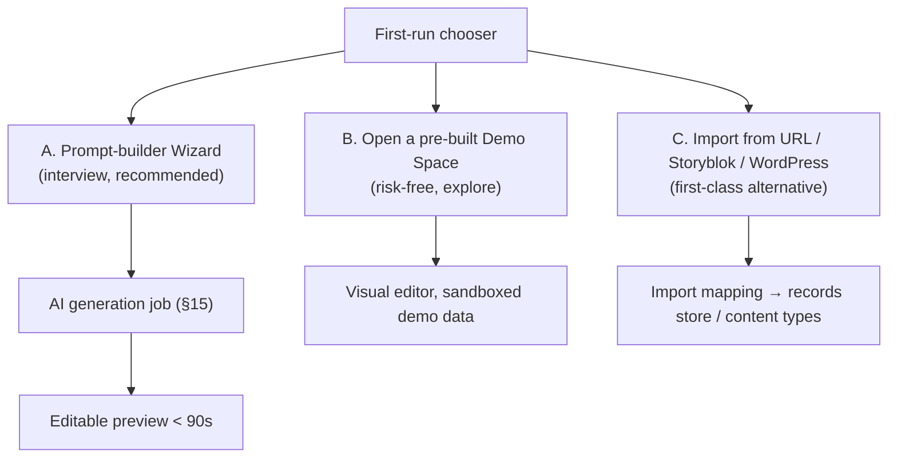

### 6.3 Path A — the prompt-builder WIZARD (not a blank box)

The wizard *interviews* the user across short steps; each step has a sensible default so it can be skipped. Outputs feed the generation job (§15) and the **"What the AI assumed" panel**.

| Step | Input | Validation | Default if skipped |
|---|---|---|---|
| 1. Industry | Single-select (Restaurant, Agency, School, SaaS, Portfolio, Other) + free text | Required one selection | "General business" |
| 2. Pages | Multi-select chips (Home, About, Services, Contact, Blog, Pricing) | ≥1 page; ≤8 in Phase 1 | Home + Contact |
| 3. Tone | Segmented (Minimal, Bold, Playful, Corporate, Luxury) → maps to a vetted style from the 31-style catalog | One selection | Minimal |
| 4. Examples (optional) | Paste a reference URL or upload a screenshot | URL format / image ≤10MB, png/jpg | none (skip) |
| 5. Brand (optional) | Brand name, primary color, logo upload | color = valid OKLCH/hex; logo ≤5MB | name from Space; accent `#2563EB` |

**Business rules:**
- The wizard composes a structured prompt; the raw composed prompt is shown ("Here's what we'll ask the AI") and is editable before run — no silent prompt injection.
- A **cost/scope preview** is shown before running: "This will generate ~N pages and 1 collection. Uses ~X credits (you have plenty)." (§12.3 of PRD; soft cap, never mid-run hard stop on paid tiers; hard cap on Free).
- Screenshot input routes through the constrained Vision path; if Vision is unavailable, the wizard degrades gracefully to prompt-only (banner: "Image analysis is busy; generating from your answers.").

### 6.4 Path B — pre-built Demo Space (risk-free)

- Opens a fully populated, **sandboxed** Space (sample collection + bound page + a form→email Flow Core) the user can click through and edit without consequence.
- Clearly badged "Demo" in the header; edits are local to the demo and a banner offers "Make this my Space" (clones the demo into a real Space).
- Demo data never sends real email or contacts a real person (AI-trust rule §18).

### 6.5 Path C — Import (first-class)

| Source | Mechanism | Phase | First-run behavior |
|---|---|---|---|
| CSV | Bulk import into records store | Phase 1 | Column→field mapping screen; preview first 10 rows |
| URL (scrape) | Fetch + constrained extraction to blocks | Phase 1 (best-effort) | Shows extracted sections for review before commit |
| Storyblok / Contentful | Content export → mapped content types | Phase 2 | Mapping wizard |
| WordPress | WXR import | Phase 2 | Mapping wizard |

Import never auto-publishes; result lands in staging (§14).

### 6.6 First-run success criteria

The user reaches an **editable preview** of generated/imported/demo content within the TTFV target, with the "What the AI assumed" panel visible and a clear primary action ("Edit", "Publish to staging"). Activation (per PRD §11) is *not* claimed here — it requires generate **AND** ≥1 manual edit **AND** publish to a live URL within 7 days.

---

## 7. Command Palette Anatomy (F11)

Traceability: SR-CMD-* · FB-063 · `04-FRONTEND-SPEC §5.3` · `_CONTEXT §14`. The palette **executes**, it is not just search.

### 7.1 Open, structure, ranking

- Open with **Cmd/Ctrl+K** on any screen (Radix dialog, `cmdk`).
- Result rows: icon · label · contextual scope breadcrumb · shortcut hint.
- **Grouping & ranking:** results group by category in this order — *Actions in this context → Navigate → AI → Search results*. Within a group, rank by recency + fuzzy score. The top result is pre-selected.
- **Empty / no-match copy:** "No commands match `{query}`. Press Enter to ask AI to do it." (offers AI fallback). Empty query shows recent + suggested actions.

### 7.2 Argument entry (inline chip/token UI)

Commands that need arguments drill in with **Tab** (not a new screen):

1. Select a command (e.g., "Set property…"). Press **Tab**.
2. The input shows an **inline chip** for the command and a prompt for the first argument ("property?"). Typing filters candidate args; Enter commits the chip.
3. Multiple args chain as chips ("Set property" · "padding" · "16px"). Backspace removes the last chip.
4. **Enter** with all required args runs; missing required arg disables Enter with a hint.

### 7.3 Destructive-command confirmation

Destructive commands (Delete Space, Unpublish, Drop collection) require a second gesture:

- **type-to-confirm** for high-blast-radius (Delete Space → type the Space slug), or
- **second Enter** with a red confirm row ("Press Enter again to delete") for medium-blast actions.

No destructive command is single-keystroke.

### 7.4 AI-command states

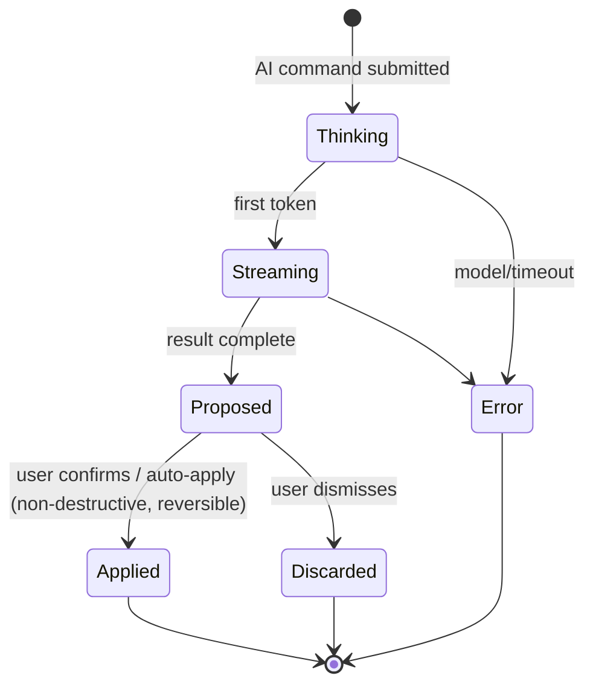

- **Thinking**: skeleton shimmer in the result area + "Thinking…" live region.
- **Streaming**: tokens stream into a preview row.
- **Applied**: an **applied toast with Undo** (every AI action is undoable — §18). AI actions that contact a real person or are irreversible are **never auto-applied** — they require explicit human approval (§18).
- **Error**: inline page-level within the palette, "Couldn't complete that. Retry?" The user's typed command is preserved.

### 7.5 What the palette can execute (examples)

Navigate (any module/Space/page/record) · Execute (set block property, move kanban card, change a node config, toggle Developer Mode, switch theme, publish a page) · Trigger AI ("Generate a pricing page", "Add a contact form bound to Leads", "Explain this workflow") · Search (content, components, tables, assets — semantic where available).

---

## 8. The Seven-Tab Block Inspector Contract (F-builder)

Traceability: SR-BLD-* · FB-018, FB-020, FB-021, FB-022, FB-050 · `04-FRONTEND-SPEC §7.3` · `_CONTEXT §3/§4`.

### 8.1 Tab set and per-persona disclosure

The seven canonical tabs are **Design · Data · Logic · Permissions · Events · SEO · AI**. Default visibility by persona:

| Tab | Simple mode (non-technical) | Power (Developer/Agency) | Behavior summary |
|---|:--:|:--:|---|
| **Design** | Yes | Yes | Layout (size/spacing/align/flex-grid), typography overrides, semantic-token color only, border/radius, background, per-breakpoint visibility, animation presets (FB-022), theme binding (FB-021). |
| **Data** | Yes | Yes | The universal data-binder (§10). |
| **AI** | Yes | Yes | Per-block AI: regenerate, rewrite copy, restyle, explain, variants (FB-050). |
| **Logic** | Hidden (disclosable) | Yes | Conditional render ("show if…"), repeaters (one block per bound row), computed values, simple expressions. No raw code unless Developer Mode. |
| **Permissions** | Hidden (disclosable) | Yes | Role-based visibility/edit gating for the block (Owner…Guest + capability flags). UI-hide only; backend/RLS still enforce (§3.2). |
| **Events** | Hidden (disclosable) | Yes | Trigger→action wiring (§12.2). |
| **SEO** | Hidden (disclosable) | Yes | Per-block/page meta, slug, sitemap, inline AI SEO. |

**Progressive disclosure rule:** Simple mode shows Design/Data/AI. A "Show advanced" affordance (or an Admin grant) reveals the remaining four inline — no navigation, no reload. The choice persists per user per Space.

### 8.2 Per-tab interaction contract (selected)

- **Design.** Every control writes a semantic token, never a raw hex (enforced — color picker only offers token swatches in Simple mode; power mode allows custom within the OKLCH contract). Per-breakpoint overrides do not leak across breakpoints (FB-019).
- **Logic.** Repeater binds to a collection query (§10); a "rows preview" shows how many instances will render; an empty/over-cap state warns at the repeater cap (§10.5).
- **Events.** See §12.2 — interchangeable form-submit targets.
- **AI.** Each action streams a proposal into a preview; user **Accept / Edit / Regenerate / Discard**. Never auto-applies to a published surface.

### 8.3 Block inspector states

Loading = skeleton tabs; empty (no block selected) = teaching empty ("Select a block to edit its properties."); error (binding broken) = inline pill on the Data tab. Disabled tabs in Simple mode are hidden, not greyed (to reduce noise).

---

## 9. Database Builder Behavior (records store)

Traceability: SR-DATA-* · FB-023, FB-024, FB-025, FB-026, FB-027 · `02` (records store) · `_CONTEXT §9`.

> **Architecture note (binding rule).** A user "table" is a **collection** in the JSONB records store: rows are `(tenant_id, space_id, collection_id, payload JSONB)` with GIN indexes. The Database Builder edits **collection definitions** (field metadata), not physical DDL. No per-tenant `CREATE TABLE` runs. Real DDL is reserved for the ~40 platform tables (`02`).

### 9.1 Create collection ("table") — FB-023

Inputs / outputs / validation:

| Input | Validation | Output |
|---|---|---|
| Collection name | non-empty; unique within Space; slugifiable | `collection_id`, slug, empty field set |
| (auto) tenancy | always `tenant_id` + `space_id` stamped | RLS-scoped rows guaranteed |

**Business rules:** every collection is automatically tenant+space scoped; a cross-Space read returns zero rows (RLS, FB-061). On create, **auto-generate REST CRUD** for the collection (FB-033) and surface it in the binder (§10) and APIs module.

### 9.2 Field editor — FB-024

| Field type | Renders as (forms/binder) | Constraints offered |
|---|---|---|
| text / rich-text | input / editor | required, unique, min/max, regex |
| number | numeric input (mono) | required, min/max, integer |
| boolean | switch | default |
| date / datetime | date picker | required, range |
| enum | select | options list, default |
| JSON | code field | schema (optional) |
| relation | record picker | target collection, cardinality |
| media | asset picker | mime allowlist, size cap |

**Business rules:**
- Adding a **required** field to a non-empty collection prompts a **backfill/default strategy** (set default, or mark existing rows incomplete). Generated changes **never auto-apply** without this resolution (dry-run + diff gate; `02`, FB-024).
- Deleting a field warns of data loss and is audited (FB-064).

### 9.3 Relations — FB-025

Visual drag from one collection's field to another creates a relation; a config popover sets cardinality (1:1, 1:M, M:N) and on-delete (restrict / cascade / null). M:N auto-creates a junction collection. In the records store these are reference ids in the payload with integrity enforced at the service layer.

### 9.4 Indexes — FB-026

Index management maps to GIN/expression indexes on JSONB paths; composite via multi-field select; advisory "slow query" suggestions surface as a row pill, never auto-applied.

### 9.5 Query Builder — FB-027 (also the binder engine)

Visual composer: pick collection → add filters (field/op/value, AND/OR groups) → select fields → sort → limit → joins via relations. Live result preview (mono numerals, density toggle). A **"Show SQL/Prisma"** toggle reveals the generated query — **only in Developer Mode** (§13). Saved queries become reusable data sources in the binder (§10). All queries respect RLS (SR-DATA-RLS).

### 9.6 Collection lifecycle

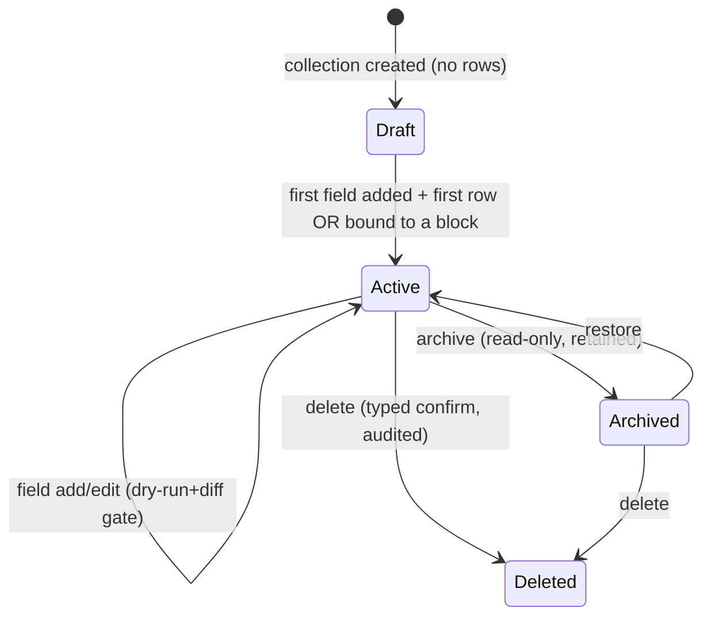

---

## 10. Universal Data-Binder UX (F4)

Traceability: SR-BIND-* · FB-027, FB-018 · `04-FRONTEND-SPEC §7.4` · `_CONTEXT §7`. **The zero-code binding contract.**

### 10.1 Binder flow (numbered)

On a block's **Data** tab, any bindable prop opens the binder:

1. **Choose source:** `Static | Database | API | Workflow | AI | CRM | Commerce | Search`. (CRM/Commerce sources are gated/vision-tier in Phase 1 but appear disabled with a phase tooltip.)
2. **Pick collection/table** via searchable picker (e.g., Database → `Products`).
3. **Fields auto-load** from the source schema.
4. **Visual field mapping** — a two-column panel: *block slots* (left) ↔ *source fields* (right). Drag or select to map (e.g., *Card Title ← Product.title*, *Price ← Product.price*, *Image ← Product.image*).
5. **Filters / sort / limit** for collections; **params** for API/Workflow; **prompt** for AI.
6. **Confirm.** A confirmation line states the binding in plain language: **"This card now shows live data from Products."**

### 10.2 Live preview with real data

- The preview pane renders the block with **actual rows** that will display (first N per the limit), not lorem placeholder.
- **Empty preview:** if the query returns zero rows → teaching empty inside the preview ("No rows match. This block will be hidden / show its empty state on the live site."). The user chooses block behavior on empty (hide vs show-empty-state).
- **Error preview:** if the source errors (bad param, broken relation) → inline pill on the Data tab + the preview shows the last-good or an error placeholder; never blank-fails silently.

### 10.3 Binding descriptor (the saved artifact)

Each binding persists a **binding descriptor** referenced by `04-FRONTEND-SPEC` and `02`:

```json
{
  "source": "database",
  "collection": "products",
  "query": { "filters": [...], "sort": [...], "limit": 12 },
  "map": { "title": "title", "price": "price", "image": "image" },
  "onEmpty": "showEmptyState",
  "repeat": true
}
```

The system silently generates the data access (e.g., `await db.products.findMany()`); the user never sees it unless Developer Mode is toggled (§13), which surfaces the generated query/service/controller — editable per the one-way rule.

### 10.4 Repeater behavior

When `repeat: true`, the block becomes a template rendered once per row (the Logic tab repeater). The page tree shows it as one node with a row-count badge.

### 10.5 Repeater row caps

| Context | Cap | On exceed |
|---|---|---|
| Editor preview | 12 rows rendered | "Showing 12 of N — preview capped" pill |
| Published page | source `limit` (default 50; max 200 per binding) | paginate or warn at bind time |

Caps protect editor performance and the SVG point ceiling (`04-FRONTEND-SPEC §15`).

### 10.6 Binder sequence

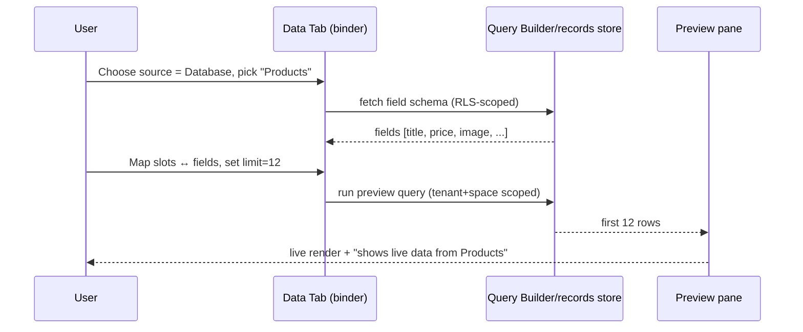

---

## 11. Content Lifecycle & Blogging Publish With Roles (F3)

Traceability: SR-CMS-* · FB-011…FB-016 · `_CONTEXT §9` (posts shape, status enum) · `03` (ABAC).

### 11.1 Content state machine

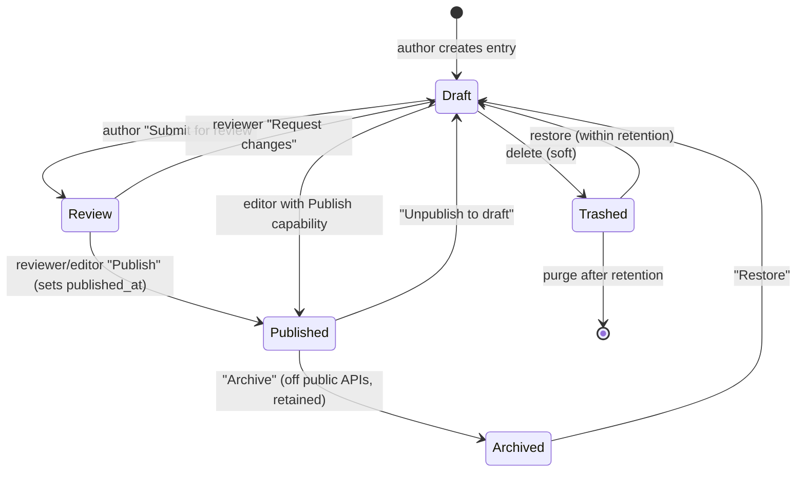

Canonical `posts` row: `(id, title, content, author_id, tenant_id, space_id, status[draft|review|published|archived], published_at)`.

### 11.2 Role behavior across the lifecycle (ABAC)

| Action | Author | Editor | Reviewer | Admin/Owner |
|---|:--:|:--:|:--:|:--:|
| Create/edit **own** entry | Yes | Yes | Yes | Yes |
| Edit **others'** entries | **No** (blocked, ABAC) | Yes | Yes | Yes |
| Submit for review | Yes | Yes | — | Yes |
| Publish / set `published_at` | **No** | Yes | Yes | Yes |
| Archive | No | Yes | Yes | Yes |
| Delete published | No | Yes | Yes | Yes |

**Business rules:** an Author who attempts another author's post is blocked at all three layers (UI hides Edit, API rejects, RLS scopes). An Author can only move Draft→Review, never →Published (FB-014).

### 11.3 End-to-end blogging publish flow (numbered)

1. Author opens Content → Post type → "New entry" (Simple mode editor).
2. Author writes; **AI Copywriter/SEO** (FB-050) optionally drafts copy/meta — inserted as **editable** text, never auto-published.
3. On save, a **version snapshot** is captured (FB-015); concurrent edits are guarded by optimistic lock → conflict prompt (no silent overwrite).
4. Author clicks **Submit for review** → status `Review`; a notification routes to reviewers.
5. Reviewer opens the entry, sees a **field-level diff** vs last published version (FB-015), and either **Request changes** (→Draft, with a comment) or **Publish**.
6. On Publish → status `Published`, `published_at` stamped, entry exposed on public read APIs; transition recorded in version history **and** the audit log (Content Changes, FB-064).
7. Live site reflects the change after deploy/ISR (§14). One-click rollback restores any prior version (FB-015).

### 11.4 Version history & diff

Named/auto snapshots; side-by-side field-level diff; one-click restore (restore is itself versioned). All versions are tenant-scoped via RLS (FB-015).

### 11.5 Localization (Phase 2 — FB-016)

Per-locale variants linked to one logical entry; fallback to default locale on missing variant; locales publish independently; `?locale=` returns the correct variant.

### 11.6 States & errors

Empty content type = teaching empty ("No entries yet. Create your first post."). Save failure = toast with Undo + retained draft. Validation failure = inline field errors (required/format). Publish without capability = disabled button with reason tooltip.

---

## 12. Workflow & Automation Behavior

Phase 1 ships **Flow Core** (the single template **form → email**, plus store-record). The **full visual workflow engine** is Phase 2 (§12.6+). Both are specified.

### 12.1 Flow Core (Phase 1) — form → email (+ store record)

Traceability: SR-FLOW-* · FB-029/FB-030 (Flow Core subset), FB-035 · `01-PRD §5.2` (Flow Core), `_CONTEXT §8`.

Flow Core is **not** the node engine. It is one parameterized template attached to a form block's **Events** tab.

### 12.2 Form-submit Events contract (interchangeable targets)

On a form block's **Events** tab, `onSubmit` targets are **interchangeable** without rebuilding the form (`_CONTEXT §8`):

`Create DB Record · Run Workflow · Create CRM Lead · Send Email · Webhook · Multiple` — and DB/Workflow/Zoho/HubSpot/Salesforce as record targets.

In Phase 1 the enabled targets are **Create DB Record**, **Send Email**, and **Multiple (record + email)** = Flow Core. CRM Lead / Run Workflow / external CRMs are visible-but-gated (phase tooltip).

### 12.3 Form → Flow Core → CRM → Email end-to-end (F5)

```mermaid
sequenceDiagram
    participant V as Visitor (live site)
    participant FB as Form block
    participant API as API (validate + RLS)
    participant RS as Records store
    participant Q as Async worker (outbox)
    participant CRM as CRM Lead (Phase 2)
    participant EM as Email provider
    V->>FB: submit (name, email, message)
    FB->>API: POST form payload + space scope
    API->>API: validate (required, email format, spam/honeypot)
    API->>RS: insert record (tenant_id, space_id)
    API-->>FB: 200 + success state
    API->>Q: enqueue actions (transactional outbox)
    Q->>CRM: create Lead (Phase 2; HITL if it contacts a person)
    Q->>EM: send notification email
    EM-->>Q: delivery result
    Q->>RS: write run journal (per-node status)
```

**Business rules:**
- Submission validates server-side (required fields, email format, honeypot/spam) → inline field errors on failure; the visitor never sees a stack trace.
- The DB insert and the action enqueue are **transactional via the outbox pattern** (`02`) — the record is never lost if email/CRM is down.
- Email is sent from the platform; **no real person is contacted by AI without human approval** (§18) — Flow Core email to the *site owner* is allowed (notification to self), CRM follow-up *to a lead* is HITL-gated.
- Every action's result lands in a **run journal** (per-node status, payload, error).

### 12.4 Form-submit / Flow Core states

| State | Visitor sees | Owner sees |
|---|---|---|
| submitting | button disabled + inline "Sending…" | — |
| success | success message (configurable) | record appears; email arrives |
| validation error | inline field errors | — |
| server error | recoverable banner "Couldn't submit. Try again." | error pill in run journal |
| email failed (record OK) | success (record saved) | row pill "Email failed — Retry" |

### 12.5 Workflow run state machine (full engine — Phase 2)

Traceability: SR-WF-* · FB-028…FB-032.

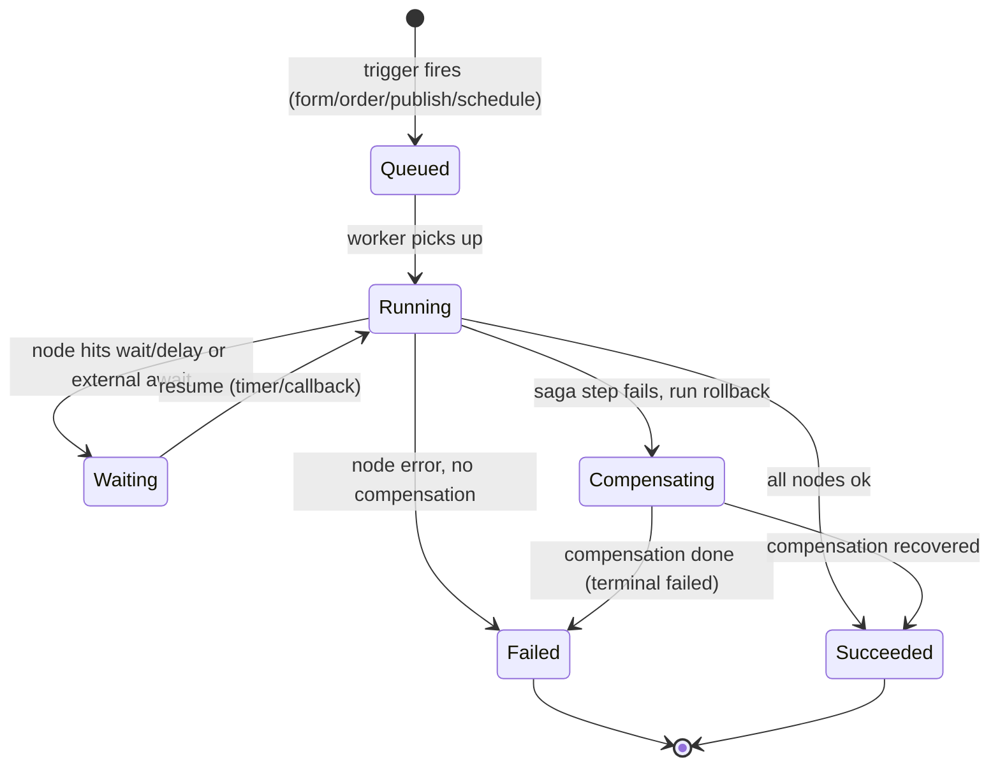

### 12.6 Workflow Builder behavior (Phase 2)

- Canvas is dark `#0A0A0A` regardless of app theme; thin connection lines; node cards are border-first with a status dot (status domain + icon, never color alone).
- Node types: **Trigger · Condition · Loop · API · Database · Email · SMS · Webhook · AI · CRM · Payment · Custom Code** (`_CONTEXT §8`).
- Triggers: form submission · order completed · post published · scheduled (cron, FB-031).
- Config panel (right drawer): per-node typed fields; references to prior nodes via a `{{ node.output }}` picker; per-node test-run.
- Stored as a **versioned JSON/YAML node graph** (`{trigger, actions:[]}`); deployable across environments; packageable as reusable micro-apps.
- The user **never sees n8n** — the engine runs behind the abstraction (`_CONTEXT §8`).

### 12.7 Run / logs journal (FB-032)

Runs list: status pill + duration + timestamp (mono numerals). Click a run → stage-by-stage **inspectable timeline** (color-blocked per node, WakaTime-style durations) with per-node input/output payloads, errors, retries. A failed node shows its error + payload; "Retry from node" where safe. Workflow definition changes write a **Workflow Changes** audit event (FB-064, FB-032).

### 12.8 Checkout saga (Commerce — vision-tier, Phase 3; documented for completeness)

Traceability: SR-COM-* · FB-043/FB-045 · `_CONTEXT §9`. **Not in the funded 18-month plan** (PRD §5.2); specified so the workflow saga model is forward-compatible.

```mermaid
stateDiagram-v2
    [*] --> Reserve: cart checkout
    Reserve --> Authorize: stock reserved (atomic)
    Authorize --> Confirm: payment authorized (tokenized; not a PSP)
    Confirm --> [*]: order completed, inventory decremented, "order completed" trigger
    Reserve --> Compensate: reservation fails
    Authorize --> Compensate: auth fails / declined
    Confirm --> Compensate: capture fails
    Compensate --> [*]: release stock, void auth, order not completed, user informed
```

**Business rules:** tokenization only (never hold card data, PRD §5.2); stock decrements **atomically** on confirm (FB-042); failure releases the reservation and voids the auth; the customer sees a recoverable message; everything is audited.

---

## 13. Developer Mode & Conflict Resolution (F9)

Traceability: SR-DEV-* · FB-055 (read, Phase 1), FB-056/FB-058 (edit/fork, Phase 2/3) · `01-PRD §17` (one-way), RISK-02. **One-way generation + explicit fork — NOT symmetric round-trip.**

### 13.1 What Developer Mode reveals

| Visual surface | Code surface (Monaco) |
|---|---|
| Page / block | React/TSX component + props |
| Data binding | generated query + service/controller |
| Workflow | Workflow JSON/YAML node graph |
| API | REST route / GraphQL schema / OpenAPI |
| Database (collection) | schema view / Prisma model |

Phase 1 = **read-only** view (FB-055). Edit/fork is Phase 2/3 (FB-056/FB-058). Read-only for roles without the code capability (§3.1).

### 13.2 The one-way rule (the moat mechanic, honestly scoped)

- **Visual → Code is always available** (generation is one-way and lossless into code).
- **Code → Visual re-import is allowed ONLY** for code that matches the generator's **lossless canonical AST grammar**.
- The **instant** a user edits **outside** that grammar, the block becomes a **sealed, clearly-labeled "Custom Component"** that is **no longer visually editable** (it still renders, still takes props where declared).

### 13.3 Edit classes — round-trip vs fork

| Edit class | Example | Result |
|---|---|---|
| **In-grammar prop/style change** | change a Tailwind token, reorder children, edit text | Round-trips to Visual |
| **In-grammar structural** | add/remove a block from the known set | Round-trips to Visual |
| **Out-of-grammar** | arbitrary JS, new imports, hooks, custom JSX | **Seals to Custom Component** (fork) |

### 13.4 Conflict resolution (generated vs hand-edited)

**Per-artifact ownership rule: never silently regenerate over hand edits.**

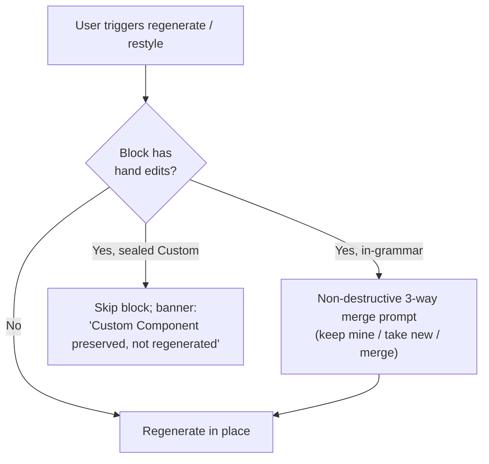

- Generated vs hand-edited regions are **visibly marked** in both surfaces.
- "Keep my edits, restyle the rest" (PRD §8.5) regenerates only unedited regions.
- A conflict is **never auto-resolved destructively** — the user chooses.

### 13.5 RISK-02 gate

The lossless-AST round-trip feasibility is a **Phase-1 go/no-go spike** (PRD RISK-02). If the grammar cannot be proven lossless for the Phase-1 block set, the fallback is: Visual→Code one-way only + Custom-Component fork (no re-import) — the wedge still holds.

---

## 14. Publish & Deploy Behavior (F10)

Traceability: SR-DEP-* · FB-014, FB-067 · `01-PRD §15` · Change-memo §6.

### 14.1 Staging-by-default

- Generation/import/edit output lands in **staging** with a **preview URL that is `noindex`** by default. Nothing is publicly indexed until explicit promotion.
- Promote-to-production is an explicit action (button or palette command) — **never automatic**.

### 14.2 Publish/deploy flow (numbered)

1. User clicks **Publish** (or palette "Publish page/site").
2. Pre-flight checks: required fields, broken bindings (§10.2), a11y/AA contrast on generated blocks (eval gate, PRD §9), and unsaved changes. Failures → page-level banner listing each blocker (each links to the offending surface).
3. Build runs (Vercel/Netlify one-click or container target via Git + GitHub Actions, FB-067).
4. On build failure → deploy blocked, error surfaced (banner + log link). On success → live URL shown and recorded; deployment counter ticks on the Space dashboard.
5. **Custom domain + SSL** flow: add domain → DNS verification (CNAME/A record shown) → SSL auto-provisioned → status pill (pending/active/fail + icon).
6. **One-click un-publish** removes the public version (returns to staging). **Rollback** restores any prior published version (wired to version history, §11.4 / FB-015).

### 14.3 Deploy state machine

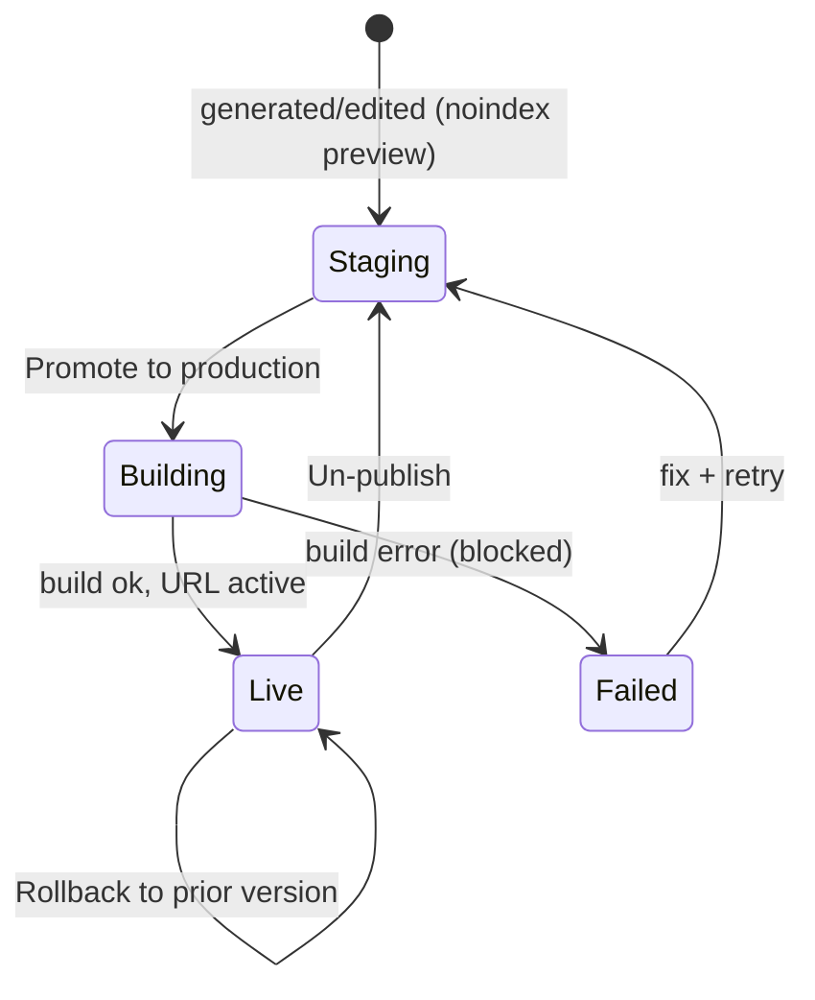

### 14.4 Domain/SSL states

pending-DNS (amber + clock) → verifying → active (green + check) → failed (red + x, with the exact DNS record to fix). Never color alone.

---

## 15. AI Generation Pipeline & Job State Machine (F7)

Traceability: SR-AI-* · FB-046, FB-047, FB-049, FB-050 (FB-048 cut from Phase 1) · `01-PRD §8/§9`, `_CONTEXT §6`. Change-memo §1.

### 15.1 Generation job state machine

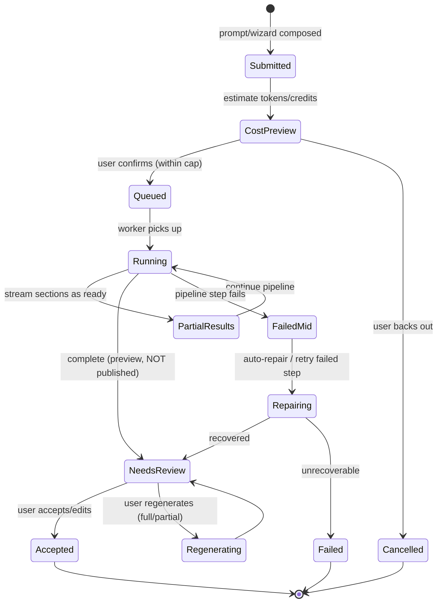

### 15.2 Constrained generation surface (business rule)

AI **selects and parameterizes vetted block templates** and a **small set of pre-modeled schema archetypes** — **not** free-form schema synthesis (`01-PRD §5.2/§8`; FB-048 cut from Phase 1). Generated DDL never auto-applies (records store; dry-run + diff gate). Output is design-token-constrained and a11y-validated (the curated library + eval gate).

### 15.3 The full generation flow (build order, on top of primitives)

Per `_CONTEXT §6` but obeying the PRD's "AI-first is GTM framing, not build order": the generator sits **on top of** Builder + Data + CMS primitives.

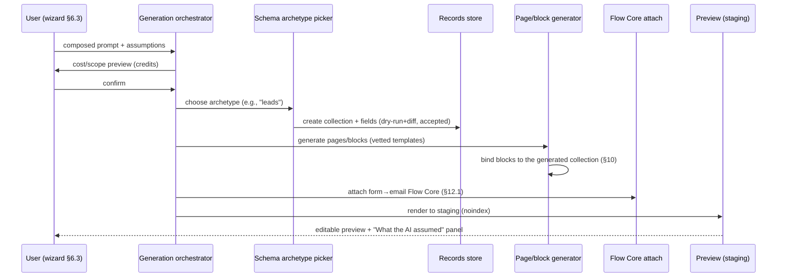

### 15.4 Progress, partial results, cost preview

- **Cost preview** before run (credits; soft cap warn, hard cap on Free).
- **Progress**: per-stage progress (schema → pages → bindings → flow), each stage streams **partial results** into the canvas as it completes (skeleton → content), so the user sees structure forming.
- **Latency**: generation p95 within budget (PRD §9.1); breach pages on-call.

### 15.5 Failure mid-pipeline & repair loop

If a stage fails (e.g., page generation errors after schema succeeded):
1. The job enters **FailedMid**; completed stages are **preserved** (the collection that was created is kept).
2. Auto-repair retries the failed step once with adjusted parameters.
3. If still failing → page-level banner: "Generated your data and 2 of 4 pages. Couldn't finish the rest — Retry the remaining, or keep what's here." The user never loses completed work or the prompt (PRD AI-outage rule §15).

### 15.6 "What the AI assumed" panel (editable)

Every generation exposes an editable panel listing: industry, sections chosen, schema archetype + fields, copy tone, style. Editing any assumption enables **Re-run** (full) or **partial regenerate** (§15.7).

### 15.7 Refinement: partial regeneration & human-accept

- **Keep my edits, restyle the rest** — regenerates only unedited regions (per-artifact ownership, §13.4).
- **Variations** — generate alternate versions of a single block; pick one.
- **Human-accept step** — generation **never auto-publishes**; output sits in `NeedsReview` (staging) until the user accepts/edits and explicitly publishes (§14).

### 15.8 Quality eval gate (CI, business rule)

Generation must pass the eval gate before a model/template change ships (PRD §9.1): golden-prompt set, automated scorers (renders-without-error, AA contrast, schema validity, binding integrity) at **≥90% pass**, human-eval rubric, CI regression gate, latency p95 + per-gen cost budget. This is a release gate, surfaced to users only as consistently good output.

### 15.9 Generation states (UX)

submitting = composing skeleton; running = per-stage progress with partial render; needs-review = preview + assumptions panel + Accept/Regenerate/Discard; failed-mid = banner preserving partial work; error = retry with prompt preserved.

---

## 16. End-to-End Hero Flow: One-Prompt Generation (F1)

Traceability: SR-AI-*, SR-DATA-*, SR-FLOW-*, SR-DEP-* · FB-046, FB-050, FB-023/024, FB-027, FB-033, FB-067, Flow Core · `01-PRD §2/§5.1` (the wedge). **This is the MVP slice proven end-to-end.**

### 16.1 The wedge in one numbered flow

1. **Prompt** — user completes the wizard (§6.3) or types a prompt; sees the composed prompt + cost preview.
2. **Generate database** — orchestrator picks a pre-modeled archetype (e.g., `leads`/`menu_items`), creates a **collection** in the records store (dry-run+diff accepted) (FB-023/024).
3. **Generate pages** — vetted block templates produce a page set, rendered to staging (FB-046).
4. **Bind to the real table** — blocks are auto-bound to the generated collection via binding descriptors (§10); a list/card block repeats over real rows; "shows live data from {Collection}".
5. **Attach form→email Flow Core** — a contact/lead form's `onSubmit` is wired to **store record + email the owner** (§12.1).
6. **View/fork code in Developer Mode** — the user toggles Developer Mode and **views** the generated React/query/schema (read, Phase 1); may **fork** a block to a Custom Component (§13).
7. **Publish** — explicit promote from staging (noindex) → production with custom domain + SSL; rollback available (§14).
8. **Export guarantee** — at any time the user can export content (JSON/Markdown), data (dump), and code (a real Git repo) (PRD §14.2).

### 16.2 End-to-end sequence

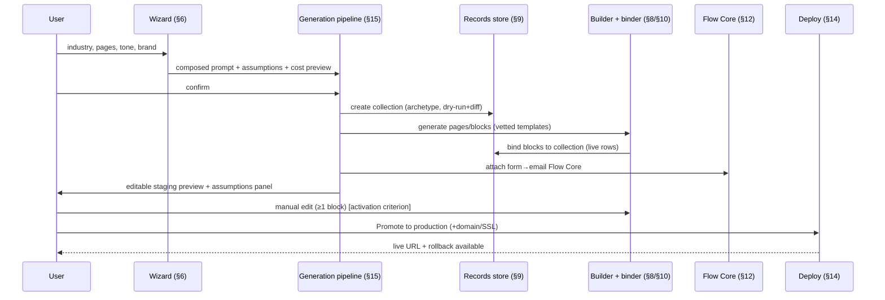

### 16.3 Activation tie-in

This flow produces **Activation** (PRD §11.2) only when, within 7 days of Space creation, the user has **generated AND made ≥1 manual edit to a generated block AND published to a live URL**. The FSD surfaces (edit telemetry, publish event) emit the product events that compute it.

### 16.4 Failure handling across the flow

| Stage | Failure | Behavior |
|---|---|---|
| Generate | model/timeout | repair loop (§15.5); prompt preserved |
| Schema | archetype invalid | dry-run+diff blocks apply; user adjusts assumption |
| Bind | broken mapping | inline pill on Data tab; preview shows error placeholder |
| Flow Core | email send fails | record still saved (outbox); row-pill retry |
| Publish | build fails | deploy blocked; banner with log; staging intact |

---

## 17. AI-Generate-Database (FB-048) — Cut From Phase 1 (documented)

Traceability: FB-048 · `01-PRD §5.2/§10.2`. **Cut from Phase 1.** Specified so the boundary is explicit and Phase-1.5 work is unambiguous.

- In Phase 1, schema comes **only** from **pre-modeled archetypes** parameterized by the generator (§15.2). Free-form AI schema synthesis is **not** offered.
- If revisited (gated), the agent **proposes** tables/fields/relations → presents a **reviewable diff** → user accepts → **dry-run + diff gate** → applied to the records store as collections. **AI-authored DDL never auto-applies** (RISK-10).
- Until then, the binder/Database Builder (§9, §10) and archetype generation cover the wedge.

---

## 18. AI-Trust & Guardrails Behavior

Traceability: SR-AI-GOV-* · `01-PRD §9.2` · Change-memo §7.

### 18.1 Human-in-the-loop rules

| AI action | Approval required? | Behavior |
|---|---|---|
| Generate page/copy/schema into **staging** | No (reversible, not live) | Streams to preview; accept/discard |
| Apply an AI edit to a **published** surface | **Yes** | Explicit publish step (§14) |
| Contact a **real person** (CRM follow-up email to a lead) | **Yes — always HITL** | Drafts only; queued for human send |
| Irreversible change (delete, drop, overwrite hand edits) | **Yes** | Confirm + never silent (§13.4) |

### 18.2 Uncertainty & undo

- AI surfaces an **"uncertain / needs review"** state when confidence is low (e.g., ambiguous prompt) — it asks a clarifying question or marks the output for review rather than guessing silently (FB-047 clarifying-question behavior).
- **Every AI action is undoable** — applied AI changes push an undo command and show an "Undo" affordance in the applied toast.

### 18.3 Moderation & IP

Input/output moderation on prompts and generated content; generated code/content is the customer's and exportable (PRD §9.2, §14.2).

---

## 19. Authentication & Session Behavior

Traceability: SR-AUTH-* · FB-005…FB-010 · `_CONTEXT §10`, `03`.

### 19.1 Registration / login (numbered)

1. **Register** (`POST /api/signup`): email + strong password → bcrypt hash, verification email sent. Weak/breached password → inline field error with policy. Duplicate email → **non-enumerating** error ("If that email is available, we'll send a verification link.").
2. **Login** (`POST` via Supabase Auth): valid credentials → **15-min access token + 30-day refresh token** in **Secure HttpOnly cookies** (never LocalStorage). Invalid attempts → rate-limited after threshold (inline error, then lockout banner). Success → `Login` audit event (FB-064).
3. **OAuth** (Google/GitHub): authorize → account created/linked by **verified email** (no duplicate identities); cookies issued identically. Cancel/error → recoverable error state, not a broken page.
4. **MFA** (FB-009; mandatory for admins, **deferred-but-specified** for Phase 1 non-admins): TOTP/OTP required before tokens issue; recovery codes shown once, stored hashed; MFA change → security audit event.

### 19.2 Session lifecycle

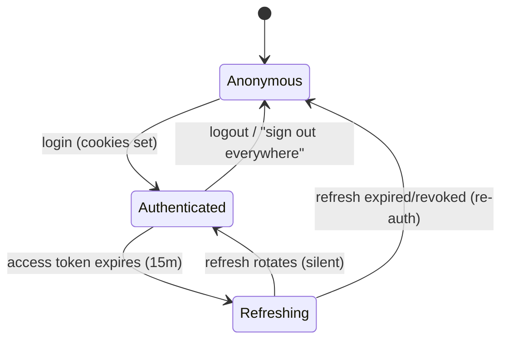

**Business rules:** silent refresh-token **rotation**; active-session listing + per-session and global revoke; revoked/expired refresh token is rejected and forces re-auth (FB-010). Asymmetric JWT (RS256/EdDSA + JWKS), alg pinned on every verifier (`01-PRD §17`, `03`).

### 19.3 Auth states & errors

Loading = button disabled + inline progress; invalid creds = inline field error (non-enumerating); rate-limited = page-level banner with cooldown; OAuth fail = recoverable banner with retry; expired session mid-action = silent refresh, else redirect preserving return URL.

---

## 20. Space Management Behavior

Traceability: SR-SPACE-* · FB-001…FB-004 · `_CONTEXT §3`.

### 20.1 Create Space (FB-001)

Inputs: Space name (→ unique slug). Validation: non-empty; unique slug within Org (duplicate → inline error). Output: a Space row with `space_id` + `tenant_id`; creator assigned **Owner**; default left-nav + empty layer stack initialized; first row written carries correct scoping and RLS proven by a cross-tenant zero-row test.

### 20.2 Delete Space (FB-002)

**Owner only.** Typed-confirmation guard (type the slug, §7.3). Cascades removal of all `space_id`-scoped rows, schedules S3/R2 asset teardown and deployed-site teardown, supports GDPR self-delete. Non-Owner → hidden + backend-rejected. Records a lifecycle/Permission-Changes audit entry.

### 20.3 Settings (FB-003)

General info, locale defaults, environments (dev/staging/prod), custom domains, per-tenant integration keys. Changes persist and reflect immediately. Non-Admin → restricted fields read-only. Adding an environment makes it a deploy target (§14).

### 20.4 Clone Space (FB-004 — Phase 2, agency core)

Deep-copy pages, content models, collections, workflows, APIs, themes, assets into a **new** `space_id`/`tenant_id` boundary with regenerated ids; **no reference leaks** to the source tenant; assets duplicated/copy-on-write. Mid-clone failure **rolls back** leaving no partial Space.

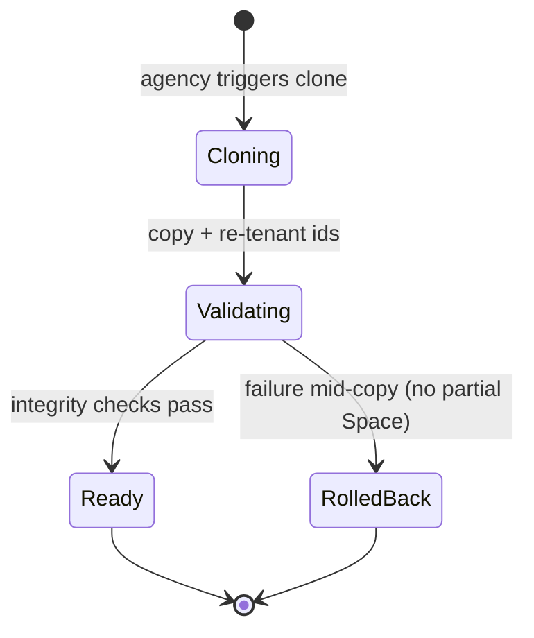

---

## 21. API Layer Behavior

Traceability: SR-API-* · FB-033 (REST, Phase 1), FB-034/035/036 (Phase 2) · `_CONTEXT §11`.

### 21.1 Auto-generation

Creating a content type/collection auto-generates **REST CRUD** immediately callable (FB-033). Endpoint naming: `/api/<resource>`, `/api/<resource>/{id}`. Each request: API verifies JWT (alg pinned) + rate limits, then RLS scopes rows to the tenant. GraphQL + GraphiQL explorer, Webhooks (signed, retried, logged), and Swagger/SDK are Phase 2 (FB-034/035/036).

### 21.2 API request behavior

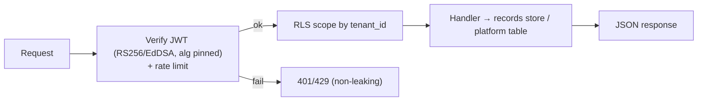

Errors follow the taxonomy: 4xx with a machine code + human message; never a stack trace; rate-limit returns a clear retry-after.

---

## 22. Marketplace & Template/Clone Flywheel Behavior

Traceability: SR-MKT-* · FB-051 (install + clone seed, pulled to Phase 1–2), FB-052/053/054 (Phase 3) · `_CONTEXT §12/§13`, `01-PRD §3.2`.

- **Template install (FB-051):** browse/filter by category → install → pages/content models/theme applied into the target Space (**re-tenanted**). Paid template → **20% commission** recorded (FB-066). Semver push-updates opt-in.
- **Clone-as-flywheel:** cloning a proven Space (§20.4) seeds new Spaces; the binder/bindings/Flow Core carry over. This is Moat B (PRD §3.2) and is **pulled forward to Phases 1–2**.
- **Plugins / workflow / AI-agent marketplace (Phase 3):** sandboxed (containerized) + code-reviewed; scoped capability grants; AI agents run with metered credits and HITL on real-person contact (§18). 20% commission applies.

---

## 23. Analytics & Dashboard Behavior (Phase 2)

Traceability: SR-ANL-* · `04-FRONTEND-SPEC §10`.

Every dashboard uses the three-tier pattern: lead health metric → KPI row (mono number + signed % delta + sparkline) → full-width time-series → horizontal-bar breakdown grid (never pie) → calendar heatmap where relevant. Role dashboards (CEO/CTO/Manager/Dev) per `04`. The **North-star** (count of live AND trailing-7-day-edited Spaces), **Activation rate**, **Layer Depth**, and **generation acceptance** (PRD §11) are first-class tiles. Strict semantic color: status colors carry icon+label; chart colors never reused as status.

---

## 24. Global Business Rules (consolidated)

| # | Rule | Source |
|---|---|---|
| BR-1 | Every tenant-owned row carries `tenant_id` + `space_id`; RLS keys on `tenant_id`, app scopes on `space_id`. | `_CONTEXT §3`, FB-061 |
| BR-2 | Three-layer enforcement (UI hide → JWT verify → RLS) on every gated action; UI is never the boundary. | §3.2, `03` |
| BR-3 | Generated DDL/schema **never auto-applies**; dry-run + diff gate; tenant data lives in the JSONB records store. | `02`, §9 |
| BR-4 | Generation **never auto-publishes**; staging (noindex) by default; explicit promote. | §14, `01-PRD §8` |
| BR-5 | Visual→Code one-way; out-of-grammar edits seal a Custom Component; never silently regenerate over hand edits. | §13 |
| BR-6 | AI inference platform-provided by default; metered credits; soft cap (paid) / hard cap (Free); BYO-key advanced-only. | `01-PRD §12` |
| BR-7 | No AI action contacts a real person or makes an irreversible change without human approval; every AI action is undoable. | §18 |
| BR-8 | Authors edit only own content and cannot publish; editors/reviewers publish; ABAC enforced at all three layers. | §11.2, `03` |
| BR-9 | 15-min access / 30-day refresh tokens in Secure HttpOnly cookies, never LocalStorage; asymmetric JWT, alg pinned. | `_CONTEXT §10`, `03` |
| BR-10 | Non-technical persona defaults to Simple mode (Design/Data/AI); seven-tab power surface gated to Developer/Agency. | §3.1, §8 |
| BR-11 | Loading = layout skeletons (never spinners); errors per taxonomy; never state-by-color-alone. | §4 |
| BR-12 | Export guarantee: content (JSON/MD), data (dump), code (Git repo) exportable at any time. | `01-PRD §14.2` |
| BR-13 | Marketplace commission = 20%; tiers $19 / $99 / $299 / Enterprise. | `_CONTEXT §13` |
| BR-14 | Form-submit targets are interchangeable; Phase-1 enables DB record + email (Flow Core); others gated. | §12.2 |

---

## 25. Traceability Matrix (FSD section → SRS → tickets)

| FSD § | Flow | SRS group | Tickets |
|---|---|---|---|
| §3 | Roles & enforcement | SR-RBAC / SR-SEC | FB-061 |
| §5 | App shell | SR-NAV | FB-062, FB-063 |
| §6 | Onboarding / first-run (F2) | SR-ONB | FB-001, FB-005/006, FB-046 |
| §7 | Command palette (F11) | SR-CMD | FB-063 |
| §8 | Seven-tab inspector | SR-BLD | FB-018, FB-020, FB-021, FB-022, FB-050 |
| §9 | Database Builder | SR-DATA | FB-023…FB-027 |
| §10 | Universal binder (F4) | SR-BIND | FB-027, FB-018 |
| §11 | Content lifecycle / blogging (F3) | SR-CMS | FB-011…FB-016 |
| §12 | Flow Core / workflow / CRM / checkout (F5/F6/F8) | SR-FLOW / SR-WF / SR-COM | FB-028…FB-032, FB-037, FB-043/045, FB-035 |
| §13 | Developer Mode / conflict (F9) | SR-DEV | FB-055/056/058 |
| §14 | Publish & deploy (F10) | SR-DEP | FB-014, FB-067 |
| §15 | AI generation pipeline (F7) | SR-AI | FB-046/047/049/050 |
| §16 | One-prompt generation (F1) | SR-AI/DATA/FLOW/DEP | FB-046, FB-050, FB-023/024, FB-033, FB-067 |
| §17 | AI-Generate-DB (cut) | SR-AI | FB-048 |
| §18 | AI trust & guardrails | SR-AI-GOV | FB-046…FB-050, FB-054 |
| §19 | Auth & session | SR-AUTH | FB-005…FB-010 |
| §20 | Space management | SR-SPACE | FB-001…FB-004 |
| §21 | API layer | SR-API | FB-033…FB-036 |
| §22 | Marketplace / flywheel | SR-MKT | FB-051…FB-054, FB-066 |
| §23 | Analytics | SR-ANL | (Phase 2) |

---

## 26. Open Items (validated per phase, reconciled to `_CONTEXT.md`)

- Exact Phase-1 content-type set and schema-archetype catalog (feeds §15.2).
- Default soft-cap thresholds per tier and worst-case token ceiling (feeds §6.3 cost preview, PRD §12.3).
- Lossless-AST grammar coverage for the Phase-1 block set (RISK-02 spike outcome, §13.5).
- Vision-availability fallback policy for screenshot import (§6.3).
- Named design-partner golden-prompt set for the eval gate (§15.8, PRD §13.2).

> Anything that would change canonical names, numbers, or decisions must first be reconciled against [`_CONTEXT.md`](./_CONTEXT.md).

---

*End of 07-FSD.md (v1.0 FINAL, 2026-06-16). Consistent with `_CONTEXT.md`; cross-references 01-PRD.md, 02-TECHNICAL-ARCHITECTURE.md, 03-SECURITY-AND-ACCESS.md, 04-FRONTEND-SPEC.md, 05-FEATURE-TICKETS.md, 06-SRS.md, 08-DESIGN-SYSTEM.md.*
