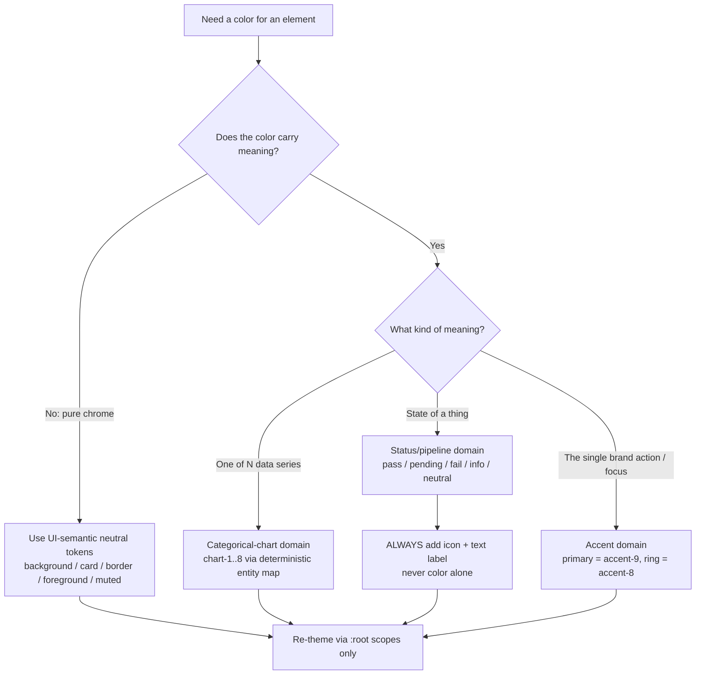
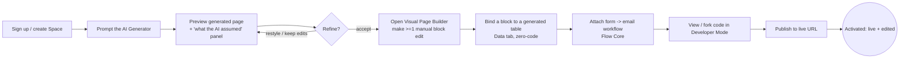
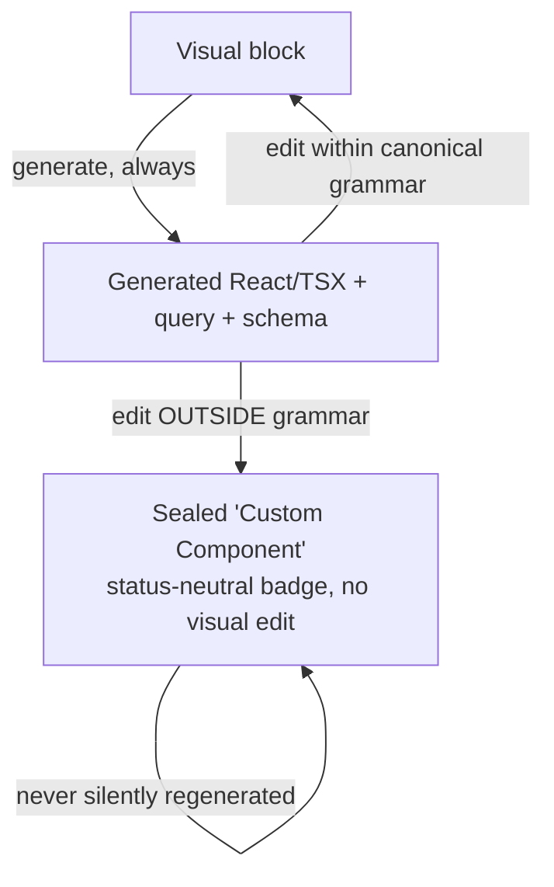
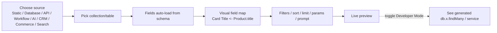
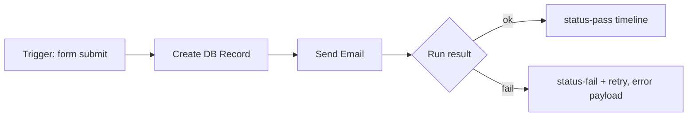
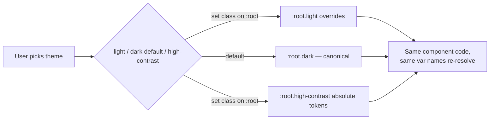

# Flowblok — Design System, Colors & Flows

## 1. Document control

| Field | Value |
|---|---|
| **Document** | 08-DESIGN-SYSTEM.md — Design System, Colors & Flows |
| **Product** | Flowblok — AI-Native Visual Business Operating System (DXOS) |
| **Version** | **v1.0 (FINAL)** |
| **Date** | 2026-06-16 |
| **Owner** | Principal Frontend Architect / Product Design |
| **Status** | FINAL — single source of truth (SSOT) for all visual design |
| **Canonical source** | `_CONTEXT.md` (this doc implements §14, and obeys §3, §4, §7) |

**This file is the single source of truth (SSOT) for Flowblok's visual design.** Every concrete color, type, spacing, radius, elevation, motion, and component value referenced anywhere in the doc set resolves *here*. The previous cross-file precedence prose — "§14 wins for semantics, stitch supplies hex" — is **retired**. Other documents cite this file for values; they do not redefine them.

The machine-readable companion is **`08-DESIGN-TOKENS.css`** (a Tailwind v4 `@theme` + `:root` / `:root.dark` / `:root.high-contrast` token file). Where this prose and the token file ever disagree, **the token file is authoritative for the literal value** and this prose is authoritative for *intent and rules*. Section 4.10 reproduces the token file inline so this document is self-contained.

**Related documents** (cross-reference, keep consistent):

- [`01-PRD.md`](./01-PRD.md) — Product Requirements Document
- [`02-TECHNICAL-ARCHITECTURE.md`](./02-TECHNICAL-ARCHITECTURE.md) — Technical Architecture
- [`03-SECURITY-AND-ACCESS.md`](./03-SECURITY-AND-ACCESS.md) — Security & Access (roles, RLS, 3-layer enforcement)
- [`04-FRONTEND-SPEC.md`](./04-FRONTEND-SPEC.md) — Frontend Specification (screen inventory, chrome, builder surfaces)
- [`05-FEATURE-TICKETS.md`](./05-FEATURE-TICKETS.md) — Feature Ticket List (FB-001 … FB-068)
- [`06-SRS.md`](./06-SRS.md) — Software Requirements Specification
- [`07-FSD.md`](./07-FSD.md) — Functional Specification Document
- [`_CONTEXT.md`](./_CONTEXT.md) — Canonical Planning Context

> **Terminology note (global decision).** The canonical user-facing entity is **Space**. The hierarchy is **Organization → Space**. The word "Workspace" is retired across UI labels, route segments (`/app/{org}/{space}`), and JWT claims. This document uses "Space" throughout; "workspace" appears only inside a literal token name that mirrors a legacy DB column, never as a label.

---

## 2. Design philosophy & north star

**North star:** *"Apple designed a developer operating system."* Flowblok is not a SaaS dashboard with rounded cards and gradients — it is an engineered surface. Every element earns its place; if a border, label, card, or shadow can be removed, it is removed.

### 2.1 The six adjectives (brand feel, applied to every screen)

| Adjective | What it means in the UI |
|---|---|
| **Fast** | Sub-100ms interaction feedback; layout-matched skeletons, never spinners; Cmd/Ctrl+K executes instantly; zero layout shift. |
| **Quiet** | Neutral chrome, **one accent**, no decorative motion. Color appears only to carry meaning (status, chart series, the single accent). |
| **Technical** | Mono/tabular numerals on every figure; dense rows; keyboard-first; code is always one toggle away. |
| **Premium** | Optical-size headings, layered ModernDark depth, precise 8px rhythm, restrained micro-motion. |
| **Precise** | Pixel-honest alignment, single `--radius` knob, deterministic entity→color maps, contrast verified at real size. |
| **Minimal** | Border-first cards, shadows only when an element truly floats, asymmetric layouts, no template aesthetics. |

### 2.2 The dark-first SSOT decision (resolves the light-vs-dark contradiction)

**The product app is dark-first.** The canonical theme is **ModernDark**: deep near-blacks (`#0A0A0A` canvas → `#141414` cards → `#171717` popovers), off-white text (`#FAFAFA`, never `#FFF`), a single indigo/blue accent (`#2563EB`), and layered depth. Dark is the **primary** token scope (`:root.dark` is the canonical authored ramp); **light is the override block** for users and contexts that prefer it; **high-contrast** is a third first-class theme authored as absolute tokens (not deltas).

This reverses the older convention where light hex led and "dark canvas `#0A0A0A`" was a footnote. The reasons: the product is a power-user operating surface viewed for hours; the inspiration set (Linear, Vercel, Raycast, Stripe, Framer, Arc) is dark-led; and the Workflow Builder canvas is unconditionally dark. Light remains fully supported and contrast-verified.

> **Elevation is a rule, not magic numbers.** In dark mode, surfaces get *lighter* as they rise (canvas → card → popover → modal), and each rising surface adds an **inset top-highlight** plus a **diffuse shadow**. The literal box-shadow stacks are in §8; the rule is: *one step lighter background + one stronger shadow stack per elevation level.*

### 2.3 The density doctrine and the non-technical default (resolves KISS-vs-power-user)

Two distinct posture rules, plus a **role-gated default editing mode** so the product serves the non-technical activation persona without dumbing down the power surface for Agency/Developer roles.

- **In the app:** density over whitespace. This is a power-user tool. Compact rows, tight leading, a density toggle.
- **On marketing/landing:** spectacle is welcome — generous whitespace, 120px section rhythm, the marketing-only animation libraries (§13).
- **Simple mode vs Power mode (role-gated, see §2.4):** the non-technical persona gets a **Simple default** — 2–3 visible block tabs (Design / Content / [AI]), progressive disclosure of the rest, comfortable density. The full **seven-tab block surface** and dense ModernDark default are the **Power mode**, the default for Developer/Agency roles. The seven tabs (Design · Data · Logic · Permissions · Events · SEO · AI) always *exist* per `_CONTEXT.md §3`; Simple mode hides the four advanced tabs behind a "Show advanced" disclosure.

**Inspiration set (product):** Linear, Vercel, Raycast, Stripe Dashboard, Framer, Arc, Notion Calendar. The Workflow Builder hero additionally draws on Temporal and GitHub Actions.

### 2.4 Editing-mode × role matrix

| Role (per `03-SECURITY-AND-ACCESS.md`) | Default editing mode | Default density | Default theme |
|---|---|---|---|
| Owner, Admin, Developer | Power (7 tabs) | Compact | Dark |
| Agency operator (Admin/Manager in client Space) | Power (7 tabs) | Compact | Dark |
| Manager | Power, advanced tabs collapsed | Comfortable | Dark |
| Editor, Author | Simple (Design/Content/AI) | Comfortable | Dark |
| Reviewer | Simple, read-biased | Comfortable | Dark or Light (user) |
| Customer, Guest | n/a (consumer surfaces only) | Comfortable | per published site |

Mode and theme are user-overridable and persist per user; the table sets the **first-run default**.

---

## 3. Token architecture & naming convention

### 3.1 Principles (the non-negotiable design law)

1. **Tokens only.** All color is authored in **OKLCH** as CSS custom properties; **never hardcode hex inside a component.** Re-theme the whole app by overriding the same variables under `:root`, `:root.dark`, `:root.high-contrast`.
2. **shadcn ~27-var semantic contract** is the UI-semantic surface. A single **`--radius`** knob derives all corner radii.
3. **Three sealed color domains** (§5): UI-semantic · categorical-chart · status/pipeline. **A chart color is never reused as a status color.** Saturated red/orange is reserved for **waste / error / over-budget** only; healthy = cool & neutral.
4. **State tokens are named aliases** onto the OKLCH ramps (§4.3) — they never reference a bare "step N" without a defined value.
5. **No gradients in the operational app.** Gradients live only in marketing (§13).

### 3.2 Token naming convention

```
--<domain>-<role>[-<modifier>][-<state>]

domain   : (implicit UI-semantic) | chart | status | sidebar | canvas
role     : background, foreground, card, popover, primary, secondary,
           muted, accent, destructive, border, input, ring, …
modifier : -foreground (text-on-surface), -strong (raised border), -glow
state    : -hover, -active, -selected   (only where a discrete state token exists)

ramps    : --neutral-1 … --neutral-12   (Radix-semantics neutral ramp)
           --accent-1   … --accent-12   (Radix-semantics accent ramp)
charts   : --chart-1 … --chart-8        (1–5 canonical, 6–8 auto-extension)
status   : --status-pass | -pending | -fail | -info | -neutral (+ -fg, -bg)
```

Rules: lowercase, hyphenated; every semantic token resolves to a ramp step or an explicit OKLCH triplet; `-foreground` is the legible text color *on* the same-named surface; one variable name has exactly three definitions (one per `:root` scope).

### 3.3 OKLCH ramp semantics (Radix 12-step map)

Every interactive surface maps to the same 12-step mental model. Both the neutral ramp (chrome) and the accent ramp (the one blue) are authored 1–12.

| Step | Semantic role | Example alias |
|---|---|---|
| 1–2 | App / subtle background | `background`, `card` base in dark |
| 3 | Component default background | control rest |
| 4 | Hover background | `--row-hover = neutral-4` |
| 5 | Pressed / selected / **dragging** | `--selected = neutral-5` |
| 6 | Subtle border | resting card border |
| 7 | Interactive border | hovered control border |
| 8 | Strong border / **focus ring** | `--ring = accent-8` |
| 9–10 | Solid / solid-hover | filled primary button |
| 11 | Low-contrast (meta) text | `muted-foreground = neutral-11` |
| 12 | High-contrast (primary) text | `foreground = neutral-12` |

Named state aliases (used everywhere; defined once):

```
--row-hover   : var(--neutral-4)
--selected    : var(--neutral-5)
--border      : var(--neutral-6)   /* resting */
--border-strong : var(--neutral-8) /* meaningful boundaries */
--ring        : var(--accent-8)
--foreground  : var(--neutral-12)
--muted-foreground : var(--neutral-11)
```

---

## 4. The color system (full OKLCH + hex token tables)

All ramps below are authored as explicit OKLCH triplets `oklch(L C H)` and shown with the nearest hex for human reference. **OKLCH is the source of truth; hex is a target.** Three theme scopes are absolute (not deltas): `light` (`:root`), `dark` (`:root.dark`, the product default), `high-contrast` (`:root.high-contrast`).

### 4.1 Neutral ramp (chrome) — 12 steps × 3 themes

The neutral ramp carries all chrome: backgrounds, surfaces, borders, and text. It is hue-neutral (C≈0; the dark ramp carries an imperceptible cool cast for warmth control).

| Step | Light OKLCH | Light hex | Dark OKLCH | Dark hex | High-contrast OKLCH | HC hex |
|---|---|---|---|---|---|---|
| 1 | `oklch(1 0 0)` | `#FFFFFF` | `oklch(0.145 0 0)` | `#0A0A0A` | `oklch(0 0 0)` | `#000000` |
| 2 | `oklch(0.985 0 0)` | `#FAFAFA` | `oklch(0.165 0 0)` | `#0F0F0F` | `oklch(0.04 0 0)` | `#0A0A0A` |
| 3 | `oklch(0.968 0 0)` | `#F4F4F4` | `oklch(0.196 0 0)` | `#141414` | `oklch(0.14 0 0)` | `#1F1F1F` |
| 4 | `oklch(0.946 0 0)` | `#EEEEEE` | `oklch(0.225 0 0)` | `#1A1A1A` | `oklch(0.20 0 0)` | `#2E2E2E` |
| 5 | `oklch(0.922 0 0)` | `#E6E6E6` | `oklch(0.252 0 0)` | `#202020` | `oklch(0.26 0 0)` | `#3D3D3D` |
| 6 | `oklch(0.899 0 0)` | `#DEDEDE` | `oklch(0.285 0 0)` | `#262626` | `oklch(0.40 0 0)` | `#5C5C5C` |
| 7 | `oklch(0.853 0 0)` | `#D0D0D0` | `oklch(0.331 0 0)` | `#2F2F2F` | `oklch(0.52 0 0)` | `#7A7A7A` |
| 8 | `oklch(0.776 0 0)` | `#B8B8B8` | `oklch(0.418 0 0)` | `#404040` | `oklch(0.66 0 0)` | `#9E9E9E` |
| 9 | `oklch(0.617 0 0)` | `#8C8C8C` | `oklch(0.535 0 0)` | `#5C5C5C` | `oklch(0.75 0 0)` | `#B8B8B8` |
| 10 | `oklch(0.581 0 0)` | `#828282` | `oklch(0.583 0 0)` | `#666666` | `oklch(0.82 0 0)` | `#CCCCCC` |
| 11 | `oklch(0.466 0 0)` | `#595959` | `oklch(0.755 0 0)` | `#A6A6A6` | `oklch(0.92 0 0)` | `#E8E8E8` |
| 12 | `oklch(0.205 0 0)` | `#1A1A1A` | `oklch(0.985 0 0)` | `#FAFAFA` | `oklch(1 0 0)` | `#FFFFFF` |

> **Contrast fixes applied (per memo §6).** Light secondary text is raised from `#666666` to **`#595959`** (neutral-11 light) so 13–14px dense text clears 4.5:1 on `#FFFFFF`/`#FAFAFA`. Dark muted text is raised from `oklch(0.70)` to **`oklch(0.755)`** (neutral-11 dark, ≈`#A6A6A6`) so it clears 4.5:1 on `#141414` cards at dense sizes. Evidence in §6.

### 4.2 Accent ramp (the single blue) — 12 steps × 3 themes

One accent only (`#2563EB` family). The ramp gives hover/active/border/focus states without introducing a second hue.

| Step | Light OKLCH | Light hex | Dark OKLCH | Dark hex | High-contrast OKLCH | HC hex |
|---|---|---|---|---|---|---|
| 1 | `oklch(0.991 0.006 264)` | `#FBFCFF` | `oklch(0.171 0.018 264)` | `#0C0E14` | `oklch(0 0 0)` | `#000000` |
| 2 | `oklch(0.979 0.013 264)` | `#F4F7FF` | `oklch(0.196 0.030 264)` | `#10131C` | `oklch(0.08 0.02 264)` | `#0A0E18` |
| 3 | `oklch(0.949 0.032 264)` | `#E4ECFF` | `oklch(0.252 0.060 264)` | `#152042` | `oklch(0.16 0.05 264)` | `#10193A` |
| 4 | `oklch(0.913 0.052 264)` | `#D2E0FF` | `oklch(0.296 0.088 264)` | `#172C5C` | `oklch(0.22 0.08 264)` | `#13235C` |
| 5 | `oklch(0.872 0.073 264)` | `#BCD2FF` | `oklch(0.345 0.112 264)` | `#1B3A7A` | `oklch(0.30 0.11 264)` | `#1A3490` |
| 6 | `oklch(0.823 0.094 264)` | `#A1C0FF` | `oklch(0.401 0.130 264)` | `#22489B` | `oklch(0.40 0.14 264)` | `#2347BE` |
| 7 | `oklch(0.762 0.117 264)` | `#82A9FF` | `oklch(0.467 0.150 264)` | `#2B58C2` | `oklch(0.52 0.17 264)` | `#345FE6` |
| 8 | `oklch(0.682 0.150 264)` | `#5B8DEF` | `oklch(0.548 0.176 264)` | `#3A6BE0` | `oklch(0.66 0.18 264)` | `#5B86FF` |
| 9 | `oklch(0.585 0.196 264)` | `#2563EB` | `oklch(0.585 0.196 264)` | `#2563EB` | `oklch(0.74 0.16 264)` | `#7AA0FF` |
| 10 | `oklch(0.548 0.192 264)` | `#1D55D8` | `oklch(0.628 0.190 264)` | `#3D78F0` | `oklch(0.80 0.13 264)` | `#9CB8FF` |
| 11 | `oklch(0.520 0.190 264)` | `#1B4ECB` | `oklch(0.715 0.150 264)` | `#6E9BFF` | `oklch(0.88 0.09 264)` | `#C2D4FF` |
| 12 | `oklch(0.380 0.140 264)` | `#15348C` | `oklch(0.880 0.060 264)` | `#C9D9FF` | `oklch(0.96 0.04 264)` | `#E6EEFF` |

`--accent` / `--primary` = step 9 in light and dark (the canonical `#2563EB`); in high-contrast, primary is raised to **step 9 (`oklch 0.74`)** to clear ≥7:1 on `#000`. `--ring` = step 8.

### 4.3 UI-semantic tokens (the shadcn ~27-var contract)

These are aliases onto the ramps above. This is the **canonical product-app color table**.

| Token | Light (hex) | Dark — DEFAULT (hex) | High-contrast (hex) | Ramp alias |
|---|---|---|---|---|
| `background` (canvas) | `#FFFFFF` | `#0A0A0A` | `#000000` | neutral-1 |
| `foreground` (text-primary) | `#1A1A1A` | `#FAFAFA` | `#FFFFFF` | neutral-12 |
| `card` / e1 surface | `#FAFAFA` | `#141414` | `#1F1F1F` | neutral-2 / dark neutral-3 |
| `card-foreground` | `#1A1A1A` | `#FAFAFA` | `#FFFFFF` | neutral-12 |
| `popover` / e3 surface | `#FFFFFF` | `#171717` | `#2E2E2E` | neutral-1 / dark ≈neutral-3.5 |
| `popover-foreground` | `#1A1A1A` | `#FAFAFA` | `#FFFFFF` | neutral-12 |
| `primary` / `accent` | `#2563EB` | `#2563EB` | `#7AA0FF` | accent-9 (HC accent-9 raised) |
| `primary-foreground` | `#FFFFFF` | `#FFFFFF` | `#000000` | — |
| `secondary` (subtle fill) | `#F4F4F4` | `#1A1A1A` | `#2E2E2E` | neutral-3 / dark neutral-4 |
| `secondary-foreground` | `#1A1A1A` | `#FAFAFA` | `#FFFFFF` | neutral-12 |
| `muted` (subtle fill) | `#F4F4F4` | `#1A1A1A` | `#2E2E2E` | neutral-3 / dark neutral-4 |
| `muted-foreground` (text-secondary) | `#595959` | `#A6A6A6` | `#E8E8E8` | neutral-11 |
| `border` (resting) | `#DEDEDE` | `oklch(1 0 0 / 0.13)` | `#7A7A7A` | neutral-6 / dark alpha |
| `border-strong` (boundaries) | `#D0D0D0` | `oklch(1 0 0 / 0.22)` | `#9E9E9E` | neutral-7–8 / dark alpha |
| `input` (control border) | `#DEDEDE` | `oklch(1 0 0 / 0.14)` | `#9E9E9E` | neutral-6 / dark alpha |
| `ring` (focus) | `#5B8DEF` | `#3A6BE0` | `#5B86FF` | accent-8 |
| `destructive` | `#BA1A1A` | `oklch(0.637 0.208 25)` (`#E5484D`) | `oklch(0.72 0.20 25)` (`#FF6166`) | status-fail solid |
| `destructive-foreground` | `#FFFFFF` | `#FFFFFF` | `#000000` | — |

> **Dark borders cleared above the invisible 8% (per memo §5).** Resting `border` in dark = `oklch(1 0 0 / 0.13)`, interactive/`input` = `0.14`, `border-strong` = `0.22`. These clear the 3:1 UI-component contrast guideline against `#141414` cards, unlike the old `0.08`.

**Sidebar sub-contract** (chrome stays neutral; never accent-tinted except the active indicator):

| Token | Light | Dark | HC |
|---|---|---|---|
| `sidebar` | `#FAFAFA` | `#0F0F0F` | `#000000` |
| `sidebar-foreground` | `#595959` | `#A6A6A6` | `#E8E8E8` |
| `sidebar-accent` (active bg) | `#F4F4F4` | `#1A1A1A` | `#2E2E2E` |
| `sidebar-accent-foreground` | `#1A1A1A` | `#FAFAFA` | `#FFFFFF` |
| `sidebar-border` | `#EEEEEE` | `oklch(1 0 0 / 0.10)` | `#7A7A7A` |
| `sidebar-ring` | `#5B8DEF` | `#3A6BE0` | `#5B86FF` |

**Hard rules:** never `#000` background in light or dark (only the HC theme uses true black); never `#FFF` text in dark; one accent only; no gradient fills in the operational app.

### 4.4 Categorical-chart domain — `chart-1 … chart-8`

Multi-series chart palettes only. **Never used as a status color.** Tuned for ~constant perceived lightness so no series visually dominates, and CVD-safe: green and red are separated primarily by **L (lightness)**, not just H (hue), so deuteranopes can still distinguish them. Charts 1–5 are canonical; 6–8 are the auto-extension when a chart needs more than five series.

**Light chart palette**

| Token | Hue family | OKLCH | Hex |
|---|---|---|---|
| `chart-1` | blue | `oklch(0.585 0.196 264)` | `#2563EB` |
| `chart-2` | emerald | `oklch(0.640 0.150 162)` | `#10A37A` |
| `chart-3` | violet | `oklch(0.585 0.220 300)` | `#8B3FE8` |
| `chart-4` | amber | `oklch(0.760 0.150 78)` | `#E8A23D` |
| `chart-5` | gray | `oklch(0.617 0 0)` | `#8C8C8C` |
| `chart-6` | cyan | `oklch(0.700 0.130 210)` | `#26A8C7` |
| `chart-7` | pink | `oklch(0.650 0.210 350)` | `#E0489E` |
| `chart-8` | lime | `oklch(0.780 0.160 128)` | `#7FB52E` |

**Dark chart palette** (separately tuned — lifted L, slightly reduced C so series read on near-black without glowing):

| Token | OKLCH | Hex |
|---|---|---|
| `chart-1` | `oklch(0.680 0.170 264)` | `#5B8DEF` |
| `chart-2` | `oklch(0.720 0.140 162)` | `#34C99B` |
| `chart-3` | `oklch(0.680 0.190 300)` | `#A968F0` |
| `chart-4` | `oklch(0.800 0.140 78)` | `#F2B65C` |
| `chart-5` | `oklch(0.700 0 0)` | `#A6A6A6` |
| `chart-6` | `oklch(0.760 0.110 210)` | `#5DC2DA` |
| `chart-7` | `oklch(0.720 0.180 350)` | `#F06AB4` |
| `chart-8` | `oklch(0.830 0.140 128)` | `#A0CE55` |

> **CVD proof.** Under simulated deuteranopia, `chart-2` (emerald, L≈0.64) and any red are distinguishable because their L differs by ≥0.10 and chart never relies on green/red adjacency for meaning. The categorical palette prefers blue/amber/violet ordering for the first three series so the two most common series never collide for protanopes/deuteranopes. Series also carry a **shape/pattern legend** (line dash, marker shape) so color is never the only differentiator.

### 4.5 Status / pipeline domain — sealed, always paired with icon + label

State of a thing. **Never reused as a chart color.** Always rendered as **color + icon + text label** (never color alone) per accessibility law. Saturated red/orange means waste/error/over-budget and nothing else.

**Light**

| Token | Meaning | Required icon (lucide) | Solid OKLCH | Solid hex | Bg (tint) hex | Fg-on-tint hex |
|---|---|---|---|---|---|---|
| `status-pass` | success / healthy | `check` / `check-circle` | `oklch(0.620 0.150 150)` | `#1A9C5B` | `#E7F6EE` | `#0F6E3F` |
| `status-pending` | changes / in-progress | `clock` / `dot` | `oklch(0.760 0.150 78)` | `#E8A23D` | `#FBF2E2` | `#8A5A12` |
| `status-fail` | blocked / error | `x` / `alert-triangle` | `oklch(0.560 0.200 25)` | `#C5343A` | `#FBE9E9` | `#A11A1F` |
| `status-info` | informational | `info` | `oklch(0.585 0.196 264)` | `#2563EB` | `#E8EFFD` | `#1B4ECB` |
| `status-neutral` | draft / idle | `circle` | `oklch(0.617 0 0)` | `#8C8C8C` | `#F1F1F1` | `#595959` |

**Dark**

| Token | Solid OKLCH | Solid hex | Bg (tint) hex | Fg-on-tint hex |
|---|---|---|---|---|
| `status-pass` | `oklch(0.720 0.150 150)` | `#33B978` | `oklch(0.62 0.15 150 / 0.16)` | `#5BD79A` |
| `status-pending` | `oklch(0.800 0.140 78)` | `#F2B65C` | `oklch(0.76 0.15 78 / 0.16)` | `#F5C97E` |
| `status-fail` | `oklch(0.637 0.208 25)` | `#E5484D` | `oklch(0.56 0.20 25 / 0.18)` | `#FF8A8E` |
| `status-info` | `oklch(0.680 0.170 264)` | `#5B8DEF` | `oklch(0.585 0.196 264 / 0.16)` | `#8FB2FF` |
| `status-neutral` | `oklch(0.700 0 0)` | `#A6A6A6` | `oklch(0.70 0 0 / 0.14)` | `#C2C2C2` |

**High-contrast** raises every solid to ≥7:1 on `#000` and uses the strong outline + icon; tints become solid 2px outlines.

### 4.6 KPI delta color logic (desirability, never raw direction)

Delta color keys on **metric desirability**, not on up/down. Each metric declares a `goodDirection` flag.

```ts
type GoodDirection = 'up' | 'down' | 'neutral';

function deltaColor(delta: number, good: GoodDirection): 'pass' | 'fail' | 'neutral' {
  if (delta === 0 || good === 'neutral') return 'neutral';
  const improving =
    (good === 'up'   && delta > 0) ||
    (good === 'down' && delta < 0);
  return improving ? 'pass' : 'fail';   // → status-pass / status-fail tokens
}
```

- **MRR ↑** → green; **Churn ↑** → red; **Waste% ↓** → green (must NOT render red just because the number fell); **Page-load p95 ↑** → red.
- **Always pair an arrow icon** (`arrow-up` / `arrow-down`) with the delta — never color alone. The arrow shows *direction*; the color shows *good/bad*; the two can disagree (e.g. green down-arrow for falling Waste%).

### 4.7 Deterministic entity → color map (never random)

Breakdown cards, chart series, and avatars must assign the same color to the same entity every render.

```ts
// Stable hash → chart slot. Fixed lookups override the hash for known entities.
const FIXED: Record<string, number> = {
  // AI models (fixed across the whole product)
  'openai':1, 'anthropic':3, 'gemini':4, 'local':5,
  // pipeline stages reuse status domain, NOT chart — handled separately
};
function entityChartToken(id: string): string {
  if (id in FIXED) return `--chart-${FIXED[id]}`;
  let h = 0; for (const c of id) h = (h * 31 + c.charCodeAt(0)) >>> 0;
  return `--chart-${(h % 8) + 1}`;   // chart-1..8
}
```

Languages use the GitHub Linguist palette mapped onto `chart-*`; AI models/agents are fixed; user-defined entities (projects, Spaces) are hashed and may be user-customized. **No `Math.random()` color assignment, ever.**

### 4.8 Workflow canvas — a themed token context (not hardcoded)

The Workflow Builder canvas reads as "always dark," but it is implemented as a **scoped theme context** (`.workflow-canvas { …canvas tokens… }`) so it honors high-contrast and never bakes `#0A0A0A` into markup.

| Canvas token | Dark default | High-contrast |
|---|---|---|
| `--canvas-bg` | `#0A0A0A` (neutral-1 dark) | `#000000` |
| `--canvas-grid` | `oklch(1 0 0 / 0.04)` | `oklch(1 0 0 / 0.16)` |
| `--canvas-grid-major` | `oklch(1 0 0 / 0.07)` | `oklch(1 0 0 / 0.24)` |
| `--canvas-edge` (connection line) | `oklch(0.755 0 0)` (`#A6A6A6`) | `#FFFFFF` |
| `--canvas-edge-active` | `--accent-9` (`#2563EB`) | accent-9 HC |
| `--node-bg` | `#141414` (card) | `#1F1F1F` |
| `--node-border` | `oklch(1 0 0 / 0.13)` | `#9E9E9E` |
| node status dot | from `status-*` domain + icon | HC status + icon |

In a light-theme app the canvas *stays* dark by default (focus surface) but uses these same variable names; switching to high-contrast remaps them. Never hardcode the hex in a node component.

### 4.9 Color decision flow (the tree every designer follows)



**Do / Don't gallery:**

| Do | Don't |
|---|---|
| Use neutral chrome for 95% of surfaces. | Don't add a gradient anywhere in the app. |
| Use `chart-2` (emerald) for a data series. | Don't reuse `chart-2` as a "success" status. |
| Use `status-pass` + check icon + "Passed". | Don't show green with no icon/label. |
| Use one accent (`#2563EB`) for the primary action and focus ring. | Don't introduce a second accent hue in-app. |
| Assign entity colors by hash/lookup. | Don't assign chart colors randomly per render. |
| Render falling Waste% with a green down-arrow. | Don't color a delta red just because it went down. |

### 4.10 Machine-readable token file (`08-DESIGN-TOKENS.css`)

This block is the SSOT token file (Tailwind v4 `@theme` + scoped `:root` overrides). It is reproduced here in full so this document is self-contained; ship it verbatim as `08-DESIGN-TOKENS.css`.

```css
/* 08-DESIGN-TOKENS.css — Flowblok Design System SSOT (v1.0 FINAL) */
/* OKLCH is the source of truth. Three scopes: :root (light), :root.dark (DEFAULT), :root.high-contrast. */

@theme {
  --font-sans: "Inter", system-ui, sans-serif;
  --font-mono: "Geist Mono", "JetBrains Mono", ui-monospace, monospace;
  --radius: 0.5rem;            /* 8px — single knob */
  --radius-sm: calc(var(--radius) - 4px);
  --radius-md: calc(var(--radius) - 2px);
  --radius-lg: var(--radius);
  --radius-xl: calc(var(--radius) + 4px);
  --ease-out: cubic-bezier(0.16, 1, 0.3, 1);
  --dur-micro: 120ms;
  --dur-standard: 180ms;
  --dur-deliberate: 240ms;
}

/* ---------- DARK = product default ---------- */
:root, :root.dark {
  color-scheme: dark;
  --neutral-1:oklch(0.145 0 0); --neutral-2:oklch(0.165 0 0);
  --neutral-3:oklch(0.196 0 0); --neutral-4:oklch(0.225 0 0);
  --neutral-5:oklch(0.252 0 0); --neutral-6:oklch(0.285 0 0);
  --neutral-7:oklch(0.331 0 0); --neutral-8:oklch(0.418 0 0);
  --neutral-9:oklch(0.535 0 0); --neutral-10:oklch(0.583 0 0);
  --neutral-11:oklch(0.755 0 0); --neutral-12:oklch(0.985 0 0);

  --accent-7:oklch(0.467 0.150 264); --accent-8:oklch(0.548 0.176 264);
  --accent-9:oklch(0.585 0.196 264); --accent-10:oklch(0.628 0.190 264);
  --accent-11:oklch(0.715 0.150 264); --accent-12:oklch(0.880 0.060 264);

  --background:var(--neutral-1); --foreground:var(--neutral-12);
  --card:var(--neutral-3); --card-foreground:var(--neutral-12);
  --popover:oklch(0.205 0 0); --popover-foreground:var(--neutral-12);
  --primary:var(--accent-9); --primary-foreground:oklch(1 0 0);
  --secondary:var(--neutral-4); --secondary-foreground:var(--neutral-12);
  --muted:var(--neutral-4); --muted-foreground:var(--neutral-11);
  --accent:var(--accent-9);
  --border:oklch(1 0 0 / 0.13); --border-strong:oklch(1 0 0 / 0.22);
  --input:oklch(1 0 0 / 0.14); --ring:var(--accent-8);
  --destructive:oklch(0.637 0.208 25); --destructive-foreground:oklch(1 0 0);

  --row-hover:var(--neutral-4); --selected:var(--neutral-5);

  --chart-1:oklch(0.680 0.170 264); --chart-2:oklch(0.720 0.140 162);
  --chart-3:oklch(0.680 0.190 300); --chart-4:oklch(0.800 0.140 78);
  --chart-5:oklch(0.700 0 0); --chart-6:oklch(0.760 0.110 210);
  --chart-7:oklch(0.720 0.180 350); --chart-8:oklch(0.830 0.140 128);

  --status-pass:oklch(0.720 0.150 150); --status-pending:oklch(0.800 0.140 78);
  --status-fail:oklch(0.637 0.208 25); --status-info:oklch(0.680 0.170 264);
  --status-neutral:oklch(0.700 0 0);

  --sidebar:oklch(0.165 0 0); --sidebar-foreground:var(--neutral-11);
  --sidebar-accent:var(--neutral-4); --sidebar-accent-foreground:var(--neutral-12);
  --sidebar-border:oklch(1 0 0 / 0.10); --sidebar-ring:var(--ring);

  --canvas-bg:oklch(0.145 0 0); --canvas-grid:oklch(1 0 0 / 0.04);
  --canvas-grid-major:oklch(1 0 0 / 0.07);
  --canvas-edge:oklch(0.755 0 0); --canvas-edge-active:var(--accent-9);

  /* elevation */
  --e0:none;
  --e1:0 0 0 1px oklch(1 0 0 / 0.06);
  --e2:0 0 0 1px oklch(1 0 0 / 0.07), 0 2px 6px oklch(0 0 0 / 0.5);
  --e3:inset 0 1px 0 oklch(1 0 0 / 0.06), 0 0 0 1px oklch(1 0 0 / 0.08), 0 8px 24px oklch(0 0 0 / 0.6);
  --e4:inset 0 1px 0 oklch(1 0 0 / 0.08), 0 0 0 1px oklch(1 0 0 / 0.10), 0 16px 48px oklch(0 0 0 / 0.7);
  --glow-drag:0 0 0 1px var(--accent-9), 0 0 16px oklch(0.585 0.196 264 / 0.45);
}

/* ---------- LIGHT = override ---------- */
:root.light {
  color-scheme: light;
  --neutral-1:oklch(1 0 0); --neutral-2:oklch(0.985 0 0);
  --neutral-3:oklch(0.968 0 0); --neutral-4:oklch(0.946 0 0);
  --neutral-5:oklch(0.922 0 0); --neutral-6:oklch(0.899 0 0);
  --neutral-7:oklch(0.853 0 0); --neutral-8:oklch(0.776 0 0);
  --neutral-9:oklch(0.617 0 0); --neutral-10:oklch(0.581 0 0);
  --neutral-11:oklch(0.466 0 0); --neutral-12:oklch(0.205 0 0);

  --accent-7:oklch(0.762 0.117 264); --accent-8:oklch(0.682 0.150 264);
  --accent-9:oklch(0.585 0.196 264); --accent-10:oklch(0.548 0.192 264);
  --accent-11:oklch(0.520 0.190 264); --accent-12:oklch(0.380 0.140 264);

  --background:var(--neutral-1); --foreground:var(--neutral-12);
  --card:var(--neutral-2); --card-foreground:var(--neutral-12);
  --popover:var(--neutral-1); --popover-foreground:var(--neutral-12);
  --primary:var(--accent-9); --primary-foreground:oklch(1 0 0);
  --secondary:var(--neutral-3); --secondary-foreground:var(--neutral-12);
  --muted:var(--neutral-3); --muted-foreground:var(--neutral-11);
  --accent:var(--accent-9);
  --border:var(--neutral-6); --border-strong:var(--neutral-7);
  --input:var(--neutral-6); --ring:var(--accent-8);
  --destructive:oklch(0.505 0.213 27); --destructive-foreground:oklch(1 0 0);

  --row-hover:var(--neutral-4); --selected:var(--neutral-5);

  --chart-1:oklch(0.585 0.196 264); --chart-2:oklch(0.640 0.150 162);
  --chart-3:oklch(0.585 0.220 300); --chart-4:oklch(0.760 0.150 78);
  --chart-5:oklch(0.617 0 0); --chart-6:oklch(0.700 0.130 210);
  --chart-7:oklch(0.650 0.210 350); --chart-8:oklch(0.780 0.160 128);

  --status-pass:oklch(0.620 0.150 150); --status-pending:oklch(0.760 0.150 78);
  --status-fail:oklch(0.560 0.200 25); --status-info:oklch(0.585 0.196 264);
  --status-neutral:oklch(0.617 0 0);

  --sidebar:var(--neutral-2); --sidebar-foreground:var(--neutral-11);
  --sidebar-accent:var(--neutral-3); --sidebar-accent-foreground:var(--neutral-12);
  --sidebar-border:oklch(0.946 0 0); --sidebar-ring:var(--ring);

  --canvas-bg:oklch(0.145 0 0); --canvas-grid:oklch(1 0 0 / 0.04);
  --canvas-grid-major:oklch(1 0 0 / 0.07);
  --canvas-edge:oklch(0.755 0 0); --canvas-edge-active:var(--accent-9);

  --e0:none;
  --e1:0 0 0 1px var(--neutral-6);
  --e2:0 0 0 1px var(--neutral-6), 0 1px 3px oklch(0 0 0 / 0.06);
  --e3:0 0 0 1px var(--neutral-6), 0 4px 16px oklch(0 0 0 / 0.08);
  --e4:0 0 0 1px var(--neutral-7), 0 12px 40px oklch(0 0 0 / 0.12);
  --glow-drag:0 0 0 1px var(--accent-9), 0 0 12px oklch(0.585 0.196 264 / 0.25);
}

/* ---------- HIGH-CONTRAST = absolute tokens (not deltas) ---------- */
:root.high-contrast {
  color-scheme: dark;
  --background:oklch(0 0 0); --foreground:oklch(1 0 0);
  --card:oklch(0.14 0 0); --card-foreground:oklch(1 0 0);
  --popover:oklch(0.20 0 0); --popover-foreground:oklch(1 0 0);
  --primary:oklch(0.74 0.16 264); --primary-foreground:oklch(0 0 0);
  --secondary:oklch(0.20 0 0); --secondary-foreground:oklch(1 0 0);
  --muted:oklch(0.20 0 0); --muted-foreground:oklch(0.92 0 0);
  --accent:oklch(0.74 0.16 264);
  --border:oklch(0.52 0 0); --border-strong:oklch(0.66 0 0);
  --input:oklch(0.66 0 0); --ring:oklch(0.66 0.18 264);
  --destructive:oklch(0.72 0.20 25); --destructive-foreground:oklch(0 0 0);
  --row-hover:oklch(0.20 0 0); --selected:oklch(0.26 0 0);
  --canvas-bg:oklch(0 0 0); --canvas-grid:oklch(1 0 0 / 0.16);
  --canvas-grid-major:oklch(1 0 0 / 0.24);
  --canvas-edge:oklch(1 0 0); --canvas-edge-active:oklch(0.74 0.16 264);
  /* focus ring widens to 3px; see motion/a11y */
  --e1:0 0 0 1px oklch(0.52 0 0);
  --e2:0 0 0 1px oklch(0.66 0 0);
  --e3:0 0 0 2px oklch(0.66 0 0);
  --e4:0 0 0 3px oklch(0.66 0 0);
}

@media (prefers-reduced-motion: reduce) {
  :root { --dur-micro:0ms; --dur-standard:0ms; --dur-deliberate:0ms; }
}
```

---

## 5. The three sealed color domains (summary law)

| Domain | Purpose | Tokens | Hard rule |
|---|---|---|---|
| **1. UI-semantic** | Chrome, surfaces, text, the one accent | `background, foreground, card, popover, primary/accent, secondary, muted, border, border-strong, input, ring, destructive, sidebar-*` | One accent (`#2563EB`). Chrome stays neutral. No rainbows, no gradients in-app. |
| **2. Categorical-chart** | Multi-series chart palettes | `chart-1 … chart-8` | CVD-safe; bound only to chart series; deterministic entity map; never a status. |
| **3. Status / pipeline** | State of a thing | `status-pass / -pending / -fail / -info / -neutral` (+ `-bg`, `-fg`) | Always **color + icon + label**. Saturated red/orange = waste/error/over-budget only. Never a chart series. |

The boundary is enforced in code: chart components import only `--chart-*`; status components import only `--status-*`; chrome imports only the UI-semantic set. An ESLint/stylelint rule flags a `--chart-*` used inside a status component and vice versa.

---

## 6. Contrast-evidence table

WCAG target: **AA (4.5:1 body / 3:1 large & UI components) minimum** across the app; **AAA (7:1)** in the high-contrast theme. **The binding constraint is 13–14px dense text at 4.5:1.** All pairs measured at real rendered size; "PASS@13px" means it clears 4.5:1 for normal-weight 13px.

### 6.1 Dark (product default)

| Foreground | Surface | Ratio | Result |
|---|---|---|---|
| `foreground` `#FAFAFA` | canvas `#0A0A0A` | 18.1:1 | PASS (AAA) |
| `foreground` `#FAFAFA` | card `#141414` | 15.6:1 | PASS (AAA) |
| `muted-foreground` `#A6A6A6` (raised) | canvas `#0A0A0A` | 7.4:1 | PASS@13px (AAA) |
| `muted-foreground` `#A6A6A6` (raised) | card `#141414` | 6.4:1 | PASS@13px (AAA) |
| `muted-foreground` `#A6A6A6` (raised) | popover `#171717` | 6.0:1 | PASS@13px |
| ~~old muted `oklch(0.70)` `#999`~~ | card `#141414` | 5.0:1 | borderline → **raised to 0.755** |
| `primary` `#2563EB` text | canvas `#0A0A0A` | 4.9:1 | PASS@13px |
| `primary-foreground` `#FFF` | primary `#2563EB` | 5.0:1 | PASS |
| `border` `oklch(1 0 0/0.13)` | card `#141414` | 3.1:1 (UI) | PASS (3:1 UI guideline) |
| `status-pass` `#33B978` + icon | card `#141414` | 6.2:1 | PASS |
| `status-fail` `#E5484D` + icon | card `#141414` | 4.9:1 | PASS |

### 6.2 Light (override)

| Foreground | Surface | Ratio | Result |
|---|---|---|---|
| `foreground` `#1A1A1A` | canvas `#FFFFFF` | 16.9:1 | PASS (AAA) |
| `muted-foreground` `#595959` (raised) | canvas `#FFFFFF` | 7.0:1 | PASS@13px (AAA) |
| `muted-foreground` `#595959` (raised) | card `#FAFAFA` | 6.7:1 | PASS@13px |
| ~~old secondary `#666666`~~ | canvas `#FFFFFF` | 5.7:1 | OK at 16px but **raised to `#595959`** for 13px headroom |
| `primary-foreground` `#FFF` | primary `#2563EB` | 5.0:1 | PASS |
| `border` `#DEDEDE` | card `#FAFAFA` | 1.2:1 → use `border-strong` `#D0D0D0` where a boundary must read | UI: pairs with layout, not text |

### 6.3 High-contrast

| Foreground | Surface | Ratio | Result |
|---|---|---|---|
| `foreground` `#FFFFFF` | canvas `#000000` | 21:1 | PASS (AAA) |
| `muted-foreground` `#E8E8E8` | canvas `#000000` | 18.1:1 | PASS (AAA) |
| `primary` `#7AA0FF` | canvas `#000000` | 8.2:1 | PASS (≥7:1 target) |
| `border` `#7A7A7A` | canvas `#000000` | 4.6:1 | PASS (≥3:1 UI) |
| focus ring `#5B86FF` @3px | any | — | PASS (visible 3px) |

---

## 7. Typography

**Family:** **Inter** for everything (body + display), implemented as **Inter Variable** with `font-optical-sizing: auto` so the `opsz` axis engages at large sizes (≥32px) to give the "Inter Display" character — there is **no separate "Inter Display" font file**; the optical axis is the mechanism. **Geist Mono** (fallback JetBrains Mono) for numerals and code. **Weights 400 / 500 / 600 only — never 700+.**

```css
.inter { font-family: "Inter", system-ui, sans-serif; font-optical-sizing: auto; }
.numeric { font-family: var(--font-mono); font-feature-settings: "tnum" 1; } /* tabular */
```

### 7.1 Type scale

| Role | Size | Weight | Line-height | Tracking | Notes |
|---|---|---|---|---|---|
| **Display** | 64–80px (72 default) | 600 | 0.95 | -0.04em | Marketing heroes; `opsz` auto. **Wrap:** `text-wrap: balance`, max 2–3 lines, hard `max-width` ~16ch per line; never orphan a single word. |
| **Heading / Headline** | 32–48px (40 default) | 600 | 1.15 | -0.02em | Page titles, section heads; `opsz` engages |
| **Title** | 20–24px | 600 | 1.3 | -0.01em | Card titles, panel heads |
| **Subtitle / Lead** | **18px** | **500** | **1.5** | -0.005em | **NEW — fills the 24→16 gap.** Section intros, lead paragraphs, the largest dense-UI label |
| **Body** | 16px | 400 | 1.6 | 0 | Reading text |
| **Body-medium** | 16px | 500 | 1.6 | 0 | Emphasis, active nav |
| **UI / dense body** | 13–14px | 400/500 | 1.45 | 0 | App rows, tables, controls (the binding contrast constraint) |
| **Label-caps** | 12–13px | 600 | 1.0 | 0.08em | UPPERCASE section labels |
| **Numerals (KPI/table)** | inherits | 500 | — | tabular (`tnum`) | Geist/JetBrains Mono |
| **Code** | 13px | 400 | 1.5 | 0 | Monaco / inline code, mono |

Old stitch front-matter type tokens (e.g. `display-xxl 80px`, `caption 550`) are **superseded** by this scale; they remain valid only inside their marketing variant (§13).

---

## 8. Spacing, radius, elevation, motion, iconography

### 8.1 Spacing — 8px grid

| Token | Value | Use |
|---|---|---|
| `base` | 8px | All spacing is a multiple of 8 (4px allowed for dense inset only) |
| `gutter` | 24px | Grid gutters |
| `margin-page` | 40px (24px dense) | App page edge padding |
| `section-v` | 120px | Major vertical rhythm (marketing only) |
| `max-width (marketing)` | 1200px | Landing column |
| `max-width (app)` | 1280px | App content column |

### 8.2 Radius — single knob

**`--radius = 0.5rem (8px)`** so buttons and cards land on a clean 8px. Derived with shadcn's exact formula:

```
--radius-sm: calc(var(--radius) - 4px);  /* 4px  — chips, inline pills, inputs inner */
--radius-md: calc(var(--radius) - 2px);  /* 6px  — small controls */
--radius-lg: var(--radius);              /* 8px  — buttons, cards, panels */
--radius-xl: calc(var(--radius) + 4px);  /* 12px — modals, large surfaces */
--radius-full: 9999px;                   /* avatars, status dots only */
```

The conflicting fixed radius scale in the stitch front matter (`sm 0.25rem · md 0.75rem · lg 1rem · xl 1.5rem`) is **deleted from canon**; only the derived scale above is authoritative for the app.

### 8.3 Elevation — literal box-shadow stacks per theme

Dark mode = inset top-highlight + surface-lightening + diffuse shadow. Cards are **border-first**; shadows appear only when an element truly floats. Values are the `--e0…--e4` and `--glow-drag` tokens in §4.10.

| Level | Use | Dark composition |
|---|---|---|
| `e0` | Canvas | none |
| `e1` | Card / panel | `0 0 0 1px oklch(1 0 0 / 0.06)` (border-highlight only) |
| `e2` | Hover / selected | border + `0 2px 6px oklch(0 0 0 / 0.5)` |
| `e3` | Popover / dropdown / command palette | `inset 0 1px 0 oklch(1 0 0 / 0.06), 0 0 0 1px oklch(1 0 0 / 0.08), 0 8px 24px oklch(0 0 0 / 0.6)` |
| `e4` | Drawer / modal / dragging card | `inset 0 1px 0 oklch(1 0 0 / 0.08), 0 0 0 1px oklch(1 0 0 / 0.10), 0 16px 48px oklch(0 0 0 / 0.7)` |
| drag glow | dragging card/node (optional) | `--glow-drag: 0 0 0 1px var(--accent-9), 0 0 16px oklch(0.585 0.196 264 / 0.45)` |

Light mode swaps the inset-highlight for a thin neutral-6 border + soft diffuse (see `:root.light` block).

### 8.4 Motion — one easing, three durations

**One easing curve for all tiers:** `--ease-out: cubic-bezier(0.16, 1, 0.3, 1)`. (The old mix of "ease-out" and "expo-out" is retired.) Three durations only.

| Tier | Duration | Move | Use |
|---|---|---|---|
| Micro | **120ms** | ≤4px | Hover, focus, tooltip |
| Standard | **180ms** | ≤8px | Panel open, AnimatePresence enter, NumberTicker |
| Deliberate | **240ms** | ≤8px | Drawer slide, route, drag handoff |

**No bounce, no elastic, no exaggerated scaling.** Opacity + position only; off the drag/scroll hot path.
**Reduced motion:** `prefers-reduced-motion: reduce` sets all three durations to **0ms on enter AND exit** (opacity-only swaps); drag drops to **instant** (no transition). High-contrast keeps the 3px focus ring but no animated ring.

### 8.5 Iconography

- **One set:** `lucide-react`, app-wide. No mixing icon families.
- Default stroke 1.5px (1.75px in high-contrast); sizes from the density set (§9): 16px compact, 18px comfortable, 14px inline-with-13px-text.
- **Status icons are mandatory** (pass=`check`, pending=`clock`, fail=`x`/`alert-triangle`, info=`info`, neutral=`circle`) — color never travels alone.
- Icon-only buttons require an `aria-label`.

---

## 9. Density token sets

Two named density modes. The app default density follows the role matrix (§2.4); the toggle lives in the unified sub-bar.

| Token | Comfortable | Compact |
|---|---|---|
| `--row-height` | 44px | 32px |
| `--cell-padding-y` | 12px | 6px |
| `--cell-padding-x` | 16px | 12px |
| `--control-height` | 40px | 32px |
| `--icon-size` | 18px | 16px |
| `--body-size` | 14px | 13px |

**32px-compact vs 44px-touch conflict resolution:** **compact is pointer-only.** When a coarse pointer is detected, force comfortable density and a **≥44×44px hit area** regardless of the visual row height:

```css
@media (pointer: coarse) {
  :root { --row-height: 44px; --control-height: 44px; --body-size: 14px; }
  /* compact toggle is disabled on coarse-pointer devices */
}
```

Hit-area expansion uses an invisible pseudo-element so a 32px visual control can still present a 44px target where compact is allowed on fine pointers.

---

## 10. Component specifications (with full state set)

All components are built on **shadcn/ui + Radix Primitives**, variants/states via **cva**, overlays on Radix (focus trap, Esc-dismiss, ARIA for free). Every component specifies the full state set: **hover · focus-visible (ring = accent-8, 3px) · active · drag · loading (skeleton) · empty · error · success · disabled.** Standard focus ring: `focus-visible:ring-[var(--ring)] focus-visible:ring-[3px]`.

| Component | Variants | Key states / tokens |
|---|---|---|
| **Button** | default / secondary / outline / ghost / destructive / link · xs/sm/default/lg/icon | height 36–40px (control-height), radius `--radius-lg` (8px), minimal shadow; default bg `primary`, hover `accent-10`, active `accent-11`; loading = inline dot + disabled; focus ring 3px |
| **Input / Select / Textarea** | text/number/search/password · select/combobox | border `input`, radius `--radius-md`; **quiet focus** (ring accent-8); error = `destructive` border + `alert` icon + helper; success tick; loading skeleton |
| **Card** | default / interactive / stat | **border-first** (`e1`), shadow only on hover/drag (`e2`); radius `--radius-lg` |
| **Table** | default / dense (density toggle) | primary data surface; sticky header; mono `tnum` numeric columns; row hover `--row-hover` (neutral-4), selected `--selected` (neutral-5); skeleton rows; empty + error states; multi-select batch bar |
| **Panel / Drawer** | left/right/bottom · collapsible | `e3`/`e4`; Radix dialog/drawer; 240ms slide gated |
| **Modal** | confirm / form / fullscreen | Radix Dialog; focus trap; Esc-dismiss; `e4`, radius `--radius-xl`; used sparingly (prefer panels) |
| **Status pill** | pass/pending/fail/info/neutral | `status-*` bg-tint + `-fg` + **icon + label** (never color alone) |
| **KPI card** | default / with-sparkline | big mono number + signed % delta colored by **desirability** (§4.6) + arrow icon + sparkline; NumberTicker on change (180ms) |
| **Universal Breakdown row** | bar / stacked | `{label, value, percent, color}` → horizontal bar; deterministic entity color (§4.7); percent mono |
| **Kanban card** | compact / detailed | id + title + status pill + priority + avatar (+ chips); drag = `--selected` + `--glow-drag` |
| **Command palette** | — | cmdk in Radix dialog; **executes** (not just search); `e3`; keyboard-first |
| **Toast** | info / success / warning / error | top/bottom-right; auto-dismiss; action button; status icon + label |
| **Tabs** | line / segmented | block inspector 7-tab; underline indicator = accent-9 |
| **Tree** | page tree | drag-nest (dnd-kit), inline rename, show/hide/lock |
| **Skeleton** | block / row / card / chart | **layout-matched, never spinners**; shimmer = neutral-3 → neutral-4 |

### 10.1 States / empty / loading / error anatomy + microcopy voice

Voice: **direct, calm, technical, never cute.** No exclamation marks; no "Oops"; name the thing and the next action.

**Loading** — layout-matched skeleton (never a spinner). Mirror the final layout's grid; shimmer animates neutral-3→neutral-4 (gated by reduced-motion → static).

**Empty state** (teaching, action-first):
```
[icon, neutral, 24px]
Title:    No workflows yet
Body:     Workflows automate what happens after an event —
          a form submit, an order, a schedule.
Action:   [ + New workflow ]   (primary)   [ Browse templates ] (ghost)
```

**Error state** (recoverable, inline pill — not a modal):
```
[alert-triangle, status-fail]  Couldn't load runs.
                               [ Retry ]   ·   Error ID 8F2C (copy)
```
Form-field error: `destructive` border + icon + one-line helper naming the fix ("Enter a valid email — name@company.com").

**Success** — quiet: a `status-pass` toast ("Page published") + the in-place state change (e.g. a "Live" pill). Never a full-screen confetti moment in-app.

### 10.2 Workflow Builder canvas component

- Scoped `.workflow-canvas` theme context (§4.8). Dark `--canvas-bg`, subtle two-tier grid (`--canvas-grid` / `--canvas-grid-major`), pan/zoom/snap.
- **Connection lines:** 1px `--canvas-edge` (neutral), animated dash only on active run (gated by reduced-motion); `--canvas-edge-active` (accent) when a run flows.
- **Node card:** `--node-bg` (#141414) + `--node-border`, `e1`; type icon (lucide) + title + `⋮` menu + summary line + thin in/out ports; **status dot from the status domain + icon** (idle/running/ok/fail). Drag = `--glow-drag`.
- No neon, no cartoon styling, no oversized controls. Honors high-contrast remap.

---

## 11. Stitch variants & 31-style landing catalog — the placement map

There are **four Stitch variants** and a **31-style landing catalog**. Exactly one variant is the product app; the rest are marketing/landing. The product stays on one system; landing expresses range.

### 11.1 The four Stitch variants

| Variant | File | Belongs to | Notes |
|---|---|---|---|
| **Flowblok OS** (mono + single blue) | `stitch/flowblok_os/DESIGN.md` | **PRODUCT APP — the system this document specifies** | See §11.3 for the strip. |
| **Professional Visual Development System** (Webflow-style, 5-accent) | `stitch/professional_visual_development_system/DESIGN.md` | **Marketing** — developer/platform landing | 5-stop chromatic palette is **marketing-only**; never enters `/app`. |
| **Teal Precision** (SaaS minimal, teal accent) | `stitch/teal_precision/DESIGN.md` | **Marketing / alt landing** — clean SaaS pages | Teal accent is marketing-only. |
| **Minimalist Community** (warm teal) | `stitch/minimalist_community/DESIGN.md` | **Marketing / alt landing** — community/docs feel | Warm-white + node colors are marketing-only. |

### 11.2 The 31-style landing catalog (`docs/design/landing/`)

Pick **one style per campaign**; never mix into the app. Recommended assignment:

| Use | Styles |
|---|---|
| **App / product (the only one)** | **ModernDark** (this document) |
| Enterprise / docs landing | Professional · Swiss Minimalist · Minimal Dark · Monochrome · Enterprise |
| Code / CLI / agent surfaces | Terminal · Tech Style |
| High-spectacle campaigns (pick one) | Bold Typography · Glassmorphism · Kinetic · Cyberpunk · Luxury · Maximalism · Neo-brutalism · Vaporwave · Crypto · Retro |
| Themed verticals (template marketing) | Academia · Art Deco · Bauhaus · Botanical · Industrial · NewsPrint · Organic · Playful Geometric · Sketch · Material Design · Flat Design · Neumorphism |

Full list (31): Academia, Art Deco, Bauhaus, Bold Typography, Botanical, Crypto, Cyberpunk, Enterprise, Flat Design, Glassmorphism, Industrial, Kinetic, Luxury, Material Design, Maximalism, Minimal Dark, ModernDark, Monochrome, Neo-brutalism, Neumorphism, NewsPrint, Organic, Playful Geometric, Professional, Retro, Sketch, Swiss Minimalist, Tech Style, Terminal, Vaporwave (+ Neo Brutalism listed as a near-duplicate of Neo-brutalism — treat as one).

### 11.3 The Flowblok OS strip (required cleanup of `stitch/flowblok_os/DESIGN.md`)

The Flowblok OS front matter carried a **Material-You tonal palette** that violates the one-accent rule and the "reserve orange/red for waste/error" rule. The following are **stripped** from canon and must be removed from the stitch file:

**Removed:** `secondary`, `tertiary` (`#943700` orange), `tertiary-container`, all `*-container`, all `*-fixed` / `*-fixed-dim`, `surface-tint`, `inverse-*`, `surface-dim/-bright`, `surface-container-*`, `primary-container`, `on-*` Material pairs.

**Kept (mapped to this document's tokens):** canvas, surface tiers (card/popover), border + border-strong, text-primary/secondary (foreground/muted-foreground), the single accent `#2563EB` + its hover/active steps (accent-10/-11), destructive, ring. Nothing else.

---

## 12. Accessibility rules (consolidated)

- **WCAG AA minimum** app-wide; **AAA (7:1 body)** in the high-contrast theme. Contrast verified at real size — **13–14px dense text at 4.5:1 is the binding constraint** (§6).
- **Never state-by-color-alone:** status/severity always pair **color + icon + label**; KPI deltas always pair **color + arrow icon** (§4.6).
- **Full keyboard nav:** `J/K` next/prev in lists & findings, arrows in trees/canvas/tables, `Cmd/Ctrl+K` palette (executes), `Ctrl+[` back/collapse, `Esc` dismiss, `Tab` order honored, visible focus ring (accent-8, 3px).
- **Radix Primitives** supply roles, focus trap/return, ARIA. Icon-only buttons get `aria-label`. Live regions announce async results (saves, runs, AI generation).
- **`prefers-reduced-motion`** → all durations 0ms (enter and exit), drag instant, no parallax/auto-animation.
- **CVD:** categorical charts separate by L (not just H) and carry shape/pattern legends (§4.4).
- **High-contrast theme** is a full, authored token set (not deltas) reachable from the theme switch.

---

## 13. Marketing / landing posture (the only place spectacle lives)

- **Storytelling structure:** Attention → Curiosity → Trust → Value → Proof → Desire → Conversion. 120px section rhythm, 1200px max width, generous whitespace, Display 64–80px.
- **Spectacle libraries allowed on landing only:** Magic UI (bento/beams/marquee), Aceternity (aurora/spotlight/3D), GSAP, Three.js. **Enforced by an ESLint import boundary:** `/app/*` routes cannot import from `@/marketing/*` or those packages. Gradients are permitted in marketing and banned in the app.
- **Positioning copy (per global decision):** lead with the wedge — *"The AI website generator that doesn't trap you: prompt → an editable, hosted site with a real database and real APIs. Own your code."* The 16-module / DXOS framing is internal-vision appendix material, not landing-hero copy.

---

## 14. Core user-flow diagrams (design + flow + color in one place)

These are the canonical journeys the design system serves. They are GTM/value framings, not build order — the AI Generator sits **on top of** the Builder + DB + CMS primitives.

### 14.1 Activation journey (the north-star path)

Activation (per global decision) = within 7 days of Space creation: **ran a generation AND made ≥1 manual edit to a generated block AND published to a live URL.** This is the proof of the five-layer thesis on one vertical slice.



Color notes along this flow: the preview/refine surface uses neutral chrome + the single accent for the primary "Accept & edit" action; the "what the AI assumed" panel uses `status-info` chips (editable); generation progress uses `status-pending`; a failed generation uses `status-fail` + retry; success of publish = `status-pass` toast + a "Live" pill.

### 14.2 Visual ↔ Code round-trip (one-way generation + explicit fork)

The moat mechanic is **one-way generation (Visual → Code always)** plus a controlled escape hatch. Code → Visual re-import works **only** for code matching the generator's lossless canonical grammar; the instant a user edits outside it, the block becomes a sealed, clearly-labeled **Custom Component**.



Color notes: a round-trippable block carries no badge (it's normal chrome); a sealed Custom Component carries a `status-neutral` "Custom" badge + lock icon so the user always knows it left the visual surface. Regeneration never overwrites a sealed block.

### 14.3 Universal data-binding (zero-code, the Data tab)



### 14.4 Workflow run (Flow Core, Phase 1)



The runs view is a stage-by-stage inspectable timeline (mono durations), each stage colored from the **status** domain + icon — never a chart color.

### 14.5 Theme override flow (one var name, three scopes)



No component changes across themes — only the `:root` scope's variable definitions change. First load respects OS `prefers-color-scheme`; choice persists per user.

---

## 15. Consistency checklist (what every other doc inherits from here)

- Names: **Flowblok**; **Space** (not Workspace) under **Organization**; the **16 modules**; tiers **$19 / $99 / $299** + Enterprise; **20%** marketplace commission; tokens **15-min access / 30-day refresh**; the **seven block tabs** (Design · Data · Logic · Permissions · Events · SEO · AI); tickets **FB-001 … FB-068**.
- Color: three sealed domains; one accent `#2563EB`; dark-first ModernDark default; OKLCH-authored; no app gradients; saturated red/orange = waste/error only.
- Type: Inter (variable, optical sizing) 400/500/600; mono tabular numerals; the §7.1 scale (incl. the new 18px Subtitle/Lead).
- Geometry: 8px grid; `--radius = 8px` with the derived scale; literal elevation stacks; one easing + three durations.
- A11y: AA app / AAA high-contrast; color + icon + label always; full keyboard nav; reduced-motion to 0ms.
- The precedence/tie-breaker prose in `04-FRONTEND-SPEC.md §3` ("§14 wins for semantics, stitch supplies hex") is **superseded** by this file; that doc now cites `08-DESIGN-SYSTEM.md` for all concrete values.

---

*End of 08-DESIGN-SYSTEM.md — v1.0 (FINAL), 2026-06-16. This document and its companion `08-DESIGN-TOKENS.css` are the single source of truth for Flowblok visual design.*
